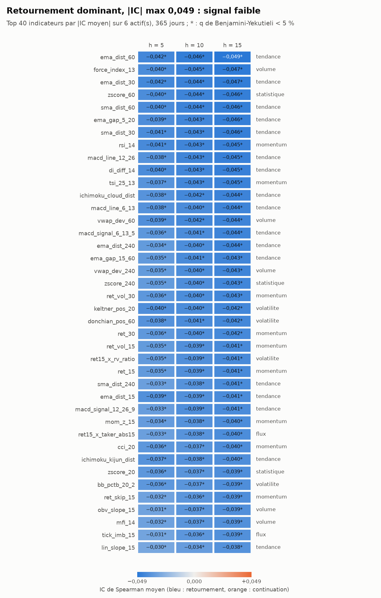
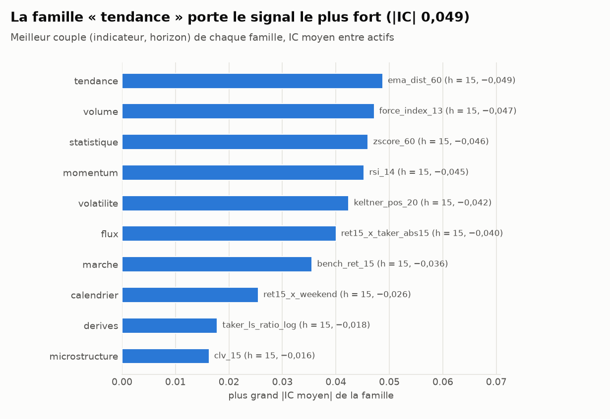
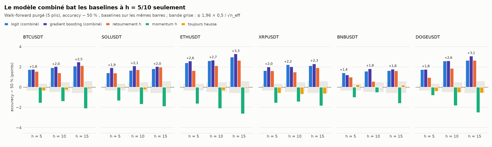

# État des lieux des indicateurs — direction à 5, 10, 15 minutes

*Généré le 2026-09-25 23:21 UTC par `python -m tradebot study --days 365` (durée totale : 1 346 s ; commit `80ebb37` + modifications locales). Actifs : BTCUSDT, SOLUSDT, ETHUSDT, XRPUSDT, BNBUSDT, DOGEUSDT ; 365 jours de barres 1m ; apprentissage = 0,60 premiers de la période.*

> Recherche uniquement. Un indicateur « significatif » n'est pas une stratégie rentable : à 1 minute, couvrir 10 pb de frais aller-retour demande 72 à 89 % de bonnes directions (docs/research/methodologie.md § 0), alors que le meilleur hit-rate hors échantillon mesuré ici est de 52,1 %.

## 0. En bref

* **501 couples (indicateur, horizon)** mesurés sur 6 actif(s), soit **2 979 tests** : il faut une correction pour tests multiples (q-valeurs BH et BY) et viser |t| > 3.
* Plus fort signal : **`ema_dist_60`** (tendance) à h = 15 : IC moyen −0,049, z de Stouffer −26,7, q BY 0,000, hit-rate hors échantillon 52,1 %, AUC 0,531.
* Sens : 100 % des 20 plus forts |IC| sont négatifs (IC < 0 : l'indicateur annonce un **retournement** ; > 0 : une continuation).
* **364 couples sur 501** ont à la fois q BY < 5 % et |z| > 3. Le z combine les actifs comme s'ils étaient indépendants (optimiste : les cryptos sont corrélées).
* Stabilité du top 20 : même signe sur tous les actifs pour 20/20 ; même signe entre apprentissage et test pour 20/20.
* Meilleur hit-rate hors échantillon : 52,1 % (`ichimoku_cloud_dist`, h = 15) ; médiane des couples : 50,9 %.
* Modèle combiné, BTCUSDT : h = 5 : hgb 51,8 % (AUC 0,526) contre retournement 51,6 % ; h = 10 : hgb 52,0 % (AUC 0,528) contre retournement 51,4 % ; h = 15 : hgb 52,5 % (AUC 0,534) contre retournement 52,1 %.
* Modèle combiné, SOLUSDT : h = 5 : hgb 51,9 % (AUC 0,527) contre retournement 51,4 % ; h = 10 : hgb 52,1 % (AUC 0,531) contre retournement 51,7 % ; h = 15 : hgb 52,0 % (AUC 0,529) contre retournement 52,0 %.
* Modèle combiné, ETHUSDT : h = 5 : hgb 52,6 % (AUC 0,537) contre retournement 51,6 % ; h = 10 : hgb 52,7 % (AUC 0,539) contre retournement 52,1 % ; h = 15 : hgb 53,3 % (AUC 0,544) contre retournement 52,6 %.
* Modèle combiné, XRPUSDT : h = 5 : hgb 52,0 % (AUC 0,526) contre retournement 51,6 % ; h = 10 : logit 52,2 % (AUC 0,528) contre retournement 51,5 % ; h = 15 : hgb 52,3 % (AUC 0,530) contre retournement 51,9 %.
* Modèle combiné, BNBUSDT : h = 5 : logit 51,4 % (AUC 0,519) contre retournement 51,0 % ; h = 10 : hgb 51,8 % (AUC 0,524) contre retournement 50,6 % ; h = 15 : hgb 51,8 % (AUC 0,522) contre retournement 51,6 %.
* Modèle combiné, DOGEUSDT : h = 5 : hgb 51,8 % (AUC 0,527) contre retournement 50,9 % ; h = 10 : hgb 52,6 % (AUC 0,533) contre retournement 51,8 % ; h = 15 : hgb 53,1 % (AUC 0,539) contre retournement 52,6 %.

## 1. Données

| ticker | n_bars | start | end | missing_bars | split_time | n_indicators | n_skipped | benchmark | deriv_coverage |
|---|---|---|---|---|---|---|---|---|---|
| BTCUSDT | 525 599 | 2025-09-25 23:00 UTC | 2026-09-25 22:58 UTC | 0 | 2026-05-02 22:59 UTC | 158 | 9 | — | 99,7 % |
| SOLUSDT | 525 599 | 2025-09-25 23:04 UTC | 2026-09-25 23:02 UTC | 0 | 2026-05-02 23:03 UTC | 167 | 0 | BTCUSDT | 99,7 % |
| ETHUSDT | 525 599 | 2025-09-25 23:09 UTC | 2026-09-25 23:07 UTC | 0 | 2026-05-02 23:08 UTC | 167 | 0 | BTCUSDT | 99,7 % |
| XRPUSDT | 525 599 | 2025-09-25 23:12 UTC | 2026-09-25 23:10 UTC | 0 | 2026-05-02 23:11 UTC | 167 | 0 | BTCUSDT | 99,7 % |
| BNBUSDT | 525 599 | 2025-09-25 23:16 UTC | 2026-09-25 23:14 UTC | 0 | 2026-05-02 23:15 UTC | 167 | 0 | BTCUSDT | 99,7 % |
| DOGEUSDT | 525 599 | 2025-09-25 23:19 UTC | 2026-09-25 23:17 UTC | 0 | 2026-05-02 23:18 UTC | 167 | 0 | BTCUSDT | 99,7 % |

## 2. Les indicateurs les plus informatifs

Les 20 couples (indicateur, horizon) de plus grand |IC moyen| (`top_20.csv`) :

| indicator | family | horizon | ic_mean | frac_same_sign | ic_train_mean | ic_test_mean | hit_rate_oos_mean | auc_oos_mean | z_combined | q_value_by |
|---|---|---|---|---|---|---|---|---|---|---|
| `ema_dist_60` | tendance | 15 | −0,049 | 1,00 | −0,051 | −0,045 | 52,1 % | 0,531 | −26,7 | 0,000 |
| `force_index_13` | volume | 15 | −0,047 | 1,00 | −0,050 | −0,043 | 52,0 % | 0,528 | −29,8 | 0,000 |
| `ema_dist_30` | tendance | 15 | −0,047 | 1,00 | −0,051 | −0,040 | 52,0 % | 0,528 | −27,5 | 0,000 |
| `ema_dist_60` | tendance | 10 | −0,046 | 1,00 | −0,048 | −0,043 | 52,0 % | 0,530 | −30,1 | 0,000 |
| `zscore_60` | statistique | 15 | −0,046 | 1,00 | −0,048 | −0,042 | 52,0 % | 0,529 | −25,8 | 0,000 |
| `sma_dist_60` | tendance | 15 | −0,046 | 1,00 | −0,048 | −0,041 | 52,0 % | 0,528 | −25,0 | 0,000 |
| `ema_gap_5_20` | tendance | 15 | −0,046 | 1,00 | −0,051 | −0,037 | 51,8 % | 0,525 | −26,5 | 0,000 |
| `sma_dist_30` | tendance | 15 | −0,046 | 1,00 | −0,051 | −0,037 | 51,8 % | 0,526 | −26,6 | 0,000 |
| `rsi_14` | momentum | 15 | −0,045 | 1,00 | −0,049 | −0,038 | 51,9 % | 0,527 | −27,2 | 0,000 |
| `macd_line_12_26` | tendance | 15 | −0,045 | 1,00 | −0,049 | −0,038 | 51,8 % | 0,526 | −24,7 | 0,000 |
| `di_diff_14` | tendance | 15 | −0,045 | 1,00 | −0,050 | −0,037 | 51,9 % | 0,526 | −27,0 | 0,000 |
| `force_index_13` | volume | 10 | −0,045 | 1,00 | −0,045 | −0,043 | 52,0 % | 0,528 | −32,3 | 0,000 |
| `tsi_25_13` | momentum | 15 | −0,045 | 1,00 | −0,049 | −0,037 | 51,8 % | 0,525 | −24,4 | 0,000 |
| `ema_dist_30` | tendance | 10 | −0,044 | 1,00 | −0,047 | −0,040 | 52,0 % | 0,527 | −30,4 | 0,000 |
| `ichimoku_cloud_dist` | tendance | 15 | −0,044 | 1,00 | −0,046 | −0,041 | 52,1 % | 0,528 | −24,2 | 0,000 |
| `sma_dist_60` | tendance | 10 | −0,044 | 1,00 | −0,046 | −0,040 | 51,9 % | 0,527 | −28,6 | 0,000 |
| `macd_line_6_13` | tendance | 15 | −0,044 | 1,00 | −0,049 | −0,035 | 51,7 % | 0,524 | −26,4 | 0,000 |
| `vwap_dev_60` | volume | 15 | −0,044 | 1,00 | −0,047 | −0,038 | 51,9 % | 0,526 | −24,1 | 0,000 |
| `zscore_60` | statistique | 10 | −0,044 | 1,00 | −0,045 | −0,040 | 51,9 % | 0,528 | −28,9 | 0,000 |
| `macd_signal_6_13_5` | tendance | 15 | −0,044 | 1,00 | −0,050 | −0,033 | 51,6 % | 0,523 | −25,4 | 0,000 |

## 3. Les moins informatifs

Les 20 couples de plus petit |IC moyen| parmi ceux mesurés sur tous les actifs (`bottom_20.csv`) : ces indicateurs n'apportent rien seuls à ces horizons.

| indicator | family | horizon | ic_mean | frac_same_sign | ic_train_mean | ic_test_mean | hit_rate_oos_mean | auc_oos_mean | z_combined | q_value_by |
|---|---|---|---|---|---|---|---|---|---|---|
| `jump_ratio_240` | volatilite | 5 | −0,000 | 0,67 | −0,001 | +0,002 | 49,9 % | 0,499 | −0,6 | 1,000 |
| `rel_volume_1440` | volume | 5 | +0,000 | 0,50 | −0,002 | +0,003 | 50,0 % | 0,500 | +0,4 | 1,000 |
| `amihud_rel_60` | microstructure | 5 | −0,000 | 0,67 | +0,003 | −0,005 | 49,9 % | 0,498 | +0,3 | 1,000 |
| `hour_cos` | calendrier | 5 | −0,000 | 0,50 | +0,004 | −0,006 | 49,6 % | 0,497 | −0,5 | 1,000 |
| `min_since_funding` | calendrier | 15 | +0,000 | 0,67 | −0,002 | +0,003 | 49,9 % | 0,498 | −0,0 | 1,000 |
| `min_to_funding` | calendrier | 15 | −0,000 | 0,67 | +0,002 | −0,003 | 49,9 % | 0,498 | +0,0 | 1,000 |
| `efficiency_ratio_30` | tendance | 5 | +0,000 | 0,67 | −0,005 | +0,009 | 49,8 % | 0,497 | +0,2 | 1,000 |
| `rel_volume_60` | volume | 10 | +0,000 | 0,67 | −0,001 | +0,002 | 50,0 % | 0,499 | +0,2 | 1,000 |
| `rv_15` | volatilite | 10 | +0,000 | 0,33 | +0,001 | −0,001 | 49,9 % | 0,500 | +0,7 | 1,000 |
| `min_since_funding` | calendrier | 10 | +0,000 | 0,50 | −0,001 | +0,002 | 50,0 % | 0,500 | +0,1 | 1,000 |
| `min_to_funding` | calendrier | 10 | −0,000 | 0,50 | +0,001 | −0,002 | 50,0 % | 0,500 | −0,1 | 1,000 |
| `rel_volume_tod` | volume | 10 | +0,000 | 0,33 | −0,001 | +0,002 | 50,0 % | 0,501 | +0,4 | 1,000 |
| `rv_60` | volatilite | 15 | −0,000 | 0,50 | −0,001 | +0,002 | 49,7 % | 0,498 | +0,5 | 1,000 |
| `jump_ratio_240` | volatilite | 10 | −0,000 | 0,50 | −0,002 | +0,002 | 50,0 % | 0,500 | −0,7 | 1,000 |
| `rel_volume_60` | volume | 5 | −0,001 | 0,50 | −0,001 | +0,001 | 50,0 % | 0,500 | −0,4 | 1,000 |
| `parkinson_15` | volatilite | 10 | −0,001 | 0,67 | −0,001 | +0,001 | 49,8 % | 0,498 | +0,4 | 1,000 |
| `ls_ratio_top_z_1440` | derives | 5 | −0,001 | 0,50 | −0,000 | −0,001 | 50,0 % | 0,500 | +1,3 | 1,000 |
| `kurt_60` | statistique | 5 | +0,001 | 0,83 | −0,001 | +0,004 | 50,0 % | 0,500 | +0,1 | 1,000 |
| `hour_cos` | calendrier | 10 | −0,001 | 0,67 | +0,005 | −0,009 | 49,4 % | 0,495 | −0,7 | 1,000 |
| `hour_cos` | calendrier | 15 | −0,001 | 0,67 | +0,006 | −0,011 | 49,2 % | 0,493 | −0,6 | 1,000 |

## 4. Synthèse par famille

| family | n_indicators | n_pairs | median_abs_ic | max_abs_ic | best_indicator | best_horizon | best_ic | frac_q_by_05 | mean_hit_rate_oos | mean_auc_oos |
|---|---|---|---|---|---|---|---|---|---|---|
| tendance | 33 | 99 | 0,035 | 0,049 | `ema_dist_60` | 15 | −0,049 | 97 % | 51,4 % | 0,519 |
| volume | 15 | 45 | 0,030 | 0,047 | `force_index_13` | 15 | −0,047 | 82 % | 51,2 % | 0,517 |
| statistique | 10 | 30 | 0,009 | 0,046 | `zscore_60` | 15 | −0,046 | 50 % | 50,7 % | 0,510 |
| momentum | 30 | 90 | 0,032 | 0,045 | `rsi_14` | 15 | −0,045 | 100 % | 51,4 % | 0,519 |
| volatilite | 19 | 57 | 0,003 | 0,042 | `keltner_pos_20` | 15 | −0,042 | 40 % | 50,4 % | 0,506 |
| flux | 12 | 36 | 0,020 | 0,040 | `ret15_x_taker_abs15` | 15 | −0,040 | 97 % | 50,8 % | 0,512 |
| marche | 9 | 27 | 0,020 | 0,036 | `bench_ret_15` | 15 | −0,036 | 78 % | 50,7 % | 0,510 |
| calendrier | 14 | 42 | 0,005 | 0,026 | `ret15_x_weekend` | 15 | −0,026 | 50 % | 50,4 % | 0,504 |
| derives | 14 | 42 | 0,004 | 0,018 | `taker_ls_ratio_log` | 15 | −0,018 | 38 % | 50,2 % | 0,502 |
| microstructure | 11 | 33 | 0,004 | 0,016 | `clv_15` | 15 | −0,016 | 45 % | 50,2 % | 0,502 |

## 5. Modèles combinés (walk-forward purgé) contre baselines

Tous les indicateurs de l'actif, `logit` (régression logistique régularisée) et `hgb` (gradient boosting), walk-forward croissant en 5 plis purgés de h barres, une origine toutes les 5 barres ; baselines sur les mêmes barres. Détail : `combined_summary.csv` ; bornes des plis : `combined_folds.csv`.

| ticker | model | acc h5 | acc h10 | acc h15 | AUC h5 | AUC h10 | AUC h15 | acc_w h5 | acc_w h10 | acc_w h15 | n_eff (h max) |
|---|---|---|---|---|---|---|---|---|---|---|---|
| BTCUSDT | `logit` | 51,7 % | 51,9 % | 52,1 % | 0,525 | 0,526 | 0,532 | 50,7 % | 50,9 % | 51,0 % | 29 175 |
| BTCUSDT | `hgb` | 51,8 % | 52,0 % | 52,5 % | 0,526 | 0,528 | 0,534 | 50,6 % | 51,0 % | 51,2 % | 29 175 |
| BTCUSDT | `reversal_h` | 51,6 % | 51,4 % | 52,1 % | 0,516 | 0,514 | 0,521 | 51,0 % | 50,7 % | 51,2 % | 29 175 |
| BTCUSDT | `momentum_h` | 48,4 % | 48,6 % | 47,9 % | 0,484 | 0,486 | 0,479 | 49,0 % | 49,3 % | 48,8 % | 29 175 |
| BTCUSDT | `always_up` | 49,6 % | 49,7 % | 49,9 % | 0,500 | 0,500 | 0,500 | 50,0 % | 50,0 % | 50,0 % | 29 175 |
| BTCUSDT | `majority_prev_day` | 50,3 % | 50,3 % | 50,0 % | 0,503 | 0,503 | 0,499 | 50,1 % | 50,3 % | 49,8 % | 29 175 |
| SOLUSDT | `logit` | 51,4 % | 51,7 % | 51,8 % | 0,522 | 0,524 | 0,527 | 50,2 % | 50,2 % | 50,6 % | 28 570 |
| SOLUSDT | `hgb` | 51,9 % | 52,1 % | 52,0 % | 0,527 | 0,531 | 0,529 | 50,3 % | 50,5 % | 50,5 % | 28 570 |
| SOLUSDT | `reversal_h` | 51,4 % | 51,7 % | 52,0 % | 0,514 | 0,517 | 0,520 | 50,0 % | 50,4 % | 50,6 % | 28 570 |
| SOLUSDT | `momentum_h` | 48,7 % | 48,3 % | 48,1 % | 0,486 | 0,483 | 0,480 | 50,0 % | 49,7 % | 49,5 % | 28 570 |
| SOLUSDT | `always_up` | 49,9 % | 49,8 % | 49,9 % | 0,500 | 0,500 | 0,500 | 50,0 % | 49,9 % | 49,9 % | 28 570 |
| SOLUSDT | `majority_prev_day` | 50,3 % | 50,5 % | 50,5 % | 0,503 | 0,505 | 0,505 | 50,5 % | 50,6 % | 50,8 % | 28 570 |
| ETHUSDT | `logit` | 52,4 % | 52,6 % | 53,0 % | 0,533 | 0,536 | 0,540 | 50,4 % | 50,6 % | 51,2 % | 29 161 |
| ETHUSDT | `hgb` | 52,6 % | 52,7 % | 53,3 % | 0,537 | 0,539 | 0,544 | 50,2 % | 50,2 % | 50,6 % | 29 161 |
| ETHUSDT | `reversal_h` | 51,6 % | 52,1 % | 52,6 % | 0,516 | 0,521 | 0,526 | 50,1 % | 50,2 % | 50,5 % | 29 161 |
| ETHUSDT | `momentum_h` | 48,3 % | 47,9 % | 47,4 % | 0,484 | 0,479 | 0,474 | 49,9 % | 49,8 % | 49,5 % | 29 161 |
| ETHUSDT | `always_up` | 50,0 % | 49,7 % | 49,9 % | 0,500 | 0,500 | 0,500 | 50,0 % | 49,9 % | 49,9 % | 29 161 |
| ETHUSDT | `majority_prev_day` | 50,2 % | 50,4 % | 50,2 % | 0,502 | 0,504 | 0,502 | 50,3 % | 50,6 % | 50,4 % | 29 161 |
| XRPUSDT | `logit` | 51,6 % | 52,2 % | 52,1 % | 0,522 | 0,528 | 0,530 | 50,8 % | 51,1 % | 50,8 % | 28 752 |
| XRPUSDT | `hgb` | 52,0 % | 52,0 % | 52,3 % | 0,526 | 0,528 | 0,530 | 51,0 % | 50,8 % | 51,4 % | 28 752 |
| XRPUSDT | `reversal_h` | 51,6 % | 51,5 % | 51,9 % | 0,516 | 0,515 | 0,519 | 50,8 % | 50,5 % | 50,5 % | 28 752 |
| XRPUSDT | `momentum_h` | 48,4 % | 48,6 % | 48,1 % | 0,484 | 0,485 | 0,481 | 49,2 % | 49,6 % | 49,6 % | 28 752 |
| XRPUSDT | `always_up` | 49,4 % | 49,3 % | 49,3 % | 0,500 | 0,500 | 0,500 | 49,9 % | 49,8 % | 49,7 % | 28 752 |
| XRPUSDT | `majority_prev_day` | 50,4 % | 50,5 % | 50,8 % | 0,502 | 0,504 | 0,507 | 50,2 % | 50,2 % | 50,6 % | 28 752 |
| BNBUSDT | `logit` | 51,4 % | 51,6 % | 51,6 % | 0,519 | 0,522 | 0,524 | 50,5 % | 50,8 % | 50,9 % | 29 080 |
| BNBUSDT | `hgb` | 51,2 % | 51,8 % | 51,8 % | 0,517 | 0,524 | 0,522 | 50,2 % | 50,7 % | 50,6 % | 29 080 |
| BNBUSDT | `reversal_h` | 51,0 % | 50,6 % | 51,6 % | 0,510 | 0,505 | 0,516 | 50,2 % | 49,3 % | 50,8 % | 29 080 |
| BNBUSDT | `momentum_h` | 49,0 % | 49,5 % | 48,4 % | 0,490 | 0,495 | 0,484 | 49,8 % | 50,7 % | 49,2 % | 29 080 |
| BNBUSDT | `always_up` | 50,2 % | 50,0 % | 50,2 % | 0,500 | 0,500 | 0,500 | 49,9 % | 49,9 % | 49,9 % | 29 080 |
| BNBUSDT | `majority_prev_day` | 50,5 % | 50,1 % | 50,4 % | 0,505 | 0,501 | 0,503 | 50,3 % | 50,3 % | 50,4 % | 29 080 |
| DOGEUSDT | `logit` | 51,7 % | 52,6 % | 52,6 % | 0,526 | 0,533 | 0,536 | 50,3 % | 51,3 % | 51,0 % | 28 581 |
| DOGEUSDT | `hgb` | 51,8 % | 52,6 % | 53,1 % | 0,527 | 0,533 | 0,539 | 50,1 % | 51,0 % | 50,9 % | 28 581 |
| DOGEUSDT | `reversal_h` | 50,9 % | 51,8 % | 52,6 % | 0,509 | 0,519 | 0,526 | 49,4 % | 50,4 % | 50,7 % | 28 581 |
| DOGEUSDT | `momentum_h` | 49,2 % | 48,2 % | 47,5 % | 0,491 | 0,481 | 0,474 | 50,8 % | 49,6 % | 49,3 % | 28 581 |
| DOGEUSDT | `always_up` | 49,6 % | 49,5 % | 49,4 % | 0,500 | 0,500 | 0,500 | 49,8 % | 49,8 % | 49,7 % | 28 581 |
| DOGEUSDT | `majority_prev_day` | 50,3 % | 50,3 % | 50,5 % | 0,502 | 0,502 | 0,504 | 50,0 % | 50,2 % | 50,5 % | 28 581 |

`acc` : accuracy ; `acc_w` : accuracy pondérée par |rendement| (ce qui compte pour le P&L). Les baselines binaires valent 0,52 / 0,48 : leur AUC égale leur balanced accuracy.

## 6. Fichiers

| fichier | contenu |
|---|---|
| `scores_<ACTIF>.csv` | scores de chaque indicateur × horizon pour un actif (`indicator_scores`) |
| `aggregate.csv` | agrégat entre actifs, trié par |ic_mean| (`aggregate_scores`) ; sert à choisir les covariables TimesFM (`ic_train_mean`) |
| `top_20.csv, bottom_20.csv` | extraits de l'agrégat (plus grands / plus petits |ic_mean|) |
| `familles.csv` | synthèse par famille |
| `combined_summary.csv` | métriques hors échantillon des modèles combinés et des baselines |
| `combined_folds.csv` | bornes de chaque pli (vérification de la purge) |
| `catalogue_indicateurs.csv` | nom, famille et description de chaque indicateur |
| `donnees.csv` | couverture des données par actif |
| `timings.csv` | temps de chaque étape |
| `run.json` | paramètres, dates de coupure, versions, commit |
| `ic_heatmap.png, familles.png, modeles_combines.png` | figures |

## 7. Dictionnaire des colonnes

### scores_<ACTIF>.csv

| colonne | signification |
|---|---|
| `ticker` | Actif (paire Binance contre USDT). |
| `indicator` | Nom de l'indicateur (voir `catalogue_indicateurs.csv` pour sa description). |
| `horizon` | Horizon h en barres de 1 minute : on prévoit le signe de log(close[t+h] / close[t]). |
| `n` | Nombre de barres où l'indicateur et le rendement futur sont tous deux définis. |
| `ic_spearman` | IC (coefficient d'information) : corrélation de Spearman entre l'indicateur en t et le rendement futur à h barres, sur toute la période. Négatif = l'indicateur annonce un retournement ; positif = une continuation. \|IC\| de 0,05 est déjà « fort » à 1 minute. |
| `ic_daily_mean` | Moyenne des IC calculés jour par jour (jours UTC d'au moins 100 barres). |
| `ic_daily_t` | t de Student des IC journaliers : moyenne / (écart type / √nombre de jours). Robuste au chevauchement des cibles à l'intérieur d'une journée. |
| `n_days` | Nombre de jours retenus pour l'IC journalier. |
| `frac_months_same_sign` | Part des mois dont l'IC journalier moyen a le même signe que l'IC global (stabilité ; viser ≥ 0,7). |
| `ic_nw_t` | t de l'IC corrigé de Newey-West (retards = h) : tient compte du chevauchement des cibles. |
| `ic_nw_t_2h` | Idem avec 2h retards (plus prudent, recommandé par la méthodologie). |
| `p_value` | p-valeur bilatérale de `ic_nw_t`. |
| `t_cons` | t le plus prudent parmi `ic_nw_t`, `ic_nw_t_2h` et `ic_daily_t` (0 si leurs signes divergent). C'est celui qu'il faut regarder ; viser \|t\| > 3. |
| `p_value_cons` | p-valeur bilatérale de `t_cons`. |
| `ic_train` | IC sur la partie apprentissage (les `train_frac` premiers pourcents de la période, moins h barres de purge). |
| `ic_test` | IC sur la partie test (après la coupure) : l'IC d'apprentissage se maintient-il ? |
| `train_sign` | Signe de `ic_train` (+1 / −1) : sens dans lequel on utilise l'indicateur sur le test. |
| `median_train` | Médiane de l'indicateur sur l'apprentissage (seuil de décision sur le test). |
| `hit_rate_oos` | Hors échantillon (test) : part des barres où « hausse si (x − médiane) × signe > 0 » donne la bonne direction. 0,5 = hasard. |
| `auc_oos` | AUC hors échantillon de signe × indicateur contre la direction réalisée (0,5 = hasard). |
| `up_rate_oos` | Part de hausses sur le test (taux de base). |
| `n_oos` | Barres de test dont la direction est définie (hors égalités et trous). |
| `n_eff_oos` | Taille effective du test : n_oos / h (les cibles de barres voisines se chevauchent). |
| `p_hit` | p-valeur binomiale unilatérale de `hit_rate_oos` > 0,5 sur n_eff_oos essais (prudente). |

### aggregate.csv, top_20.csv, bottom_20.csv

| colonne | signification |
|---|---|
| `indicator` | Nom de l'indicateur (voir `catalogue_indicateurs.csv` pour sa description). |
| `horizon` | Horizon h en barres de 1 minute : on prévoit le signe de log(close[t+h] / close[t]). |
| `family` | Famille de l'indicateur (tendance, momentum, volatilite, volume, flux, microstructure, statistique, calendrier, marche, derives). |
| `n_tickers` | Nombre d'actifs où l'IC est défini. |
| `ic_mean` | IC moyen entre actifs (critère de classement). |
| `ic_std` | Écart type de l'IC entre actifs. |
| `ic_t_cross` | t inter-actifs : ic_mean / (ic_std / √n_tickers) (défini dès 2 actifs, peu de degrés de liberté). |
| `frac_same_sign` | Part des actifs dont l'IC a le signe de `ic_mean` (viser au moins 4 actifs sur 6). |
| `ic_daily_t_mean` | Moyenne entre actifs du t journalier. |
| `ic_train_mean` | IC moyen sur les parties apprentissage seulement : c'est lui qui sert à choisir des covariables TimesFM sans regarder le test. |
| `ic_test_mean` | IC moyen sur les parties test. |
| `hit_rate_oos_mean` | Hit-rate hors échantillon moyen entre actifs. |
| `auc_oos_mean` | AUC hors échantillon moyenne entre actifs. |
| `z_combined` | Z de Stouffer : somme des t prudents (`t_cons`) des actifs / √nombre d'actifs. |
| `p_combined` | p-valeur bilatérale de `z_combined` (optimiste : les cryptos sont corrélées entre elles). |
| `q_value` | q-valeur de Benjamini-Hochberg sur toutes les lignes (indicateurs × horizons) : taux de fausses découvertes attendu si l'on retient cette ligne et les meilleures. |
| `q_value_by` | q-valeur de Benjamini-Yekutieli : valable même si les tests sont dépendants (indicateurs très corrélés). Plus sévère ; à privilégier. |

### familles.csv

| colonne | signification |
|---|---|
| `family` | Famille de l'indicateur (tendance, momentum, volatilite, volume, flux, microstructure, statistique, calendrier, marche, derives). |
| `n_indicators` | Nombre d'indicateurs de la famille présents dans l'agrégat. |
| `n_pairs` | Nombre de couples (indicateur, horizon). |
| `median_abs_ic` | Médiane de \|ic_mean\| sur les couples de la famille. |
| `max_abs_ic` | Plus grand \|ic_mean\| de la famille. |
| `best_indicator` | Indicateur qui atteint `max_abs_ic`. |
| `best_horizon` | Horizon de ce meilleur couple. |
| `best_ic` | ic_mean (signé) de ce meilleur couple. |
| `frac_q_by_05` | Part des couples de la famille avec q_value_by < 0,05. |
| `mean_hit_rate_oos` | Moyenne de `hit_rate_oos_mean` sur la famille. |
| `mean_auc_oos` | Moyenne de `auc_oos_mean` sur la famille. |

### combined_summary.csv

| colonne | signification |
|---|---|
| `ticker` | Actif (paire Binance contre USDT). |
| `model` | Modèle : `logit` et `hgb` (gradient boosting) combinent tous les indicateurs en walk-forward purgé ; `reversal_h`, `momentum_h`, `always_up`, `majority_prev_day` sont les baselines naïves évaluées sur exactement les mêmes barres ; `timesfm` = TimesFM zero-shot, `timesfm_cal` = sa probabilité recalibrée (isotonique). |
| `horizon` | Horizon h en barres de 1 minute : on prévoit le signe de log(close[t+h] / close[t]). |
| `n` | Nombre de barres où l'indicateur et le rendement futur sont tous deux définis. |
| `n_eff` | Taille effective : n divisé par le chevauchement des cibles (ceil(h / pas entre origines)). |
| `accuracy` | Part des directions correctement prévues (hausse prévue si P(hausse) > 0,5). |
| `balanced_accuracy` | Moyenne des taux de réussite sur les hausses et sur les baisses (insensible au taux de base). |
| `auc` | AUC de la probabilité de hausse (0,5 = aucun pouvoir de classement). |
| `brier` | Score de Brier : moyenne de (P(hausse) − y)². 0,25 = toujours 0,5 ; plus bas = mieux. |
| `log_loss` | Log-loss (entropie croisée). ln 2 ≈ 0,693 = toujours 0,5 ; plus bas = mieux. |
| `bss` | Brier skill score contre la climatologie hors échantillon (taux de hausse du test) : > 0 = mieux que la climatologie. |
| `acc_w` | Accuracy pondérée par \|rendement\| : c'est elle qui compte pour gagner de l'argent. |
| `up_rate` | Part de hausses réalisées. |
| `p_binom` | p-valeur binomiale unilatérale (accuracy > 0,5) sur n_eff essais. |

### combined_folds.csv

| colonne | signification |
|---|---|
| `ticker` | Actif (paire Binance contre USDT). |
| `model` | Modèle : `logit` et `hgb` (gradient boosting) combinent tous les indicateurs en walk-forward purgé ; `reversal_h`, `momentum_h`, `always_up`, `majority_prev_day` sont les baselines naïves évaluées sur exactement les mêmes barres ; `timesfm` = TimesFM zero-shot, `timesfm_cal` = sa probabilité recalibrée (isotonique). |
| `horizon` | Horizon h en barres de 1 minute : on prévoit le signe de log(close[t+h] / close[t]). |
| `fold` | Numéro du pli du walk-forward (0 = le plus ancien). |
| `n_train` | Lignes d'apprentissage du pli (après purge et éclaircissement). |
| `train_start` | Première ligne d'apprentissage. |
| `train_end` | Dernière ligne d'apprentissage (au moins h barres avant le test : purge). |
| `train_end_row` | Position de `train_end` dans les données. |
| `test_start` | Première ligne de test du pli. |
| `test_end` | Dernière ligne de test du pli. |
| `test_start_row` | Position de `test_start` dans les données. |

### donnees.csv, timings.csv

| colonne | signification |
|---|---|
| `ticker` | Actif (paire Binance contre USDT). |
| `n_bars` | Barres de 1 minute chargées (clôturées). |
| `start` | Première barre (ouverture, UTC). |
| `end` | Dernière barre (ouverture, UTC). |
| `missing_bars` | Barres absentes de la grille régulière (pannes de l'exchange) : jamais inventées ; les cibles qui les traversent valent NaN. |
| `split_time` | Première barre de la partie test (coupure à `train_frac`). |
| `n_indicators` | Nombre d'indicateurs de la famille présents dans l'agrégat. |
| `n_skipped` | Indicateurs ignorés faute de colonnes (ex. force relative pour BTC lui-même). |
| `benchmark` | Référence de marché pour la force relative (BTCUSDT pour les altcoins). |
| `deriv_coverage` | Part des barres avec un open interest disponible (dérivés futures). |
| `step` | Étape chronométrée. |
| `seconds` | Durée de l'étape en secondes (horloge murale, machine partagée : ordre de grandeur). |

## 8. Temps de calcul

| ticker | chargement | référence de marché | indicateurs | cibles | scores des indicateurs | modèle combiné logit | modèle combiné hgb | baselines (mêmes barres) | agrégat et rapport | total |
|---|---|---|---|---|---|---|---|---|---|---|
| BTCUSDT | 3,7 | 0,0 | 8,9 | 0,1 | 67,8 | 89,5 | 109,6 | 0,9 | — | — |
| SOLUSDT | 2,0 | 0,0 | 7,7 | 0,1 | 60,0 | 73,7 | 150,2 | 0,8 | — | — |
| ETHUSDT | 4,9 | 0,0 | 9,2 | 0,1 | 52,9 | 66,7 | 32,9 | 0,8 | — | — |
| XRPUSDT | 3,0 | 0,0 | 8,9 | 0,1 | 90,8 | 90,7 | 43,9 | 0,7 | — | — |
| BNBUSDT | 4,1 | 0,0 | 8,5 | 0,1 | 54,5 | 75,5 | 49,3 | 0,8 | — | — |
| DOGEUSDT | 3,9 | 0,0 | 8,7 | 0,1 | 58,6 | 67,1 | 28,7 | 0,7 | — | — |
| (global) | — | — | — | — | — | — | — | — | 2,1 | 1 345,6 |

## 9. Méthode et limites

* **Coupure apprentissage / test** : `split = round(train_frac × n)` barres ; apprentissage = barres < split − h (purge de h barres : leurs cibles chevauchent le test), test = barres ≥ split. Signe et médiane de chaque indicateur appris sur l'apprentissage seulement.
* **Chevauchement** : à h barres, les cibles de barres voisines partagent h − 1 minutes ; t de Newey-West (h et 2h retards), t par jours et binomial sur n / h en tiennent compte.
* **Tests multiples** : Benjamini-Hochberg et Benjamini-Yekutieli sur toutes les lignes ; Stouffer suppose des actifs indépendants (optimiste).
* **Pas de coffre-fort** : la méthodologie (§ 4.4) réserve les 30 derniers jours à une validation finale unique ; cette commande utilise toute la période demandée.
* **Modèles combinés** : NaN imputés par la médiane de l'apprentissage du pli ; apprentissage éclairci au-delà de 100000 lignes ; arrêt précoce chronologique pour `hgb`.
* **Dérivés** alignés avec un décalage de publication prudent (+5 min) ; le funding du mois en cours n'existe pas en fichiers bulk (NaN).
