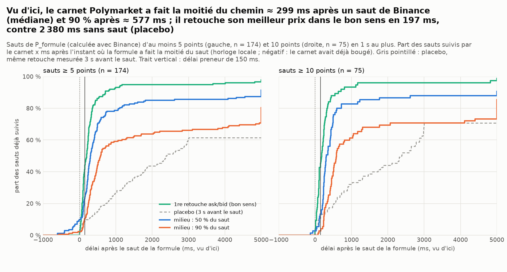
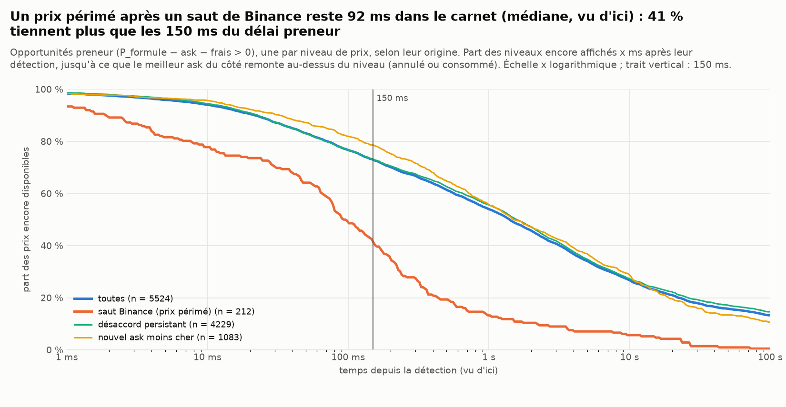
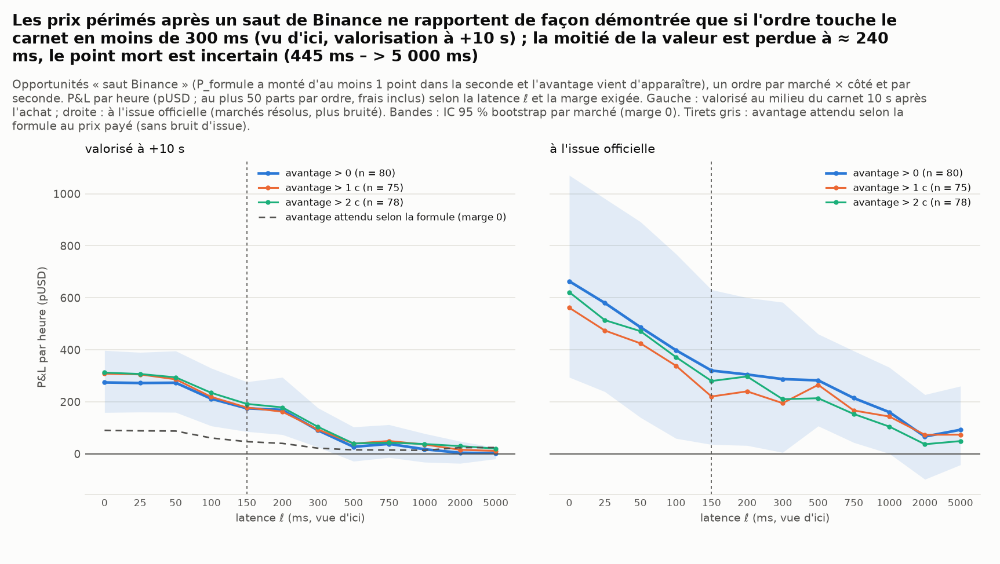
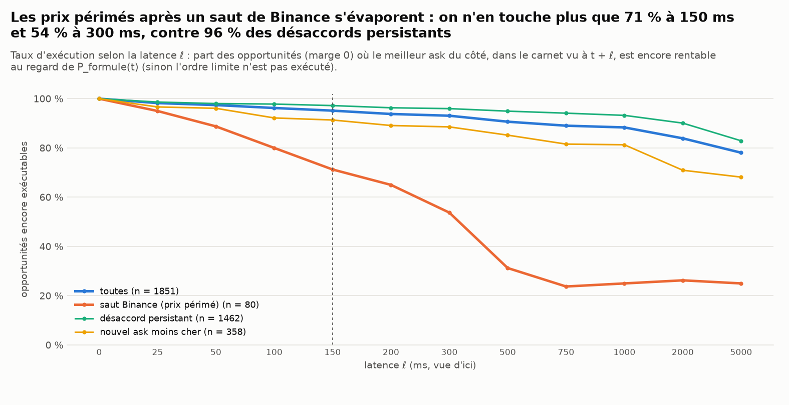
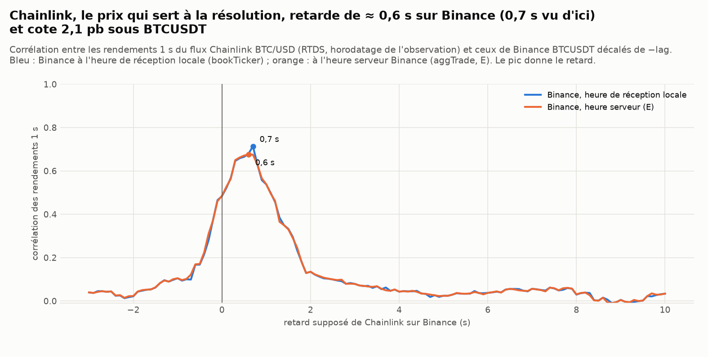
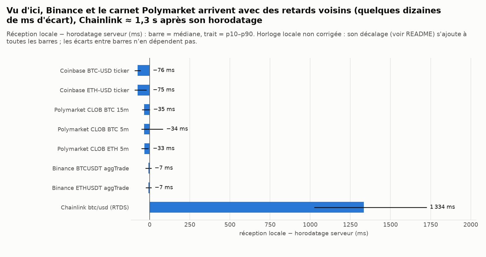

# Temps de réaction nécessaire pour prendre les prix périmés (Polymarket « Up or Down »)

*Généré le 26/09/2026 16:01 UTC par `scripts/latency_study.py` (51 s). Données : 26/09 10:29:52 – 26/09 11:27:52 UTC (chevauchement des deux collecteurs), 22 marchés (BTC 15m : 2, BTC 5m : 10, ETH 5m : 10), dont 22 résolus ; 0,86 h de marché.*

> **Cadre légal.** Recherche et simulation papier sur données publiques. Polymarket est bloqué en France (ANJ, 16/07/2026) et la France est en « close-only » sur le site et l'API ; les CGU interdisent de contourner le géoblocage. Rien ici n'est utilisable légalement pour trader depuis la France, et ce document ne décrit **aucun** moyen de contourner un blocage (VPN, serveur à l'étranger piloté depuis la France, prête-nom…).

## Résumé

* **Temps de réaction nécessaire (vu d'ici, détection du saut Binance → ordre au carnet)** : la valeur réalisée des prix périmés (milieu du carnet +10 s, courbe lissée) est divisée par deux à **ℓ½ ≈ 240 ms** (IC 95 % 131 ms – 310 ms) ; l'avantage attendu selon la formule l'est à ℓ½ ≈ 162 ms (IC 122 ms – 221 ms) ; le gain n'est **démontré** (borne basse de l'IC 95 % > 0) que jusqu'à ℓ = 300 ms (valorisation à +10 s, proxy de l'espérance, pas un prix de sortie) ; le point mort (P&L = 0, courbe lissée) est à ℓ* > 5 000 ms, IC 95 % 445 ms – > 5 000 ms : pas identifié sur cet échantillon (80 ordres « saut Binance », un par marché × côté et par seconde). À l'issue officielle (plus bruitée, 80 opportunités des marchés résolus) : ℓ* > 5 000 ms (IC 1 482 ms – > 5 000 ms), gain démontré jusqu'à 1 000 ms.
* **En temps réel** (mouvement Binance → appariement, = ℓ + 26 ms d'écart de transport Binance/Polymarket vu d'ici) : moitié de la valeur réalisée à ≈ 267 ms, de l'avantage selon la formule à ≈ 189 ms, gain démontré jusqu'à ≈ 326 ms. Les latences vues d'ici sont donc un **minorant** du temps réel disponible (de 26 ms ; 25 à 30 ms selon la tranche de 10 min). Tout ordre preneur attend **150 ms** avant appariement, et un preneur qui lit Binance (Tokyo) et envoie à Londres ne descend pas sous ≈ 230 ms (meilleur réseau privé publié), ≈ 265–280 ms sur le réseau d'AWS (plancher physique ≈ 200 ms, `docs/research/latence_infra.md`) : ℓ½ est comparable à ce plancher, et le gain démontré reste atteignable avec une infrastructure dédiée.
* **Le carnet suit Binance en quelques centaines de ms** : après un saut de P_formule ≥ 5 points (n = 174), le meilleur prix est retouché dans le bon sens en 197 ms (placebo sans saut : 2 380 ms), le milieu fait 50 % du chemin en 299 ms (médiane ; quartiles 158 ms – 698 ms) et 90 % en 577 ms ; 9 % des sauts ne sont pas suivis dans les 30 s.
* **Durée de vie d'un prix périmé** (saut Binance, 212 niveaux) : médiane 92 ms (p75 323 ms) ; 41 % sont encore là à 150 ms, 27 % à 300 ms ; avantage médian 2,3 c/part pour 20 parts au meilleur ask ; ces 212 niveaux ne font que 80 épisodes (un saut retire souvent plusieurs niveaux en quelques ms). 41 % disparaissent par un trade, le reste est annulé par le teneur ; ces trades sont appariés 47 ms (médiane, heures serveur) après le mouvement de Binance, 73 % en moins de 200 ms : avec 150 ms de délai preneur, ce sont des ordres partis **avant** le mouvement (flux sans rapport, ou signal plus précoce), pas des preneurs plus rapides que nous.
* **Gain attendu sur les prix périmés (saut Binance, marge 0, un ordre de 50 parts max. par marché × côté et par seconde, frais inclus ; valorisé au milieu +10 s, puis à l'issue officielle)** — 0 ms : +274 (IC +159 ; +397) pUSD/h, +8,4 c/part (exécution 100 %) ; à l'issue +664 (IC +294 ; +1 071) ; 50 ms : +273 (IC +160 ; +396) pUSD/h, +9,0 c/part (exécution 89 %) ; à l'issue +487 (IC +140 ; +892) ; 100 ms : +212 (IC +107 ; +329) pUSD/h, +8,7 c/part (exécution 80 %) ; à l'issue +399 (IC +59 ; +769) ; 200 ms : +169 (IC +74 ; +294) pUSD/h, +10,2 c/part (exécution 65 %) ; à l'issue +305 (IC +32 ; +601) ; 500 ms : +27 (IC −28 ; +103) pUSD/h, +2,6 c/part (exécution 31 %) ; à l'issue +283 (IC +107 ; +461).
* **Correction de revue (double comptage)** : la version d'origine simulait une exécution par *niveau* périmé (212 au lieu de 80 ordres), sans retirer du carnet les parts déjà achetées : à 100 ms elle donnait +185 pUSD/h, contre +212 pUSD/h avec un seul ordre par saut.
* **Toutes opportunités confondues** (1851 ; surtout des désaccords persistants entre la formule et le marché) : pUSD/h 50 ms : −1 478 à +10 s, −1 376 à l'issue ; 100 ms : −1 484 à +10 s, −1 108 à l'issue ; 200 ms : −1 485 à +10 s, −1 017 à l'issue ; 500 ms : −1 611 à +10 s, −603 à l'issue. Exécution 100 % à 0 ms et 78 % à 5 s : la vitesse n'y change presque rien, leur rentabilité dépend de la justesse de la formule (voir `reports/polymarket/formule/`).
* **Chainlink** (prix de résolution) retarde de ≈ 600 ms sur Binance (heure serveur ; 700 ms vu d'ici), cote 2,1 pb sous BTCUSDT et n'arrive ici que 1 334 ms après son horodatage : le signal, c'est Binance ; Chainlink n'est que la règle.
* **Transport vu d'ici** : Binance rx − E −7 ms (médiane), carnet Polymarket rx − ts −34 ms ; horloge locale en retard d'environ 133 ms (± 94 ms) ; aller-retour HTTP vers le CLOB depuis ce conteneur 134 ms. D'ici, un ordre aurait ℓ ≈ calcul + aller-retour CLOB + 150 ms ≈ 284 ms.
* **Échantillon petit** : 0,9 h, 22 marchés (22 résolus) ; IC larges. Relancer `python scripts/latency_study.py` quand les collecteurs auront tourné plusieurs jours.

## Graphiques

**Vu d'ici, le carnet Polymarket a fait la moitié du chemin ≈ 299 ms après un saut de Binance (médiane) et 90 % après ≈ 577 ms ; il retouche son meilleur prix dans le bon sens en 197 ms, contre 2 380 ms sans saut (placebo)**



**Un prix périmé après un saut de Binance reste 92 ms dans le carnet (médiane, vu d'ici) : 41 % tiennent plus que les 150 ms du délai preneur**



**Les prix périmés après un saut de Binance ne rapportent de façon démontrée que si l'ordre touche le carnet en moins de 300 ms (vu d'ici, valorisation à +10 s) ; la moitié de la valeur est perdue à ≈ 240 ms, le point mort est incertain (445 ms – > 5 000 ms)**



**Les prix périmés après un saut de Binance s'évaporent : on n'en touche plus que 71 % à 150 ms et 54 % à 300 ms, contre 96 % des désaccords persistants**



**Chainlink, le prix qui sert à la résolution, retarde de ≈ 0,6 s sur Binance (0,7 s vu d'ici) et cote 2,1 pb sous BTCUSDT**



**Vu d'ici, Binance et le carnet Polymarket arrivent avec des retards voisins (quelques dizaines de ms d'écart), Chainlink ≈ 1,3 s après son horodatage**



## Comment atteindre ce temps de réaction

> Description technique générique, **inutilisable légalement depuis la France** (blocage ANJ, close-only, CGU). Le Royaume-Uni, où se trouve le moteur du CLOB, est lui aussi « close-only » : un serveur à Londres reçoit le même refus. Ces budgets sont donc des bornes physiques, pas une architecture déployable ; l'éligibilité dépend de la personne et de sa juridiction, pas de l'emplacement d'une machine. Aucune méthode de contournement n'est donnée ni envisagée. Détail des mesures : `docs/research/latence_infra.md`.

Budget « mouvement Binance → ordre apparié », à comparer aux ≈ 267 ms au bout desquels la moitié de la valeur réalisée est perdue (gain démontré jusqu'à ≈ 326 ms) :

| étape | ordre de grandeur | levier |
|---|---|---|
| Binance (moteur à Tokyo, AWS ap-northeast-1) → serveur du robot | 1–5 ms à Tokyo ; ≈ 100–120 ms jusqu'à Londres ; ici rx − E = −7 ms + décalage d'horloge | WebSocket direct (bookTicker, ou flux binaires SBE), sans CDN ni proxy |
| calcul de P_formule et décision | < 1 ms | formule fermée (Φ), moyennes glissantes incrémentales, σ tenu à jour à chaque seconde |
| signature EIP-712 de l'ordre + en-têtes HMAC | ≈ 0,54 ms avec `py-clob-client-v2`, ≈ 0,05 ms en chemin direct (keccak + libsecp256k1), 0 si l'ordre est pré-signé (mesuré, `docs/research/latence_infra.md`) | clé en mémoire, ordres préparés d'avance aux prix probables |
| serveur du robot → CLOB (AWS eu-west-2, Londres) | < 2 ms dans la même région ; ≈ 100–120 ms depuis Tokyo ; aller-retour 134 ms depuis ce conteneur | connexion HTTP/2 déjà ouverte (keep-alive) |
| délai preneur Polymarket (marchés crypto) | **150 ms, incompressible** (depuis le 04/09/2026) | aucun : c'est un ralentisseur qui laisse aux teneurs le temps d'annuler |

Tokyo ↔ Londres coûte ≈ 105 ms dans un sens sur le réseau d'AWS, ≈ 70 ms sur le meilleur réseau privé publié et 47 ms en fibre en ligne droite (qui n'existe pas), à payer une fois (sur le flux Binance ou sur l'ordre). Le meilleur total réaliste pour un **preneur** qui lit Binance est donc ≈ 230 ms (réseau privé), ≈ 265–280 ms sur AWS ; plancher physique ≈ 200 ms. Les **teneurs de marché**, eux, annulent sans délai : ce sont eux qui gagnent la course, et la plupart des prix périmés disparaissent avant qu'un preneur puisse les toucher. Quand le temps utile est sous 150 ms, aucune infrastructure ne suffit en preneur : il faudrait tenir le carnet (être celui qui réévalue ses prix le plus vite), ce qui change de métier (inventaire, sélection adverse, remises maker) — voir `reports/polymarket/maker_live/`.

**Depuis ce conteneur** (Google Cloud us-central1, Iowa, sortie par un proxy ; le CLOB y répond d'ailleurs 403 à tout ordre), ℓ ≈ aller-retour CLOB + 150 ms ≈ 284 ms, contre ℓ½ ≈ 240 ms et un gain démontré jusqu'à 300 ms : on arriverait après la disparition de l'essentiel des prix périmés. En théorie, les seuls leviers sont la **géographie** (distance au moteur de Binance et à celui du CLOB), un **flux Binance direct** et des **ordres pré-signés** envoyés sur une connexion déjà ouverte ; le délai de 150 ms, lui, ne se négocie pas, et aucun de ces leviers ne fait passer un preneur sous ≈ 200 ms.

## Tableaux

### Latence critique ℓ* (P&L = 0) et demi-vie de l'avantage

| origine | marge | valorisation | ℓ* (isotone) | IC bas | IC haut | ℓ* (brut) | gain démontré jusqu'à | ℓ½ valeur | IC ℓ½ valeur | ℓ½ avantage | IC ℓ½ avantage | P(P&L > 0 à ℓ = 0) | ordres | marchés |
|---|---|---|---|---|---|---|---|---|---|---|---|---|---|---|
| saut | 0 c | issue officielle | > 5 000 ms | 1 482 ms | > 5 000 ms | > 5 000 ms | 1 000 ms | 143 ms | 42 ms – 1 209 ms | 162 ms | 122 ms – 221 ms | 100 % | 80 | 20 |
| saut | 1 c | issue officielle | > 5 000 ms | 1 009 ms | > 5 000 ms | > 5 000 ms | 50 ms | 127 ms | 31 ms – 1 670 ms | 177 ms | 133 ms – 238 ms | 100 % | 75 | 20 |
| saut | 2 c | issue officielle | > 5 000 ms | 472 ms | > 5 000 ms | > 5 000 ms | 50 ms | 137 ms | 30 ms – 1 049 ms | 173 ms | 134 ms – 228 ms | 100 % | 78 | 20 |
| saut | 0 c | valorisé à +10 s | > 5 000 ms | 445 ms | > 5 000 ms | > 5 000 ms | 300 ms | 240 ms | 131 ms – 310 ms | 162 ms | 122 ms – 221 ms | 100 % | 80 | 20 |
| saut | 1 c | valorisé à +10 s | > 5 000 ms | 493 ms | > 5 000 ms | > 5 000 ms | 300 ms | 212 ms | 104 ms – 302 ms | 177 ms | 133 ms – 238 ms | 100 % | 75 | 20 |
| saut | 2 c | valorisé à +10 s | > 5 000 ms | > 5 000 ms | > 5 000 ms | > 5 000 ms | 300 ms | 230 ms | 130 ms – 324 ms | 173 ms | 134 ms – 228 ms | 100 % | 78 | 20 |
| tous | 0 c | issue officielle | 0 ms | 0 ms | > 5 000 ms | 0 ms | aucune | aucune | 7 ms – > 5 000 ms | > 5 000 ms | > 5 000 ms – > 5 000 ms | 33 % | 1 851 | 22 |
| tous | 1 c | issue officielle | 0 ms | 0 ms | > 5 000 ms | 0 ms | aucune | aucune | 7 ms – > 5 000 ms | > 5 000 ms | > 5 000 ms – > 5 000 ms | 42 % | 1 664 | 22 |
| tous | 2 c | issue officielle | > 5 000 ms | 0 ms | > 5 000 ms | 0 ms | aucune | > 5 000 ms | 3 ms – > 5 000 ms | > 5 000 ms | > 5 000 ms – > 5 000 ms | 51 % | 1 478 | 22 |
| tous | 0 c | valorisé à +10 s | 0 ms | 0 ms | 0 ms | 0 ms | aucune | aucune | 0 ms – > 5 000 ms | > 5 000 ms | > 5 000 ms – > 5 000 ms | 2 % | 1 851 | 22 |
| tous | 1 c | valorisé à +10 s | 0 ms | 0 ms | 2 ms | 0 ms | aucune | aucune | 0 ms – 17 ms | > 5 000 ms | > 5 000 ms – > 5 000 ms | 3 % | 1 664 | 22 |
| tous | 2 c | valorisé à +10 s | 0 ms | 0 ms | 6 ms | 0 ms | aucune | aucune | 0 ms – 15 ms | > 5 000 ms | > 5 000 ms – > 5 000 ms | 6 % | 1 478 | 22 |

ℓ* : première latence où le P&L moyen par opportunité devient ≤ 0 (interpolation linéaire sur la grille 0–5 000 ms), après régression isotone décroissante de la courbe (en espérance, arriver plus tard ne peut pas rapporter plus ; « brut » : sans ce lissage, sensible au bruit) ; « 0 ms » : jamais positif ; « > 5 000 ms » : encore positif à 5 s. « gain démontré jusqu'à » : plus grande latence de la grille jusqu'à laquelle la borne basse de l'IC 95 % reste > 0 (« aucune » : pas même à 0 ms). IC : percentiles 2,5 et 97,5 % sur 2000 tirages bootstrap des marchés. ℓ½ valeur : latence à laquelle le P&L moyen (courbe lissée isotone) tombe à la moitié de sa valeur à ℓ = 0 ; ℓ½ avantage : idem pour l'avantage attendu selon la formule (Σ parts × (P(t) − coût), sans bruit d'issue, plus optimiste car P(t) n'est pas remis à jour). Un ordre par marché × côté et par seconde ; version « un ordre par niveau » et origines « persistante » et « carnet » : `latence_critique.csv` (colonne `ordres`).

### P&L selon la latence (marge 0)

| origine | ℓ (ms) | exécution | parts | avantage attendu (c/part) | attendu (pUSD/h) | +10 s (pUSD/h) | IC +10 s | issue (pUSD/h) | IC issue | issue (c/part) |
|---|---|---|---|---|---|---|---|---|---|---|
| saut | 0 | 100 % | 2 804 | 2,8 | +90,4 | +274,5 | +158,9 ; +397,5 | +663,8 | +294,4 ; +1 071,1 | +20,3 |
| saut | 25 | 95 % | 2 744 | 2,8 | +88,5 | +272,4 | +160,6 ; +390,2 | +580,2 | +239,0 ; +981,5 | +18,2 |
| saut | 50 | 89 % | 2 610 | 2,9 | +87,7 | +273,5 | +159,6 ; +395,7 | +487,2 | +139,9 ; +892,5 | +16,0 |
| saut | 100 | 80 % | 2 090 | 2,7 | +61,0 | +211,8 | +107,3 ; +329,4 | +398,5 | +59,3 ; +768,9 | +16,4 |
| saut | 150 | 71 % | 1 683 | 2,7 | +46,8 | +174,9 | +85,7 ; +276,9 | +320,2 | +35,9 ; +630,9 | +16,3 |
| saut | 200 | 65 % | 1 421 | 2,6 | +40,1 | +169,0 | +74,0 ; +294,4 | +305,1 | +32,1 ; +600,6 | +18,4 |
| saut | 300 | 54 % | 1 150 | 2,0 | +21,8 | +90,6 | +25,8 ; +176,7 | +287,5 | +5,4 ; +582,8 | +21,5 |
| saut | 500 | 31 % | 895 | 1,6 | +15,2 | +27,1 | −28,3 ; +103,5 | +282,6 | +106,9 ; +460,6 | +27,1 |
| saut | 750 | 24 % | 726 | 1,9 | +14,6 | +38,3 | −14,1 ; +112,1 | +214,5 | +43,5 ; +395,8 | +25,4 |
| saut | 1 000 | 25 % | 693 | 1,8 | +13,6 | +17,6 | −32,1 ; +77,9 | +160,4 | +0,9 ; +332,6 | +19,9 |
| saut | 2 000 | 26 % | 774 | 2,5 | +23,8 | +4,2 | −36,6 ; +48,3 | +66,6 | −98,0 ; +227,7 | +7,4 |
| saut | 5 000 | 25 % | 675 | 2,7 | +24,3 | +2,4 | −19,3 ; +24,3 | +92,5 | −42,4 ; +260,3 | +11,7 |
| tous | 0 | 100 % | 40 982 | 5,5 | +2 509,1 | −729,1 | −1 387,0 ; −35,4 | −1 084,1 | −5 137,1 ; +2 792,5 | −2,3 |
| tous | 25 | 98 % | 66 840 | 5,8 | +4 452,8 | −1 605,6 | −2 500,7 ; −723,3 | −1 565,3 | −8 143,0 ; +4 961,6 | −2,0 |
| tous | 50 | 97 % | 70 073 | 5,9 | +4 789,5 | −1 477,8 | −2 510,2 ; −435,6 | −1 376,0 | −8 163,6 ; +5 364,5 | −1,7 |
| tous | 100 | 96 % | 72 194 | 6,0 | +5 006,0 | −1 483,9 | −2 580,7 ; −348,1 | −1 107,6 | −8 184,1 ; +5 921,3 | −1,3 |
| tous | 150 | 95 % | 72 711 | 6,1 | +5 153,6 | −1 594,9 | −2 733,0 ; −475,7 | −1 751,5 | −8 843,4 ; +5 360,3 | −2,1 |
| tous | 200 | 94 % | 73 193 | 6,3 | +5 283,4 | −1 485,1 | −2 572,4 ; −345,9 | −1 016,5 | −8 199,8 ; +6 189,1 | −1,2 |
| tous | 300 | 93 % | 71 872 | 6,4 | +5 328,4 | −1 610,9 | −2 732,5 ; −435,7 | −1 233,4 | −8 214,6 ; +5 870,5 | −1,5 |
| tous | 500 | 91 % | 70 950 | 6,7 | +5 414,3 | −1 611,3 | −2 804,1 ; −431,8 | −603,1 | −7 929,0 ; +6 563,3 | −0,7 |
| tous | 750 | 89 % | 69 617 | 6,9 | +5 468,8 | −1 475,6 | −2 631,8 ; −321,0 | −1 278,0 | −8 383,1 ; +5 717,1 | −1,6 |
| tous | 1 000 | 88 % | 68 501 | 7,0 | +5 624,4 | −1 569,9 | −2 685,4 ; −460,2 | −1 045,8 | −7 924,2 ; +5 887,6 | −1,3 |
| tous | 2 000 | 84 % | 65 807 | 7,7 | +5 827,3 | −1 675,3 | −2 681,8 ; −647,0 | −1 061,0 | −7 964,7 ; +5 853,3 | −1,4 |
| tous | 5 000 | 78 % | 61 396 | 9,0 | +6 561,5 | −1 501,6 | −2 607,9 ; −394,1 | −969,6 | −7 372,1 ; +5 563,3 | −1,4 |

« attendu » : avantage selon la formule au prix payé (modèle, sans bruit) ; « +10 s » : valorisé au milieu du carnet 10 s après l'achat ; « issue » : à l'issue officielle, marchés résolus seulement. Les totaux par heure supposent qu'on prend chaque opportunité (50 parts au plus chacune), sans limite de position.

### Réaction du carnet aux sauts de la formule

| saut | actif | n | marchés | 1re retouche bon sens | placebo (3 s avant) | 50 % p25 | 50 % médiane | 50 % p75 | 90 % médiane | non suivis (30 s) | carnet en avance |
|---|---|---|---|---|---|---|---|---|---|---|---|
| 5 pts | btc | 99 | 12 | 242 | 2 428 | 241 | 394 | 754 | 708 | 9 % | 7 % |
| 5 pts | eth | 75 | 10 | 113 | 2 306 | 96 | 214 | 491 | 457 | 8 % | 16 % |
| 10 pts | btc | 42 | 11 | 221 | 2 580 | 248 | 409 | 597 | 592 | 7 % | 0 % |
| 10 pts | eth | 33 | 9 | 148 | 1 575 | 201 | 249 | 491 | 560 | 12 % | 7 % |
| 5 pts | tous | 174 | 22 | 197 | 2 380 | 158 | 299 | 698 | 577 | 9 % | 11 % |
| 10 pts | tous | 75 | 20 | 179 | 2 377 | 228 | 307 | 500 | 590 | 9 % | 3 % |

Délais en ms, vus d'ici, depuis l'instant où la formule a fait la moitié de son saut. « carnet en avance » : le milieu avait déjà fait la moitié du chemin avant cet instant (il a réagi à une autre source, ou les teneurs voient Binance avant nous). Le placebo mesure la même retouche 3 s avant le saut (fréquence de base des retouches, fenêtre arrêtée au saut) : la « 1re retouche » n'est une réaction que si elle est nettement plus rapide que lui. Quantiles « censure comprise » (pas de réaction = +∞).

### Prix périmés (marge 0)

| origine | actif | n | marchés | vie méd. (ms) | p75 (ms) | > 50 ms | > 150 ms | > 300 ms | > 1 s | avantage > 0 (ms, méd.) | avantage (c/part) | parts au meilleur ask | parts rentables | épisodes (1/s) | pris par un trade | trade après Binance (ms, méd.) | trade < 200 ms |
|---|---|---|---|---|---|---|---|---|---|---|---|---|---|---|---|---|---|
| tous | tous | 5 524 | 22 | 800 | 4 779 | 83 % | 73 % | 67 % | 54 % | 700 | 5,1 | 15 | 444 | 1 851 | 39 % | 400 | 35 % |
| tous | btc | 2 462 | 12 | 1 749 | 8 164 | 90 % | 84 % | 78 % | 66 % | 1 455 | 5,1 | 16 | 1 174 | 933 | 66 % | 349 | 37 % |
| tous | eth | 3 062 | 10 | 425 | 2 983 | 77 % | 65 % | 57 % | 44 % | 373 | 5,1 | 15 | 271 | 918 | 19 % | 533 | 29 % |
| carnet | tous | 1 083 | 22 | 1 087 | 6 550 | 87 % | 79 % | 72 % | 56 % | 825 | 1,7 | 15 | 99 | 358 | 38 % | 411 | 35 % |
| carnet | btc | 421 | 12 | 1 899 | 10 105 | 93 % | 86 % | 81 % | 66 % | 1 418 | 1,7 | 20 | 157 | 163 | 63 % | 298 | 39 % |
| carnet | eth | 662 | 10 | 744 | 5 321 | 84 % | 74 % | 66 % | 49 % | 615 | 1,7 | 15 | 75 | 195 | 23 % | 544 | 28 % |
| persistante | tous | 4 229 | 22 | 863 | 4 666 | 83 % | 73 % | 67 % | 56 % | 788 | 6,3 | 15 | 654 | 1 462 | 39 % | 460 | 32 % |
| persistante | btc | 1 922 | 12 | 2 095 | 8 413 | 92 % | 86 % | 81 % | 70 % | 1 800 | 6,3 | 15 | 1 694 | 749 | 67 % | 415 | 34 % |
| persistante | eth | 2 307 | 10 | 372 | 2 619 | 76 % | 63 % | 56 % | 44 % | 324 | 6,3 | 15 | 384 | 713 | 18 % | 630 | 27 % |
| saut | tous | 212 | 20 | 92 | 323 | 64 % | 41 % | 27 % | 13 % | 90 | 2,3 | 20 | 91 | 80 | 41 % | 47 | 73 % |
| saut | btc | 119 | 11 | 88 | 302 | 61 % | 42 % | 25 % | 10 % | 88 | 2,2 | 22 | 105 | 46 | 55 % | 43 | 74 % |
| saut | eth | 93 | 9 | 106 | 378 | 68 % | 40 % | 30 % | 17 % | 98 | 2,5 | 20 | 80 | 34 | 22 % | 117 | 70 % |

Origine : **saut** = P_formule a monté d'au moins 1 point dans la seconde et l'avantage n'existait pas 1 s plus tôt (prix périmé au sens strict) ; **persistante** = l'avantage existait déjà 1 s plus tôt (désaccord durable entre la formule et le marché, ou niveau qui clignote) ; **carnet** = un ask moins cher est apparu sans mouvement de Binance. « trade après Binance » : appariement (heure serveur Polymarket) du premier trade qui a consommé le niveau, moins l'heure serveur Binance de la détection (réception locale corrigée de la médiane de rx − E de la minute) ; avec 150 ms de délai preneur, un trade apparié moins de ≈ 200 ms après le mouvement n'y réagit pas. Marges 1 c et 2 c : `opportunites_resume.csv`.

### Latences de transport (réception locale − horodatage serveur)

| source | mesure | n | p10 | median | p90 | note |
|---|---|---|---|---|---|---|
| Binance ETHUSDT aggTrade | rx − E | 8 202 | −25 | −7 | 11 | réception locale − heure d'événement Binance |
| Binance ETHUSDT aggTrade | E − T | 8 202 | 0 | 1 | 2 | événement − trade (serveur) |
| Binance BTCUSDT aggTrade | rx − E | 16 026 | −26 | −7 | 11 | réception locale − heure d'événement Binance |
| Binance BTCUSDT aggTrade | E − T | 16 026 | 0 | 0 | 1 | événement − trade (serveur) |
| Coinbase ETH-USD ticker | rx − time | 2 492 | −95 | −75 | −20 | réception locale − heure du trade Coinbase |
| Coinbase BTC-USD ticker | rx − time | 12 885 | −95 | −76 | −56 | réception locale − heure du trade Coinbase |
| RTDS crypto_prices btcusdt | rx − timestamp | 3 480 | 205 | 319 | 438 | réception locale − horodatage de l'observation |
| RTDS crypto_prices btcusdt | msg_ts − timestamp | 3 480 | 124 | 133 | 157 | publication RTDS − observation (serveur) |
| RTDS crypto_prices btcusdt | rx − msg_ts | 3 480 | 68 | 181 | 297 | réception locale − publication RTDS |
| Chainlink btc/usd (RTDS) | rx − timestamp | 3 436 | 1 024 | 1 334 | 1 726 | réception locale − horodatage de l'observation |
| Chainlink btc/usd (RTDS) | msg_ts − timestamp | 3 436 | 793 | 1 091 | 1 470 | publication RTDS − observation (serveur) |
| Chainlink btc/usd (RTDS) | rx − msg_ts | 3 436 | 113 | 246 | 357 | réception locale − publication RTDS |
| Polymarket CLOB BTC 15m | rx − ts | 275 293 | −49 | −35 | 3 | réception locale − horodatage du message CLOB |
| Polymarket CLOB BTC 5m | rx − ts | 521 979 | −52 | −34 | 84 | réception locale − horodatage du message CLOB |
| Polymarket CLOB ETH 5m | rx − ts | 387 879 | −53 | −33 | −7 | réception locale − horodatage du message CLOB |

### Chainlink contre Binance

| asset | horloge | horizon_s | lag_ms | corr_max | corr_lag0 | n | basis_median_pb | basis_p10_pb | basis_p90_pb | basis_sd_pb |
|---|---|---|---|---|---|---|---|---|---|---|
| btc | rx | 1,000 | 700 | 0,714 | 0,483 | 3 403 | −2,09 | −2,50 | −1,71 | 0,30 |
| btc | rx | 5,000 | 700 | 0,899 | 0,855 | 3 390 | −2,09 | −2,50 | −1,71 | 0,30 |
| btc | serveur | 1,000 | 600 | 0,676 | 0,485 | 3 404 | −2,09 | −2,50 | −1,71 | 0,30 |
| btc | serveur | 5,000 | 500 | 0,894 | 0,856 | 3 391 | −2,09 | −2,49 | −1,71 | 0,30 |

`lag_ms` : décalage de corrélation maximale entre les rendements Chainlink (sur `horizon_s`) et ceux de Binance décalés ; `horloge` = `rx` (Binance à la réception locale : ce que voit le robot) ou `serveur` (heure d'événement Binance `E`, indépendante de notre réseau). `basis` : log(Chainlink / Binance décalé), en points de base. Le rapport historique `reports/polymarket/formule/` trouvait ≈ 4 s avec une autre méthode (erreur sur F − K entre bougies Binance 1 s et `priceToBeat`) : la corrélation des rendements mesure le retard du signal, l'erreur de niveau inclut aussi le lissage de l'agrégat Chainlink.

## Méthode

1. **Séries alignées sur l'horloge locale** (`rx`) : milieu Binance (`bookTicker`), dernier prix Binance (`aggTrade`, `E`/`T` serveur), Coinbase (`ticker`, `time`), Chainlink (RTDS `crypto_prices_chainlink` : valeur, horodatage de l'observation, heure de publication, `rx`), carnet Polymarket reconstruit après chaque message (meilleurs bid/ask Up et Down, tailles, milieu ; `rx` et `ts` serveur). Valeur « à la date » = dernier point reçu ≤ t.
2. **P_formule** (`tradebot.latency.TwapFormula`) : P(Up | t) de `polymarket_formula` (Up ssi TWAP60 Chainlink à E ≥ TWAP60 à S) calculée pour des moyennes de **points 1 s** : m = E[F − K | t] avec les points déjà réalisés (Binance 1 s reconstruit : dernier milieu reçu ≤ chaque seconde) et le prix Binance courant pour les points futurs ; Var/σ² = ∫ g², exacte entre deux secondes. σ = EWMA causale des rendements 1 s (demi-vie 600 s, initialisée sur les 3 h de bougies Binance 1 s précédant les données) × 1,40 (facteur de calibration du rapport historique `reports/polymarket/formule/` : les rendements 1 s sont autocorrélés). Retard de Chainlink : le point Chainlink `s` est lu sur Binance à `s − 700 ms` (mesuré ici). Erreur de suivi Chainlink − Binance de F − K : 0,40 pb ajoutés en quadrature (valeur du rapport historique : moins de 10 marchés BTC avec Chainlink complet ici (6)). Évaluée toutes les 100 ms, à chaque mise à jour Binance et à chaque message du carnet.
3. **Réaction du carnet** : sauts de P_formule ≥ 5 et ≥ 10 points en ≤ 1 s (puis 2 s sans nouveau saut) ; t0 = instant où la formule a fait la moitié du saut (précisé à la mise à jour Binance près) ; délais jusqu'à la première retouche du meilleur ask/bid Up dans le sens du saut après t0 (placebo : la même mesure 3 s avant le saut), puis jusqu'à ce que le milieu ait parcouru 50 % et 90 % du saut depuis son niveau d'avant ; censure à 30 s.
4. **Prix périmés** : opportunité à t si P_côté(t) − (ask + 0,07·ask·(1 − ask)) > marge (0, 1 c, 2 c), pour un ask entre 0,05 et 0,95 (les queues relèvent surtout de l'erreur de modèle). Une opportunité = un niveau de prix (côté, ask0) ; elle vit jusqu'à ce que le meilleur ask du côté remonte au-dessus de ask0 (niveau annulé ou consommé) ; un niveau encore vivant n'en ouvre pas une nouvelle. Origine : « saut » si P_côté a monté d'au moins 1 point dans la seconde et que l'avantage n'existait pas 1 s plus tôt, « persistante » s'il existait déjà, « carnet » sinon. « Pris par un preneur » : un trade a consommé ce niveau pendant sa vie. Tailles : au meilleur ask, et cumulées sur les niveaux encore rentables. Les messages du CLOB de même horodatage serveur (annulation + nouvel ordre…) sont regroupés : les états intermédiaires de quelques µs ne comptent pas comme des prix disponibles.
5. **Exécution à t + ℓ** : pour chaque opportunité détectée à t, l'ordre arrive au carnet vu à t + ℓ ; achat au meilleur ask de ce carnet si P_côté(t) − coût(ask) > marge (ordre limite calculé à t), quantité min(taille au meilleur ask, 50) ; P&L = parts × (1{côté gagnant} − ask − frais) à l'issue officielle (`meta.json`, sinon gamma en lecture seule), et valorisation au milieu du côté 10 s après l'achat (à l'issue si la clôture tombe avant). **Un ordre par marché × côté et par 1 s** : un saut de Binance fait apparaître plusieurs niveaux périmés en quelques ms, un robot n'envoie qu'un ordre, et la simulation ne retire pas du carnet les parts déjà achetées (sans ce filtre, les mêmes parts seraient comptées plusieurs fois). IC : bootstrap des marchés (2000 tirages).

### Biais de notre propre latence (et comment il déplace ℓ*)

On voit Binance avec un retard d_B et le carnet avec un retard d_P (≈ 90–120 ms et ≈ 65–85 ms une fois l'horloge corrigée, voir `docs/research/latence_infra.md`). Un mouvement Binance à l'instant réel τ est détecté ici à τ + d_B ; un état du carnet à l'instant réel x est vu ici à x + d_P. Simuler « ordre au carnet vu à t + ℓ » revient à apparier l'ordre à l'instant réel τ + d_B + ℓ − d_P : **le temps réel disponible vaut T = ℓ + (d_B − d_P)**, et d_B − d_P ne dépend pas de l'horloge locale : médiane(rx − E Binance) − médiane(rx − ts CLOB) = −7 − (−34) = +26 ms, stable de 25 à 30 ms d'une tranche de 10 min à l'autre alors que l'horloge locale dérive de −39 ms sur la période (`derive_horloge.csv`). **Les latences mesurées ici (ℓ*, ℓ½, gain démontré) sont donc des minorants du temps réel disponible, de ≈ 26 ms.** L'avance des teneurs qui lisent Binance plus près de Tokyo est déjà dans les données (leurs annulations apparaissent dans le carnet) : elle ne déplace pas ℓ* davantage. Incertitudes restantes : (i) si le CLOB horodate ses messages g ms après l'événement du moteur, le temps réel est plus court de g ; (ii) la synchronisation des horloges des serveurs Binance et Polymarket (quelques ms, non mesurable ici) ; (iii) notre ordre ne déplace pas le carnet (un ordre de 50 parts au plus par saut) ; (iv) un teneur qui annulerait en voyant arriver un ordre preneur pendant les 150 ms rendrait l'exécution réelle pire que simulée.

## Limites

* **n petit** : 0,9 h de données communes aux deux collecteurs, 22 marchés, 22 avec issue connue (les autres n'entrent que dans la valorisation à +10 s). Les opportunités d'un même marché partagent la même issue : l'IC groupé par marché est la seule mesure honnête de l'incertitude.
* ETH : le flux RTDS ne renvoie que la première souscription de chaque thème (btc/usd) : **pas de Chainlink ETH** ; le retard et l'erreur de suivi mesurés sur BTC sont appliqués à ETH.
* Carnet : les `price_change` sont filtrés à ± 0,10 du milieu par le collecteur (sans effet sur le meilleur niveau) ; la taille au meilleur ask est celle affichée (d'autres preneurs peuvent la prendre avant nous).
* P_formule suppose un log-prix sans tendance, σ constant jusqu'à E et Chainlink = Binance décalé ; elle se trompe quand Chainlink s'écarte de Binance (sources agrégées), surtout près de F = K. Les désaccords persistants sont surtout des erreurs de modèle ou des différences de σ, pas des prix périmés.
* 150 ms de délai preneur (documenté pour les marchés crypto depuis le 04/09/2026, non mesurable ici) : les latences ℓ < 150 ms ne sont atteignables par personne en preneur ; elles servent de référence. Le décalage d'horloge locale est estimé par une seule requête Binance (± la moitié de l'aller-retour) et l'horloge dérive (`derive_horloge.csv`) : seules les différences entre sources sont sûres. Sur plusieurs jours, la dérive déplacerait aussi le retard Chainlink estimé sur l'horloge locale ; le relancer par tranches (`--since`/`--until`).
* K et F viennent de Binance décalé, pas de Chainlink : sur les marchés BTC où le flux Chainlink est complet, l'erreur de F − K est de signe constant (`chainlink_erreur_suivi.csv`, ≈ −0,3 pb en moyenne sur une poignée de marchés), du même ordre que l'écart-type de F − K près de F = K un samedi calme (σ ≈ 0,2 pb/√s) : P_formule peut s'y tromper de plusieurs points. Pour BTC, K Chainlink est connu ≈ 1,4 s après S (RTDS) : l'utiliser supprimerait la moitié de cette erreur.
* Choix faits après coup : l'origine « saut » est mise en avant parce que l'ensemble des opportunités perd ; la définition (P a monté d'au moins 1 point dans la seconde, avantage absent 1 s plus tôt) est fixée a priori, mais les nombreuses variantes (3 marges × 4 origines × 2 valorisations × 12 latences) ne sont pas corrigées pour tests multiples. Une seule matinée de samedi : liquidité et volatilité de week-end.

## Relancer

```bash
. .venv/bin/activate
python scripts/latency_study.py              # tout ce qui est disponible
python scripts/latency_study.py --since 2026-09-27T00:00 --until 2026-09-28T00:00 --jobs 3
python scripts/latency_study.py --offline    # sans réseau (ni horloge, ni gamma, ni historique pour σ)
```

Le script relit tous les fichiers des deux collecteurs sur la période, garde les marchés complets (Binance et carnet couvrant [S − 90 s, E]) et réécrit ce dossier. Il ne modifie aucune donnée brute (les issues manquantes sont lues sur gamma sans toucher aux `meta.json`).

## Fichiers

* `marches.csv` : un marché par ligne : couverture, σ à S, F − K Binance contre l'issue officielle, nombres d'événements.
* `latences_transport.csv` : réception locale − horodatages serveur par source (p01, p10, médiane, p90, p99).
* `chainlink_binance_correlation.csv` : corrélation Chainlink / Binance selon le décalage (pas de 100 ms).
* `chainlink_binance_resume.csv` : retard et décalage (pb) de Chainlink sur Binance.
* `chainlink_erreur_suivi.csv` : F − K Chainlink contre Binance décalé, par marché BTC.
* `reaction_carnet.csv` : un saut de la formule par ligne, délais de réaction du carnet (ms).
* `reaction_carnet_resume.csv` : résumé des délais par seuil et actif.
* `opportunites.csv.gz` : une opportunité (niveau périmé) par ligne et par marge : origine, durée de vie, taille, avantage, retrait.
* `opportunites_resume.csv` : résumé par marge, origine et actif (survie à 50/150/300/1 000 ms).
* `pnl_par_opportunite.csv.gz` : P&L, quantité et prix d'exécution de chaque opportunité pour chaque ℓ.
* `pnl_vs_latence.csv` : P&L total / par opportunité / par part / par heure selon ℓ, marge et origine, avec IC.
* `latence_critique.csv` : ℓ*, IC et ℓ½ par marge, origine et valorisation.
* `pnl_par_marche.csv` : P&L par marché, marge, origine et ℓ.
* `pnl_par_heure.csv` : P&L par heure UTC, marge, origine et ℓ.
* `series_alignees_1s.csv.gz` : séries alignées sur l'horloge locale, une ligne par seconde et par marché : Binance (milieu, dernier trade), Coinbase, Chainlink (valeur et horodatage du dernier point reçu), carnet Up (bid, ask, tailles, milieu), P_formule, σ (désactivable : `--no-series`).
* `run.json` : paramètres et métadonnées du calcul.

Les fichiers `.csv.gz` (volumineux) se lisent directement avec `pandas.read_csv`.
