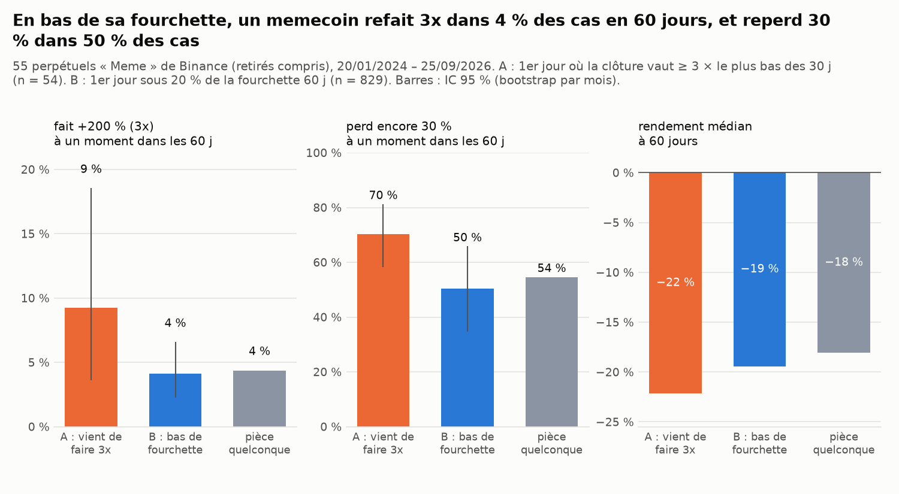
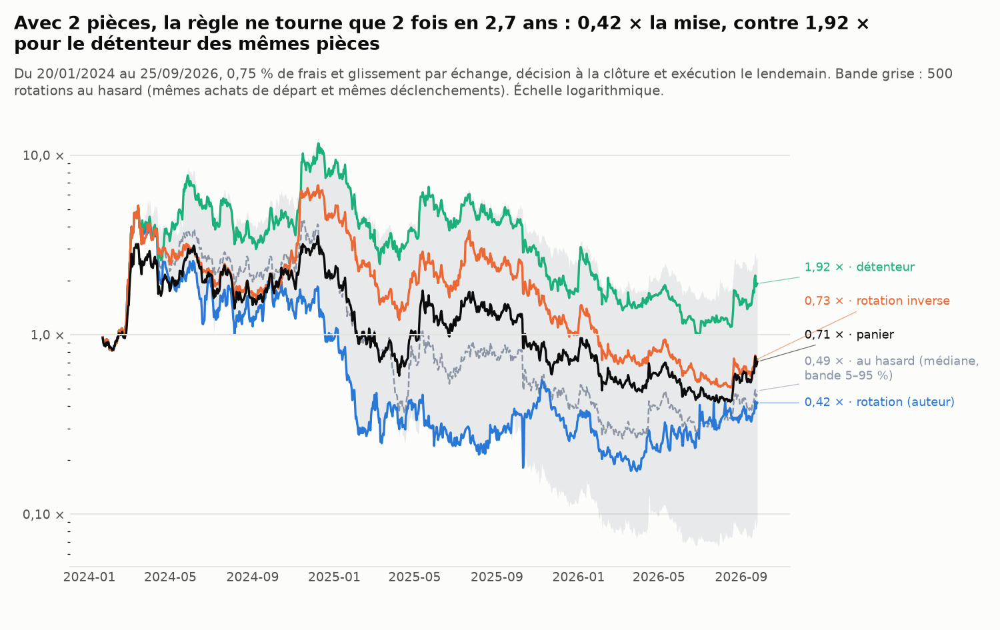
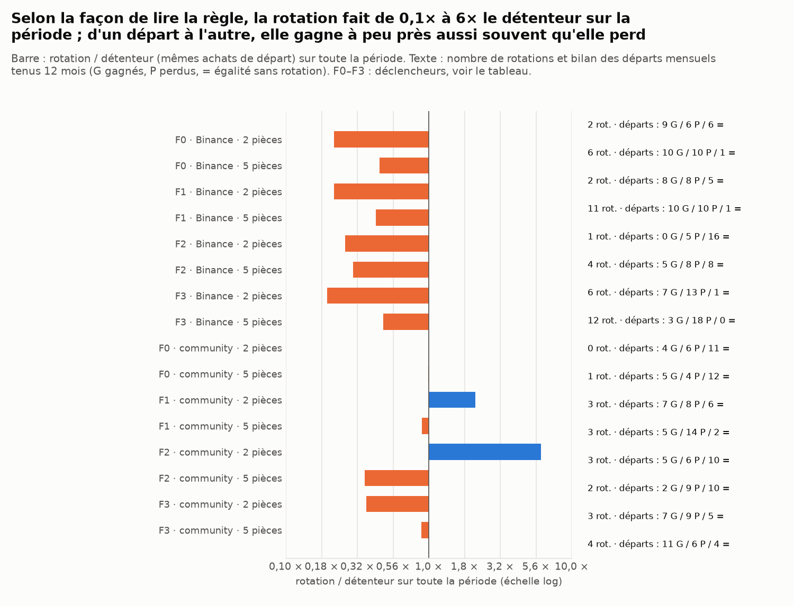
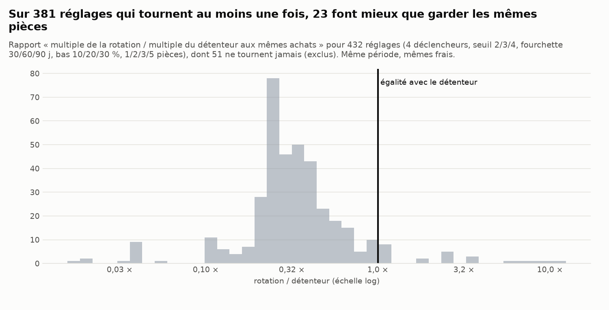

# Memecoins : la « rotation » entre community coins bat-elle la détention ?

*Généré le 26/09/2026 16:21 UTC par `scripts/memecoin_rotation.py` (669 s). Données : 55 perpétuels USDT classés « Meme » par Binance, dont 8 retirés de la cote, bougies quotidiennes ; étude du 20/01/2024 au 25/09/2026. Version corrigée après relecture contradictoire (§ 12).*

> Recherche sur données publiques historiques, aucun ordre, aucune recommandation. Les liens de parrainage et le canal d'« appels » de l'article testé ne sont pas repris ici.

## 0. Réponse courte

La thèse testée (fil X « Ultimate Memecoin Trading Guide », 2026) : parmi des memecoins établis, vendre celui qui vient de faire 3x (A) et acheter celui qui est en bas de sa fourchette (B), car B « va faire le même 3x » avec « −30 % au pire », alors que A « fera peut-être +100 % » avant « un repli typique de −70 % ». Exemple de l'auteur : rotateur 10 k$ → 270 k$, détenteur 10 k$ → 27 k$.

* **B ne fait pas « le même 3x ».** Au premier jour sous 20 % de sa fourchette de 60 jours, un memecoin atteint +200 % dans les 60 jours suivants dans **4 %** des cas (IC 95 % 2 % – 7 %), comme une pièce éligible quelconque (4 %). Il reperd 30 % à un moment dans **50 %** des cas (IC 35 % – 66 % ; l'auteur : « −30 % au pire »).
* **A retombe bien, mais lentement.** Depuis son sommet, la plus forte baisse médiane après un 3x est de −55 % sur 60 jours et −75 % sur 180 jours ; −70 % ou pire dans 13 % des cas à 60 jours et 63 % à 180 jours (pièce quelconque : 46 %). Le « repli typique de −70 % » de l'auteur se vérifie donc à long terme ; il ne dit pas quand vendre (n = 54 événements).
* **La décision de rotation elle-même** (43 cas : vendre A le jour de son 3x, acheter la pièce la plus basse de sa fourchette, frais déduits) : en moyenne **+146 %** de richesse à 60 jours par rapport à garder A (IC 95 % −6 % ; +523 %, médiane −10 %), gagnante dans 49 % des cas. Vers une pièce éligible quelconque : +166 % (IC +23 % ; +501 %). Aucun des deux n'est démontré.
* **Les pièces en retard ne rattrapent pas de façon mesurable.** Corrélation de rang entre la position dans la fourchette et le rendement des 30 jours suivants : +0,026 (t de Newey-West +0,7) : ni retour à la moyenne ni momentum démontré.
* **Portefeuille de la règle testée (F0, 2 pièces)** : elle ne tourne que 2 fois en 2,7 ans ; 0,42 × la mise contre 1,92 × pour le détenteur des mêmes pièces, 0,71 × pour le panier et 0,73 × pour la rotation inverse (mêmes achats et déclenchements, cible en haut de fourchette). Ce résultat tient à 2 décisions : ce n'est pas une mesure de la stratégie.
* **Quatre lectures de la règle, deux univers, 2 ou 5 pièces** (16 cas, § 6) : sur la période entière, la rotation va de 0,19 × à 6,11 × le détenteur. Le meilleur cas (F2, community coins, 2 pièces : 13,53 × contre 2,21 ×, 3 rotations) est une seule trajectoire : sur les départs mensuels tenus 12 mois, il gagne 5 fois, perd 6 fois et fait 10 égalités. Tous cas réunis : 98 départs gagnés, 140 perdus, 98 égalités.
* **Tous les réglages** (432 ; 381 tournent au moins une fois) : 23 des 381 font mieux que le détenteur aux mêmes achats. Le meilleur (range_top mult=3 range=30 bottom=0.1 k=5) a un Sharpe dégonflé de **0,46** (259 séries distinctes ; seuil 0,95). Walk-forward : les 1 réglages à égalité en tête sur la 1re moitié font en médiane 0,23 × sur la 2e, contre 0,33 × pour leurs détenteurs.
* **Une rotation systématique vers le bas de fourchette détruit de la valeur** : chaque semaine vers les 2 pièces les plus basses, 0,00 × la mise contre 0,71 × pour le panier (écart −85 % par an, IC −94 % ; −65 %).
* **Verdict.** Aucune version de « vendre le 3x, acheter le bas de fourchette » ne montre d'avantage qui se répète d'un point de départ à l'autre, ni dans les décisions elles-mêmes. Le calcul de l'auteur (gain/risque 6,7 contre 1,4 ; 270 k$ contre 27 k$) suppose connue l'issue : que B refera 3x (4 % des cas mesurés) sans perdre plus de 30 % (50 %). Une trajectoire spectaculaire existe (F2), mais c'est une trajectoire, pas une règle.

## 1. Données et règle testée

* **Univers** : les perpétuels USDT que Binance classe « Meme » (`underlyingSubType`), y compris ceux retirés de la cote (1000WHY, DEGEN, HIPPO, MYRO, NEIROETH, PONKE, SLERF, VINE). Le prix du perpétuel sert de prix spot (sans levier ni financement) : l'écart est de quelques pb pour les 28 pièces qui ont aussi un marché spot Binance. Liste : `univers.csv`.
* **Éligible au jour d** (point-in-time) : échangé ce jour, coté depuis au moins 60 jours, volume quotidien médian (30 j) d'au moins 5 M$, et pas de retrait de la cote annoncé. Binance annonce ses retraits quelques jours à l'avance (NEIROETH : annonce le 22/09/2025, règlement le 26/09) : on considère l'information publique 5 jours avant le dernier jour échangé, et une pièce détenue est vendue le lendemain de l'annonce. Début : premier jour avec au moins 8 pièces éligibles (20/01/2024).
* **Règle testée d'abord (F0)** : 2 pièces. À la clôture de chaque jour, une pièce détenue qui vaut au moins 3 × son plus bas des 30 derniers jours est vendue si une pièce éligible non détenue est sous 20 % de sa fourchette de 60 jours ; on achète alors la plus basse. Achats de départ : les pièces les plus basses de leur fourchette. Exécution à l'ouverture du lendemain, 0,75 % de frais et glissement par échange (l'auteur : « 1–2 % par rotation »). Trois autres déclencheurs (F1–F3) sont testés au § 6.
* **Comparaisons à conditions égales** : le détenteur (mêmes achats de départ, aucune rotation), la rotation inverse et 500 placebos (mêmes achats de départ, mêmes déclenchements, seule la pièce achetée change : la plus haute, ou une au hasard), et le panier équipondéré de toutes les pièces éligibles (30 tranches rééquilibrées chacune tous les 30 jours à des dates décalées, mêmes frais).

## 2. A après un 3x, B en bas de fourchette : ce qui arrive ensuite

| état (60 jours suivants) | n | atteint +100 % | atteint +200 % (3x) | touche −30 % | touche −70 % | rendement médian | rendement moyen |
|---|---|---|---|---|---|---|---|
| A : vient de faire 3x | 54 | 13 % | 9 % | 70 % | 9 % | −22 % | +11 % |
| B : bas de fourchette | 829 | 10 % | 4 % | 50 % | 4 % | −19 % | −6 % |
| toute pièce éligible, tout jour | 22451 | 12 % | 4 % | 54 % | 4 % | −18 % | −2 % |

« Touche −30 % » se mesure depuis le prix du jour de l'état. La baisse depuis un sommet (ce que l'auteur appelle un repli) :

| horizon | état | n | baisse médiane depuis un sommet | −50 % ou pire | −70 % ou pire |
|---|---|---|---|---|---|
| 60 j | A : vient de faire 3x | 54 | −55 % | 57 % | 13 % |
| 60 j | toute pièce éligible, tout jour | 22451 | −44 % | 36 % | 6 % |
| 120 j | A : vient de faire 3x | 53 | −59 % | 81 % | 25 % |
| 120 j | toute pièce éligible, tout jour | 21324 | −58 % | 69 % | 24 % |
| 180 j | A : vient de faire 3x | 51 | −75 % | 100 % | 63 % |
| 180 j | toute pièce éligible, tout jour | 20030 | −68 % | 87 % | 46 % |

Hypothèses de l'auteur, face à la mesure :

| affirmation | mesure |
|---|---|
| A après un 3x : « peut-être +100 % » | +100 % atteint dans 13 % des cas en 60 jours |
| A après un 3x : « repli typique de −70 % » | depuis un sommet : −70 % ou pire dans 13 % des cas en 60 jours, 63 % en 180 jours |
| B en bas de fourchette : « le même 3x, +200 % » | +200 % atteint dans 4 % des cas en 60 jours |
| B en bas de fourchette : « −30 % au pire » | −30 % touché dans 50 % des cas en 60 jours ; plus bas médian −30 % |

## 3. La décision de rotation, appariée

Le jour où A fait 3x : ce que rapporte le fait de vendre A et d'acheter B (ou une pièce quelconque), en richesse finale, frais de la vente et de l'achat déduits : (1 + r_B)/(1 + r_A) × (1 − coût)² − 1. IC 95 % par bootstrap en tirant des mois entiers.

| horizon | on achète | rotations | gain moyen | IC 95 % bas | IC 95 % haut | gain médian | la rotation gagne |
|---|---|---|---|---|---|---|---|
| 30 j | rotation vers B (bas de fourchette) | 45 | +70,4 % | +17,7 % | +179,4 % | +14,9 % | 60 % |
| 30 j | rotation vers une pièce quelconque | 45 | +80,3 % | +32,1 % | +179,3 % | +31,1 % | 73 % |
| 60 j | rotation vers B (bas de fourchette) | 43 | +146,1 % | −6,4 % | +523,5 % | −10,4 % | 49 % |
| 60 j | rotation vers une pièce quelconque | 43 | +165,8 % | +22,7 % | +500,6 % | +25,1 % | 70 % |

## 4. Les pièces en retard rattrapent-elles ?

Corrélation de rang (Spearman), jour par jour, entre un signal et le rendement futur, sur les pièces éligibles ; t de Newey-West (rendements futurs qui se chevauchent). Négatif = retour à la moyenne (ce qui ferait marcher la rotation), positif = momentum.

| signal | horizon | jours | corrélation moyenne | t (Newey-West) | jours positifs |
|---|---|---|---|---|---|
| position dans la fourchette 60 j | 7 j | 973 | +0,020 | +1,1 | 52 % |
| rendement des 30 derniers jours | 7 j | 973 | −0,013 | −0,6 | 47 % |
| rendement des 7 derniers jours | 7 j | 973 | −0,027 | −1,6 | 47 % |
| position dans la fourchette 60 j | 30 j | 950 | +0,026 | +0,7 | 48 % |
| rendement des 30 derniers jours | 30 j | 950 | −0,011 | −0,3 | 42 % |
| rendement des 7 derniers jours | 30 j | 950 | +0,004 | +0,2 | 50 % |

## 5. Portefeuilles de la règle testée (F0)

| stratégie | multiple final | par an | volatilité | Sharpe | perte max. | rotations |
|---|---|---|---|---|---|---|
| rotation (règle testée) | 0,42 × | −28 % | 154 % | 0,53 | −97 % | 2 |
| détenteur (mêmes achats de départ, aucune rotation) | 1,92 × | +28 % | 125 % | 0,79 | −91 % | 0 |
| rotation inverse (mêmes achats et déclenchements, cible en haut de fourchette) | 0,73 × | −11 % | 112 % | 0,43 | −93 % | 8 |
| panier équipondéré (30 tranches, rééquilibrage mensuel) | 0,71 × | −12 % | 108 % | 0,42 | −88 % | — |

* Rotations effectuées : 17/03/2024 : 1000PEPE (6,4 × son plus bas de 30 j) → 1000RATS ; 06/11/2025 : 1000RATS (3,2 × son plus bas de 30 j) → BROCCOLIF3B. Le multiple final tient à ces décisions et aux deux achats de départ.
* Placebos (mêmes achats de départ et mêmes déclenchements, pièce achetée au hasard) : multiple médian 0,49 ×, 5–95 % 0,09 × – 2,69 × ; la règle (0,42 ×) fait mieux que 42 % d'entre eux.
* Départs mensuels tenus 12 mois (21 fenêtres qui se chevauchent à 11 mois sur 12, soit environ 2,7 années indépendantes) : contre le détenteur, 9 gagnées, 6 perdues, 6 égalités (aucune rotation) ; test de signe sur les cas tranchés p = 0,61. Contre le panier : 4 gagnées, 17 perdues. La rotation inverse bat la règle dans 8 fenêtres et perd dans 7.
* Sur les 30 derniers jours (l'auteur parle de ses propres 30 derniers jours, publiés la veille de cette étude) : rotation 1,21 × ; détenteur 1,16 × ; rotation inverse 1,07 × ; panier équipondéré 1,20 ×.

## 6. Quatre lectures de la règle, deux univers

F0 : 3 × le plus bas des 30 derniers jours. F1 : 3 × le plus bas de la fourchette de 60 jours. F2 : 3 × le prix d'achat. F3 : en haut de fourchette (≥ 90 %) et 2 × son plus bas. Univers « community coins » : pièces qui ont déjà perdu 70 % depuis un sommet puis doublé depuis le creux (critère de l'auteur, point-in-time). Placebos : 100 tirages, mêmes achats et déclenchements.

| univers | règle | pièces | rotation | détenteur | rotations | placebos battus | départs gagnés | perdus | égalités | test de signe p |
|---|---|---|---|---|---|---|---|---|---|---|
| Binance « Meme » | F0 | 2 | 0,42 × | 1,92 × | 2 | 47 % | 9 | 6 | 6 | 0,61 |
| Binance « Meme » | F0 | 5 | 0,51 × | 1,12 × | 6 | 24 % | 10 | 10 | 1 | 1,00 |
| Binance « Meme » | F1 | 2 | 0,42 × | 1,92 × | 2 | 33 % | 8 | 8 | 5 | 1,00 |
| Binance « Meme » | F1 | 5 | 0,48 × | 1,12 × | 11 | 11 % | 10 | 10 | 1 | 1,00 |
| Binance « Meme » | F2 | 2 | 0,50 × | 1,92 × | 1 | 62 % | 0 | 5 | 16 | 0,06 |
| Binance « Meme » | F2 | 5 | 0,33 × | 1,12 × | 4 | 4 % | 5 | 8 | 8 | 0,58 |
| Binance « Meme » | F3 | 2 | 0,37 × | 1,92 × | 6 | 26 % | 7 | 13 | 1 | 0,26 |
| Binance « Meme » | F3 | 5 | 0,54 × | 1,12 × | 12 | 31 % | 3 | 18 | 0 | 0,00 |
| community coins | F0 | 2 | 2,21 × | 2,21 × | 0 | 0 % | 4 | 6 | 11 | 0,75 |
| community coins | F0 | 5 | 1,21 × | 1,22 × | 1 | 66 % | 5 | 4 | 12 | 1,00 |
| community coins | F1 | 2 | 4,69 × | 2,21 × | 3 | 79 % | 7 | 8 | 6 | 1,00 |
| community coins | F1 | 5 | 1,09 × | 1,22 × | 3 | 47 % | 5 | 14 | 2 | 0,06 |
| community coins | F2 | 2 | 13,53 × | 2,21 × | 3 | 95 % | 5 | 6 | 10 | 1,00 |
| community coins | F2 | 5 | 0,43 × | 1,22 × | 2 | 29 % | 2 | 9 | 10 | 0,07 |
| community coins | F3 | 2 | 0,81 × | 2,21 × | 3 | 26 % | 7 | 9 | 5 | 0,80 |
| community coins | F3 | 5 | 1,09 × | 1,22 × | 4 | 55 % | 11 | 6 | 4 | 0,33 |

Le cas le plus favorable à l'auteur (F2, community coins, 2 pièces) enchaîne quelques triplements successifs et bat la plupart de ses placebos sur la période entière. Mais d'un départ mensuel à l'autre il ne gagne pas plus souvent qu'il ne perd : c'est une trajectoire chanceuse, pas un avantage qui se répète.

## 7. Tous les réglages, et la correction pour essais multiples

* 432 réglages (`grille_variantes.csv`) : 51 ne tournent jamais (ce sont des détentions, exclues). Parmi les 381 autres, 23 font mieux que le détenteur aux mêmes achats et 127 mieux que le panier.
* Meilleur réglage qui tourne : range_top mult=3 range=30 bottom=0.1 k=5, 2,61 × contre 0,97 × pour son détenteur. Sharpe dégonflé (Bailey et López de Prado, Sharpe **par jour** de l'écart au détenteur, 259 séries distinctes) : **0,46**, sous le seuil de 0,95.
* Walk-forward : sur 20/01/2024 – 23/05/2025, 1 réglages qui tournent sont à égalité en tête (même série de rendements). Sur la 2e moitié, ils font en médiane 0,23 ×, contre 0,33 × pour leurs détenteurs et 0,48 × pour le panier ; 0 % battent leur détenteur (`walk_forward.csv`).

## 8. Rotation systématique

Tous les 7 ou 30 jours, détenir à parts égales les k pièces les plus basses (ou les plus hautes, ou au hasard) de leur fourchette de 60 jours. Écart au panier : log annualisé, IC 95 % par blocs de 30 jours.

| fréquence | pièces | bas de fourchette | haut de fourchette | au hasard (médiane) | panier | bas − panier, par an | IC bas | IC haut |
|---|---|---|---|---|---|---|---|---|
| hebdomadaire | 2 | 0,00 × | 2,42 × | 0,06 × | 0,71 × | −85 % | −94 % | −65 % |
| hebdomadaire | 5 | 0,04 × | 0,84 × | 0,10 × | 0,71 × | −67 % | −81 % | −44 % |
| mensuelle | 2 | 0,04 × | 3,86 × | 0,54 × | 0,71 × | −66 % | −82 % | −39 % |
| mensuelle | 5 | 0,21 × | 2,52 × | 0,56 × | 0,71 × | −37 % | −56 % | −9 % |

## 9. Robustesse et régimes

| variante (règle F0) | rotation | détenteur | panier | perte max. rotation | rotations |
|---|---|---|---|---|---|
| règle testée (0,75 % par échange, ouverture de J+1, préavis de retrait 5 j) | 0,42 × | 1,92 × | 0,71 × | −97 % | 2 |
| frais 0,25 % par échange | 0,43 × | 1,93 × | 0,76 × | −97 % | 2 |
| frais 1,5 % par échange | 0,40 × | 1,91 × | 0,64 × | −97 % | 2 |
| exécution à la clôture de J+1 (panier compris) | 0,42 × | 2,00 × | 0,74 × | −97 % | 2 |
| sans préavis, pièce retirée revendue −50 % | 0,42 × | 1,92 × | 0,70 × | −97 % | 2 |
| volume médian ≥ 10 M$ | 0,62 × | 1,92 × | 0,45 × | −97 % | 2 |
| volume médian ≥ 20 M$ | 0,62 × | 1,92 × | 0,42 × | −97 % | 2 |
| volume médian ≥ 50 M$ | 0,35 × | 1,92 × | 0,31 × | −97 % | 2 |
| k = 1 pièce — aucune rotation : non informatif | 0,03 × | 0,03 × | 0,71 × | −99 % | 0 |
| k = 3 pièces | 0,32 × | 1,56 × | 0,71 × | −98 % | 3 |
| seuil 2x au lieu de 3x | 0,55 × | 1,92 × | 0,71 × | −93 % | 5 |
| univers « community coins » (déjà −70 % puis ×2) — aucune rotation : non informatif | 2,21 × | 2,21 × | 1,02 × | −91 % | 0 |

Régimes (indice équipondéré des memecoins au-dessus ou en dessous de sa moyenne mobile 200 jours, mesuré la veille) :

| régime | stratégie | jours | multiple sur ces jours | rendement log annualisé |
|---|---|---|---|---|
| haussier (indice > MM 200 j) | rotation | 440 | 0,22 × | −126 % |
| haussier (indice > MM 200 j) | détenteur | 440 | 3,45 × | +103 % |
| haussier (indice > MM 200 j) | panier | 440 | 0,74 × | −25 % |
| baissier (indice < MM 200 j) | rotation | 539 | 1,91 × | +44 % |
| baissier (indice < MM 200 j) | détenteur | 539 | 0,56 × | −40 % |
| baissier (indice < MM 200 j) | panier | 539 | 0,96 × | −3 % |

La règle F0 ne tourne que quelques fois : l'écart entre régimes reflète ces décisions, pas une propriété de la règle.

## 10. Limites

* **Univers Binance.** Les pièces de l'auteur (CATE, NEET…) ne sont pas cotées sur Binance ; celles qui le sont (SPX, FARTCOIN, USELESS, POPCAT, PEPE, BONK, WIF…) sont les « community coins » les plus liquides. Être coté est déjà une sélection, connue le jour de la cotation. L'étiquette « Meme » est celle de Binance aujourd'hui : quelques memecoins étiquetés AI ou Gaming en sont absents ; les ajouter ne change pas le verdict (relecture : la part des départs où la rotation bat le panier passerait de 19 % à 29 %).
* **Bougies quotidiennes.** Un 3x fait et défait dans la journée échappe à la règle ; l'auteur dit détenir 38 jours en moyenne. La règle F0 à 2 pièces détient bien plus longtemps : c'est pourquoi le § 6 teste d'autres déclencheurs et 5 pièces.
* **Petits échantillons.** Quelques dizaines de 3x, 2 à 3 années indépendantes de départs glissants, un seul cycle des memecoins (2024–2026). La conclusion est l'absence d'avantage démontré, pas une perte démontrée (sauf la rotation systématique du § 8).
* **Prix du perpétuel.** Pour les pièces sans spot Binance, l'écart au spot n'est pas mesuré ici (la relecture l'estime à moins de 1 % sur les deux achats concernés).

## 11. Grille en 8 points appliquée à ce backtest

Statut du **défaut** (PRÉSENT = le défaut existe), avec la ligne de code qui le montre.

1. **Look-ahead** : ABSENT, avec une exception documentée. Décision à la clôture de d, exécution le lendemain : `src/tradebot/memecoins.py:373` : `v *= O[i + 1, sell] / C[i, sell] * (1.0 - c)` ; signaux sur fenêtres qui finissent au jour d : `src/tradebot/memecoins.py:167` : `lo = close.rolling(w, min_periods=w).min()`. Le moteur lit le statut de cotation du lendemain (`src/tradebot/memecoins.py:326` : `if s is not None and (soon[i, s] or not act[i + 1, s]):` ; `src/tradebot/memecoins.py:320` : `return np.array([x for x in np.flatnonzero(E[i]) if x not in held and act[i + 1, x]], dtype=int)`) : c'est une information publique grâce au préavis de retrait de Binance ; sans effet chiffré (relecture : un seul cas concerné, NEIROETH).
2. **Survivorship** : ABSENT par rapport à la cote Binance (retirés compris : `src/tradebot/memecoins.py:83` : `and "Meme" in (s.get("underlyingSubType") or [])]`) ; PARTIEL par rapport aux DEX.
3. **Repainting** : ABSENT. Fenêtres glissantes non centrées, prix figés après retrait : `src/tradebot/memecoins.py:153` : `tabs[k] = tabs[k].where(last)            # rien après le retrait de la cote` ; le régime est mesuré la veille (`.shift(1)` dans `scripts/memecoin_rotation.py`).
4. **Coûts** : ABSENT. Chaque vente et chaque achat paient `cost` : `src/tradebot/memecoins.py:377` : `v *= 1.0 - c` ; le panier paie le même coût sur ses rééquilibrages.
5. **Exécution à un prix jamais disponible** : PARTIEL. L'ouverture de J+1 vaut la clôture de J sur un marché ouvert 24 h/24 (écart médian 0,8 pb) : `src/tradebot/memecoins.py:372` : `elif p.execution == "open":` ; variante à la clôture de J+1, panier compris, au § 9.
6. **Ajustement des paramètres** : F0 fixée avant le test sur les chiffres de l'article ; F1–F3 ajoutées pour ne pas tester un homme de paille ; 432 réglages essayés ensuite, comptés dans le Sharpe dégonflé (séries distinctes) et testés en walk-forward.
7. **Échantillon** : PARTIEL. Hausse 2024 puis baisse : les deux régimes sont présents (§ 9), mais sur un seul cycle.
8. **Alignement** : ABSENT. Une seule source, bougies UTC 00:00 : `src/tradebot/memecoins.py:106` : `df["date"] = pd.to_datetime(df["open_ms"], unit="ms").dt.normalize()`.

## 12. Corrections apportées après la relecture contradictoire

Quatre relecteurs (fuite d'information, statistiques, exécution, fidélité à l'auteur) et un contradicteur par défaut signalé. Défauts confirmés et corrigés dans cette version :

* Les réglages qui ne tournent jamais étaient comptés comme des rotations « qui battent le panier » : ils sont exclus (§ 7) ;
* Les départs glissants comptaient les égalités (aucune rotation) comme des défaites : victoires, défaites et égalités sont séparées, et le chevauchement des fenêtres est indiqué ;
* Le test apparié moyennait des log-rendements présentés comme des rendements : il donne maintenant le gain moyen en richesse ;
* La rotation inverse et les placebos ne partaient pas des mêmes achats que la règle, et les placebos vendaient à chaque 3x : achats de départ et déclenchements sont maintenant identiques, seule la cible change ;
* Le Sharpe dégonflé comptait 162 essais dont 72 doublons : il est calculé sur les séries distinctes des réglages qui tournent ;
* Le walk-forward choisissait, par un départage arbitraire, une détention de PEPE : il choisit parmi les réglages qui tournent et rapporte tous les ex aequo ;
* Le « repli de −70 % » était mesuré depuis le jour du 3x : il l'est depuis un sommet, sur 60 à 180 jours ;
* Une formalisation unique qui ne tournait que 2 fois : 4 déclencheurs, 2 univers, 2 ou 5 pièces (§ 6) ;
* Les pièces dont le retrait était annoncé restaient achetables : préavis de 5 jours ;
* Le panier était rééquilibré à une date favorable et exécuté sans délai dans la variante prudente : 30 tranches décalées, même délai que la rotation ;
* Le seuil de volume n'était pas testé : 5, 10, 20 et 50 M$ (§ 9) ; la rotation systématique vers le bas de fourchette est ajoutée (§ 8).

## Fichiers

* `univers.csv` : les pièces, dates de cotation et de retrait, jours éligibles
* `etats_A_B.csv` : ce qui suit un 3x (A) et un bas de fourchette (B), 30 et 60 jours
* `baisse_depuis_sommet_A.csv` : baisse depuis un sommet après un 3x, 60 à 180 jours
* `rotations_appariees_resume.csv` : décision de rotation appariée, résumé
* `rotations_appariees_60j.csv` : chaque rotation appariée à 60 jours
* `ic_retour_moyenne.csv` : corrélations de rang signal / rendement futur
* `portefeuilles.csv` : performances des portefeuilles de la règle F0
* `rotations_regle_testee.csv` : chaque achat et rotation de la règle F0
* `departs_glissants_12_mois.csv` : départs mensuels tenus 12 mois
* `formalisations.csv` : F0–F3 × univers × nombre de pièces
* `grille_variantes.csv` : tous les réglages essayés
* `walk_forward.csv` : réglages choisis sur la 1re moitié, 2e moitié
* `rotation_periodique.csv` : rotation systématique
* `robustesse_variantes.csv` : frais, exécution, retraits, volume, univers
* `regimes.csv` : par régime de marché
* `run.json` : paramètres et résumé
