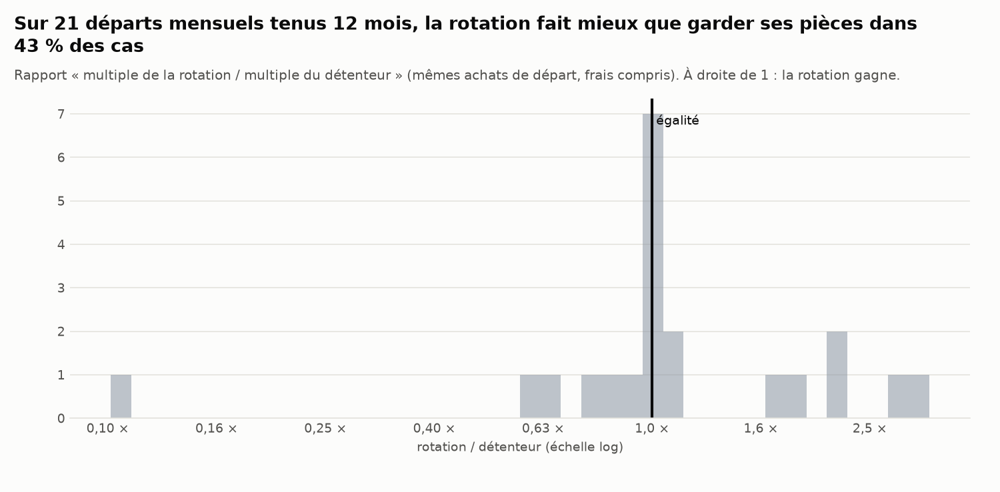

# Memecoins : la « rotation » entre community coins bat-elle la détention ?

*Généré le 26/09/2026 15:13 UTC par `scripts/memecoin_rotation.py` (100 s). Données : 55 perpétuels USDT classés « Meme » par Binance, dont 8 retirés de la cote, bougies quotidiennes ; étude du 20/01/2024 au 25/09/2026.*

> Recherche sur données publiques historiques, aucun ordre, aucune recommandation. Les liens de parrainage et le canal d'« appels » de l'article testé ne sont pas repris ici.

## 0. Réponse courte

La thèse testée (fil X « Ultimate Memecoin Trading Guide », 2026) : parmi des memecoins établis, vendre celui qui vient de faire 3x (A) et acheter celui qui est en bas de sa fourchette (B), car B « va faire le même 3x » avec « −30 % au pire », alors que A « fera peut-être +100 % » avant « un repli typique de −70 % ». Exemple de l'auteur : rotateur 10 k$ → 270 k$, détenteur 10 k$ → 27 k$.

* **B ne fait pas « le même 3x ».** Au premier jour sous 20 % de sa fourchette de 60 jours, un memecoin atteint +200 % dans les 60 jours suivants dans **4 %** des cas (IC 95 % 3 % – 6 %), contre 4 % pour une pièce éligible quelconque un jour quelconque. Il reperd 30 % à un moment dans **50 %** des cas (l'auteur : « −30 % au pire »). Rendement médian à 60 jours : −19 %.
* **A retombe, mais pas du « −70 % typique ».** Après un 3x, rendement médian à 60 jours −22 % (pièce quelconque : −18 % ; moyenne de A +11 %, tirée par quelques envolées), plus bas médian −42 %, −70 % touché dans 9 % des cas (pièce quelconque : 4 %), +100 % dans 13 % (n = 54 événements, petit échantillon).
* **La décision de rotation elle-même** (vendre A le jour de son 3x, acheter la pièce la plus basse dans sa fourchette, frais déduits) : écart moyen de rendement à 60 jours B − A = −2 % (IC 95 % −30 % ; +49 %), B gagne dans 49 % des 43 cas. Acheter une pièce éligible quelconque à la place : +20 %.
* **Vendre A après son 3x n'est pas absurde, acheter le bas de fourchette n'apporte rien.** À 30 jours, une pièce éligible quelconque fait en moyenne +25 % de mieux que A (IC 95 % +1 % ; +64 % : limite, et non significatif à 60 jours), contre +14 % pour la pièce en bas de fourchette (IC −12 % ; +55 %). Deux horizons essayés, 45 événements : un indice, pas une règle.
* **Les pièces en retard ne rattrapent pas de façon exploitable.** Corrélation de rang, jour par jour, entre la position dans la fourchette et le rendement des 30 jours suivants : +0,026 (t de Newey-West +0,7) ; avec le rendement des 30 derniers jours : −0,011 (t −0,3). Verdict : non significatif (|t| < 2) : ni retour à la moyenne ni momentum démontré.
* **Portefeuilles, frais compris** (20/01/2024 – 25/09/2026) : rotation de l'auteur 0,42 × la mise (2 rotations, perte maximale −97 %), détenteur des mêmes pièces 1,92 ×, panier équipondéré 0,80 ×, rotation inverse 0,39 ×. La rotation fait mieux que 70 % de 500 rotations vers une pièce **au hasard**.
* **Selon le point de départ** (21 départs mensuels tenus 12 mois) : la rotation bat le détenteur dans 43 % des cas et le panier dans 19 %.
* **En essayant 162 réglages**, 88 battent le panier sur la période ; le meilleur (mult=2 low=14 range=30 bottom=0.1 k=1) a un Sharpe d'écart de 0,88 mais un **Sharpe dégonflé de 0,04** (seuil 0,95) : indiscernable du hasard une fois les essais comptés. Choisi sur la 1re moitié (mult=2 low=14 range=30 bottom=0.1 k=1), il fait 0,07 × sur la 2e moitié, contre 0,53 × pour le panier et 0,33 × pour le détenteur.
* **Verdict.** Sur les memecoins établis de Binance, la règle « vendre le 3x, acheter le bas de fourchette » ne montre aucun avantage démontré sur la détention ou sur un panier. Le calcul de l'auteur (rapport gain/risque de 6,7 contre 1,4, 270 k$ contre 27 k$) suppose connue l'issue : que B refera 3x et ne perdra pas plus de 30 %. Mesuré, ce scénario arrive dans 4 % des cas pour le 3x, et la chute de 30 % dans 50 %.

## 1. Données et règle testée

* **Univers** : les perpétuels USDT que Binance classe « Meme » (`underlyingSubType`), y compris ceux retirés de la cote (1000WHY, DEGEN, HIPPO, MYRO, NEIROETH, PONKE, SLERF, VINE). Le prix du perpétuel suit le spot à quelques pb : il sert de prix, sans levier ni financement. Liste : `univers.csv`.
* **Éligible au jour d** (point-in-time) : échangé ce jour, coté depuis au moins 60 jours, volume quotidien médian (30 j) d'au moins 5 M$ (l'auteur veut pouvoir « entrer et sortir 50–500 k$ »). Début de l'étude : premier jour avec au moins 8 pièces éligibles (20/01/2024).
* **Règle de l'auteur, fixée avant tout test** : 2 pièces détenues. À la clôture de chaque jour, une pièce détenue qui vaut au moins 3 × son plus bas des 30 derniers jours est vendue et remplacée par la pièce éligible non détenue la plus basse dans sa fourchette de 60 jours, si elle est sous 20 % de cette fourchette (sinon on garde). Exécution à l'ouverture du lendemain, 0,75 % de frais et glissement par échange (l'auteur : « 1–2 % par rotation »). Pièce retirée de la cote : vendue à sa dernière clôture échangée.
* **Comparaisons** : le détenteur (mêmes achats de départ, aucune rotation), le panier équipondéré de toutes les pièces éligibles (rééquilibré tous les 30 jours, mêmes frais), la rotation inverse (vers le haut de fourchette) et 500 rotations placebo (mêmes déclenchements, pièce achetée au hasard).

## 2. A après un 3x, B en bas de fourchette : ce qui arrive ensuite

| état (60 jours suivants) | n | atteint +100 % | atteint +200 % (3x) | touche −30 % | touche −70 % | rendement médian | rendement moyen |
|---|---|---|---|---|---|---|---|
| A : vient de faire 3x | 54 | 13 % | 9 % | 70 % | 9 % | −22 % | +11 % |
| B : bas de fourchette | 829 | 10 % | 4 % | 50 % | 4 % | −19 % | −6 % |
| toute pièce éligible, tout jour | 22456 | 12 % | 4 % | 54 % | 4 % | −18 % | −2 % |

Hypothèses de l'auteur, face à la mesure :

| affirmation | mesure (60 jours) |
|---|---|
| A après un 3x : « peut-être +100 % » | +100 % atteint dans 13 % des cas |
| A après un 3x : « repli typique de −70 % » | −70 % touché dans 9 % des cas ; plus bas médian −42 % |
| B en bas de fourchette : « le même 3x, +200 % » | +200 % atteint dans 4 % des cas |
| B en bas de fourchette : « −30 % au pire » | −30 % touché dans 50 % des cas ; plus bas médian −30 % |

La décision de rotation, appariée (même jour, frais de la vente et de l'achat déduits) :

| horizon | on achète | rotations | écart moyen (B − A) | IC 95 % bas | IC 95 % haut | la rotation gagne |
|---|---|---|---|---|---|---|
| 30 j | rotation vers B (bas de fourchette) | 45 | +14,1 % | −12,2 % | +55,0 % | 60 % |
| 30 j | rotation vers une pièce quelconque | 45 | +25,0 % | +0,6 % | +63,7 % | 73 % |
| 60 j | rotation vers B (bas de fourchette) | 43 | −1,8 % | −29,5 % | +48,8 % | 49 % |
| 60 j | rotation vers une pièce quelconque | 43 | +20,4 % | −11,2 % | +77,8 % | 63 % |

## 3. Les pièces en retard rattrapent-elles ?

Corrélation de rang (Spearman), jour par jour, entre un signal et le rendement futur, sur les pièces éligibles ; t de Newey-West (rendements futurs qui se chevauchent). Négatif = retour à la moyenne (ce qui ferait marcher la rotation), positif = momentum.

| signal | horizon | jours | corrélation moyenne | t (Newey-West) | jours positifs |
|---|---|---|---|---|---|
| position dans la fourchette 60 j | 7 j | 973 | +0,021 | +1,1 | 52 % |
| rendement des 30 derniers jours | 7 j | 973 | −0,013 | −0,6 | 47 % |
| rendement des 7 derniers jours | 7 j | 973 | −0,027 | −1,6 | 47 % |
| position dans la fourchette 60 j | 30 j | 950 | +0,026 | +0,7 | 48 % |
| rendement des 30 derniers jours | 30 j | 950 | −0,011 | −0,3 | 42 % |
| rendement des 7 derniers jours | 30 j | 950 | +0,004 | +0,2 | 50 % |

## 4. Portefeuilles

| stratégie | multiple final | par an | volatilité | Sharpe | perte max. | rotations |
|---|---|---|---|---|---|---|
| rotation (règle de l'auteur) | 0,42 × | −28 % | 154 % | 0,53 | −97 % | 2 |
| détenteur (mêmes achats de départ, aucune rotation) | 1,92 × | +28 % | 125 % | 0,79 | −91 % | 0 |
| rotation inverse (vers le haut de fourchette) | 0,39 × | −29 % | 115 % | 0,26 | −91 % | 2 |
| panier équipondéré (rééquilibré tous les 30 j) | 0,80 × | −8 % | 108 % | 0,46 | −88 % | — |

* Rotations placebo (même règle, pièce achetée au hasard) : multiple médian 0,26 ×, 5–95 % 0,06 × – 1,27 × ; la règle de l'auteur (0,42 ×) fait mieux que 70 % d'entre elles.
* Écart rotation − panier : −22 % par an (IC 95 % par blocs de 30 j : −76 % ; +153 %). Rotation − détenteur : −43 % par an (IC −86 % ; +112 %).
* Sur les 30 derniers jours (la période de l'auteur : « 150 k$ → 420 k$ ») : rotation 1,21 × ; détenteur 1,16 × ; rotation inverse 1,15 × ; panier équipondéré 1,31 ×.

* **La règle ne se déclenche presque jamais** avec 2 pièces : 2 rotations en 2,7 ans (17/03/2024 : 1000PEPE (6,4 × son plus bas de 30 j) → 1000RATS ; 06/11/2025 : 1000RATS (3,2 × son plus bas de 30 j) → BROCCOLIF3B). Le multiple final tient donc à ces décisions et aux deux achats de départ : les tests qui comptent sont les rotations appariées (section 2), les départs glissants (ci-dessous) et la grille (section 5).

Départs mensuels tenus 12 mois (21 départs, `departs_glissants_12_mois.csv`) : la rotation bat le détenteur dans 43 % des cas, le panier dans 19 % ; multiple médian rotation 0,40 ×, détenteur 0,33 ×, panier 0,53 ×.
Le résultat dépend de la date de départ : les départs de la 1re moitié donnent la rotation gagnante contre le détenteur dans 10 % des cas, les trois derniers (départs du 13/07/2025 au 11/09/2025, fenêtres qui se chevauchent) dans 100 % (rotation 1,42 ×, 1,66 ×, 1,99 × contre détenteur 0,64 ×, 0,73 ×, 0,72 ×), avec 2 ou 3 rotations chacun. Rien de stable : ce sont quelques décisions, pas une règle qui marche.

## 5. Tous les réglages, et la correction pour essais multiples

* 162 réglages (`grille_162_variantes.csv`) : 88 battent le panier sur toute la période. Règle de l'auteur : 0,42 ×, écart au panier −22 % par an, probabilité que son vrai Sharpe d'écart soit positif (PSR) 0,35.
* Meilleur réglage : mult=2 low=14 range=30 bottom=0.1 k=1, 3,82 ×, Sharpe d'écart 0,88. Sharpe dégonflé (Bailey et López de Prado, en Sharpe **par jour**, maximum attendu de 162 essais sans talent : 1,89 annualisé) : **0,04**, sous le seuil de 0,95.
* Walk-forward : réglage choisi sur 20/01/2024 – 23/05/2025 (mult=2 low=14 range=30 bottom=0.1 k=1, +376 % par an contre le panier), puis appliqué à la 2e moitié : 0,07 × contre 0,53 × (panier) et 0,33 × (détenteur) ; écart −77 % par an, PSR 0,13.

## 6. Robustesse

| variante | rotation | détenteur | panier | perte max. rotation | rotations |
|---|---|---|---|---|---|
| règle de l'auteur (0,75 % par échange, exécution à l'ouverture de J+1) | 0,42 × | 1,92 × | 0,80 × | −97 % | 2 |
| frais 0,25 % par échange | 0,43 × | 1,93 × | 0,86 × | −97 % | 2 |
| frais 1,5 % par échange | 0,40 × | 1,91 × | 0,72 × | −97 % | 2 |
| exécution à la clôture de J+1 | 0,42 × | 2,00 × | 0,80 × | −97 % | 2 |
| pièce retirée de la cote revendue −50 % | 0,42 × | 1,92 × | 0,80 × | −97 % | 2 |
| k = 1 pièce | 0,03 × | 0,03 × | 0,80 × | −99 % | 0 |
| k = 3 pièces | 0,32 × | 1,56 × | 0,80 × | −98 % | 3 |
| seuil 2x au lieu de 3x | 0,55 × | 1,92 × | 0,80 × | −93 % | 6 |
| univers « community coins » (déjà −70 % puis ×2) | 2,21 × | 2,21 × | 1,15 × | −91 % | 0 |

Régimes (indice équipondéré des memecoins au-dessus ou en dessous de sa moyenne mobile 200 jours, mesuré la veille) :

| régime | stratégie | jours | multiple sur ces jours | rendement log annualisé |
|---|---|---|---|---|
| haussier (indice > MM 200 j) | rotation | 440 | 0,22 × | −126 % |
| haussier (indice > MM 200 j) | panier | 440 | 0,80 × | −18 % |
| baissier (indice < MM 200 j) | rotation | 539 | 1,91 × | +44 % |
| baissier (indice < MM 200 j) | panier | 539 | 1,00 × | −0 % |

La rotation fait mieux que le panier en régime baissier et bien moins bien en régime haussier. Sur quelques rotations seulement, c'est surtout le hasard de deux ou trois décisions, pas une propriété démontrée de la règle.

## 7. Limites

* **Univers Binance.** Les pièces de l'auteur (CATE, NEET…) ne sont pas cotées sur Binance ; celles qui le sont (SPX, FARTCOIN, USELESS, POPCAT, PEPE, BONK, WIF…) sont les « community coins » les plus liquides, exactement la catégorie qu'il recommande. Être coté sur Binance est déjà une sélection (les pièces cotées avaient réussi), mais connue le jour de la cotation : pas d'information future. Sur les DEX, beaucoup plus de pièces meurent : le biais irait contre la rotation (B en bas de fourchette est plus souvent une pièce qui meurt).
* **Bougies quotidiennes.** Un 3x réalisé et défait dans la journée échappe à la règle ; l'auteur dit détenir 38 jours en moyenne, l'échelle quotidienne convient.
* **Petits échantillons d'événements** (quelques dizaines de 3x) : les IC sont larges ; la conclusion repose sur l'absence de tout avantage démontré, pas sur une perte démontrée.
* **Une seule histoire de marché** (2024–2026, un cycle des memecoins) : la section 6 sépare haussier et baissier, mais sur un seul cycle.

## 8. Grille en 8 points appliquée à ce backtest

Statut du **défaut** (PRÉSENT = le défaut existe), avec la ligne de code qui le montre.

1. **Look-ahead** : ABSENT. Décision à la clôture de d, exécution le lendemain : `src/tradebot/memecoins.py:334` : `v *= O[i + 1, sell] / C[i, sell] * (1.0 - c)` ; signaux sur fenêtres qui finissent au jour d : `src/tradebot/memecoins.py:167` : `lo = close.rolling(w, min_periods=w).min()`.
2. **Survivorship** : ABSENT par rapport à la cote Binance (retirés compris : `src/tradebot/memecoins.py:83` : `and "Meme" in (s.get("underlyingSubType") or [])]`) ; PARTIEL par rapport aux DEX (seules les pièces un jour cotées sur Binance).
3. **Repainting** : ABSENT. Fenêtres glissantes non centrées, prix figés après retrait : `src/tradebot/memecoins.py:153` : `tabs[k] = tabs[k].where(last)            # rien après le retrait de la cote` ; le régime est mesuré la veille (`.shift(1)` dans `scripts/memecoin_rotation.py`).
4. **Coûts** : ABSENT. Chaque vente et chaque achat paient `cost` : `src/tradebot/memecoins.py:338` : `v *= 1.0 - c` ; panier : `src/tradebot/memecoins.py:391` : `fee = cost * np.abs(tgt - w).sum()`.
5. **Exécution à un prix jamais disponible** : PARTIEL. L'ouverture de J+1 vaut la clôture de J sur un marché ouvert 24 h/24 : `src/tradebot/memecoins.py:333` : `elif p.execution == "open":` ; variante prudente à la clôture de J+1 dans la section 6 ; une pièce retirée est vendue à sa dernière clôture échangée (variante −50 % en section 6).
6. **Ajustement des paramètres** : 5 paramètres (seuil, fenêtre du plus bas, fenêtre de la fourchette, bas de fourchette, nombre de pièces) fixés **avant** le test sur les chiffres de l'article ; 162 réglages essayés ensuite, comptés dans le Sharpe dégonflé et testés en walk-forward (section 5).
7. **Échantillon** : PARTIEL. Hausse 2024 puis baisse : les deux régimes sont présents (section 6), mais sur un seul cycle.
8. **Alignement** : ABSENT. Une seule source, bougies UTC 00:00 : `src/tradebot/memecoins.py:106` : `df["date"] = pd.to_datetime(df["open_ms"], unit="ms").dt.normalize()`.

## Fichiers

* `univers.csv` : les pièces, dates de cotation et de retrait, jours éligibles
* `etats_A_B.csv` : ce qui suit un 3x (A) et un bas de fourchette (B), 30 et 60 jours
* `rotations_appariees.csv` : décision de rotation B − A appariée, et contre une pièce quelconque
* `rotations_appariees_60j.csv` : chaque rotation appariée à 60 jours
* `ic_retour_moyenne.csv` : corrélations de rang signal / rendement futur
* `portefeuilles.csv` : performances des portefeuilles
* `rotations_regle_auteur.csv` : chaque achat et rotation de la règle de l'auteur
* `departs_glissants_12_mois.csv` : départs mensuels tenus 12 mois
* `grille_162_variantes.csv` : tous les réglages essayés
* `robustesse.csv` : variantes de frais, d'exécution, d'univers
* `regimes.csv` : par régime de marché
* `run.json` : paramètres et résumé
