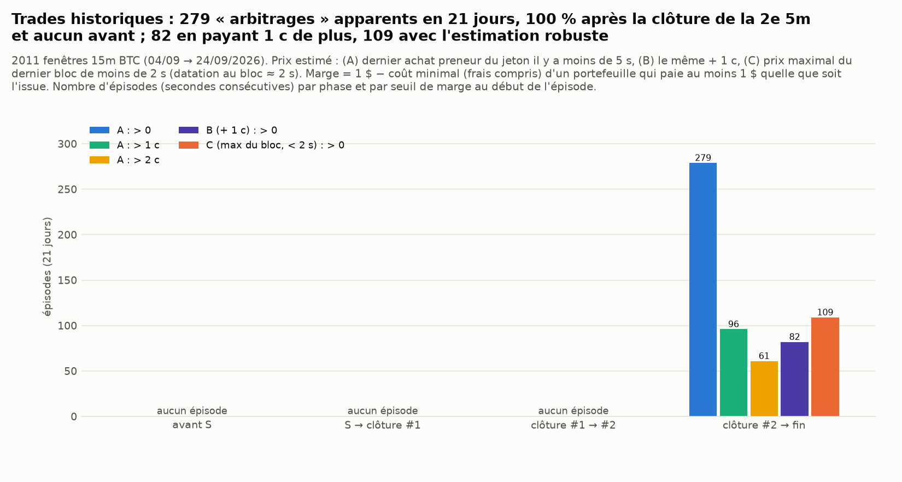
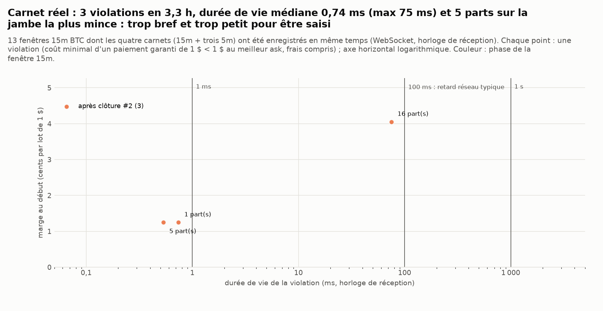
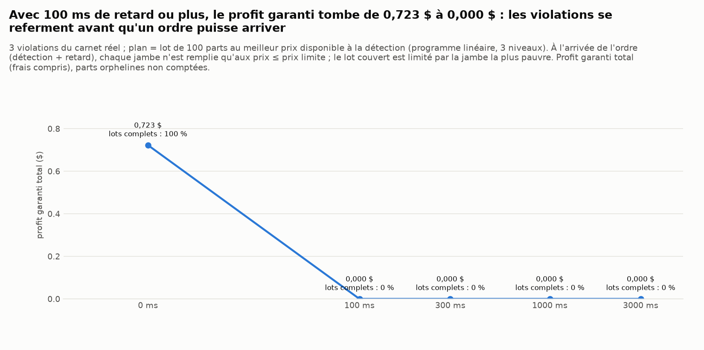
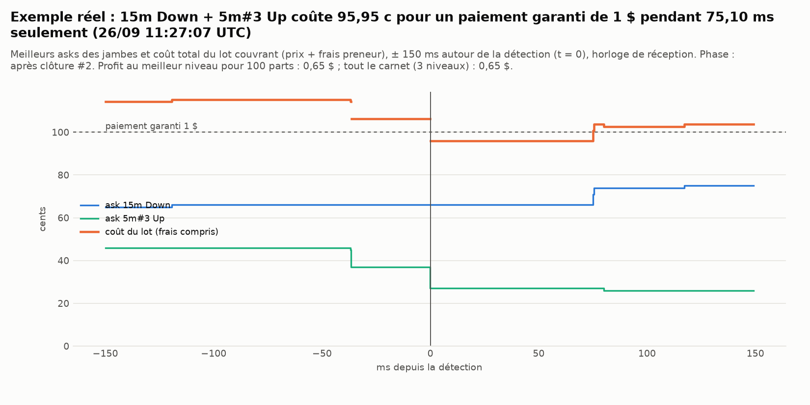
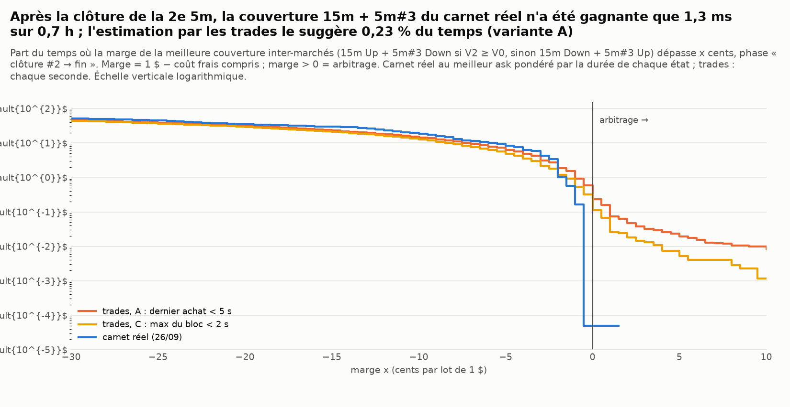

# Arbitrages entre marchés liés : peut-on gagner à coup sûr, Up ou Down ?

*Généré le 26/09/2026 11:32 UTC par `scripts/polymarket_arbitrage.py` (temps d'exécution total : 240 s, détail dans `runtime.csv`). Marchés BTC « Up or Down » 5 min, 15 min (et 4 h pour la chaîne). Historique : trades preneurs du 04/09 au 24/09/2026 ; carnet réel : enregistrement WebSocket du 26/09/2026.*

> Simulation papier, lecture seule de données publiques : aucun ordre, aucune clé. Depuis la France, Polymarket est en « close-only » : aucune de ces opérations n'y est possible. Il s'agit de répondre à une question, pas de trader.

## 0. Réponse courte

* **Prévoir Up ou Down à coup sûr est impossible.** Le meilleur signal trouvé ne dépasse pas ≈ 56 % de réussite à l'ouverture (`reports/polymarket/diagnostic.md`). La seule façon de gagner quel que soit le résultat est d'acheter, sur des marchés dont les issues sont liées, un ensemble de jetons qui paie au moins 1 $ dans tous les cas et coûte moins de 1 $, frais compris.
* **Les marchés sont bien liés, et c'est vérifié.** La 15 min et ses trois 5 min forment une chaîne de niveaux Chainlink : 33 119 égalités exactes sur 33 119 paires comparées pour BTC (5m, 15m et 4h). Sur les issues officielles de 2 016 fenêtres 15m, on compte 0 violation des implications logiques (par exemple « trois 5m Up ⇒ 15m Up »). Deux 5m consécutives, elles, ne sont **pas** liées : les quatre combinaisons Up/Down arrivent chacune environ 25 % du temps.
* **Une seule combinaison peut devenir gagnante à coup sûr.** Après la clôture de la 2e 5m, la 15m et la 3e 5m parient sur le **même prix final** avec deux seuils différents. Si le niveau V2 est au-dessus du niveau d'ouverture V0, « 5m#3 Up » entraîne « 15m Up » : acheter **15m Up + 5m#3 Down** paie alors toujours 1 $. Si V2 est en dessous, c'est **15m Down + 5m#3 Up**. Plus tôt dans la fenêtre, une couverture demande trois ou quatre jambes qui coûtent environ 1,5 à 2 $ : aucun cas trouvé.
* **Historique (trades, 21 jours)** : une combinaison apparemment gagnante à coup sûr apparaît dans **115 fenêtres 15m sur 2 011** (5,7 %). Au-dessus de 1 c : 69 fenêtres ; au-dessus de 2 c : 45. Elle survient toujours après la clôture de #2 et dure en médiane 2 s. Profit total sur 21 jours, limité aux tailles réellement échangées : **42,93 $ à 10 parts, 85,86 $ à 50 parts, 102,10 $ à 100 parts**, avec 15 parts en médiane sur la jambe la plus mince. En payant 1 c de plus par jambe, on tombe à 46,45 $ (100 parts). Mais la même méthode « voit » un Up + Down du même marché coûtant moins de 1 $, ce qui est impossible dans le carnet, pendant 14,1 % des secondes (2,1 % frais compris). Ces détections sont donc largement du bruit : les trades sont datés au bloc (≈ 2 s).
* **Carnet réel à la milliseconde** (13 fenêtres 15m, 3,3 h de carnets 5m et 15m enregistrés ensemble le 26/09) : **3 violations**, durée de vie médiane **0,7 ms** (maximum 75,1 ms), 5 parts disponibles en médiane sur la jambe la plus mince. Profit garanti si l'on était servi instantanément : 0,72 $ au total. Avec **100 ms** de retard : 0,00 $ ; avec 300 ms : 0,00 $. **Rien n'est exécutable.**
* **Le seul « coup sûr » qui rapporte : l'issue déjà connue.** Le TWAP final ne dépend que des points Chainlink horodatés jusqu'à **2 à 3 s avant la clôture**. On le recalcule exactement depuis le flux RTDS (écart < 1e-6 $ quand aucun point ne manque), et il est connu environ **1,6 s avant la fin**. Sur 21 jours, des preneurs ont acheté le gagnant après la clôture avec une marge positive sur **125 marchés sur 8 043**, pour **45 030 $** au total. Sur les quasi-égalités (écart final < 0,1 pb), le gagnant restait à vendre sous 1 $ après la clôture dans 73 marchés sur 104 (24 891 $), parfois à quelques centimes. C'est une course de vitesse (délai médian ≈ 0 à 2 s après la clôture), réservée aux robots qui lisent Chainlink en direct.
* **Exemple réel, en ordre de réception local (artefact, voir l'audit ci-dessous)** (26/09 11:27:07.773 UTC, après clôture #2) : 15m Down + 5m#3 Up aux prix 0,660 / 0,270 ; coût frais compris 95,95 c pour un paiement garanti de 1 $, soit **4,05 c de gain sûr par lot**. Mais la jambe la plus mince ne portait que 16 part(s) (profit maximal 0,65 $) et la situation a disparu en **75,10 ms**.
* **Audit contradictoire du 26/09/2026** (`reports/audit_8_points/README.md`) : les violations du carnet réel ci-dessus viennent de la fusion, à l'heure de réception locale, de deux connexions WebSocket décalées de 150 à 300 ms (flux 15m en retard sur le flux 5m). Remises dans l'ordre du serveur (`ts`), les 3 disparaissent, y compris l'« exemple réel » : **0 violation réelle** sur les 13 fenêtres. L'issue n'est connaissable qu'environ **0,8 s** avant la clôture (point T−2 du flux RTDS), et non 1,6 s ; et 21 544 $ des 45 030 $ du « coup sûr » viennent de quasi-égalités (écart < 0,04 pb) indécidables en temps réel.
* **Verdict.** Non : dans le carnet réel remis dans l'ordre du serveur, aucune combinaison de marchés liés ne gagne à coup sûr, et les détections historiques sont surtout du bruit de datation. Le seul gain sûr observé, acheter le gagnant d'une quasi-égalité autour de la clôture, suppose de recalculer le TWAP Chainlink en direct et de battre des robots déjà présents. Ce n'est pas une stratégie accessible depuis la France (close-only).

## 1. La chaîne de niveaux (vérification)

Chaque marché compare deux TWAP Chainlink sur 60 s : « Up » si `F ≥ K` (l'égalité va à Up). Pour une 15m `[S, S+900)` et ses trois 5m, on a V0 = K(15m) = K(5m#1), V1 = F(5m#1) = K(5m#2), V2 = F(5m#2) = K(5m#3) et V3 = F(5m#3) = F(15m). La 4h (alignée sur l'heure de New York, soit 00h, 04h… UTC en septembre) commence et finit sur les mêmes niveaux que ses 16 fenêtres 15m. Sources : caches `event_meta` (21 447 marchés BTC/ETH/SOL 5m et 15m, du 14/08 au 24/09) et `eventMetadata` des 252 fenêtres 4h BTC lues sur gamma (lecture seule, en mémoire).

| actif | relation | n | égalités | taux d'égalité exacte | écart max ($) |
|---|---|---|---|---|---|
| BTC | K(5m#k) == F(5m#k−1) (5m consécutives) | 12 050 | 12 050 | 100,0 % | 0,000000 |
| BTC | K(15m) == F(15m précédente) | 4 005 | 4 005 | 100,0 % | 0,000000 |
| BTC | K(15m) == K(5m#1) (même début) | 4 014 | 4 014 | 100,0 % | 0,000000 |
| BTC | F(15m) == F(5m#3) (même fin) | 4 015 | 4 015 | 100,0 % | 0,000000 |
| BTC | K(5m#2) == F(5m#1) dans une 15m | 4 014 | 4 014 | 100,0 % | 0,000000 |
| BTC | K(5m#3) == F(5m#2) dans une 15m | 4 014 | 4 014 | 100,0 % | 0,000000 |
| BTC | K(4h) == F(4h précédente) | 251 | 251 | 100,0 % | 0,000000 |
| BTC | K(4h) == K(15m) (même début) | 252 | 252 | 100,0 % | 0,000000 |
| BTC | F(4h) == F(15m) (même fin) | 252 | 252 | 100,0 % | 0,000000 |
| BTC | F(4h) == F(5m) (même fin) | 252 | 252 | 100,0 % | 0,000000 |
| ETH | K(5m#k) == F(5m#k−1) (5m consécutives) | 2 011 | 2 011 | 100,0 % | 0,000000 |
| ETH | K(15m) == F(15m précédente) | 669 | 669 | 100,0 % | 0,000000 |
| ETH | K(15m) == K(5m#1) (même début) | 671 | 671 | 100,0 % | 0,000000 |
| ETH | F(15m) == F(5m#3) (même fin) | 670 | 670 | 100,0 % | 0,000000 |
| ETH | K(5m#2) == F(5m#1) dans une 15m | 671 | 671 | 100,0 % | 0,000000 |
| ETH | K(5m#3) == F(5m#2) dans une 15m | 670 | 670 | 100,0 % | 0,000000 |
| SOL | K(5m#k) == F(5m#k−1) (5m consécutives) | 2 013 | 2 013 | 100,0 % | 0,000000 |
| SOL | K(15m) == F(15m précédente) | 669 | 669 | 100,0 % | 0,000000 |
| SOL | K(15m) == K(5m#1) (même début) | 671 | 671 | 100,0 % | 0,000000 |
| SOL | F(15m) == F(5m#3) (même fin) | 671 | 671 | 100,0 % | 0,000000 |
| SOL | K(5m#2) == F(5m#1) dans une 15m | 671 | 671 | 100,0 % | 0,000000 |
| SOL | K(5m#3) == F(5m#2) dans une 15m | 671 | 671 | 100,0 % | 0,000000 |

Implications logiques, contrôlées sur les **issues officielles** (`outcomePrices`, BTC, 04/09 → 24/09) :

| controle | n | violations |
|---|---|---|
| trois 5m Up mais 15m Down (impossible) | 2 016 | 0 |
| trois 5m Down mais 15m Up (impossible) | 2 016 | 0 |
| V2 ≥ V0, 5m#3 Up mais 15m Down (impossible) | 2 016 | 0 |
| V2 < V0, 5m#3 Down mais 15m Up (impossible) | 2 016 | 0 |
| issue officielle ≠ comparaison des niveaux de la chaîne | 8 064 | 0 |

Deux 5m consécutives ne sont soumises à **aucune contrainte logique** : elles partagent un niveau (F de l'une = K de l'autre), mais « V1 ≥ V0 » et « V2 ≥ V1 » peuvent se combiner librement. Les quatre combinaisons arrivent : Up→Up 25,2 %, Up→Down 24,7 %, Down→Up 24,7 %, Down→Down 25,4 % (n = 6 047, `5m_consecutives.csv`). Aucun arbitrage n'est possible entre elles.

## 2. Méthode : issues possibles et programme linéaire

À un instant t, on connaît certains niveaux (V0 dès l'ouverture, V1 à la clôture de #1, V2 à la clôture de #2). `possible_outcomes` énumère tous les vecteurs d'issues encore possibles pour les marchés ouverts : les niveaux inconnus sont libres, on parcourt tous leurs ordres relatifs (égalités comprises) entre eux et par rapport aux niveaux connus. Avant la clôture de #1, il reste 14 vecteurs sur 16 : « tous Up ⇒ 15m Up » et « tous Down ⇒ 15m Down ». Entre #1 et #2, il en reste 7, et 3 après #2.

`solve_arbitrage` résout ensuite le programme linéaire (`scipy.optimize.linprog`, HiGHS). Variables : les quantités x ≥ 0 de chaque jeton, par niveau de prix et dans la limite des tailles. Objectif : maximiser le paiement minimal garanti moins le coût, avec un coût par part égal à p + 0,07·p·(1−p). Il y a arbitrage si l'optimum est strictement positif. Pour balayer des millions d'instants, on énumère une fois les **sommets** du polyèdre des portefeuilles couvrants {x ≥ 0 : A·x ≥ 1}. Le coût minimal d'un paiement garanti de 1 $ est alors un simple minimum de produits (`min_cover_cost`), égal exactement à l'optimum du programme linéaire (vérifié par les tests sur des prix tirés au hasard). Le programme complet, avec niveaux et tailles, n'est résolu qu'au début de chaque épisode. Tests : `tests/test_polymarket_arbitrage.py` (violation évidente trouvée, prix cohérents sans arbitrage, frais qui annulent une violation de 1 c, tailles et niveaux, branchement de la 4h).

Sommets (portefeuilles couvrants minimaux) par phase : « Up + Down » d'un même marché (toujours ≥ 1 $ dans un carnet unifié) ; avant la clôture de #1, 15m Up + trois 5m Down et 15m Down + trois 5m Up ; entre #1 et #2, 15m Up + 5m#2 Down + 5m#3 Down si V1 ≥ V0 (sinon 15m Down + 5m#2 Up + 5m#3 Up) ; après #2, **15m Up + 5m#3 Down** si V2 ≥ V0 (sinon **15m Down + 5m#3 Up**).

## 3. Historique 04/09 → 24/09 (trades preneurs) : une détection, pas une preuve

11 168 420 trades preneurs BTC 5m et 15m. Pour chaque fenêtre 15m et ses trois 5m, on estime à chaque seconde le prix d'achat de chacun des 8 jetons à partir du dernier achat preneur de ce jeton. Les niveaux connus viennent des `finalPrice` : V1 est connu dès la clôture de #1 (en temps réel, il le serait via Chainlink, voir § 4). Trois variantes d'estimation : (A) dernier achat de moins de 5 s, comme demandé ; (B) la même + 1 c, prudente ; (C) prix le plus élevé payé dans le dernier bloc, de moins de 2 s. La variante C est robuste à l'ordre inconnu des trades dans un même bloc. Quand l'estimation donne Up + Down < 1 $ pour un même marché, ce qui est impossible dans le carnet unifié, l'estimation la plus ancienne est jetée.

| variante | prix estimé | fenêtres 15m | avec opportunité > 0 | > 1 c | > 2 c | épisodes | dont après clôture #2 | durée médiane (s) | durée p90 (s) | profit 10 parts ($) | profit 50 parts ($) | profit 100 parts ($) | 100 parts sans limite de taille ($) | secondes Up+Down < 1 (impossible) | idem frais compris |
|---|---|---|---|---|---|---|---|---|---|---|---|---|---|---|---|
| A | dernier achat < 5 s | 2 011 | 115 | 69 | 45 | 279 | 279 | 2 | 4 | 42,93 | 85,86 | 102,10 | 565,65 | 14,1 % | 2,07 % |
| B | dernier achat < 5 s, + 1 c | 2 011 | 53 | 35 | 26 | 82 | 82 | 2 | 3 | 26,93 | 44,71 | 46,45 | 350,39 | 2,9 % | 0,66 % |
| C | prix max du dernier bloc < 2 s | 2 011 | 58 | 19 | 12 | 109 | 109 | 2 | 2 | 9,55 | 30,51 | 43,33 | 111,75 | 4,3 % | 0,40 % |

*Profit « N parts » : programme linéaire au début de chaque épisode, avec un paiement garanti ≤ N $ et chaque jambe limitée à la taille échangée à ce prix dans la seconde (ce qu'un preneur a réellement obtenu). « Sans limite de taille » : N × marge. Un épisode = des secondes consécutives avec une marge > 0 dans la même phase. Sa durée reflète surtout la fenêtre de 5 s de l'estimateur.*

*Trades historiques : 279 « arbitrages » apparents en 21 jours, 100 % après la clôture de la 2e 5m et aucun avant ; 82 en payant 1 c de plus, 109 avec l'estimation robuste*

Portefeuilles détectés (variante A) : 15m Down + 5m#3 Up : 183 ; 15m Up + 5m#3 Down : 96. Aucune détection avant la clôture de #2 : les couvertures à trois ou quatre jambes coûtent toujours plus de 1 $.

Les plus gros épisodes, variante robuste C (détail complet : `historique_episodes.csv`) :

| slug15 | t (s après S) | durée (s) | portefeuille | prix | âges (s) | tailles | marge | profit 100 parts ($) |
|---|---|---|---|---|---|---|---|---|
| `btc-updown-15m-1790042400` | 849 | 1 | 15m Up + 5m#3 Down | 0,680 / 0,186 | 1 / 0 | 82,0 / 100,0 | 10,8 % | 8,87 |
| `btc-updown-15m-1788999300` | 874 | 8 | 15m Up + 5m#3 Down | 0,936 / 0,010 | 0 / 0 | 100,0 / 1061,9 | 4,9 % | 4,92 |
| `btc-updown-15m-1788755400` | 603 | 3 | 15m Down + 5m#3 Up | 0,322 / 0,500 | 0 / 0 | 50,0 / 30,0 | 14,5 % | 4,36 |
| `btc-updown-15m-1788999300` | 886 | 2 | 15m Up + 5m#3 Down | 0,947 / 0,010 | 0 / 0 | 2500,0 / 100,0 | 3,9 % | 3,88 |
| `btc-updown-15m-1789544700` | 823 | 2 | 15m Down + 5m#3 Up | 0,920 / 0,040 | 0 / 0 | 35,0 / 35,0 | 3,2 % | 1,13 |
| `btc-updown-15m-1789853400` | 855 | 2 | 15m Down + 5m#3 Up | 0,980 / 0,010 | 0 / 0 | 105,0 / 861,0 | 0,8 % | 0,79 |
| `btc-updown-15m-1789654500` | 855 | 1 | 15m Up + 5m#3 Down | 0,980 / 0,010 | 0 / 0 | 105,0 / 3300,0 | 0,8 % | 0,79 |
| `btc-updown-15m-1788678000` | 777 | 2 | 15m Down + 5m#3 Up | 0,980 / 0,010 | 0 / 0 | 308,0 / 323,0 | 0,8 % | 0,79 |

**Pourquoi c'est surtout du bruit.** Les trades sont datés au bloc (≈ 2 s) et l'ordre des trades dans un bloc est inconnu. Lors d'un mouvement brusque, le « dernier » achat d'un jeton peut précéder le mouvement et celui de l'autre le suivre. Exemple du 10/09 : dans le même bloc, la 5m#3 Down s'échange entre 0,51 et 0,91 et la 15m Up entre 0,27 et 0,50. L'estimateur fabrique alors des « arbitrages » impossibles. La preuve : il voit Up + Down < 1 $ sur un même marché pendant 14,1 % (A) ou 4,3 % (C) des secondes où les deux prix existent. Or le carnet réel ne le permet jamais (§ 6). Seul le carnet enregistré permet de dire si c'est exécutable.

## 4. Carnet réel à la milliseconde (26/09/2026)

Enregistrement WebSocket CLOB des carnets BTC 5m **et** 15m en même temps (collecteur `scripts/polymarket_live_collector.py`, depuis 04:30 UTC, panne de 06:05 à 10:00). 13 fenêtres 15m terminées sont analysées, soit 3,3 h pendant lesquelles la marge est calculable. On reconstruit les quatre carnets dans le repère Up (carnet unifié : ask Down = 1 − bid Up) et on garde les trois meilleurs niveaux de chaque jeton après chaque message qui les modifie. Les horloges sont celles de réception locale. V0 à V3 viennent du flux **Chainlink RTDS** quand il est enregistré (depuis 10:29 UTC), sinon de gamma (`priceToBeat` des fenêtres suivantes). Un marché dont le carnet est croisé (bid ≥ ask, état intermédiaire entre deux messages) ou dont l'enregistrement est interrompu est ignoré pendant ce temps.

**Niveaux via Chainlink RTDS.** V(T) est reproduit **exactement** (écart < 1e-6 $) par la moyenne des 60 points `btc/usd` du flux RTDS qui finissent 3 s avant T (7 fois) ou 2 s avant T (1 fois). Sur 12 niveaux dont gamma donne la valeur officielle, 8 sont reproduits ; les autres ont un point manquant dans l'enregistrement (4 niveaux avec moins de 60 points). Sans décalage, l'écart atteint 1,03 $. Le dernier point utile arrive **1,58 s avant T** en médiane. Le niveau, donc l'issue d'une fenêtre qui se termine en T, est connu juste avant la clôture. Mais la fenêtre exacte (2 s ou 3 s) n'est pas connue d'avance, et les deux calculs diffèrent de 0,013 pb en médiane. Une quasi-égalité plus serrée que cela reste indécidable en temps réel, tout comme un point manquant. Détail : `chainlink_rtds_niveaux.csv`.

**3 violations** au meilleur ask, frais compris, toutes inter-marchés (les carnets croisés sont exclus) :

| slug15 | phase | t (s après S) | durée de vie (ms) | portefeuille | asks | tailles | marge | profit max ($) | source des V |
|---|---|---|---|---|---|---|---|---|---|
| `btc-updown-15m-1790419500` | après clôture #2 | 643,578 | 0,74 | 15m Up + 5m#3 Down | 0,250 / 0,710 | 1,0 / 8,0 | 1,25 % | 0,012 | rtds, rtds, rtds |
| `btc-updown-15m-1790419500` | après clôture #2 | 643,580 | 0,53 | 15m Up + 5m#3 Down | 0,250 / 0,710 | 5,0 / 21,0 | 1,25 % | 0,062 | rtds, rtds, rtds |
| `btc-updown-15m-1790421300` | après clôture #2 | 727,773 | 75,10 | 15m Down + 5m#3 Up | 0,660 / 0,270 | 16,0 / 26,8 | 4,05 % | 0,648 | gamma, rtds, rtds |

*Carnet réel : 3 violations en 3,3 h, durée de vie médiane 0,74 ms (max 75 ms) et 5 parts sur la jambe la plus mince : trop bref et trop petit pour être saisi*

**Exécution avec retard.** À la détection, on planifie un lot de 100 parts au meilleur prix, sur trois niveaux au plus. Les ordres arrivent 0, 100, 300, 1 000 ou 3 000 ms plus tard et ne sont remplis qu'aux prix inférieurs ou égaux au prix limite détecté. Chaque jambe est confrontée au carnet à l'instant d'arrivée, et la jambe la plus pauvre fixe la part du lot couverte. Les parts achetées en trop sur une jambe restent « orphelines » : non couvertes, donc non comptées.

| retard (ms) | violations | profit garanti total ($) | lots complets | part moyenne du lot | violations encore rentables | parts orphelines |
|---|---|---|---|---|---|---|
| 0 | 3 | 0,723 | 100 % | 1,00 | 3 | 0,0 |
| 100 | 3 | 0,000 | 0 % | 0,00 | 0 | 22,0 |
| 300 | 3 | 0,000 | 0 % | 0,00 | 0 | 22,0 |
| 1 000 | 3 | 0,000 | 0 % | 0,00 | 0 | 6,0 |
| 3 000 | 3 | 0,000 | 0 % | 0,00 | 0 | 6,0 |

*Avec 100 ms de retard ou plus, le profit garanti tombe de 0,723 $ à 0,000 $ : les violations se referment avant qu'un ordre puisse arriver*

*Exemple réel : 15m Down + 5m#3 Up coûte 95,95 c pour un paiement garanti de 1 $ pendant 75,10 ms seulement (26/09 11:27:07 UTC)*

*Après la clôture de la 2e 5m, la couverture 15m + 5m#3 du carnet réel n'a été gagnante que 76,4 ms sur 0,8 h ; l'estimation par les trades le suggère 0,23 % du temps (variante A)*

## 5. Issue déjà connue : acheter le gagnant autour de la clôture

Ce n'est pas un arbitrage entre marchés, mais c'est le seul autre moyen de « gagner à coup sûr ». Une fois le TWAP final figé (2 à 3 s avant la clôture, § 4), le gagnant paie 1 $ avec certitude. L'acheter à p < 1 − frais rapporte 1 − p − 0,07·p·(1−p).

Historique : trades preneurs datés d'un bloc ≥ clôture E, selon l'écart final |F/K − 1|. Les colonnes « E−2…E−1 s » comptent les blocs datés E−2 s et E−1 s. Le TWAP y est déjà figé, mais son dernier point n'est publié sur RTDS que vers E − 1,7 s : ces achats ne sont que partiellement « sûrs » et ne sont pas comptés dans le résumé.

| écart final | marchés | gagnant acheté après E (marge > 0) | profit des preneurs après E ($) | parts | prix minimal médian | idem en E−2…E−1 s | profit E−2…E−1 s ($) |
|---|---|---|---|---|---|---|---|
| < 0,1 pb | 104 | 73 | 24 891 | 236 796 | 0,970 | 87 | 7 464 |
| 0,1 – 0,5 pb | 419 | 28 | 11 284 | 54 106 | 0,980 | 41 | 1 592 |
| 0,5 – 1 pb | 459 | 2 | 3 | 93 | 0,960 | 2 | 132 |
| 1 – 5 pb | 2 897 | 16 | 4 139 | 47 246 | 0,974 | 7 | 141 |
| ≥ 5 pb | 4 164 | 6 | 4 713 | 42 933 | 0,730 | 1 | 5 |
| Tous | 8 043 | 125 | 45 030 | 381 174 | 0,970 | 138 | 9 334 |

Plus gros cas (`historique_gagnant_apres_cloture.csv`) : `btc-updown-5m-1790238600` (écart −0,141 pb, gagnant acheté dès 0,010, délai médian 0 s, 10 254 $) ; `btc-updown-5m-1789148100` (écart −27,848 pb, gagnant acheté dès 0,507, délai médian 28 s, 4 365 $) ; `btc-updown-5m-1789845300` (écart −0,026 pb, gagnant acheté dès 0,220, délai médian 2 435 s, 3 786 $) ; `btc-updown-5m-1789046100` (écart +0,002 pb, gagnant acheté dès 0,100, délai médian 1 s, 3 661 $) ; `btc-updown-5m-1789697700` (écart −0,004 pb, gagnant acheté dès 0,020, délai médian 2 s, 2 627 $) ; `btc-updown-5m-1790224800` (écart −0,007 pb, gagnant acheté dès 0,175, délai médian 0 s, 1 768 $).

Quand l'écart final est minuscule, le marché, qui raisonne sur le prix spot, ne sait pas qui a gagné au moment de la clôture. Celui qui recalcule le TWAP Chainlink sait. Certains cas avec un délai de plusieurs minutes (jusqu'à 40 min) portent en plus un risque de résolution : le marché hésitait encore. Les montants sont concentrés sur quelques fenêtres.

Carnet réel : sur 49 marchés, le gagnant était encore à vendre avec une marge positive après l'instant où l'issue est connue (RTDS, ou E − 1,7 s à défaut) dans **0** cas. Quasi-égalités (|écart| < 0,5 pb) :

| slug | gagnant | écart (pb) | connu avant E (s) | ask gagnant E−10 s | marge E−10 s | ask E−3 s | ask quand connu | ask à E | marge max après connu | profit max ($) |
|---|---|---|---|---|---|---|---|---|---|---|
| `btc-updown-15m-1790397900` | Up | +0,311 | — | — | — | — | — | — | — | 0,00 |
| `btc-updown-5m-1790398200` | Up | +0,044 | — | 0,990 | 0,9 % | 0,990 | — | — | — | 0,00 |
| `btc-updown-5m-1790401200` | Down | −0,020 | — | 0,980 | 1,9 % | 0,990 | — | — | — | 0,00 |
| `btc-updown-5m-1790402100` | Up | +0,343 | — | — | — | — | — | — | — | 0,00 |
| `btc-updown-5m-1790418000` | Down | −0,042 | — | 0,860 | 13,2 % | 0,990 | — | — | — | 0,00 |
| `btc-updown-15m-1790418600` | Up | +0,278 | 1,74 | — | — | — | — | — | — | 0,00 |
| `btc-updown-5m-1790418900` | Down | −0,176 | — | — | — | — | — | — | — | 0,00 |
| `btc-updown-5m-1790419800` | Down | −0,224 | 1,35 | — | — | — | — | — | — | 0,00 |
| `btc-updown-15m-1790420400` | Up | +0,464 | — | — | — | — | — | — | — | 0,00 |

*— = aucun ask du gagnant (personne ne le vend) ou marché plus enregistré. À E−10 s, le TWAP n'est pas encore figé : acheter alors n'est pas un coup sûr.*

## 6. Autres relations testées

* **Up + Down du même marché** : dans le carnet unifié, ask Up + ask Down = 1 + écart ≥ 1 $. Vérifié sur le carnet reconstruit : médiane sur les états 1,010 $. Seuls 2 007 états sur 4 226 822 (0,047 %) passent sous 1 $, pour 4,5 s au total. Ce sont tous des carnets croisés, donc des états intermédiaires de la reconstruction : messages entre deux mises à jour, ou niveaux hors de la bande de ± 0,10 que le collecteur ne suit pas. Le moteur d'appariement ne peut pas être croisé. Détail : `carnet_up_plus_down.csv`.
* Dans les trades historiques, la même relation paraît violée pendant 14,1 % des secondes (variante A). Frais compris, c'est 2,07 %. C'est la mesure du bruit de l'estimation par les trades (`historique_up_plus_down.csv`).
* **5m consécutives** : aucune contrainte logique (§ 1), donc aucun arbitrage possible.
* **4h** : la chaîne est vérifiée (K et F de la 4h égaux à ceux de ses 15m de début et de fin, 100 %). La 4h ne se branche sur une 15m que pendant la **dernière 15m** de sa fenêtre (6 fois par jour). Après la clôture de #2, 4h, 15m et 5m#3 sont alors trois paris sur V3 avec trois seuils, et leurs prix doivent être rangés dans l'ordre des seuils. Le programme linéaire gère ce cas (test `test_4h_ladder_arbitrage`), mais ni trades 4h ni carnet 4h ne sont enregistrés : non mesuré ici.

## 7. Limites

* **Historique = détection.** Prix estimés par des trades datés au bloc, sans carnet. Une « opportunité » historique n'est pas une preuve d'exécution. Les tailles utilisées sont celles réellement échangées, pas la profondeur disponible.
* **Carnet réel = court échantillon** (3,3 h, une seule journée, avec une panne de 06:05 à 10:00). Les `price_change` sont filtrés à ± 0,10 du milieu par le collecteur. Lors d'un saut de plus de 10 c, des niveaux éloignés peuvent rester périmés jusqu'à l'instantané suivant. Ces états sont presque toujours croisés, donc exclus, mais une violation fantôme de quelques ms ne peut pas être totalement écartée. Cela renforce la conclusion : rien d'exploitable.
* Retard mesuré sur l'horloge de réception locale. Un ordre réel ajoute l'aller vers le serveur, la mise en file et le bloc de règlement. Les résultats avec retard sont donc optimistes.
* Frais : barème `crypto_fees_v2` (0,07·p·(1−p) par part, preneur), sans arrondi. Le gain du gagnant connu suppose une résolution conforme à la règle (vérifiée à 100 % sur 8 064 marchés) et un flux RTDS complet.
* 4h non mesurée (pas de données de prix). ETH/SOL : seule la chaîne est vérifiée.

## 8. Fichiers et temps d'exécution

| fichier | contenu |
|---|---|
| `chaine_verification.csv` | égalités K/F par relation et par actif (5m, 15m, 4h) |
| `controles_logiques.csv` | implications logiques sur les issues officielles |
| `5m_consecutives.csv` | table 2×2 des issues de deux 5m consécutives |
| `historique_resume.csv` | résumé par variante d'estimation (fenêtres, épisodes, profits, bruit Up+Down) |
| `historique_episodes.csv` | chaque épisode détecté dans les trades : phase, durée, portefeuille, prix, âges, tailles, profits 10/50/100 |
| `historique_fenetres.csv` | marge maximale par fenêtre 15m et par variante |
| `historique_up_plus_down.csv` | secondes où Up + Down < 1 dans l'estimation (bruit) |
| `historique_distribution_marge.csv` | distribution de la marge par phase (secondes) |
| `historique_gagnant_apres_cloture.csv` | achats preneurs du gagnant après la clôture (et 2 s avant), par marché |
| `historique_gagnant_par_ecart.csv` | idem agrégé par écart final |
| `chainlink_rtds_niveaux.csv` | niveaux V recalculés depuis Chainlink RTDS contre gamma, avance à la connaissance |
| `carnet_fenetres.csv` | fenêtres 15m du carnet réel : états, sources des V, marge maximale |
| `carnet_episodes.csv` | violations du carnet réel : durée de vie (ms), tailles, profits, exécution avec retard |
| `carnet_profit_latence.csv` | profit garanti selon le retard |
| `carnet_distribution_marge.csv` | distribution de la marge (ms) par phase |
| `carnet_up_plus_down.csv` | contrôle Up + Down ≥ 1 par marché |
| `carnet_gagnant_connu.csv` | ask du gagnant autour de la clôture (E−10 s, E−3 s, connu via RTDS, E, E+2 s) |

| etape | secondes |
|---|---|
| 1. chaîne K/F (event_meta + 4h gamma) et contrôles logiques | 3,2 |
| 2. historique trades (21 jours, 2 processus) | 96,8 |
| 3a. Chainlink RTDS (niveaux V en temps réel) | 0,1 |
| 3b. carnet réel (13 fenêtres 15m, 2 processus) | 138,0 |
| 4. figures | 1,4 |
| total | 239,6 |

Relancer : `. .venv/bin/activate && python scripts/polymarket_arbitrage.py` (≈ 2 min d'historique avec 2 processus, puis ≈ 20 s par fenêtre 15m de carnet). Le collecteur peut tourner en parallèle.
