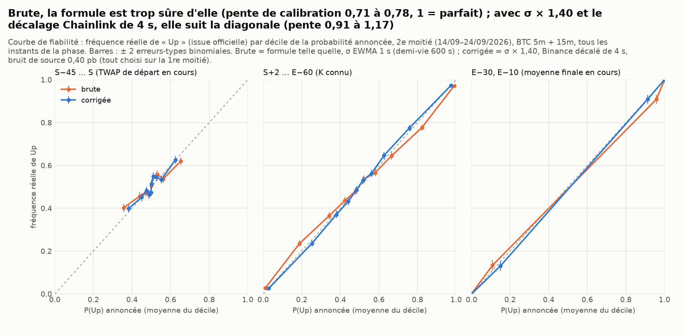
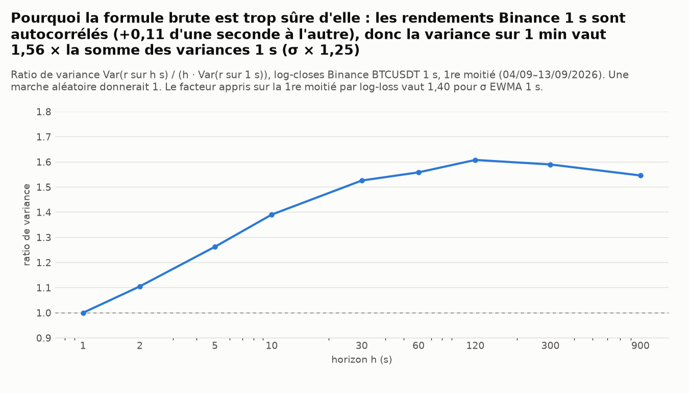
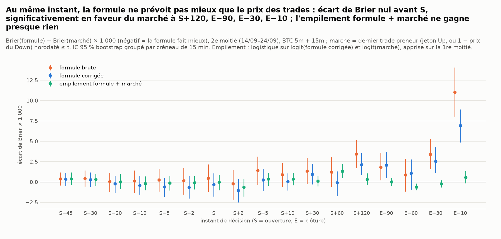
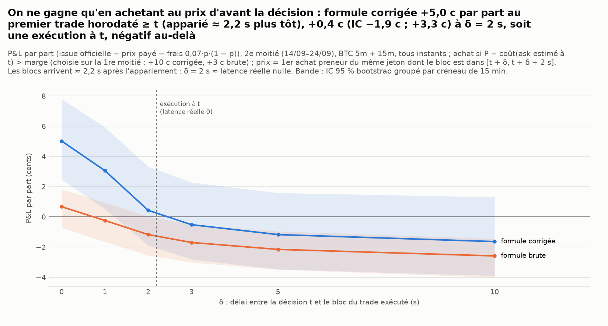
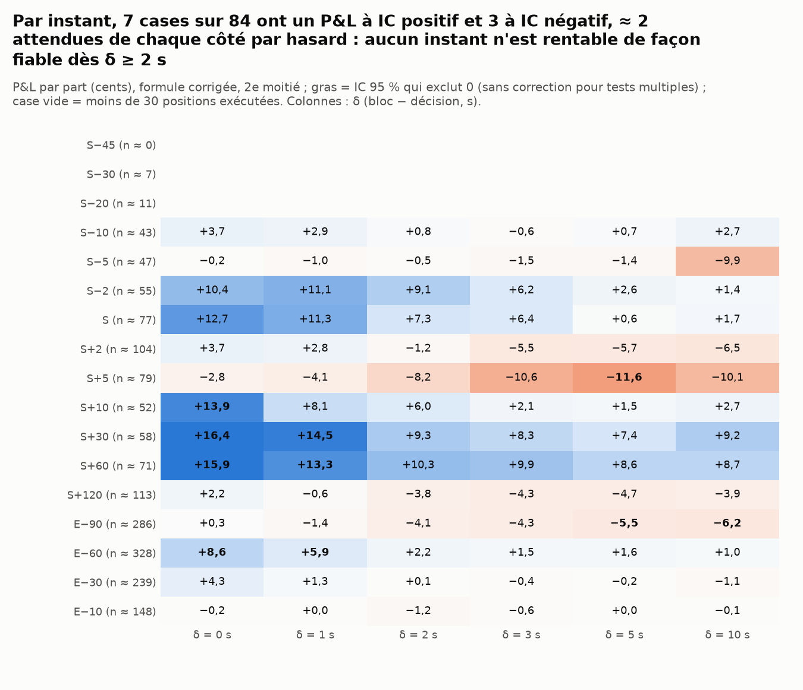
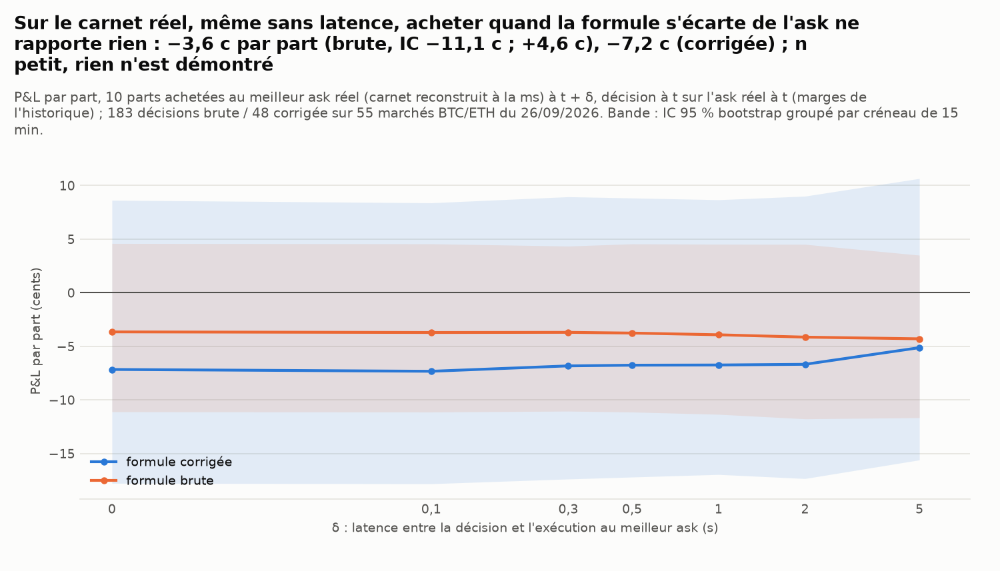
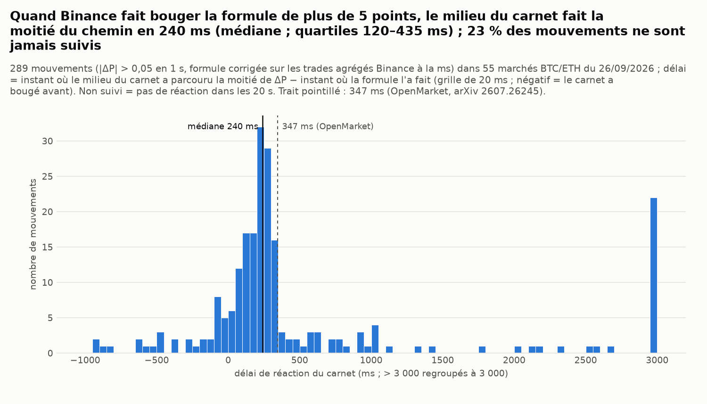

# La formule exacte P(Up) contre le marché — Polymarket « Up or Down » BTC 5m / 15m

*Généré le 26/09/2026 10:42 UTC par `scripts/polymarket_formula_backtest.py` (temps de calcul : 186 s, détail § 8). Historique : 8 064 marchés BTC 5m et 15m du 04/09 au 24/09/2026 (tous). Carnet réel : 55 marchés BTC 5m, BTC 15m et ETH 5m enregistrés à la milliseconde le 26/09/2026.*

> Simulation papier sur données publiques : aucun ordre, aucune clé. La formule est celle de `src/tradebot/polymarket_formula.py` (vérifiée par Monte-Carlo dans `tests/test_polymarket_formula.py`).

## 0. Réponse courte

* **La formule est juste, à condition de mesurer σ à la bonne échelle.** Telle quelle (σ = EWMA des rendements Binance 1 s, demi-vie 600 s, le meilleur des trois σ sur la 1re moitié), elle classe bien mais elle est **trop sûre d'elle** : pente de calibration 0,71 à 0,78 selon la phase (1 = parfait). Quand elle annonce moins de 2 % (K connu), l'improbable arrive 1,4 % du temps au lieu de 0,2 %. La cause est mesurée : les rendements Binance 1 s sont autocorrélés (+0,11 d'une seconde à l'autre) et la variance sur une minute vaut 1,56 × la somme des variances 1 s. Avec σ × 1,40, Binance décalé de 4 s (Chainlink est en retard) et un bruit de source de 0,40 pb, tous trois fixés sur la 1re moitié, la pente passe à 0,91–1,17 sur la 2e moitié : la formule « corrigée » est calibrée, à ± 0,2 près.
* **Elle ne bat pas le marché.** Au même instant, le prix du dernier trade preneur prévoit aussi bien ou mieux. L'écart de Brier (formule corrigée − marché) va de −1,03 à +6,94 × 10⁻³. L'IC est en faveur du marché à S+120, E−90, E−30, E−10 (4 instants sur 17), et jamais en faveur de la formule. Les AUC sont identiques (à S : formule 0,590, marché 0,588).
* **Son désaccord avec le marché contient un peu d'information, autour de l'ouverture seulement.** La pente de l'issue sur l'écart formule − marché vaut 0,60 à 0,74 de S−10 à S+2 (IC qui exclut 0 à 5 de ces 5 instants ; 1 voudrait dire « la formule a raison, le marché tort »). Mais l'empilement formule + marché appris sur la 1re moitié n'améliore le Brier du marché de façon significative qu'à E−60 (−0,61 × 10⁻³, sur un Brier de 0,051), et le dégrade à S+60 : l'information en plus est minuscule.
* **Pour gagner, il faut acheter au prix d'avant la décision.** Règle : acheter si P − coût(ask estimé) > marge (marge fixée sur la 1re moitié : +10 c pour la formule corrigée). P&L par part, frais inclus, 2e moitié : +5,0 c (IC +2,5 c ; +7,8 c) au prix du premier trade dont le bloc est ≥ t, +3,1 c (IC +0,5 c ; +5,9 c) à δ = 1 s, +0,4 c (IC −1,9 c ; +3,3 c) à δ = 2 s, puis négatif (−1,6 c à 10 s). La formule brute fait +0,7 c à δ = 0 et −1,2 c à δ = 2 s.
* **Or un bloc arrive 2,2 s après l'appariement** (médiane mesurée sur 29 659 trades vus à la fois dans le WebSocket et dans data-api ; quartiles 1,8–2,6 s). « δ = 0 » est donc un prix apparié ≈ 2,2 s **avant** la décision, inaccessible ; δ = 2 s correspond à une exécution à t. À latence réelle nulle, il ne reste rien de significatif.
* **Le carnet réel suit Binance en ≈ 240 ms** (médiane ; quartiles 120–435 ms ; 289 mouvements de la formule de plus de 5 points en 1 s). 23 % des mouvements ne sont jamais suivis : le marché n'y croit pas.
* **Sur le carnet réel, même sans latence, rien n'est gagné** (n petit : 55 marchés, 9 créneaux de 15 min ; les IC contiennent 0). En achetant au meilleur ask affiché à t : formule brute −3,6 c (IC −11,1 c ; +4,6 c) par part (183 décisions), corrigée −7,2 c (IC −17,8 c ; +8,6 c) (48 décisions) ; aucune latence de 0 à 5 s ne donne un P&L positif. La profondeur n'est pas la contrainte : 65 parts au meilleur ask (médiane), et 100 parts coûtent 0,8 c de plus que 10.
* **Verdict : la formule est exacte, mais le marché la connaît et l'applique en un quart de seconde.** Le gain historique (+3 c à +5 c par part, sur 1 685 achats en 11 jours) n'existe que contre des prix vieux d'une à deux secondes ; or le carnet se remet à jour ≈ 250 ms après Binance, et ces prix ont disparu quand un preneur arrive. Pour gagner, il faudrait voir Binance et frapper le carnet en moins de ≈ 250 ms (vitesse d'un teneur de marché), et l'avantage serait alors inférieur à cette borne de quelques cents. Avec une latence d'une seconde ou plus (un robot qui lit Binance à la seconde), il ne reste rien après frais : +0,4 c (IC −1,9 c ; +3,3 c) par part à exécution immédiate, négatif ensuite.

## 1. La formule en clair

Règle officielle (TWAP-60, vérifiée sur 8 063 marchés) : on note p le log-prix Chainlink publié chaque seconde, S l'ouverture, E la clôture, D = E − S (300 s ou 900 s).

```text
K = moyenne de p sur (S − 60, S]      (le « prix à battre », 60 points)
F = moyenne de p sur (E − 60, E]      (le prix final)
« Up »  si et seulement si  F ≥ K

Si p suit une marche aléatoire de volatilité σ (par √seconde) :

    P(Up | ce qu'on sait à t) = Φ( m(t) / s(t) )        Φ = loi normale

Phase 1   t ≤ S − 60        m = 0                                   → P = 0,5
Phase 2   S − 60 < t ≤ S    m = (a / 60) · (p_t − Ā)                a = t − (S − 60), Ā = moyenne réalisée sur (S − 60, t]
                            s² = σ² · (D − 40 + r − r²/60 + r³/10 800),   r = S − t
Phase 3   S < t ≤ E − 60    m = p_t − K                             s² = σ² · (E − t − 40)
Phase 4   E − 60 < t ≤ E    m = B + (τ / 60) · p_t − K              B = (somme réalisée sur (E − 60, t]) / 60, τ = E − t
                            s² = σ² · τ³ / 10 800
```

Intuition : avant S, le prix à battre n'est pas encore fixé ; si le prix actuel est au-dessus de la moyenne en cours, K finira sous le prix actuel, d'où un avantage à « Up » (le « TWAP partiel »). Après S, c'est l'écart au prix à battre, rapporté à la volatilité qui reste. Le code utilise la version exacte à la seconde (sommes discrètes), qui coïncide avec ces formules à < 1 % près. Décision preneur : acheter « Up » à l'ask a coûte a + 0,07 · a · (1 − a) ; l'espérance par part est P − a − 0,07 · a · (1 − a) (symétrique pour « Down »).

**Exemple chiffré à S−10 s** (`btc-updown-5m-1789799100`, ouverture 19/09/2026 06:25 UTC, 2e moitié) :

* Binance à t = S−10 s : 80 950,35 $ ; moyenne des 50 closes 1 s de (S−60, S−10] : 80 959,81 $ ; p_t − Ā = −1,17 pb ; a = 50 s ⇒ m = 50/60 × (−1,17) = −0,97 pb.
* σ (EWMA 1 s) = 0,196 pb/√s ; facteur de variance exact (r = 10 s, D = 300 s) = 268,8 (formule continue : 300 − 40 + 10 − 100/60 + 1 000/10 800 = 268,4) ; s = 0,196 × √268,8 = 3,22 pb.
* m / s = −0,303 ⇒ **P(Up) = Φ(−0,303) = 0,381** (formule brute). Corrigée (σ × 1,40 = 0,275 pb/√s, Binance décalé de 4 s, bruit de source) : m = −1,18 pb, s = 4,49 pb, P(Up) = 0,396.
* Marché au même instant : dernier trade = 0,450 (pour Up). Acheter « Down » coûterait ≈ 0,555 + frais 0,0173 = 0,572 ; espérance selon la formule corrigée : 0,604 − 0,572 = +3,1 c par part, sous la marge de +10 c : pas d'achat. Issue officielle : **Up**.

## 2. Données

* **Marchés** : 8 064 marchés BTC du 04/09 au 24/09/2026 (6 048 en 5m, taux de Up 49,9 % ; 2 016 en 15m, 49,0 %), issue officielle (`PolymarketClient`, cache), `priceToBeat`/`finalPrice` (caches `event_meta` et `markets.csv`). Choix des paramètres : 04/09–13/09 (1re moitié) ; évaluation : 14/09–24/09 (2e moitié).
* **Binance** : closes 1 s BTCUSDT (cache `pm_maker/binance_1s`, 03/09–24/09) ; bougies 1 m (cache `BTCUSDT_1m`) pour Parkinson ; σ TimesFM par marché (`reports/timesfm_amplitude/sigma_par_marche.csv`, prévu à S−120 s donc connu à tous les instants).
* **Trades preneurs** : 11 168 420 trades de 8 052 marchés, horodatés au bloc Polygon (data-api, cache `wallets/trades`) : 7 620 marchés depuis les fichiers `*_taker`, 432 (une partie du 23/09 et le 24/09, absents de ces fichiers) depuis les jambes `role = taker` des fichiers `*_all`.
* **Carnet réel** : fichiers du collecteur (`data/cache/polymarket/live/`, carnet reconstruit par `tradebot.polymarket_book`) : 64 marchés enregistrés, **55 exploitables** ; écartés : carnet incomplet (fin manquante) (3), issue inconnue (collecte interrompue) (3), fenêtre en cours (3). Binance 1 s (BTC, ETH) et trades agrégés (ms) via `data-api.binance.vision`, cache `data/cache/pm_formula/`.

## 3. Méthode

**Alignement (aucune donnée après t).** La bougie Binance 1 s ouverte à u − 1 clôt à u : son close est « le prix à u », connu à u. À l'instant t, la formule n'utilise que les prix aux instants ≤ t : p_t = close de la bougie ouverte à t − 1 ; Ā = moyenne sur (S − 60, t] ; K = moyenne sur (S − 60, S] ; B = somme sur (E − 60, t] / 60. Les σ sont calculés avant t : Parkinson sur les 60 dernières bougies 1 m **closes** à t ; EWMA des rendements 1 s jusqu'à t ; TimesFM prévu à S − 120 s. Des tests unitaires modifient toutes les données postérieures à t et vérifient que rien ne change (`tests/test_polymarket_formula_backtest.py`).

**K vient de Binance, pas du `priceToBeat`.** Vérification sur les 8 064 marchés : la moyenne Binance sur (S − 60, S] dépasse le `priceToBeat` Chainlink de 1,8 pb en moyenne sur la 1re moitié et de 4,3 pb sur la 2e (écart-type 1,7 à 2,9 pb) : l'écart de niveau n'est pas constant d'un jour à l'autre. En revanche il s'annule dans F − K : l'erreur quadratique sur F − K n'est que de 0,50 pb. Comparer le spot Binance au `priceToBeat` introduirait un biais de 2 à 4 pb, énorme en fin de fenêtre (s ≈ 1 pb à E−10 s). Décaler Binance de 4 s vers le passé réduit cette erreur à 0,40 pb (1re moitié ; 0,36 pb sur la 2e) : Chainlink est en retard d'environ 4 s sur Binance. Même avec le bon K, l'issue calculée sur Binance ne coïncide avec l'issue officielle que dans 98,4 % des cas (2e moitié) : c'est un plancher d'erreur en fin de fenêtre.

**Trois σ, tous connus avant t** : (i) Parkinson « hauts/bas » sur les bougies 1 m des 60 dernières minutes ; (ii) EWMA des carrés des rendements 1 s, demi-vie choisie sur la 1re moitié parmi 15, 30, 60, 120, 300, 600, 1800 s (log-loss) : **600 s** ; (iii) TimesFM : σ prévu à l'horizon de h = D/60 + 1 bougies 1 m, divisé par √(60 h) pour l'avoir par √s. L'estimateur principal est choisi sur la 1re moitié par log-loss : **EWMA 1 s**.

| σ | log-loss brut | Brier brut | facteur k choisi | log-loss avec σ × k | n (marché × instant) |
|---|---|---|---|---|---|
| Parkinson 1 m (60 min) | 0,5612 | 0,1944 | 1,50 | 0,5547 | 65 280 |
| EWMA 1 s | 0,5556 | 0,1934 | 1,40 | 0,5519 | 65 280 |
| TimesFM | 0,5569 | 0,1940 | 1,25 | 0,5555 | 65 280 |

**Deux variantes.** *Brute* : la formule telle quelle avec EWMA 1 s (ce que demande l'énoncé). *Corrigée* : σ × k (k choisi sur la 1re moitié par log-loss, grille 0,80–2,20 ; retenu : EWMA 1 s × 1,40), Binance décalé de 4 s (décalage qui minimise l'erreur sur F − K contre `priceToBeat`/`finalPrice` sur la 1re moitié ; la formule est alors évaluée à τ = t + 4 s avec les données Binance ≤ t) et un bruit de source de 0,40 pb ajouté à s (l'erreur résiduelle sur F − K, 1re moitié). Aucun de ces trois paramètres n'utilise les issues de la 2e moitié.

**Prix du marché au même instant** : dernier trade preneur de bloc ≤ t, ramené au jeton Up (un trade sur Down au prix p compte 1 − p), ignoré s'il a plus de 300 s ; variante : VWAP des trades de bloc dans [t − 3 s, t] (dans `scores_par_instant.csv`).

**P&L preneur** : à t, ask estimé = prix de référence (VWAP 3 s, sinon dernier trade) + 0,005 pour Up et 1 − référence + 0,005 pour Down ; on achète le côté dont l'espérance P − (ask + 0,07·ask·(1 − ask)) dépasse la marge. Prix payé : **premier achat preneur du même jeton dont le bloc est dans [t + δ, t + δ + 2 s]**, δ ∈ {0, 1, 2, 3, 5, 10} s ; sans trade dans la fenêtre, pas d'exécution (comptée à part). Frais 0,07·p·(1 − p), gain 1 si le côté acheté gagne (issue officielle). Marge choisie sur la 1re moitié dans {0,0, 0,5, 1,0, 2,0, 3,0, 5,0, 7,5, 10,0, 15,0, 20,0, 25,0, 30,0} c : P&L total maximal à δ = 0 s (cas le plus favorable), au moins 200 achats exécutés ⇒ **+10 c** (corrigée), **+3 c** (brute). À δ = 2 s, **aucune** marge de la grille n'est rentable sur la 1re moitié (voir `marge_par_moitie.csv`) : la règle stricte serait de ne jamais acheter.

**Biais des horodatages de bloc** : un trade est horodaté au bloc Polygon qui l'inclut, en moyenne 2,20 s (médiane 2,19 s) après l'appariement dans le carnet (mesuré ici en appariant par hash de transaction les trades du WebSocket, à la ms, et ceux de data-api). Le « premier trade de bloc ≥ t + δ » a donc été apparié vers t + δ − 2,2 s : **le P&L historique à un δ donné est optimiste** (le prix reflète un état du carnet plus ancien, d'avant que le marché intègre le mouvement de Binance). Lire δ − 2,2 s comme la latence réelle. Le même retard vieillit le prix du marché « à t » (il a ≈ 2 s de plus que son horodatage) : la comparaison du § 4b est donc biaisée **en faveur de la formule**, qui ne bat pourtant pas le marché.

**Incertitude** : IC à 95 % par bootstrap groupé par créneau de 15 min (les 5m et 15m d'un même créneau sont tirés ensemble ; 2 000 tirages). **Tests multiples** : 17 instants × 2 durées × 2 variantes pour les scores, 17 instants × 6 δ pour le P&L ; aucun IC n'est corrigé : à 95 %, environ 1 case sur 40 sort « significative » de chaque côté par hasard. Les conclusions reposent sur les agrégats et les motifs réguliers, pas sur une case isolée.

## 4. Historique (BTC 5m + 15m, 2e moitié : 14/09–24/09/2026)

### 4a. La formule est-elle juste ? (calibration contre l'issue officielle)





Par phase et par durée (2e moitié ; pente de calibration : logistique de l'issue sur logit(P), 1 = parfaitement calibrée, < 1 = trop sûre d'elle) :

| durée | phase | variante | n | brier | log-loss | auc | justesse | pente de calibration |
|---|---|---|---|---|---|---|---|---|
| 5m | 2 (S−45…S) | brute | 22 176 | 0,2465 | 0,6862 | 0,573 | 55,4 % | 0,71 |
| 5m | 2 (S−45…S) | corrigée | 22 176 | 0,2459 | 0,6848 | 0,574 | 55,6 % | 0,90 |
| 5m | 3 (S+2…E−60) | brute | 25 344 | 0,1835 | 0,5353 | 0,794 | 70,5 % | 0,78 |
| 5m | 3 (S+2…E−60) | corrigée | 25 344 | 0,1828 | 0,5301 | 0,794 | 70,3 % | 1,06 |
| 5m | 4 (E−30, E−10) | brute | 6 336 | 0,0186 | 0,0746 | 0,998 | 97,5 % | 0,77 |
| 5m | 4 (E−30, E−10) | corrigée | 6 336 | 0,0159 | 0,0522 | 0,998 | 97,9 % | 1,23 |
| 15m | 2 (S−45…S) | brute | 7 392 | 0,2489 | 0,6910 | 0,540 | 53,6 % | 0,73 |
| 15m | 2 (S−45…S) | corrigée | 7 392 | 0,2487 | 0,6906 | 0,539 | 53,4 % | 0,92 |
| 15m | 3 (S+2…E−60) | brute | 8 448 | 0,1922 | 0,5458 | 0,755 | 66,7 % | 0,77 |
| 15m | 3 (S+2…E−60) | corrigée | 8 448 | 0,1916 | 0,5428 | 0,754 | 66,6 % | 1,03 |
| 15m | 4 (E−30, E−10) | brute | 2 112 | 0,0139 | 0,0574 | 0,998 | 98,2 % | 0,78 |
| 15m | 4 (E−30, E−10) | corrigée | 2 112 | 0,0119 | 0,0380 | 0,999 | 98,2 % | 1,04 |
| tous | 2 (S−45…S) | brute | 29 568 | 0,2471 | 0,6874 | 0,566 | 55,0 % | 0,71 |
| tous | 2 (S−45…S) | corrigée | 29 568 | 0,2466 | 0,6862 | 0,566 | 55,0 % | 0,91 |
| tous | 3 (S+2…E−60) | brute | 33 792 | 0,1857 | 0,5379 | 0,785 | 69,5 % | 0,78 |
| tous | 3 (S+2…E−60) | corrigée | 33 792 | 0,1850 | 0,5333 | 0,785 | 69,4 % | 1,06 |
| tous | 4 (E−30, E−10) | brute | 8 448 | 0,0174 | 0,0703 | 0,998 | 97,7 % | 0,77 |
| tous | 4 (E−30, E−10) | corrigée | 8 448 | 0,0149 | 0,0487 | 0,999 | 98,0 % | 1,17 |

Queues (2e moitié, 5m + 15m) : quand la formule annonce moins de 2 % (ou plus de 98 %), fréquence réelle de l'improbable :

| phase | variante | zone | annonces | attendu (moyenne de P) | observé | surprises |
|---|---|---|---|---|---|---|
| 3 | brute | P < 0,02 | 2 635 | 0,24 % | 1,37 % | 36 |
| 3 | brute | P > 0,98 | 2 691 | 0,23 % | 1,11 % | 30 |
| 3 | corrigée | P < 0,02 | 2 064 | 0,28 % | 0,53 % | 11 |
| 3 | corrigée | P > 0,98 | 2 137 | 0,26 % | 0,42 % | 9 |
| 4 | brute | P < 0,02 | 3 880 | 0,03 % | 0,41 % | 16 |
| 4 | brute | P > 0,98 | 3 980 | 0,03 % | 0,68 % | 27 |
| 4 | corrigée | P < 0,02 | 3 697 | 0,05 % | 0,00 % | 0 |
| 4 | corrigée | P > 0,98 | 3 768 | 0,05 % | 0,08 % | 3 |

Lecture : la formule brute sous-estime la variance (queues trop fines : en phase 3, 36 surprises sur 2 635 annonces < 2 % contre 6 attendues). La correction de σ ramène la phase 3 à 0,5 % observés pour 0,3 % attendus, et le bruit de source supprime les excès de confiance de fin de fenêtre (phase 4). Le Brier par instant et par σ est dans `scores_par_sigma.csv` (TimesFM, déjà à l'échelle de la minute, est le meilleur σ brut de S−20 à S+120 ; une fois multipliés par leur k, les trois σ se valent).

### 4b. Bat-elle le marché au même instant ?



Formule corrigée contre dernier trade preneur, 5m + 15m. « Pente de l'écart » : régression sans constante de (issue − p_marché) sur (P_formule − p_marché) ; 0 = l'écart n'apprend rien au-delà du marché, 1 = la formule a entièrement raison quand ils divergent.

| instant | n | Brier formule | Brier marché | ΔBrier ×10³ [IC] | AUC formule | AUC marché | pente calib. formule | pente calib. marché | empilement − marché ×10³ [IC] | pente de l'écart [IC] |
|---|---|---|---|---|---|---|---|---|---|---|
| S−45 | 4 171 | 0,2495 | 0,2492 | +0,35 [−0,48 ; +1,14] | 0,535 | 0,534 | 1,57 | 1,34 | +0,39 [−0,37 ; +1,19] | 0,19 [−0,53 ; 0,85] |
| S−30 | 4 175 | 0,2489 | 0,2486 | +0,30 [−0,62 ; +1,18] | 0,538 | 0,543 | 0,98 | 1,22 | +0,31 [−0,45 ; +0,96] | 0,31 [−0,31 ; 0,88] |
| S−20 | 4 180 | 0,2480 | 0,2482 | −0,22 [−1,30 ; +0,76] | 0,554 | 0,550 | 0,89 | 0,93 | +0,03 [−0,85 ; +1,00] | 0,62 [0,01 ; 1,10] |
| S−10 | 4 180 | 0,2462 | 0,2466 | −0,41 [−1,56 ; +0,76] | 0,567 | 0,565 | 0,92 | 0,95 | −0,17 [−1,00 ; +0,69] | 0,66 [0,24 ; 1,04] |
| S−5 | 4 180 | 0,2458 | 0,2464 | −0,60 [−1,82 ; +0,53] | 0,573 | 0,567 | 0,85 | 0,84 | −0,13 [−1,02 ; +0,75] | 0,72 [0,30 ; 1,13] |
| S−2 | 4 180 | 0,2448 | 0,2455 | −0,66 [−2,04 ; +0,73] | 0,584 | 0,578 | 0,87 | 0,86 | −0,09 [−0,90 ; +0,75] | 0,71 [0,28 ; 1,11] |
| S | 4 180 | 0,2438 | 0,2442 | −0,33 [−1,78 ; +1,08] | 0,590 | 0,588 | 0,88 | 0,93 | −0,03 [−1,01 ; +0,88] | 0,60 [0,23 ; 0,98] |
| S+2 | 4 180 | 0,2422 | 0,2433 | −1,03 [−2,49 ; +0,35] | 0,600 | 0,594 | 0,91 | 0,95 | −0,64 [−1,78 ; +0,35] | 0,74 [0,42 ; 1,07] |
| S+5 | 4 180 | 0,2414 | 0,2411 | +0,25 [−1,12 ; +1,63] | 0,604 | 0,607 | 0,90 | 0,90 | +0,36 [−0,47 ; +1,15] | 0,43 [0,02 ; 0,77] |
| S+10 | 4 180 | 0,2376 | 0,2375 | +0,04 [−1,03 ; +1,07] | 0,627 | 0,627 | 0,98 | 0,92 | +0,36 [−0,39 ; +1,14] | 0,49 [0,10 ; 0,89] |
| S+30 | 4 180 | 0,2258 | 0,2249 | +0,93 [−0,30 ; +2,23] | 0,679 | 0,683 | 1,09 | 1,03 | +0,13 [−0,54 ; +0,73] | 0,25 [−0,09 ; 0,65] |
| S+60 | 4 182 | 0,2128 | 0,2129 | −0,08 [−1,71 ; +1,31] | 0,721 | 0,720 | 1,05 | 1,00 | +1,32 [+0,49 ; +2,20] | 0,52 [0,20 ; 0,84] |
| S+120 | 4 182 | 0,1844 | 0,1822 | +2,13 [+0,86 ; +3,56] | 0,796 | 0,800 | 1,03 | 1,00 | +0,33 [−0,33 ; +1,09] | 0,12 [−0,17 ; 0,37] |
| E−90 | 4 182 | 0,0857 | 0,0836 | +2,08 [+0,49 ; +3,72] | 0,954 | 0,956 | 1,08 | 1,02 | +0,01 [−0,46 ; +0,49] | 0,24 [0,04 ; 0,44] |
| E−60 | 4 182 | 0,0521 | 0,0511 | +1,08 [−0,94 ; +2,77] | 0,983 | 0,983 | 1,14 | 1,13 | −0,61 [−0,99 ; −0,19] | 0,39 [0,20 ; 0,57] |
| E−30 | 4 182 | 0,0185 | 0,0159 | +2,56 [+1,14 ; +4,29] | 0,998 | 0,998 | 1,26 | 1,28 | −0,21 [−0,65 ; +0,24] | 0,23 [0,08 ; 0,40] |
| E−10 | 4 182 | 0,0115 | 0,0045 | +6,94 [+4,86 ; +8,92] | 0,999 | 1,000 | 1,08 | 1,44 | +0,56 [−0,14 ; +1,35] | 0,04 [−0,05 ; 0,15] |

Distribution de l'écart P_formule (corrigée) − p_marché (2e moitié) :

| instant | n | moyenne | écart-type | p05 | médiane | p95 | \|écart\| > 5 pts | \|écart\| > 10 pts |
|---|---|---|---|---|---|---|---|---|
| S−45 | 4 171 | +0,001 | 0,023 | −0,037 | +0,000 | +0,040 | 4,3 % | 0,2 % |
| S−30 | 4 175 | +0,001 | 0,028 | −0,044 | +0,001 | +0,045 | 7,1 % | 0,3 % |
| S−20 | 4 180 | +0,002 | 0,030 | −0,046 | +0,002 | +0,050 | 8,7 % | 0,7 % |
| S−10 | 4 180 | +0,002 | 0,036 | −0,054 | +0,001 | +0,056 | 13,2 % | 1,8 % |
| S−5 | 4 180 | +0,002 | 0,037 | −0,056 | +0,001 | +0,060 | 14,3 % | 1,8 % |
| S−2 | 4 180 | +0,002 | 0,039 | −0,060 | +0,002 | +0,061 | 15,8 % | 2,3 % |
| S | 4 180 | +0,002 | 0,042 | −0,062 | +0,002 | +0,067 | 17,2 % | 3,2 % |
| S+2 | 4 180 | +0,002 | 0,046 | −0,072 | +0,002 | +0,075 | 21,5 % | 4,4 % |
| S+5 | 4 180 | +0,002 | 0,041 | −0,063 | +0,002 | +0,066 | 17,9 % | 2,6 % |
| S+10 | 4 180 | +0,002 | 0,039 | −0,060 | +0,002 | +0,064 | 17,2 % | 1,6 % |
| S+30 | 4 180 | +0,001 | 0,043 | −0,065 | +0,001 | +0,067 | 20,4 % | 2,4 % |
| S+60 | 4 182 | +0,000 | 0,046 | −0,070 | +0,001 | +0,071 | 23,6 % | 3,2 % |
| S+120 | 4 182 | +0,001 | 0,053 | −0,076 | +0,001 | +0,084 | 27,0 % | 5,0 % |
| E−90 | 4 182 | +0,000 | 0,064 | −0,104 | +0,001 | +0,101 | 26,7 % | 10,4 % |
| E−60 | 4 182 | −0,002 | 0,069 | −0,105 | −0,000 | +0,104 | 20,4 % | 10,7 % |
| E−30 | 4 182 | −0,001 | 0,069 | −0,054 | −0,001 | +0,042 | 9,9 % | 6,6 % |
| E−10 | 4 182 | +0,001 | 0,087 | −0,010 | +0,001 | +0,010 | 5,9 % | 4,8 % |

Lecture : avant S, formule et marché sont presque toujours à moins de 5 points l'un de l'autre ; l'écart s'élargit ensuite (plus d'information, prix plus extrêmes). Le marché est aussi bien calibré (pentes ≈ 1) et fait mieux en fin de fenêtre, où il connaît Chainlink et où l'issue Binance diffère parfois de l'issue officielle.

### 4c. Peut-on gagner, et à quelle vitesse faut-il agir ?



P&L par part (cents, frais inclus), 2e moitié ; **gras** = IC 95 % qui exclut 0. « Ask estimé à t » : exécution supposée au prix de référence + 0,5 c (hypothèse des études précédentes). « Surcoût » : prix réellement payé − ask estimé.

| variante | instants | achats | ask estimé à t | δ = 0 s | δ = 1 s | δ = 2 s | δ = 3 s | δ = 5 s | δ = 10 s | exécutés à δ = 2 s | surcoût à δ = 2 s |
|---|---|---|---|---|---|---|---|---|---|---|---|
| corrigée | tous les instants | 1 805 | +6,2 c | **+5,0 c** | **+3,1 c** | +0,4 c | −0,5 c | −1,2 c | −1,6 c | 94 % | +6,3 c |
| corrigée | avant S (S−45…S−2) | 171 | +7,0 c | +3,9 c | +2,9 c | +2,3 c | +0,6 c | −0,2 c | −3,3 c | 92 % | +4,9 c |
| corrigée | ouverture (S…S+10) | 313 | +9,2 c | +5,8 c | +4,0 c | +0,4 c | −2,5 c | −4,5 c | −3,8 c | 99 % | +9,0 c |
| corrigée | milieu (S+30…E−60) | 886 | +6,9 c | **+6,1 c** | **+3,8 c** | +0,5 c | −0,0 c | −0,6 c | −0,8 c | 96 % | +6,8 c |
| corrigée | fin (E−30, E−10) | 435 | +2,5 c | +2,6 c | +0,8 c | −0,4 c | −0,5 c | −0,1 c | −0,8 c | 85 % | +3,7 c |
| brute | tous les instants | 16 864 | +1,7 c | +0,7 c | −0,2 c | −1,2 c | **−1,7 c** | **−2,1 c** | **−2,6 c** | 92 % | +2,9 c |
| brute | avant S (S−45…S−2) | 3 930 | +1,6 c | −0,0 c | −0,5 c | −1,5 c | −1,8 c | −2,4 c | **−3,6 c** | 81 % | +2,2 c |
| brute | ouverture (S…S+10) | 4 965 | +2,0 c | +0,4 c | −0,6 c | −1,7 c | **−2,8 c** | **−3,4 c** | **−3,7 c** | 95 % | +3,8 c |
| brute | milieu (S+30…E−60) | 7 293 | +1,4 c | +0,9 c | −0,1 c | −0,9 c | −1,1 c | **−1,4 c** | **−1,5 c** | 95 % | +2,5 c |
| brute | fin (E−30, E−10) | 676 | +3,8 c | **+3,3 c** | +1,9 c | +0,6 c | +0,3 c | +0,6 c | +0,1 c | 91 % | +3,9 c |



Lecture : le gain « papier » (ask estimé) et le gain à δ = 0–1 s viennent de prix appariés **avant** la décision. À δ = 2 s (exécution au moment de la décision, compte tenu des ≈ 2,2 s de bloc), le surcoût payé mange l'avantage estimé : les vendeurs ont déjà déplacé leurs prix. Les 7 cases à IC positif de la carte sont toutes à δ ≤ 1 s. À δ = 2 s, les meilleurs instants sont S+60 (+10,3 c, IC −2,4 c ; +21,2 c, 71 achats) et S+30 (+9,3 c, IC −3,3 c ; +20,3 c, 57 achats) : choisis a posteriori parmi 17, sur quelques dizaines d'achats, ce ne sont pas des résultats ; à revalider sur d'autres jours avant d'y croire.

<details><summary>Choix de la marge sur la 1re moitié (P&L par part selon la marge, δ = 0 et δ = 2 s)</summary>

| variante | marge | achats δ = 0 | P&L/part δ = 0 | achats δ = 2 s | P&L/part δ = 2 s |
|---|---|---|---|---|---|
| brute | +0,0 c | 28 646 | +0,0 c | 29 612 | −0,9 c |
| brute | +0,5 c | 25 658 | +0,1 c | 26 494 | −0,9 c |
| brute | +1,0 c | 22 834 | +0,4 c | 23 610 | −0,7 c |
| brute | +2,0 c | 18 298 | +0,7 c | 18 882 | −0,7 c |
| brute | +3,0 c | 14 772 | +0,9 c | 15 230 | −0,6 c |
| brute | +5,0 c | 9 890 | +1,4 c | 10 183 | −0,7 c |
| brute | +7,5 c | 6 106 | +1,9 c | 6 274 | −0,4 c |
| brute | +10,0 c | 3 787 | +2,1 c | 3 884 | −0,7 c |
| brute | +15,0 c | 1 667 | +3,3 c | 1 713 | −0,7 c |
| brute | +20,0 c | 945 | +4,8 c | 972 | −0,2 c |
| brute | +25,0 c | 578 | +3,7 c | 593 | −2,1 c |
| brute | +30,0 c | 391 | +3,9 c | 404 | −1,9 c |
| corrigée | +0,0 c | 25 470 | −0,4 c | 26 401 | −1,3 c |
| corrigée | +0,5 c | 21 959 | −0,3 c | 22 768 | −1,4 c |
| corrigée | +1,0 c | 18 919 | −0,1 c | 19 611 | −1,3 c |
| corrigée | +2,0 c | 14 450 | +0,2 c | 14 939 | −1,1 c |
| corrigée | +3,0 c | 11 085 | +0,1 c | 11 471 | −1,5 c |
| corrigée | +5,0 c | 6 747 | +0,7 c | 6 942 | −1,2 c |
| corrigée | +7,5 c | 3 952 | +0,7 c | 4 045 | −1,6 c |
| corrigée | +10,0 c | 2 538 | +2,3 c | 2 603 | −0,6 c |
| corrigée | +15,0 c | 1 265 | +3,6 c | 1 296 | −0,3 c |
| corrigée | +20,0 c | 727 | +2,2 c | 742 | −2,5 c |
| corrigée | +25,0 c | 475 | +2,8 c | 488 | −1,5 c |
| corrigée | +30,0 c | 327 | +3,0 c | 339 | −1,0 c |

</details>

## 5. Carnet réel (collecteur WebSocket, milliseconde)

**n est petit** : 55 marchés BTC 5m / BTC 15m / ETH 5m du 26/09/2026 (04:30–06:05 et à partir de 10:00 UTC), quelques créneaux de 15 min. Paramètres (demi-vie, k, décalage, bruit de source, marges) repris de l'historique BTC, y compris pour ETH. σ : EWMA 1 s (brute), EWMA 1 s × 1,40 (corrigée) ; TimesFM n'est pas disponible en direct. Décision à t sur le **meilleur ask réel** à t ; exécution au meilleur ask réel à t + δ (δ ∈ {0,0, 0,1, 0,3, 0,5, 1,0, 2,0, 5,0} s), en parcourant le carnet pour 10 et 100 parts.

Carnet aux instants de décision (médianes) :

| instant | marchés | écart bid–ask (c) | parts au meilleur ask Up | parts au meilleur ask Down |
|---|---|---|---|---|
| S−45 | 49 | 1,0 | 31 | 40 |
| S−30 | 49 | 1,0 | 30 | 30 |
| S−20 | 49 | 1,0 | 30 | 35 |
| S−10 | 49 | 1,0 | 30 | 34 |
| S−5 | 49 | 1,0 | 30 | 45 |
| S−2 | 49 | 2,0 | 30 | 30 |
| S | 49 | 4,0 | 30 | 30 |
| S+2 | 49 | 1,0 | 42 | 51 |
| S+5 | 49 | 1,0 | 62 | 96 |
| S+10 | 49 | 1,0 | 107 | 94 |
| S+30 | 49 | 1,0 | 104 | 86 |
| S+60 | 52 | 1,0 | 67 | 117 |
| S+120 | 52 | 1,0 | 126 | 142 |
| E−90 | 42 | 1,0 | 247 | 140 |
| E−60 | 31 | 1,0 | 91 | 119 |
| E−30 | 13 | 1,0 | 65 | 40 |
| E−10 | 4 | 1,0 | 377 | 172 |

Formule contre milieu du carnet au même instant (Brier ; plus bas = mieux) :

| groupe | n | marchés | Brier brute | Brier corrigée | Brier milieu du carnet | log-loss corrigée | log-loss milieu |
|---|---|---|---|---|---|---|---|
| S…S+120 | 349 | 52 | 0,2214 | 0,2236 | 0,2148 | 0,6361 | 0,6159 |
| avant S | 294 | 49 | 0,2438 | 0,2451 | 0,2423 | 0,6835 | 0,6784 |
| fin (E−90…E−10) | 90 | 44 | 0,1760 | 0,1584 | 0,1054 | 0,4570 | 0,3575 |
| tous | 733 | 54 | 0,2248 | 0,2242 | 0,2124 | 0,6331 | 0,6092 |



| variante | parts | décisions | marchés | créneaux | taille au meilleur ask (méd.) | entièrement rempli | prix moyen payé | taux de gain | P&L par part à δ = 0 [IC] |
|---|---|---|---|---|---|---|---|---|---|
| brute | 10 | 183 | 51 | 9 | 65 | 100 % | 0,459 | 44 % | −3,6 c (IC −11,1 c ; +4,6 c) |
| brute | 100 | 183 | 51 | 9 | 65 | 100 % | 0,467 | 44 % | −4,4 c (IC −11,8 c ; +3,8 c) |
| corrigée | 10 | 48 | 26 | 8 | 132 | 100 % | 0,187 | 12 % | −7,2 c (IC −17,8 c ; +8,6 c) |
| corrigée | 100 | 48 | 26 | 8 | 132 | 100 % | 0,191 | 12 % | −7,5 c (IC −18,1 c ; +8,2 c) |

P&L par part selon la latence (cents ; gras = IC qui exclut 0 ; IC complets dans `carnet_pnl.csv`) :

| variante | parts | δ = 0 s | δ = 0,1 s | δ = 0,3 s | δ = 0,5 s | δ = 1 s | δ = 2 s | δ = 5 s |
|---|---|---|---|---|---|---|---|---|
| brute | 10 | −3,6 c | −3,7 c | −3,7 c | −3,8 c | −3,9 c | −4,1 c | −4,3 c |
| brute | 100 | −4,4 c | −4,6 c | −4,4 c | −4,5 c | −4,7 c | −4,9 c | −5,0 c |
| corrigée | 10 | −7,2 c | −7,3 c | −6,8 c | −6,8 c | −6,7 c | −6,7 c | −5,1 c |
| corrigée | 100 | −7,5 c | −7,8 c | −7,3 c | −7,3 c | −7,5 c | −7,2 c | −5,6 c |

Lecture : la variante corrigée n'achète que lorsque l'écart dépasse sa marge (+10 c) : 92 % de ses 48 achats ont lieu à S+60 s ou après, à un ask médian de 0,14 (des « outsiders » que le marché juge peu probables) ; elle en gagne 6. Le carnet avait raison contre la formule. La brute achète plus souvent, près de 0,50, et gagne moins souvent que le prix payé ne l'exige.

### Délai de réaction du carnet



Méthode : formule corrigée recalculée toutes les 20 ms avec le dernier trade agrégé Binance (ms) et σ figé à S−45 s ; mouvement = |P(g) − P(g − 1 s)| > 0,05, puis 3 s sans nouveau mouvement ; délai = (premier instant où le milieu du carnet a parcouru la moitié de ΔP depuis sa valeur à g − 1 s) − (instant où la formule a parcouru la moitié de ΔP). Horloges : horodatage serveur Polymarket (ms) contre horodatage de trade Binance (ms).

| groupe | mouvements | non suivis | médiane (ms) | quartile 1 (ms) | quartile 3 (ms) | carnet avant la formule | < 347 ms |
|---|---|---|---|---|---|---|---|
| tous | 289 | 23 % | 240 | 120 | 435 | 15 % | 73 % |
| phase 2 | 24 | 29 % | 300 | 280 | 760 | 0 % | 59 % |
| phase 3 | 219 | 12 % | 240 | 120 | 375 | 16 % | 74 % |
| phase 4 | 46 | 72 % | 200 | −20 | 280 | 31 % | 77 % |
| btc 15m | 60 | 18 % | 240 | 160 | 300 | 2 % | 78 % |
| btc 5m | 111 | 25 % | 260 | 170 | 520 | 14 % | 70 % |
| eth 5m | 118 | 24 % | 190 | 20 | 435 | 23 % | 73 % |

Lecture : les teneurs de marché déplacent leurs prix environ un quart de seconde après Binance comptant, un peu plus vite que les 347 ms rapportés par OpenMarket ; dans une partie des cas le carnet bouge même avant (ils suivent sans doute les contrats à terme, qui mènent le comptant). Les mouvements de fin de fenêtre (phase 4) sont rarement suivis : près de l'échéance, la moyenne finale est déjà en grande partie fixée par Chainlink et le carnet ne réagit plus au comptant Binance. Un preneur qui lit les bougies Binance 1 s (≈ 0,5 s de retard en moyenne sur le dernier trade) puis envoie un ordre arrive après eux.

## 6. Limites

* **Prix d'exécution historiques** : premier achat preneur du même jeton dans la fenêtre ; un autre preneur l'a obtenu, rien ne garantit qu'il restait de la quantité. Les trades sont horodatés au bloc (≈ 2,2 s après l'appariement) : biais optimiste, voir § 3.
* **Ask estimé à t** (décision historique) : prix de référence + 0,5 c ; l'écart réel est souvent de 1 c et s'ouvre à 4–5 c à S.
* **Chainlink** : le flux officiel n'est pas disponible ; Binance décalé de 3–4 s en tient lieu. 1,6 à 2,7 % des marchés se résolvent autrement que Binance ne l'indique : plancher d'erreur en fin de fenêtre.
* **Carnet réel** : quelques dizaines de marchés sur une matinée, paramètres BTC appliqués à ETH ; conclusions à confirmer quand la collecte aura couvert plusieurs jours (le collecteur continue).
* **Tests multiples** : nombreux instants, durées, variantes et latences ; aucune correction dans les IC affichés.

## 7. Fichiers

| fichier | contenu |
|---|---|
| `scores_par_instant.csv` | formule (brute, corrigée) contre marché par durée × instant, 2e moitié : Brier, log-loss, AUC, écarts et IC, pentes de calibration |
| `scores_par_sigma.csv` | formule selon l'estimateur de σ (bruts, × k, corrigée) par durée × instant, 2e moitié |
| `scores_par_phase.csv` | formule par durée × phase, 2e moitié et période entière |
| `calibration.csv` | courbes de fiabilité par déciles (durée × phase × variante), 2e moitié |
| `queues.csv` | queues : quand la formule annonce < 2 % ou > 98 %, fréquence réelle de l'improbable |
| `ecart_formule_marche.csv` | distribution de l'écart P_formule − p_marché par instant, 2e moitié |
| `empilement.csv` | empilement formule + marché (2e moitié) et pente de l'écart sur l'issue |
| `empilement_coefficients.csv` | coefficients de l'empilement appris sur la 1re moitié |
| `pnl_latence.csv` | P&L preneur par variante × groupe d'instants × δ (δ = −1 : ask estimé à t), 2e moitié |
| `marge_par_moitie.csv` | P&L par marge × moitié × δ (choix de la marge sur la 1re moitié) |
| `choix_sigma.csv` | log-loss 1re moitié de chaque σ, brut et × k |
| `choix_demi_vie_ewma.csv` | log-loss 1re moitié selon la demi-vie EWMA |
| `choix_facteur_sigma.csv` | log-loss 1re moitié selon le facteur k appliqué à σ |
| `alignement_chainlink.csv` | Binance contre priceToBeat / finalPrice selon le décalage (écart de niveau, erreur sur F − K, accord d'issue) |
| `ratio_variance.csv` | ratio de variance et autocorrélations des rendements Binance 1 s (1re moitié) |
| `carnet_marches.csv` | marchés du collecteur : statut, issue, couverture |
| `carnet_prix.csv` | carnet réel : formule, milieu, écart, tailles au meilleur niveau par marché × instant |
| `carnet_executions.csv` | carnet réel : décisions et exécutions à t + δ (10 et 100 parts) |
| `carnet_scores.csv` | carnet réel : Brier / log-loss formule contre milieu du carnet |
| `carnet_pnl.csv` | carnet réel : P&L par variante × δ × quantité, IC |
| `carnet_profondeur.csv` | carnet réel : écart et tailles médianes au meilleur ask par instant |
| `carnet_reaction.csv` | mouvements de la formule > 5 points et délai de réaction du carnet (ms) |
| `retard_blocs.csv` | retard horodatage de bloc (data-api) − appariement (WebSocket), par trade apparié |
| `runtime.csv` | temps de calcul par étape (s) |
| `calibration.png` | Brute, la formule est trop sûre d'elle (pente de calibration 0,71 à 0,78, 1 = parfait) ; avec σ × 1,40 et le décalage Chainlink de 4 s, elle suit la diagonale (pente 0,91 à 1,17) |
| `ratio_variance.png` | Pourquoi la formule brute est trop sûre d'elle : les rendements Binance 1 s sont autocorrélés (+0,11 d'une seconde à l'autre), donc la variance sur 1 min vaut 1,56 × la somme des variances 1 s (σ × 1,25) |
| `brier_vs_marche.png` | Au même instant, la formule ne prévoit pas mieux que le prix des trades : écart de Brier nul avant S, significativement en faveur du marché à S+120, E−90, E−30, E−10 ; l'empilement formule + marché ne gagne presque rien |
| `pnl_latence.png` | On ne gagne qu'en achetant au prix d'avant la décision : formule corrigée +5,0 c par part au premier trade horodaté ≥ t (apparié ≈ 2,2 s plus tôt), +0,4 c (IC −1,9 c ; +3,3 c) à δ = 2 s, soit une exécution à t, négatif au-delà |
| `pnl_par_instant.png` | Par instant, 7 cases sur 84 ont un P&L à IC positif et 3 à IC négatif, ≈ 2 attendues de chaque côté par hasard : aucun instant n'est rentable de façon fiable dès δ ≥ 2 s |
| `pnl_carnet_reel.png` | Sur le carnet réel, même sans latence, acheter quand la formule s'écarte de l'ask ne rapporte rien : −3,6 c par part (brute, IC −11,1 c ; +4,6 c), −7,2 c (corrigée) ; n petit, rien n'est démontré |
| `reaction_carnet.png` | Quand Binance fait bouger la formule de plus de 5 points, le milieu du carnet fait la moitié du chemin en 240 ms (médiane ; quartiles 120–435 ms) ; 23 % des mouvements ne sont jamais suivis |

Code : `src/tradebot/polymarket_formula_backtest.py` (fonctions testées), `scripts/polymarket_formula_backtest.py` (ce rapport), `tests/test_polymarket_formula_backtest.py`. Relancer : `python scripts/polymarket_formula_backtest.py` (options `--skip-live`, `--boot N`, `--report-only`).

## 8. Temps d'exécution

| etape | secondes |
|---|---|
| 1a. marchés BTC 5m/15m (cache), issue officielle, priceToBeat/finalPrice, σ TimesFM | 0,9 |
| 1b. Binance 1 s (cache pm_maker) et 1 m (cache) | 0,7 |
| 1c. trades preneurs (cache wallets/trades) | 14,2 |
| 2a. entrées de la formule (Binance 1 s) et σ | 0,8 |
| 2b. alignement Binance / Chainlink (priceToBeat, finalPrice) | 0,0 |
| 2c. choix de la demi-vie EWMA (1re moitié, log-loss) | 0,1 |
| 2d. probabilités de la formule (3 σ bruts, σ × k, variante corrigée) | 2,1 |
| 2e. prix du marché à t et exécutions à t + δ (trades preneurs) | 2,5 |
| 3a. calibration et scores par instant / phase / durée | 15,2 |
| 3b. empilement et information au-delà du marché | 0,9 |
| 3c. P&L preneur selon la latence δ | 2,2 |
| 3d. exemple chiffré à S−10 s | 0,0 |
| 4a. marchés du collecteur (carnet reconstruit, issue) | 67,4 |
| 4b. Binance 1 s (data-api, cache pm_formula) et bougies 1 m | 13,5 |
| 4c. formule, carnet à t + δ, exécutions (10 et 100 parts) | 3,1 |
| 4d. scores formule contre milieu du carnet ; P&L par δ | 0,1 |
| 4e. délai de réaction du carnet (trades agrégés Binance, ms) | 46,5 |
| 4f. retard bloc − appariement (data-api contre WebSocket) | 13,9 |
| total calcul | 185,8 |
