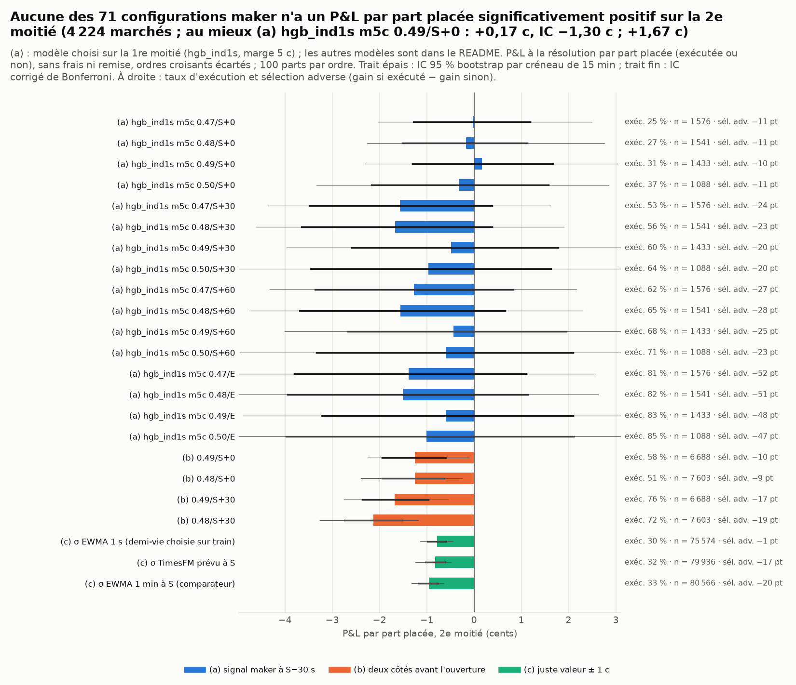
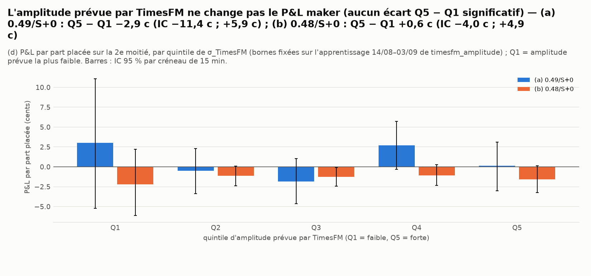
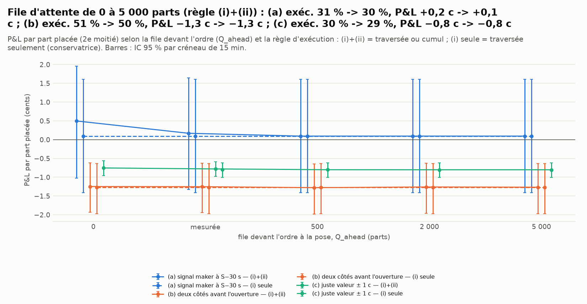
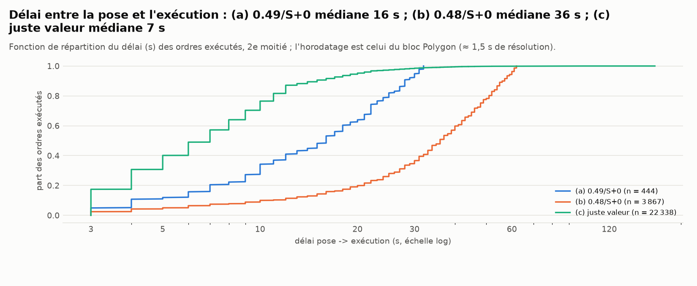
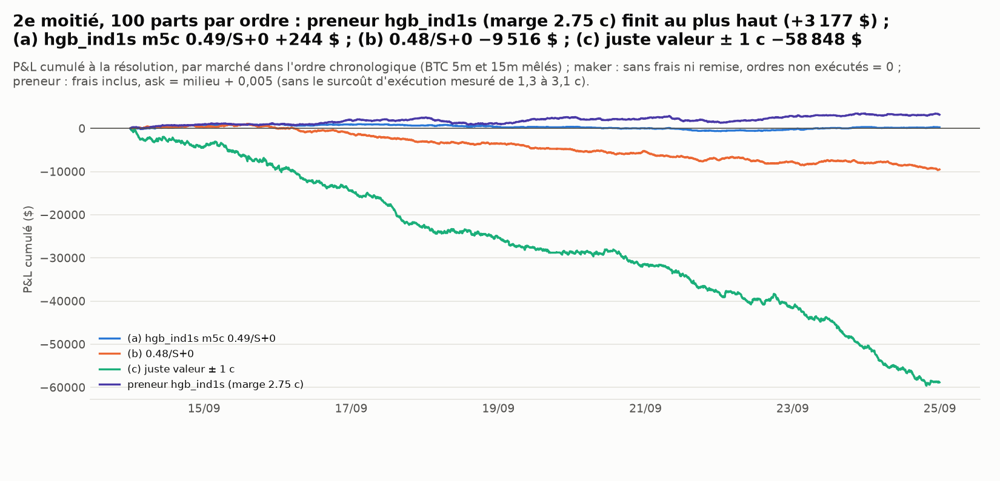

# Le maker gagne-t-il ? — simulation historique sur les trades preneurs, Polymarket « Up or Down » BTC 5m / 15m

*Généré le 26/09/2026 10:31 UTC par `scripts/polymarket_maker_backtest.py` (temps total : 484 s, caches compris — § 10). Marchés BTC 5m et 15m du 04/09/2026 au 24/09/2026 UTC : 8 064 marchés résolus sur 8 064 créneaux attendus ; 11 168 420 trades preneurs (183,0 M$). 1re moitié (paramètres) : 3 840 marchés jusqu'au 13/09 ; 2e moitié (test) : 4 224 marchés.*

> Simulation papier sur données publiques : aucun ordre, aucune clé. Nos ordres simulés ne modifient pas l'historique (pas de réaction des autres participants) ; les exécutions sont déduites des trades preneurs réels par le modèle du § 2.

## 0. Résumé : le maker gagne-t-il ?

* **Non, pas de façon démontrable.** Sur les 71 configurations testées ((a) 64, (b) 4, (c) 3), 0 ont un IC 95 % (par créneau de 15 min) entièrement positif sur la 2e moitié, 0 après correction de Bonferroni (α = 5 %/71) ; 7 sont significativement **perdantes** après correction. La meilleure a posteriori, (a) hgb_ind1s m5c 0.49/S+0, fait +0,17 c par part placée (IC −1,30 c ; +1,67 c).
* **(a) Signal maker à S−30 s**, règle fixée d'avance (meilleur P&L par part placée sur la 1re moitié parmi 4 modèles × 4 prix × 4 annulations) : **hgb_ind1s, marge 5 c, 0.49/S+0**. 1re moitié : +2,11 c par part placée (1 102 ordres, exécutés 30 %). **2e moitié : +0,17 c par part placée (IC −1,30 c ; +1,67 c), +0,55 c par part exécutée, exécutés 31 %** (1 433 ordres, 187 croisants écartés), délai médian 16 s, remise ≈ 0,35 c. Sélection adverse : gain 50 % si exécuté contre 59 % sinon (−10 points, IC −16 pt ; −4 pt).
* **(b) Deux côtés avant l'ouverture** (0.48/S+0, choisi sur la 1re moitié) : 2e moitié −1,25 c par part placée (IC −1,94 c ; −0,62 c), exécutés 51 %, sélection adverse −9 points ; par paire Up + Down posable : les deux exécutés 21 %, un seul 65 %, P&L −2,25 c par paire (IC −3,66 c ; −0,80 c).
* **(c) Juste valeur Φ(d/σ) ± 1 c en cours de fenêtre** (σ EWMA 1 s, demi-vie 600 s choisie sur la 1re moitié) : 2e moitié −0,78 c par part placée (IC −0,98 c ; −0,59 c), −2,63 c par part exécutée, exécutés 30 % (75 574 ordres, 102 139 croisants écartés), sélection adverse −1 points ; P&L −13,97 $ par marché (100 parts par ordre). Avec **σ TimesFM** (prévu à S) : −0,83 c (IC −1,03 c ; −0,61 c) ; avec σ EWMA 1 min à S : −0,96 c.
* **(d) Filtre d'amplitude TimesFM** (quintiles fixés sur l'apprentissage de `timesfm_amplitude`) : (a) 0.49/S+0 : Q5 − Q1 −2,9 c (IC −11,4 c ; +5,9 c) ; (b) 0.48/S+0 : Q5 − Q1 +0,6 c (IC −4,0 c ; +4,9 c). Aucun écart significatif : l'amplitude prévue ne rend pas le maker gagnant, ni sur les marchés calmes ni sur les agités.
* **Sensibilité à la file et à la règle** ((a) choisie, 2e moitié) : Q_ahead = 0 (optimiste) -> exécutés 32 %, +0,50 c par part placée ; file mesurée -> 31 %, +0,17 c ; 5 000 parts -> 30 %, +0,09 c ; règle (i) seule (traversée, conservatrice) -> 30 %, +0,09 c. Le signe ne dépend pas de la file : un ordre au repos est surtout exécuté par **traversée** (84 % des exécutions), c'est-à-dire quand un preneur pressé va au-delà de notre niveau — le moment où le signal a le plus de chances d'être faux.
* **Comparaison avec le preneur** (mêmes marchés, 2e moitié, 100 parts) : preneur `hgb_ind1s` à sa marge de `modeles_vs_marche` +2,32 c par part (IC −0,53 c ; +5,32 c, 1 370 positions, avant le surcoût d'exécution de 1,3 à 3,1 c mesuré dans le diagnostic) ; borne haute maker (exécution supposée certaine) +2,30 c (IC +0,67 c ; +3,96 c). Le maker réel (a) fait +0,17 c par part placée : la borne haute est inatteignable parce que l'ordre n'est exécuté que 31 % du temps, et surtout quand il a tort.
* **Ce que vaut le modèle d'exécution** : 11 168 420 trades preneurs réels, ordre chronologique on-chain, délai bloc de 3 s ; la file d'attente vient des mesures sur le carnet réel (`maker_live`, 18 marchés) et l'exécution est tout ou rien. Les traversées (règle (i)) ne dépendent pas de la file : la variante conservatrice « (i) seule » donne la borne la plus sûre ; la variante optimiste (Q_ahead = 0) la borne haute. Les deux concluent dans le même sens (§ 8).

## 1. Données

* **Trades preneurs** : cache `data/cache/polymarket/wallets/trades/` (`scripts/polymarket_collect_taker_trades.py`, `/v2/trades` avec `taker_only=true` : une ligne par transaction, côté preneur, prix moyen d'exécution, horodatage du bloc Polygon à la seconde, `seq` = ordre on-chain). 8 064 marchés, 11 168 420 trades, 183,0 M$ de notionnel preneur ; par marché (médiane) : 5m 1 436 trades, 15m 753 ; dans [S−60 s, S) : 57 / 8 trades ; dans [S, S+60 s) : 292 / 53.
* **Marchés** : `PolymarketClient.list_updown_markets` (cache), issue officielle `outcomePrices`, barème `feeSchedule` (crypto_fees_v2 (taux 0.07, exposant 1) : 8 064 marchés) ; `priceToBeat`/`finalPrice` du cache `timesfm_amplitude/event_meta.parquet` ; prédictions par marché de `modeles_vs_marche/marches_predictions.csv` (`p_hgb_ind1s`, `p_logit_tw`, `tw_gap30`, prix Up à S−30 s `p_pre`) et prix Up à S−60 s `p_pre60` (`prices-history`, pour la règle du milieu de (b)) ; σ TimesFM et EWMA à S de `timesfm_amplitude/sigma_par_marche.csv` (8 064 marchés avec σ TimesFM).
* **Binance 1 s** (BTCUSDT, zips journaliers `data.binance.vision`, cache `data/cache/pm_maker/binance_1s/`) pour la juste valeur (c) ; TWAP60(S) = moyenne des closes 1 s sur (S−60 s, S] (agrégats `pm_backtest/agg1s`). Écart de niveau log(TWAP60_Binance(S) / priceToBeat) : moyenne 3,2 pb, écart-type 3,0 pb : on prend K = TWAP60_Binance(S) comme référence de d (l'écart Binance–Chainlink est le même à S et à E, cf. diagnostic), pas le `priceToBeat` brut.
* **Périodes** : 1re moitié = fenêtres du 04/09 au 13/09 (3 840 marchés : choix des paramètres) ; 2e moitié = du 14/09 au 24/09 (4 224 marchés : test). IC 95 % : bootstrap groupé par créneau de 15 min (les marchés 5m et 15m d'un même créneau sont tirés ensemble), 2 000 tirages.

## 2. Modèle d'exécution (documenté et testé)

Un ordre au repos « acheter Q parts de X à L » posé à t0 (annulé à t1) est exécuté, dans l'ordre chronologique des trades preneurs (horodatage du bloc puis `seq`), à la première des deux conditions :

* **(i) traversée** : un trade preneur dépasse strictement le niveau — vente preneur de X à un prix < L, ou achat preneur de l'autre jeton Y à un prix > 1 − L (complémentarité du CLOB : un bid X à L est un ask Y à 1 − L, servi par appariement « mint ») ; par priorité de prix, notre ordre est servi avant que le preneur n'aille plus loin ;
* **(ii) file** : le cumul depuis t0 des ventes preneurs de X à un prix ≤ L et des achats preneurs de Y à un prix ≥ 1 − L dépasse Q_ahead + Q (Q_ahead = file devant nous à la pose).

Variante conservatrice : (i) seule ; variante optimiste : Q_ahead = 0. Exécution **tout ou rien**. **Délai on-chain** : l'ordre n'est visible qu'après ≈ 0,3 s et un trade n'est daté que par son bloc (≈ 2,2 s après l'appariement en médiane) : l'ordre ne voit que les trades dont le bloc est dans [t0 + 3 s, t1 + 3 s). **Ordres croisants** (sans carnet historique) : un achat preneur de X à un prix ≤ L (ou une vente preneur de Y à ≥ 1 − L) dans les 10 s précédant la pose prouve que l'ask de X était ≤ L : l'ordre serait un ordre preneur (frais, exécution immédiate) et il est écarté ; avant l'ouverture s'y ajoute la règle du milieu `prices-history` (L ≥ milieu_X + 0,005, milieu connu à la pose : S−30 s pour (a), S−60 s pour (b)). **Résolution** : 1 $ par part si X gagne ; P&L par part = 1{gagné} − L, sans frais. **Remise maker** estimée à part : 0,2 × frais preneur au prix L (≈ 0,35 c à 0,50), plafonnée à 20 % des frais preneurs du marché.

**File d'attente Q_ahead** (parts) : médiane de la taille affichée au niveau quand il est présent, mesurée sur le carnet réel (`reports/polymarket/maker_live/README.md` § 3, 18 marchés du 26/09) ; 0,47 non mesuré = valeur de 0,48 ; en cours de fenêtre (c) : 100 parts.

| phase | côté | 0.47 | 0.48 | 0.49 | 0.50 |
|---|---|---|---|---|---|
| avant S | up | 100 | 100 | 70 | 179 |
| avant S | down | 91 | 91 | 59 | 25 |
| après S | up | 114 | 114 | 138 | 108 |
| après S | down | 36 | 36 | 25 | 76 |

Tests unitaires (`tests/test_polymarket_maker.py`) : traversée, cumul, complémentarité Up/Down, annulation, délai, croisement, tout ou rien, P&L et remise, absence de fuite (l'ordre ne voit rien après t0 sauf les trades de sa fenêtre ; l'issue n'entre qu'au P&L), juste valeur, re-cotation, cache.


## 3. Stratégies et protocole

* **(a) signal** : à S−30 s, côté favorisé par le modèle (`hgb_ind1s` : Up ssi p ≥ 0,5 + m, Down ssi p ≤ 0,5 − m, m ∈ {0, 2 c, 5 c} ; `gap_m30` : signe du TWAP partiel), prix L ∈ {0,47 ; 0,48 ; 0,49 ; 0,50}, annulation à S, S+30 s, S+60 s ou E, Q = 100 parts. Règle fixée d'avance : la configuration (modèle, L, annulation) au meilleur P&L par part placée sur la 1re moitié (≥ 200 ordres) est évaluée sur la 2e.
* **(b) deux côtés** : achat Up et achat Down au même prix (0,49 ou 0,48) posés à S−60 s, annulés à S ou S+30 s ; P&L par paire = écart capté (2 c à 0,49) si les deux sont exécutés, position directionnelle sinon.
* **(c) juste valeur** : de S+30 s à E−60 s, toutes les 10 s, p̂ = Φ(d/σ_restant) avec d = log(spot Binance 1 s / TWAP60(S)) (close de la bougie 1 s close à l'instant de cotation) et var_restant = σ_1s² × ((E − 60 − t) + 20) ; bid Up à p̂ − 1 c et bid Down à (1 − p̂) − 1 c (cent inférieur, niveaux dans [0,05 ; 0,95]), ordre conservé tant que le niveau ne change pas, sinon remplacé ; positions cumulées réglées à la résolution. σ : EWMA des rendements 1 s (demi-vie choisie sur la 1re moitié parmi {30, 60, 120, 300, 600, 1 200, 1 800, 3 600} s par log-loss de p̂ contre l'issue : **600 s**), ou σ TimesFM prévu à S (σ_1s = σ_TimesFM / √(D + 60 s)), ou σ EWMA 1 min à S (le comparateur de `timesfm_amplitude`).
* **(d) filtre d'amplitude** : (a) et (b) choisies, restreintes aux quintiles de σ_TimesFM (bornes de l'apprentissage 14/08–03/09).
* **Tests multiples** : 71 cellules évaluées sur la 2e moitié ; IC corrigés de Bonferroni (α = 5 %/71) donnés en plus des IC bruts. Les résumés « 1re moitié » sont en échantillon pour les choix de paramètres.


## 4. (a) Signal maker à S−30 s



Configuration choisie sur la 1re moitié : **hgb_ind1s, marge 5 c, 0.49/S+0** (file mesurée, règle (i)+(ii)).

| moitié | ordres | marchés | croisants | exécutés | via (i) | délai médian (s) | P&L / part placée (c) | IC bas | IC haut | P&L / part exécutée (c) | remise (c) | gain si exécuté | gain sinon | sél. adverse (pt) |
|---|---|---|---|---|---|---|---|---|---|---|---|---|---|---|
| 1re moitié | 1 102 | 1 102 | 169 | 30 % | 77 % | 16,0 | +2,11 | +0,55 | +3,67 | +7,06 | 0,35 | 56 % | 55 % | +1 |
| 2e moitié | 1 433 | 1 433 | 187 | 31 % | 84 % | 16,0 | +0,17 | −1,30 | +1,67 | +0,55 | 0,35 | 50 % | 59 % | −10 |

Toutes les configurations (a), 2e moitié, par modèle (`resume_configurations.csv` pour les deux moitiés) : P&L par part placée et IC bruts / corrigés.

| modèle | config. | ordres | croisants | exécutés | P&L / part placée (c) | IC bas | IC haut | IC bas (Bonf.) | IC haut (Bonf.) | P&L / part exécutée (c) | sél. adverse (pt) |
|---|---|---|---|---|---|---|---|---|---|---|---|
| hgb_ind1s (Up ssi p ≥ 0,5) | 0.47/S+0 | 3 986 | 238 | 32 % | −0,19 | −1,04 | +0,73 | −1,83 | +1,21 | −0,59 | −10 |
| hgb_ind1s (Up ssi p ≥ 0,5) | 0.48/S+0 | 3 787 | 437 | 35 % | −0,58 | −1,53 | +0,45 | −2,40 | +0,97 | −1,67 | −10 |
| hgb_ind1s (Up ssi p ≥ 0,5) | 0.49/S+0 | 3 356 | 868 | 39 % | −0,59 | −1,69 | +0,55 | −2,47 | +1,22 | −1,49 | −10 |
| hgb_ind1s (Up ssi p ≥ 0,5) | 0.50/S+0 | 2 324 | 1 900 | 42 % | −0,56 | −1,92 | +0,85 | −2,53 | +1,79 | −1,33 | −9 |
| hgb_ind1s, marge 2 c (\|p − 0,5\| ≥ 0,02) | 0.47/S+0 | 2 984 | 113 | 28 % | −0,25 | −1,21 | +0,66 | −1,98 | +1,65 | −0,89 | −10 |
| hgb_ind1s, marge 2 c (\|p − 0,5\| ≥ 0,02) | 0.48/S+0 | 2 884 | 213 | 31 % | −0,46 | −1,46 | +0,56 | −2,24 | +1,52 | −1,48 | −10 |
| hgb_ind1s, marge 2 c (\|p − 0,5\| ≥ 0,02) | 0.49/S+0 | 2 616 | 481 | 35 % | −0,37 | −1,53 | +0,76 | −2,37 | +1,67 | −1,06 | −10 |
| hgb_ind1s, marge 2 c (\|p − 0,5\| ≥ 0,02) | 0.50/S+0 | 1 927 | 1 170 | 40 % | −0,42 | −1,82 | +1,04 | −2,62 | +1,97 | −1,04 | −9 |
| hgb_ind1s, marge 5 c | 0.47/S+0 | 1 576 | 44 | 25 % | −0,02 | −1,28 | +1,19 | −2,02 | +2,50 | −0,09 | −11 |
| hgb_ind1s, marge 5 c | 0.48/S+0 | 1 541 | 79 | 27 % | −0,17 | −1,52 | +1,13 | −2,26 | +2,76 | −0,63 | −11 |
| hgb_ind1s, marge 5 c | 0.49/S+0 | 1 433 | 187 | 31 % | +0,17 | −1,30 | +1,67 | −2,31 | +3,04 | +0,55 | −10 |
| hgb_ind1s, marge 5 c | 0.50/S+0 | 1 088 | 532 | 37 % | −0,32 | −2,17 | +1,57 | −3,33 | +2,85 | −0,87 | −11 |
| gap_m30 (signe du TWAP partiel) | 0.47/S+0 | 3 884 | 340 | 28 % | −0,86 | −1,68 | −0,02 | −2,38 | +0,55 | −3,03 | −13 |
| gap_m30 (signe du TWAP partiel) | 0.48/S+0 | 3 598 | 626 | 32 % | −0,86 | −1,78 | +0,09 | −2,44 | +0,88 | −2,71 | −12 |
| gap_m30 (signe du TWAP partiel) | 0.49/S+0 | 3 042 | 1 182 | 35 % | −0,91 | −1,92 | +0,18 | −2,62 | +0,83 | −2,58 | −12 |
| gap_m30 (signe du TWAP partiel) | 0.50/S+0 | 2 019 | 2 205 | 37 % | −0,89 | −2,21 | +0,50 | −3,02 | +1,25 | −2,42 | −11 |
| hgb_ind1s (Up ssi p ≥ 0,5) | 0.47/S+30 | 3 986 | 238 | 59 % | −1,54 | −2,81 | −0,24 | −3,67 | +0,68 | −2,60 | −21 |
| hgb_ind1s (Up ssi p ≥ 0,5) | 0.48/S+30 | 3 787 | 437 | 62 % | −1,66 | −2,99 | −0,24 | −3,80 | +0,62 | −2,65 | −21 |
| hgb_ind1s (Up ssi p ≥ 0,5) | 0.49/S+30 | 3 356 | 868 | 66 % | −1,38 | −2,79 | +0,10 | −3,87 | +1,12 | −2,10 | −20 |
| hgb_ind1s (Up ssi p ≥ 0,5) | 0.50/S+30 | 2 324 | 1 900 | 68 % | −1,01 | −2,80 | +0,82 | −3,82 | +1,80 | −1,48 | −18 |
| hgb_ind1s, marge 2 c (\|p − 0,5\| ≥ 0,02) | 0.47/S+30 | 2 984 | 113 | 56 % | −1,53 | −2,88 | −0,05 | −4,01 | +1,11 | −2,73 | −21 |
| hgb_ind1s, marge 2 c (\|p − 0,5\| ≥ 0,02) | 0.48/S+30 | 2 884 | 213 | 60 % | −1,58 | −3,05 | −0,08 | −4,20 | +0,97 | −2,66 | −21 |
| hgb_ind1s, marge 2 c (\|p − 0,5\| ≥ 0,02) | 0.49/S+30 | 2 616 | 481 | 63 % | −1,22 | −2,79 | +0,41 | −4,24 | +1,71 | −1,93 | −19 |
| hgb_ind1s, marge 2 c (\|p − 0,5\| ≥ 0,02) | 0.50/S+30 | 1 927 | 1 170 | 67 % | −0,91 | −2,84 | +1,11 | −3,97 | +2,21 | −1,36 | −17 |
| hgb_ind1s, marge 5 c | 0.47/S+30 | 1 576 | 44 | 53 % | −1,56 | −3,48 | +0,38 | −4,36 | +1,62 | −2,97 | −24 |
| hgb_ind1s, marge 5 c | 0.48/S+30 | 1 541 | 79 | 56 % | −1,67 | −3,64 | +0,38 | −4,61 | +1,90 | −2,99 | −23 |
| hgb_ind1s, marge 5 c | 0.49/S+30 | 1 433 | 187 | 60 % | −0,48 | −2,58 | +1,78 | −3,96 | +3,47 | −0,80 | −20 |
| hgb_ind1s, marge 5 c | 0.50/S+30 | 1 088 | 532 | 64 % | −0,97 | −3,46 | +1,63 | −5,06 | +3,18 | −1,50 | −20 |
| gap_m30 (signe du TWAP partiel) | 0.47/S+30 | 3 884 | 340 | 58 % | −1,75 | −2,97 | −0,47 | −3,73 | +0,12 | −3,03 | −21 |
| gap_m30 (signe du TWAP partiel) | 0.48/S+30 | 3 598 | 626 | 61 % | −1,70 | −3,02 | −0,34 | −3,95 | +0,37 | −2,81 | −20 |
| gap_m30 (signe du TWAP partiel) | 0.49/S+30 | 3 042 | 1 182 | 63 % | −1,16 | −2,64 | +0,35 | −3,68 | +1,04 | −1,83 | −19 |
| gap_m30 (signe du TWAP partiel) | 0.50/S+30 | 2 019 | 2 205 | 65 % | −0,92 | −2,79 | +0,94 | −3,74 | +2,16 | −1,40 | −18 |
| hgb_ind1s (Up ssi p ≥ 0,5) | 0.47/S+60 | 3 986 | 238 | 67 % | −1,33 | −2,70 | +0,06 | −3,62 | +0,81 | −1,96 | −24 |
| hgb_ind1s (Up ssi p ≥ 0,5) | 0.48/S+60 | 3 787 | 437 | 70 % | −1,51 | −2,94 | +0,04 | −3,79 | +0,74 | −2,15 | −24 |
| hgb_ind1s (Up ssi p ≥ 0,5) | 0.49/S+60 | 3 356 | 868 | 73 % | −1,22 | −2,72 | +0,37 | −3,71 | +1,27 | −1,67 | −23 |
| hgb_ind1s (Up ssi p ≥ 0,5) | 0.50/S+60 | 2 324 | 1 900 | 75 % | −0,56 | −2,44 | +1,40 | −3,53 | +2,37 | −0,74 | −20 |
| hgb_ind1s, marge 2 c (\|p − 0,5\| ≥ 0,02) | 0.47/S+60 | 2 984 | 113 | 65 % | −1,48 | −2,98 | +0,07 | −4,23 | +1,24 | −2,28 | −25 |
| hgb_ind1s, marge 2 c (\|p − 0,5\| ≥ 0,02) | 0.48/S+60 | 2 884 | 213 | 68 % | −1,62 | −3,20 | +0,02 | −4,53 | +0,87 | −2,39 | −25 |
| hgb_ind1s, marge 2 c (\|p − 0,5\| ≥ 0,02) | 0.49/S+60 | 2 616 | 481 | 71 % | −1,24 | −2,86 | +0,48 | −4,30 | +1,55 | −1,75 | −24 |
| hgb_ind1s, marge 2 c (\|p − 0,5\| ≥ 0,02) | 0.50/S+60 | 1 927 | 1 170 | 74 % | −0,57 | −2,61 | +1,60 | −3,79 | +2,69 | −0,77 | −19 |
| hgb_ind1s, marge 5 c | 0.47/S+60 | 1 576 | 44 | 62 % | −1,27 | −3,36 | +0,83 | −4,33 | +2,17 | −2,04 | −27 |
| hgb_ind1s, marge 5 c | 0.48/S+60 | 1 541 | 79 | 65 % | −1,55 | −3,69 | +0,66 | −4,75 | +2,29 | −2,38 | −28 |
| hgb_ind1s, marge 5 c | 0.49/S+60 | 1 433 | 187 | 68 % | −0,44 | −2,67 | +1,95 | −4,01 | +3,53 | −0,64 | −25 |
| hgb_ind1s, marge 5 c | 0.50/S+60 | 1 088 | 532 | 71 % | −0,60 | −3,33 | +2,10 | −4,96 | +3,83 | −0,84 | −23 |
| gap_m30 (signe du TWAP partiel) | 0.47/S+60 | 3 884 | 340 | 66 % | −1,81 | −3,12 | −0,46 | −3,89 | +0,21 | −2,73 | −26 |
| gap_m30 (signe du TWAP partiel) | 0.48/S+60 | 3 598 | 626 | 69 % | −1,75 | −3,12 | −0,32 | −4,20 | +0,53 | −2,55 | −25 |
| gap_m30 (signe du TWAP partiel) | 0.49/S+60 | 3 042 | 1 182 | 71 % | −1,21 | −2,71 | +0,29 | −3,92 | +1,15 | −1,71 | −24 |
| gap_m30 (signe du TWAP partiel) | 0.50/S+60 | 2 019 | 2 205 | 73 % | −0,89 | −2,80 | +1,08 | −3,85 | +2,41 | −1,23 | −22 |
| hgb_ind1s (Up ssi p ≥ 0,5) | 0.47/E | 3 986 | 238 | 85 % | −1,82 | −3,41 | −0,22 | −4,25 | +0,82 | −2,15 | −53 |
| hgb_ind1s (Up ssi p ≥ 0,5) | 0.48/E | 3 787 | 437 | 86 % | −1,96 | −3,58 | −0,29 | −4,57 | +0,83 | −2,28 | −52 |
| hgb_ind1s (Up ssi p ≥ 0,5) | 0.49/E | 3 356 | 868 | 87 % | −1,66 | −3,40 | +0,13 | −4,31 | +1,22 | −1,92 | −50 |
| hgb_ind1s (Up ssi p ≥ 0,5) | 0.50/E | 2 324 | 1 900 | 88 % | −1,36 | −3,40 | +0,87 | −4,81 | +1,88 | −1,54 | −48 |
| hgb_ind1s, marge 2 c (\|p − 0,5\| ≥ 0,02) | 0.47/E | 2 984 | 113 | 83 % | −1,98 | −3,77 | −0,16 | −4,73 | +1,11 | −2,38 | −53 |
| hgb_ind1s, marge 2 c (\|p − 0,5\| ≥ 0,02) | 0.48/E | 2 884 | 213 | 84 % | −1,99 | −3,83 | −0,08 | −4,90 | +1,21 | −2,36 | −51 |
| hgb_ind1s, marge 2 c (\|p − 0,5\| ≥ 0,02) | 0.49/E | 2 616 | 481 | 86 % | −1,68 | −3,59 | +0,29 | −4,96 | +1,65 | −1,96 | −49 |
| hgb_ind1s, marge 2 c (\|p − 0,5\| ≥ 0,02) | 0.50/E | 1 927 | 1 170 | 88 % | −1,48 | −3,73 | +0,89 | −5,23 | +2,26 | −1,69 | −48 |
| hgb_ind1s, marge 5 c | 0.47/E | 1 576 | 44 | 81 % | −1,38 | −3,81 | +1,10 | −5,34 | +2,58 | −1,71 | −52 |
| hgb_ind1s, marge 5 c | 0.48/E | 1 541 | 79 | 82 % | −1,51 | −3,94 | +1,13 | −5,61 | +2,63 | −1,84 | −51 |
| hgb_ind1s, marge 5 c | 0.49/E | 1 433 | 187 | 83 % | −0,60 | −3,22 | +2,10 | −4,88 | +3,79 | −0,72 | −48 |
| hgb_ind1s, marge 5 c | 0.50/E | 1 088 | 532 | 85 % | −1,01 | −3,98 | +2,11 | −5,95 | +4,01 | −1,19 | −47 |
| gap_m30 (signe du TWAP partiel) | 0.47/E | 3 884 | 340 | 84 % | −1,93 | −3,35 | −0,44 | −4,14 | +0,58 | −2,29 | −53 |
| gap_m30 (signe du TWAP partiel) | 0.48/E | 3 598 | 626 | 85 % | −2,10 | −3,63 | −0,46 | −4,62 | +0,48 | −2,47 | −51 |
| gap_m30 (signe du TWAP partiel) | 0.49/E | 3 042 | 1 182 | 86 % | −1,44 | −3,10 | +0,33 | −4,35 | +1,25 | −1,68 | −49 |
| gap_m30 (signe du TWAP partiel) | 0.50/E | 2 019 | 2 205 | 87 % | −1,29 | −3,37 | +1,02 | −4,90 | +1,88 | −1,49 | −46 |

Configuration choisie par durée et par côté (2e moitié) :

| cellule | ordres | marchés | croisants | exécutés | via (i) | délai médian (s) | P&L / part placée (c) | IC bas | IC haut | P&L / part exécutée (c) | remise (c) | gain si exécuté | gain sinon | sél. adverse (pt) |
|---|---|---|---|---|---|---|---|---|---|---|---|---|---|---|
| Tous | 1 433 | 1 433 | 187 | 31 % | 84 % | 16,0 | +0,17 | −1,33 | +1,64 | +0,55 | 0,35 | 50 % | 59 % | −10 |
| BTC 5m | 1 127 | 1 127 | 166 | 36 % | 82 % | 15,0 | +0,53 | −1,15 | +2,22 | +1,50 | 0,35 | 50 % | 61 % | −10 |
| BTC 15m | 306 | 306 | 21 | 14 % | 98 % | 24,0 | −1,17 | −3,29 | +0,93 | −8,52 | 0,35 | 40 % | 55 % | −15 |
| côté Up | 318 | 318 | 45 | 25 % | 100 % | 17,5 | −0,06 | −2,77 | +2,70 | −0,25 | 0,35 | 49 % | 60 % | −11 |
| côté Down | 1 115 | 1 115 | 142 | 33 % | 80 % | 16,0 | +0,24 | −1,38 | +1,92 | +0,73 | 0,35 | 50 % | 59 % | −10 |


## 5. (b) Deux côtés avant l'ouverture

| moitié | config. | ordres | marchés | croisants | exécutés | via (i) | délai médian (s) | P&L / part placée (c) | IC bas | IC haut | P&L / part exécutée (c) | remise (c) | gain si exécuté | gain sinon | sél. adverse (pt) |
|---|---|---|---|---|---|---|---|---|---|---|---|---|---|---|---|
| 1re moitié | 0.49/S+0 | 6 269 | 3 833 | 1 411 | 57 % | 77 % | 31,0 | −0,77 | −1,44 | −0,14 | −1,36 | 0,35 | 48 % | 54 % | −7 |
| 1re moitié | 0.48/S+0 | 6 959 | 3 839 | 721 | 48 % | 97 % | 36,0 | −0,71 | −1,35 | −0,08 | −1,47 | 0,35 | 47 % | 54 % | −7 |
| 1re moitié | 0.49/S+30 | 6 269 | 3 833 | 1 411 | 77 % | 81 % | 42,0 | −1,83 | −2,48 | −1,14 | −2,36 | 0,35 | 47 % | 64 % | −17 |
| 1re moitié | 0.48/S+30 | 6 959 | 3 839 | 721 | 72 % | 97 % | 48,0 | −1,74 | −2,39 | −1,10 | −2,43 | 0,35 | 46 % | 62 % | −17 |
| 2e moitié | 0.49/S+0 | 6 688 | 4 218 | 1 760 | 58 % | 83 % | 31,0 | −1,25 | −1,95 | −0,59 | −2,15 | 0,35 | 47 % | 56 % | −10 |
| 2e moitié | 0.48/S+0 | 7 603 | 4 222 | 845 | 51 % | 95 % | 36,0 | −1,25 | −1,94 | −0,62 | −2,46 | 0,35 | 46 % | 55 % | −9 |
| 2e moitié | 0.49/S+30 | 6 688 | 4 218 | 1 760 | 76 % | 86 % | 39,0 | −1,68 | −2,36 | −0,96 | −2,20 | 0,35 | 47 % | 64 % | −17 |
| 2e moitié | 0.48/S+30 | 7 603 | 4 222 | 845 | 72 % | 96 % | 46,0 | −2,13 | −2,74 | −1,51 | −2,95 | 0,35 | 45 % | 64 % | −19 |

Par **paire** Up + Down (marchés où les deux ordres sont posables), 2e moitié :

| config. | paires | les deux exécutés | un seul | aucun | P&L / paire (c) | IC bas | IC haut |
|---|---|---|---|---|---|---|---|
| 0.49/S+0 | 2 470 | 37 % | 56 % | 7 % | −2,84 | −4,37 | −1,34 |
| 0.48/S+0 | 3 381 | 21 % | 65 % | 14 % | −2,25 | −3,66 | −0,80 |
| 0.49/S+30 | 2 470 | 62 % | 36 % | 2 % | −3,84 | −5,02 | −2,61 |
| 0.48/S+30 | 3 381 | 50 % | 48 % | 2 % | −4,19 | −5,42 | −2,98 |

Par côté acheté (2e moitié) :

| config. | côté | ordres | marchés | croisants | exécutés | via (i) | délai médian (s) | P&L / part placée (c) | IC bas | IC haut | P&L / part exécutée (c) | remise (c) | gain si exécuté | gain sinon | sél. adverse (pt) |
|---|---|---|---|---|---|---|---|---|---|---|---|---|---|---|---|
| 0.49/S+0 | up | 3 241 | 3 241 | 983 | 58 % | 90 % | 32,0 | −1,19 | −2,59 | +0,19 | −2,05 | 0,35 | 47 % | 56 % | −10 |
| 0.48/S+0 | up | 3 738 | 3 738 | 486 | 51 % | 96 % | 36,0 | −1,13 | −2,37 | +0,07 | −2,23 | 0,35 | 46 % | 55 % | −9 |
| 0.49/S+0 | down | 3 447 | 3 447 | 777 | 58 % | 77 % | 31,0 | −1,31 | −2,69 | +0,14 | −2,25 | 0,35 | 47 % | 56 % | −10 |
| 0.48/S+0 | down | 3 865 | 3 865 | 359 | 51 % | 94 % | 37,0 | −1,37 | −2,62 | −0,17 | −2,69 | 0,35 | 45 % | 55 % | −10 |
| 0.49/S+30 | up | 3 241 | 3 241 | 983 | 76 % | 91 % | 39,5 | −1,15 | −2,85 | +0,49 | −1,52 | 0,35 | 47 % | 62 % | −14 |
| 0.48/S+30 | up | 3 738 | 3 738 | 486 | 72 % | 96 % | 45,0 | −1,49 | −3,14 | −0,01 | −2,07 | 0,35 | 46 % | 62 % | −16 |
| 0.49/S+30 | down | 3 447 | 3 447 | 777 | 77 % | 80 % | 39,0 | −2,18 | −3,83 | −0,37 | −2,83 | 0,35 | 46 % | 66 % | −20 |
| 0.48/S+30 | down | 3 865 | 3 865 | 359 | 72 % | 95 % | 48,0 | −2,75 | −4,28 | −1,20 | −3,82 | 0,35 | 44 % | 65 % | −21 |


## 6. (c) Juste valeur Φ(d/σ) ± 1 c en cours de fenêtre

Qualité de la juste valeur aux instants de cotation (log-loss et Brier de p̂ contre l'issue, moyenne par marché ; « 1re moitié » sert au choix de la demi-vie) :

| variant | log_loss 1re moitié | log_loss 2e moitié | brier 1re moitié | brier 2e moitié |
|---|---|---|---|---|
| ewma1s_h120 | 0,5069 | 0,4881 | 0,1661 | 0,1593 |
| ewma1s_h1200 | 0,4984 | 0,4797 | 0,1647 | 0,1578 |
| ewma1s_h1800 | 0,4987 | 0,4799 | 0,1648 | 0,1578 |
| ewma1s_h30 | 0,5522 | 0,5115 | 0,1733 | 0,1630 |
| ewma1s_h300 | 0,4996 | 0,4828 | 0,1649 | 0,1584 |
| ewma1s_h3600 | 0,4995 | 0,4808 | 0,1651 | 0,1579 |
| ewma1s_h60 | 0,5220 | 0,4961 | 0,1687 | 0,1606 |
| ewma1s_h600 | 0,4982 | 0,4806 | 0,1646 | 0,1580 |
| ewma_S | 0,4963 | 0,4753 | 0,1647 | 0,1575 |
| timesfm_S | 0,5005 | 0,4758 | 0,1655 | 0,1575 |

P&L des cotations (toutes durées puis par durée) ; `fair_value_par_marche.csv` donne le détail par marché :

| moitié | σ | durée | ordres | marchés | croisants | exécutés | via (i) | délai médian (s) | P&L / part placée (c) | IC bas | IC haut | P&L / part exécutée (c) | remise (c) | gain si exécuté | gain sinon | sél. adverse (pt) |
|---|---|---|---|---|---|---|---|---|---|---|---|---|---|---|---|---|
| 1re moitié | σ EWMA 1 s (demi-vie choisie sur train) | 15m | 38 369 | 960 | 36 651 | 26 % | 99 % | 7,0 | −0,62 | −0,90 | −0,36 | −2,36 | 0,29 | 44 % | 39 % | +5 |
| 1re moitié | σ TimesFM prévu à S | 15m | 38 457 | 959 | 35 035 | 31 % | 99 % | 7,0 | −1,02 | −1,29 | −0,77 | −3,34 | 0,29 | 41 % | 51 % | −10 |
| 1re moitié | σ EWMA 1 min à S (comparateur) | 15m | 39 709 | 958 | 35 575 | 32 % | 99 % | 7,0 | −1,11 | −1,37 | −0,84 | −3,45 | 0,28 | 40 % | 53 % | −12 |
| 1re moitié | σ EWMA 1 s (demi-vie choisie sur train) | 5m | 27 609 | 2 840 | 48 145 | 30 % | 96 % | 7,0 | −0,85 | −1,21 | −0,50 | −2,84 | 0,25 | 31 % | 44 % | −13 |
| 1re moitié | σ TimesFM prévu à S | 5m | 26 906 | 2 849 | 49 972 | 31 % | 96 % | 6,0 | −0,93 | −1,29 | −0,61 | −2,99 | 0,26 | 39 % | 60 % | −22 |
| 1re moitié | σ EWMA 1 min à S (comparateur) | 5m | 27 181 | 2 850 | 50 916 | 31 % | 96 % | 6,0 | −1,04 | −1,42 | −0,70 | −3,38 | 0,26 | 41 % | 64 % | −24 |
| 1re moitié | σ EWMA 1 s (demi-vie choisie sur train) | toutes | 65 978 | 3 800 | 84 796 | 28 % | 97 % | 7,0 | −0,72 | −0,94 | −0,49 | −2,57 | 0,27 | 38 % | 41 % | −3 |
| 1re moitié | σ TimesFM prévu à S | toutes | 65 363 | 3 808 | 85 007 | 31 % | 98 % | 7,0 | −0,98 | −1,21 | −0,77 | −3,20 | 0,27 | 40 % | 55 % | −15 |
| 1re moitié | σ EWMA 1 min à S (comparateur) | toutes | 66 890 | 3 808 | 86 491 | 32 % | 98 % | 7,0 | −1,08 | −1,31 | −0,85 | −3,42 | 0,27 | 41 % | 58 % | −17 |
| 2e moitié | σ EWMA 1 s (demi-vie choisie sur train) | 15m | 46 526 | 1 056 | 45 041 | 26 % | 98 % | 7,0 | −0,72 | −0,93 | −0,52 | −2,82 | 0,29 | 43 % | 38 % | +6 |
| 2e moitié | σ TimesFM prévu à S | 15m | 49 987 | 1 056 | 44 003 | 31 % | 98 % | 7,0 | −0,73 | −0,98 | −0,48 | −2,34 | 0,28 | 41 % | 54 % | −13 |
| 2e moitié | σ EWMA 1 min à S (comparateur) | 15m | 50 868 | 1 056 | 44 374 | 32 % | 98 % | 7,0 | −1,01 | −1,25 | −0,77 | −3,13 | 0,28 | 40 % | 57 % | −17 |
| 2e moitié | σ EWMA 1 s (demi-vie choisie sur train) | 5m | 29 048 | 3 143 | 57 098 | 36 % | 95 % | 6,0 | −0,86 | −1,24 | −0,49 | −2,42 | 0,25 | 31 % | 40 % | −9 |
| 2e moitié | σ TimesFM prévu à S | 5m | 29 949 | 3 154 | 61 448 | 34 % | 96 % | 6,0 | −0,98 | −1,36 | −0,64 | −2,88 | 0,26 | 42 % | 68 % | −25 |
| 2e moitié | σ EWMA 1 min à S (comparateur) | 5m | 29 698 | 3 153 | 61 756 | 35 % | 96 % | 6,0 | −0,86 | −1,23 | −0,48 | −2,47 | 0,26 | 43 % | 69 % | −25 |
| 2e moitié | σ EWMA 1 s (demi-vie choisie sur train) | toutes | 75 574 | 4 199 | 102 139 | 30 % | 97 % | 7,0 | −0,78 | −0,98 | −0,59 | −2,63 | 0,27 | 37 % | 38 % | −1 |
| 2e moitié | σ TimesFM prévu à S | toutes | 79 936 | 4 210 | 105 451 | 32 % | 97 % | 6,0 | −0,83 | −1,03 | −0,61 | −2,55 | 0,27 | 42 % | 59 % | −17 |
| 2e moitié | σ EWMA 1 min à S (comparateur) | toutes | 80 566 | 4 209 | 106 130 | 33 % | 97 % | 6,0 | −0,96 | −1,17 | −0,75 | −2,88 | 0,27 | 41 % | 61 % | −20 |

Exposition : sur la 2e moitié, un marché reçoit en médiane 11 ordres (c) et 4 exécutions (100 parts chacune) ; position nette médiane |Up − Down| = 200 parts ; P&L par marché : moyenne −13,97 $, p10 −132,0 $, p90 +128,6 $.


## 7. (d) Filtre d'amplitude TimesFM



| stratégie | quintile | ordres | exécutés | P&L / part placée (c) | IC bas | IC haut | sél. adverse (pt) | Q5 − Q1 (c) | IC bas | IC haut |
|---|---|---|---|---|---|---|---|---|---|---|
| (a) 0.49/S+0 | 1 | 36 | 22 % | +3,00 | −5,22 | +11,07 | −5 | −2,86 | −11,44 | +5,88 |
| (a) 0.49/S+0 | 2 | 324 | 26 % | −0,52 | −3,37 | +2,32 | −12 | −2,86 | −11,44 | +5,88 |
| (a) 0.49/S+0 | 3 | 414 | 34 % | −1,83 | −4,63 | +1,02 | −15 | −2,86 | −11,44 | +5,88 |
| (a) 0.49/S+0 | 4 | 379 | 32 % | +2,70 | −0,30 | +5,71 | −4 | −2,86 | −11,44 | +5,88 |
| (a) 0.49/S+0 | 5 | 280 | 32 % | +0,14 | −3,04 | +3,12 | −8 | −2,86 | −11,44 | +5,88 |
| (b) 0.48/S+0 | 1 | 217 | 40 % | −2,19 | −6,12 | +2,21 | −15 | +0,62 | −3,96 | +4,89 |
| (b) 0.48/S+0 | 2 | 2 137 | 49 % | −1,12 | −2,37 | +0,11 | −8 | +0,62 | −3,96 | +4,89 |
| (b) 0.48/S+0 | 3 | 2 302 | 51 % | −1,26 | −2,44 | −0,07 | −9 | +0,62 | −3,96 | +4,89 |
| (b) 0.48/S+0 | 4 | 1 791 | 53 % | −1,07 | −2,32 | +0,27 | −9 | +0,62 | −3,96 | +4,89 |
| (b) 0.48/S+0 | 5 | 1 156 | 53 % | −1,57 | −3,24 | +0,14 | −12 | +0,62 | −3,96 | +4,89 |

Lecture : l'amplitude prévue trie le mouvement réalisé (`timesfm_amplitude`, test 3) mais pas la justesse des signaux ; côté maker, elle change le taux d'exécution (plus de traversées quand ça bouge) et donc l'exposition, pas le signe du P&L : aucun écart Q5 − Q1 n'est significatif.


## 8. Sensibilité : file d'attente, règle d'exécution, délai



| stratégie | Q_ahead | règle | ordres | exécutés | via (i) | P&L / part placée (c) | IC bas | IC haut | P&L / part exécutée (c) | sél. adverse (pt) |
|---|---|---|---|---|---|---|---|---|---|---|
| (a) | mesurée | (i)+(ii) | 1 433 | 31 % | 84 % | +0,17 | −1,33 | +1,64 | +0,55 | −10 |
| (b) | mesurée | (i)+(ii) | 7 603 | 51 % | 95 % | −1,25 | −1,94 | −0,62 | −2,46 | −9 |
| (a) | mesurée | (i) seule | 1 433 | 30 % | 100 % | +0,09 | −1,41 | +1,61 | +0,31 | −10 |
| (b) | mesurée | (i) seule | 7 603 | 50 % | 100 % | −1,27 | −1,97 | −0,63 | −2,52 | −9 |
| (a) | 0 | (i)+(ii) | 1 433 | 32 % | 72 % | +0,50 | −1,03 | +1,96 | +1,54 | −9 |
| (b) | 0 | (i)+(ii) | 7 603 | 52 % | 81 % | −1,25 | −1,93 | −0,61 | −2,40 | −10 |
| (a) | 0 | (i) seule | 1 433 | 30 % | 100 % | +0,09 | −1,41 | +1,61 | +0,31 | −10 |
| (b) | 0 | (i) seule | 7 603 | 50 % | 100 % | −1,27 | −1,97 | −0,63 | −2,52 | −9 |
| (a) | 500 | (i)+(ii) | 1 433 | 30 % | 100 % | +0,09 | −1,41 | +1,61 | +0,31 | −10 |
| (b) | 500 | (i)+(ii) | 7 603 | 50 % | 100 % | −1,28 | −1,98 | −0,65 | −2,54 | −10 |
| (a) | 500 | (i) seule | 1 433 | 30 % | 100 % | +0,09 | −1,41 | +1,61 | +0,31 | −10 |
| (b) | 500 | (i) seule | 7 603 | 50 % | 100 % | −1,27 | −1,97 | −0,63 | −2,52 | −9 |
| (a) | 2 000 | (i)+(ii) | 1 433 | 30 % | 100 % | +0,09 | −1,41 | +1,61 | +0,31 | −10 |
| (b) | 2 000 | (i)+(ii) | 7 603 | 50 % | 100 % | −1,26 | −1,96 | −0,63 | −2,51 | −9 |
| (a) | 2 000 | (i) seule | 1 433 | 30 % | 100 % | +0,09 | −1,41 | +1,61 | +0,31 | −10 |
| (b) | 2 000 | (i) seule | 7 603 | 50 % | 100 % | −1,27 | −1,97 | −0,63 | −2,52 | −9 |
| (a) | 5 000 | (i)+(ii) | 1 433 | 30 % | 100 % | +0,09 | −1,41 | +1,61 | +0,31 | −10 |
| (b) | 5 000 | (i)+(ii) | 7 603 | 50 % | 100 % | −1,27 | −1,97 | −0,63 | −2,52 | −9 |
| (a) | 5 000 | (i) seule | 1 433 | 30 % | 100 % | +0,09 | −1,41 | +1,61 | +0,31 | −10 |
| (b) | 5 000 | (i) seule | 7 603 | 50 % | 100 % | −1,27 | −1,97 | −0,63 | −2,52 | −9 |
| (c) | mesurée | (i)+(ii) | 75 574 | 30 % | 97 % | −0,78 | −0,98 | −0,59 | −2,63 | −1 |
| (c) | 0 | (i)+(ii) | 75 574 | 30 % | 91 % | −0,75 | −0,96 | −0,56 | −2,49 | −1 |
| (c) | 500 | (i)+(ii) | 75 574 | 29 % | 100 % | −0,80 | −1,00 | −0,61 | −2,73 | −1 |
| (c) | 2 000 | (i)+(ii) | 75 574 | 29 % | 100 % | −0,80 | −1,00 | −0,61 | −2,74 | −1 |
| (c) | 5 000 | (i)+(ii) | 75 574 | 29 % | 100 % | −0,80 | −1,00 | −0,61 | −2,74 | −1 |
| (c) | mesurée | (i) seule | 75 574 | 29 % | 100 % | −0,80 | −1,00 | −0,61 | −2,74 | −1 |



Délais (2e moitié, ordres exécutés) : (a) 0.49/S+0 : médiane 16 s, p90 28 s (n = 444) ; (b) 0.48/S+0 : médiane 36 s, p90 57 s (n = 3 867) ; (c) juste valeur : médiane 7 s, p90 15 s (n = 22 338). Le délai on-chain de 3 s est fixé (pas de re-simulation à 0 ou 6 s : les fenêtres [t0 + δ, t1 + δ) se décalent d'autant, ce qui ne change que les exécutions à moins de 3 s de la pose ou de l'annulation).


## 9. Comparaison avec le preneur (mêmes marchés, 2e moitié)



| stratégie | positions | taux de gain | P&L / part (c) | IC bas | IC haut | P&L total ($, 100 parts) |
|---|---|---|---|---|---|---|
| preneur hgb_ind1s (marge 2.75 c) | 1 370 | 54,9 % | +2,32 | −0,53 | +5,32 | 3 177 |
| preneur logit_tw (marge 0.50 c) | 2 447 | 53,5 % | +1,86 | −0,21 | +3,96 | 4 554 |
| preneur gap_m30 (toujours en position) | 4 224 | 52,6 % | +0,35 | −1,20 | +1,93 | 1 499 |
| borne haute maker hgb_ind1s (achat au bid, exécution supposée certaine) | 4 224 | 51,8 % | +2,30 | +0,67 | +3,96 | 9 709 |

| stratégie | positions / ordres | P&L / part placée (c) | IC bas | IC haut | P&L total ($, 100 parts) |
|---|---|---|---|---|---|
| maker (a) hgb_ind1s m5c 0.49/S+0 | 1 433 | +0,17 | −1,30 | +1,67 | 244 |
| maker (b) 0.48/S+0 | 7 603 | −1,25 | −1,94 | −0,62 | −9 516 |
| maker (c) juste valeur ± 1 c (σ EWMA 1 s) | 75 574 | −0,78 | −0,98 | −0,59 | −58 848 |
| preneur hgb_ind1s (marge 2.75 c) | 1 370 | +2,32 | −0,53 | +5,32 | 3 177 |
| preneur logit_tw (marge 0.50 c) | 2 447 | +1,86 | −0,21 | +3,96 | 4 554 |
| preneur gap_m30 (toujours en position) | 4 224 | +0,35 | −1,20 | +1,93 | 1 499 |
| borne haute maker hgb_ind1s (achat au bid, exécution supposée certaine) | 4 224 | +2,30 | +0,67 | +3,96 | 9 709 |

Le preneur paie les frais (≈ 1,75 c à 0,50) et, en réalité, 1,3 à 3,1 c de plus que l'ask supposé (diagnostic) ; le maker ne paie rien mais n'est exécuté que si un preneur vient le chercher — surtout par traversée, quand le carnet part dans l'autre sens. La « borne haute maker » de `modeles_vs_marche` (exécution certaine au bid) mesurait le demi-écart capté ; ici, l'exécution réelle le rend au marché.


## 10. Limites

* **Tout ou rien** : pas d'exécution partielle ; un ordre de 100 parts est soit entièrement servi, soit pas du tout (les vrais ordres sont souvent servis par morceaux).
* **File estimée** : Q_ahead vient de 18 marchés d'une seule matinée (`maker_live`), appliquée uniformément ; les annulations devant nous ne sont pas vues (borne haute de la file), la règle (i) seule et Q_ahead = 0 encadrent le résultat.
* **Pas de réaction des autres participants** à notre présence (ni des makers concurrents, ni des preneurs) ; nos ordres n'altèrent pas l'historique.
* **Carnet inconnu** : les ordres croisants ne sont détectés que par les trades (preuve d'ask) et par le milieu `prices-history` (ancienneté médiane 17 s) ; une partie des « traversées » sont sans doute des ordres qui auraient été preneurs (exécution immédiate avec frais).
* **Horodatage au bloc** (≈ 1,5 s de résolution, ≈ 2,2 s après l'appariement) et délai fixe de 3 s ; le prix d'un trade est le prix moyen du preneur.
* **Juste valeur (c)** : gaussienne sans saut, K = TWAP60 Binance (≈ 3 pb au-dessus de Chainlink, corrigé par construction), Binance en avance de ≈ 4 s sur Chainlink non modélisée.
* **Tests multiples** : 71 cellules ; la meilleure a posteriori est optimiste, seule la règle fixée d'avance (§ 4) compte. Une seule période de 21 jours, un seul actif.


## 11. Fichiers, temps d'exécution et relance

| fichier | contenu |
|---|---|
| marches.csv | un marché par ligne : issue, prix S−30 s, côtés par modèle, σ TimesFM/EWMA, quintile, TWAP60(S), priceToBeat, trades preneurs (total, [S−60, S), [S, S+60)) |
| resume_configurations.csv | toutes les cellules (a), (b), (c) par moitié : exécution, P&L, IC bruts et Bonferroni, sélection adverse, délais |
| resume_par_cellule.csv | configuration (a) choisie par durée et par côté |
| paires_two_sided.csv | (b) par paire Up + Down |
| resume_sensibilite.csv | file × règle pour (a), (b), (c) |
| resume_quintiles.csv | (d) par quintile d'amplitude TimesFM |
| juste_valeur_qualite.csv | log-loss / Brier de p̂ par variante de σ |
| fair_value_par_marche.csv | (c) agrégats par marché et configuration |
| comparaison_preneur.csv | preneur / borne haute maker sur les mêmes marchés |
| pnl_cumule.csv | séries cumulées de la figure |
| ordres_choisis.csv | ordres (a) et (b) des configurations choisies, un par ligne |
| runtime.csv | temps par étape |

| étape | secondes |
|---|---|
| 1a. marchés, issue, barème (PolymarketClient, cache) | 1,0 |
| 1b. prédictions modeles_vs_marche, σ TimesFM, priceToBeat | 7,1 |
| 1c. TWAP60(S) Binance (agrégats 1 s pm_backtest) | 0,1 |
| 2a. Binance 1 s (zips journaliers, cache) et EWMA | 2,1 |
| 2b. juste valeur aux instants de cotation : choix de la demi-vie EWMA (train) | 15,0 |
| 3. simulation des ordres au repos sur les trades preneurs (pool de processus) | 411,5 |
| 4. analyse : expansion, P&L, bootstrap | 38,1 |
| 5. figures | 1,8 |
| total | 484,3 |

```bash
. .venv/bin/activate
python scripts/polymarket_maker_backtest.py            # --workers 3 --B 2000 par défaut ; --skip-fv pour sauter (c) ; --max-markets 400 pour un essai
python -m pytest tests/test_polymarket_maker.py -q
```
