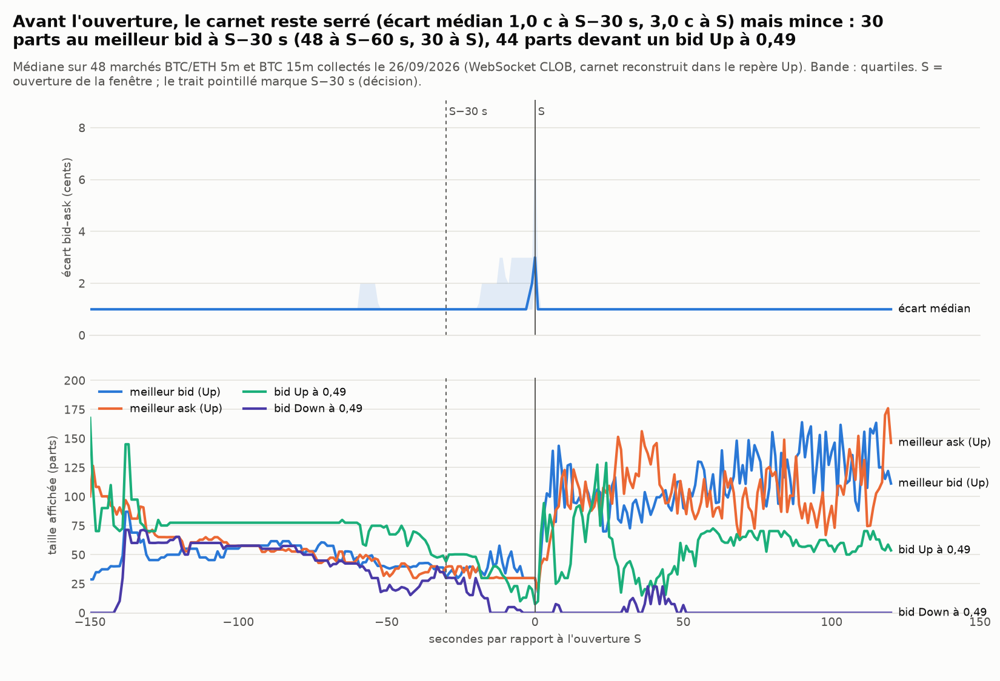
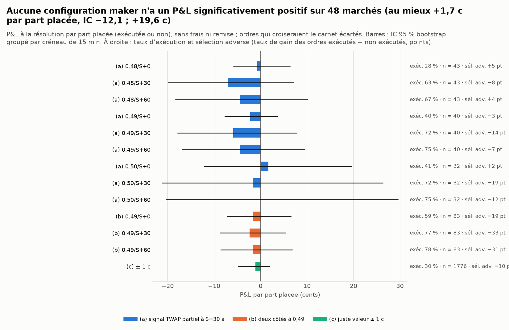
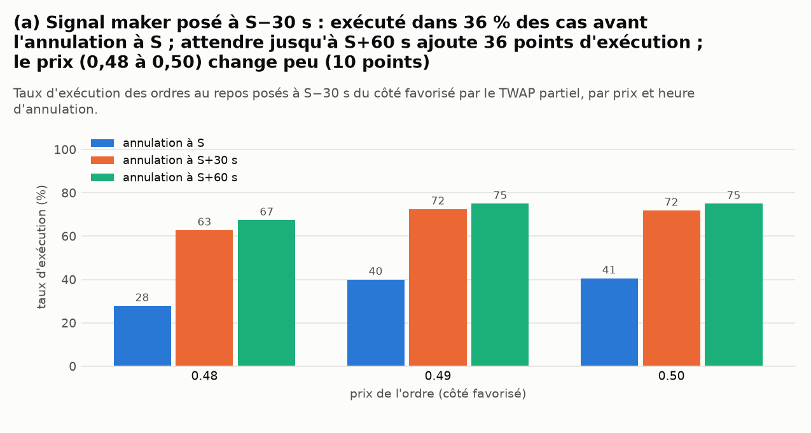

# Maker sur le carnet réel — Polymarket « Up or Down » BTC/ETH 5m, BTC 15m

*Généré le 26/09/2026 10:20 UTC par `scripts/polymarket_maker_live.py` (temps : 57 s). Marchés collectés par `scripts/polymarket_live_collector.py` (WebSocket CLOB, une connexion par marché) : 59 enregistrés, **48 exploitables** (fenêtre finie, carnet reconstruit dès S−60 s), du 26/09/2026 04:35–10:10 UTC.*

> Simulation papier sur données publiques : aucun ordre, aucune clé. Les ordres simulés n'altèrent pas le carnet enregistré : chaque configuration est une simulation indépendante.

## 0. Résumé

* **n est petit** (48 marchés sur 8 créneaux de 15 min ; 54 % résolus Up sur 46 issues connues) : les IC bootstrap (groupés par créneau) sont larges, et rien ci-dessous n'est démontré. Un taux de Up éloigné de 50 % sur si peu de marchés fait gagner mécaniquement les achats d'Up et perdre les achats de Down : lire les tableaux « par côté » avec cette réserve. C'est un premier passage à relancer quand la collecte aura duré 24 h.
* **Carnet autour de l'ouverture** (médianes) : écart 1,0 c à S−60 s, 1,0 c à S−30 s, 3,0 c à S, 1,0 c à S+30 s ; taille au meilleur bid 48 / 30 / 30 / 92 parts aux mêmes instants (meilleur ask : 46 / 40 / 30 / 102).
* **File d'attente typique** (paramètre `Q_ahead` pour le simulateur historique) : avant S, bid Up à 0,49 : 61 (p25 30 ; p75 135) parts, à 0,50 : 26 (p25 0 ; p75 148) ; bid Down à 0,49 : 38 (p25 0 ; p75 67), à 0,50 : 0 (p25 0 ; p75 10). Après S (S, S+30 s) : bid Up 0,49 : 10 (p25 0 ; p75 82) ; 0,50 : 0 (p25 0 ; p75 98) ; bid Down 0,49 : 0 (p25 0 ; p75 30) ; 0,50 : 0 (p25 0 ; p75 19). Un niveau à 0 part est un niveau vide (le milieu est ailleurs) : la médiane mélange donc « file » et « niveau absent » ; le § 3 sépare les deux.
* **Trades preneurs** : 23 922 trades ; 19,8 % traversent plus d'un niveau (IC 18,3 % ; 21,3 %) ; 10,2 % dépassent la taille affichée au meilleur niveau ; taille médiane 8 parts. Dans [S−60 s, S) : 18,8 % de traversées ; dans [S, S+60 s) : 22,7 %.
* **(a) signal TWAP partiel à S−30 s** : 345 ordres posables sur 43 marchés (87 écartés car ils croiseraient le carnet), exécutés 59 % (délai médian 21,1 s) ; P&L −3,0 c par part placée (IC −14,1 ; +10,7 c), −4,8 c par part exécutée (IC −28,1 ; +18,5 c) ; remise maker estimée +0,3 c ; sélection adverse : taux de gain 44 % si exécuté contre 48 % sinon (−4 points).
* **(b) deux côtés à 0,49** : 249 ordres posables sur 48 marchés (39 écartés car ils croiseraient le carnet), exécutés 71 % (délai médian 42,6 s) ; P&L −1,9 c par part placée (IC −7,2 ; +6,0 c), −2,8 c par part exécutée (IC −10,6 ; +8,1 c) ; remise maker estimée +0,3 c ; sélection adverse : taux de gain 46 % si exécuté contre 72 % sinon (−26 points).
* **(c) juste valeur ± 1 c** : 1776 ordres posables sur 46 marchés (85 écartés car ils croiseraient le carnet), exécutés 30 % (délai médian 3,7 s) ; P&L −1,1 c par part placée (IC −4,8 ; +1,9 c), −3,7 c par part exécutée (IC −15,5 ; +6,2 c) ; remise maker estimée +0,3 c ; sélection adverse : taux de gain 46 % si exécuté contre 56 % sinon (−10 points).
* **Juste valeur Φ(d/σ) contre le milieu du carnet** (§ 6) : à S+30 s, Brier 0,213 contre 0,231 pour le marché (ΔBrier −0,018, IC −0,053 ; +0,008) ; à S+840 s, 0,138 contre 0,029 (ΔBrier +0,110) : l'information Binance 1 s vaut quelque chose dans les premières secondes, puis le carnet en sait plus que notre gaussienne.
* **Verdict provisoire** : 0 configuration(s) sur 13 ont un IC entièrement positif (tests multiples : 13 configurations, aucune correction). La meilleure, (a) signal TWAP partiel à S−30 s 0.50/S+0, fait +1,7 c par part placée (IC −12,1 ; +19,6 c) ; choisie a posteriori, elle est optimiste. La règle fixée d'avance (choix sur la 1re moitié, test sur la 2e) est au § 5.

## 1. Données : le collecteur et ce qu'il enregistre

* `scripts/polymarket_live_collector.py` ouvre une connexion `wss://ws-subscriptions-clob.polymarket.com/ws/market` par marché (jetons Up et Down), 2,5 min avant l'ouverture, fermée 2 min après la clôture ou dès l'événement `market_resolved`. Messages : `book` (instantané complet, émis à chaque trade), `price_change` (nouvelle taille d'un niveau), `best_bid_ask`, `last_trade_price` (côté, prix, taille du preneur, horodatage serveur ms), `tick_size_change`, `market_resolved`.
* **Débit** mesuré avec le format brut (v1, messages tels quels) le 26/09 à 04:45 UTC : 55,5 Mo en 13,4 min, soit ≈ 250 Mo/h pour BTC 5m + BTC 15m + ETH 5m (≈ 6 Go / 24 h ; un marché BTC 5m actif pèse 16 Mo), dont 80 % de `price_change` (identifiants de jetons de 77 caractères répétés, niveaux lointains). Estimation en régime établi d'après la taille moyenne par marché fini : v1 ≈ 223 Mo/h. Le collecteur a été remplacé à 04:51 UTC (recouvrement de 3 min, sans perte) par un **format compact v2** : jetons codés 0/1, `price_change` filtrés aux niveaux à ± 0,10 du milieu, vidage gzip toutes les 5 s, chien de garde (reconnexion si 45 s sans message), arrêt propre sur SIGINT/SIGTERM, segments `<slug>.s<k>.jsonl.gz` quand un fichier existe déjà, rafraîchissement de l'issue et de `priceToBeat`/`finalPrice` pendant 6 h après la clôture. Débit v2 estimé de la même façon : ≈ 34 Mo/h (≈ 0,8 Go / 24 h ; un marché BTC 5m ≈ 1,3 Mo, ETH 5m ≈ 0,4 à 1,2 Mo, BTC 15m ≈ 2,5 Mo). Mémoire du processus : ≈ 140 Mo.
* **Reconstruction** (`tradebot.polymarket_book`) : carnet dans le repère du jeton Up (les messages Up et Down sont exactement symétriques : bid Down à p = ask Up à 1 − p, vérifié sur 290 000 `price_change`, 0 écart) ; instantané puis deltas ; contrôle avec `best_bid_ask` : accord médian 98,4 % par marché (le serveur émet `best_bid_ask` juste avant le `price_change` correspondant ; on accepte 200 ms de retard). Les fichiers tronqués (collecteur tué) sont lus jusqu'à la coupure.
* **Marchés** : 59 enregistrés, 48 exploitables. Écartés : pas de carnet à S−60 s (collecte commencée trop tard) (6); fenêtre en cours (5).
* **Binance 1 s** (`data-api.binance.vision`, cache `data/cache/pm_maker_live/binance_1s/`) : signal `gap_m30` = log(spot(S−30) / moyenne des closes 1 s sur [S−60, S−30)) et juste valeur pendant la fenêtre.

## 2. Le carnet autour de l'ouverture



Profondeur par instant (médiane ; p25 ; p75 sur les marchés exploitables), tous marchés :

| mesure | S-60 s | S-30 s | S | S+30 s |
|---|---|---|---|---|
| écart bid–ask | 1,0 c (1,0 ; 1,0) | 1,0 c (1,0 ; 1,0) | 3,0 c (2,0 ; 8,3) | 1,0 c (1,0 ; 1,0) |
| taille au meilleur bid (Up) | 48 (34 ; 137) | 30 (17 ; 101) | 30 (10 ; 40) | 92 (59 ; 164) |
| taille au meilleur ask (Up) | 46 (17 ; 97) | 40 (14 ; 90) | 30 (10 ; 55) | 102 (59 ; 351) |
| cumul bids à ± 0,10 du milieu | 1 523 (612 ; 1 818) | 894 (453 ; 1 351) | 323 (85 ; 484) | 2 016 (1 350 ; 3 685) |
| cumul asks à ± 0,10 du milieu | 1 382 (641 ; 1 791) | 837 (472 ; 1 278) | 318 (115 ; 467) | 2 079 (1 524 ; 4 166) |

Par cellule, à S−30 s (médianes) :

| cellule | marchés | écart (c) | meilleur bid | meilleur ask | bid Up 0,49 | bid Up 0,50 | bid Down 0,49 | bid Down 0,50 |
|---|---|---|---|---|---|---|---|---|
| Tous | 48 | 1,0 | 30 | 40 | 44 | 26 | 30 | 0 |
| BTC 15m | 6 | 1,0 | 258 | 75 | 100 | 258 | 59 | 0 |
| BTC 5m | 21 | 1,0 | 61 | 73 | 65 | 28 | 5 | 0 |
| ETH 5m | 21 | 1,0 | 20 | 20 | 15 | 0 | 30 | 0 |

## 3. File d'attente aux niveaux 0,48–0,52 et traversées

Taille affichée (parts) à chaque niveau, avant S (instants S−60 s et S−30 s) et après S (S et S+30 s) ; « niveau présent » = niveau non vide (le milieu est proche). La médiane sur les niveaux présents est la file `Q_ahead` qu'un ordre posé à ce prix aurait devant lui.

| phase | niveau | part niveau présent | médiane (tous) | médiane (présents) | p25 (présents) | p75 (présents) |
|---|---|---|---|---|---|---|
| avant S | bid Up 0,48 | 96 % | 86 | 89 | 61 | 133 |
| avant S | bid Up 0,49 | 91 % | 61 | 70 | 40 | 143 |
| avant S | bid Up 0,50 | 59 % | 26 | 61 | 35 | 266 |
| avant S | bid Up 0,51 | 28 % | 0 | 61 | 30 | 89 |
| avant S | bid Up 0,52 | 16 % | 0 | 55 | 35 | 80 |
| avant S | bid Down 0,48 | 79 % | 71 | 91 | 66 | 147 |
| avant S | bid Down 0,49 | 67 % | 38 | 57 | 39 | 131 |
| avant S | bid Down 0,50 | 33 % | 0 | 25 | 10 | 42 |
| avant S | bid Down 0,51 | 6 % | 0 | 30 | 30 | 49 |
| avant S | bid Down 0,52 | 3 % | 0 | 30 | 30 | 43 |
| après S | bid Up 0,48 | 62 % | 20 | 63 | 29 | 159 |
| après S | bid Up 0,49 | 53 % | 10 | 70 | 35 | 197 |
| après S | bid Up 0,50 | 49 % | 0 | 106 | 25 | 272 |
| après S | bid Up 0,51 | 41 % | 0 | 100 | 30 | 308 |
| après S | bid Up 0,52 | 34 % | 0 | 110 | 50 | 268 |
| après S | bid Down 0,48 | 49 % | 0 | 65 | 20 | 163 |
| après S | bid Down 0,49 | 39 % | 0 | 138 | 15 | 293 |
| après S | bid Down 0,50 | 30 % | 0 | 100 | 30 | 140 |
| après S | bid Down 0,51 | 28 % | 0 | 138 | 55 | 315 |
| après S | bid Down 0,52 | 24 % | 0 | 133 | 30 | 274 |

Trades preneurs (tous marchés exploitables) : « traverse » = le prix du trade dépasse strictement le meilleur niveau d'avant (au moins deux niveaux consommés) ; « dépasse la profondeur » = taille > taille affichée au meilleur niveau. IC bootstrap par créneau.

| fenêtre | trades | traverse > 1 niveau | IC bas | IC haut | dépasse la profondeur | taille médiane | taille p90 | part d'achats |
|---|---|---|---|---|---|---|---|---|
| toutes | 23 922 | 19,8 % | 18,3 % | 21,3 % | 10,2 % | 8 | 59 | 91 % |
| avant S−60 s | 188 | 8,5 % | 3,5 % | 12,9 % | 16,5 % | 8 | 90 | 99 % |
| [S−60 s, S) | 1 164 | 18,8 % | 15,1 % | 22,4 % | 14,9 % | 7 | 52 | 99 % |
| [S, S+60 s) | 3 668 | 22,7 % | 20,3 % | 25,1 % | 9,8 % | 8 | 46 | 97 % |
| après S+60 s | 18 902 | 19,4 % | 17,2 % | 21,4 % | 9,9 % | 9 | 61 | 89 % |

## 4. Le simulateur maker

Un ordre au repos (achat de 10 parts de Up ou de Down à L) posé à t0 (+ 300 ms de latence) a devant lui la taille affichée à L à t0. La file ne dépasse jamais la taille affichée (les annulations devant nous la réduisent). Chaque trade preneur qui consomme ce niveau (`last_trade_price` du côté opposé, en tenant compte de la complémentarité : un achat preneur de Down à 1 − L consomme les bids Up à L) sert d'abord la file, puis nous ; un trade au-delà du niveau (traversée) nous exécute entièrement. La mise à jour du carnet d'un trade est émise ≈ 20 ms avant son message `last_trade_price` : la file consommée par un trade est mesurée avant les baisses de taille des 200 ms précédentes (pas de double comptage), et un état croisé transitoire du carnet reconstruit (ordre agresseur visible un instant avant son appariement, instantanés Up/Down désynchronisés) n'exécute rien : seul un trade preneur consomme le niveau. Un ordre qui croiserait le carnet dès la pose serait un ordre preneur : il est écarté (`crossing`) et compté à part. Annulation à t_cancel (exécution partielle conservée). Paiement à la résolution : 1{gagnant} − L par part, sans frais ; remise maker estimée à part (0,2 × frais preneur au même prix). Tests : `tests/test_polymarket_maker_live.py`.

Stratégies : (a) `signal` : côté favorisé par `gap_m30` (> 0 : Up), prix 0,48 / 0,49 / 0,50, pose à S−30 s, annulation à S, S+30 s, S+60 s ; (b) `two_sided` : achat Up et achat Down à 0,49 posés à S−60 s, mêmes annulations ; (c) `fair_value` : de S+10 s à E−10 s, toutes les 10 s, juste valeur p̂ = Φ(d/σ) avec d = log(TWAP final estimé / TWAP60(S) Binance) et σ = EWMA 1 s (variance du TWAP restant), bid Up à p̂ − 1 c et bid Down à (1 − p̂) − 1 c, plafonnés à 1 c sous le meilleur prix opposé (jamais croisants), conservés tant que le niveau ne change pas.

## 5. Résultats par stratégie



| stratégie | config. | ordres | marchés | croisants (écartés) | exécutés | via la file | via traversée | file médiane | délai médian (s) | P&L / part placée (c) | IC bas | IC haut | P&L / part exécutée (c) | remise (c) | gain si exécuté | gain sinon |
|---|---|---|---|---|---|---|---|---|---|---|---|---|---|---|---|---|
| (a) signal TWAP partiel à S−30 s | 0.48/S+0 | 43 | 43 | 5 | 28 % | 33 % | 67 % | 71 | 18,6 | −0,7 | −5,8 | +6,4 | −2,5 | 0,35 | 45 % | 40 % |
| (a) signal TWAP partiel à S−30 s | 0.48/S+30 | 43 | 43 | 5 | 63 % | 22 % | 78 % | 71 | 30,3 | −7,1 | −19,9 | +7,0 | −9,5 | 0,35 | 38 % | 47 % |
| (a) signal TWAP partiel à S−30 s | 0.48/S+60 | 43 | 43 | 5 | 67 % | 21 % | 79 % | 71 | 30,6 | −4,5 | −18,3 | +10,1 | −5,1 | 0,35 | 43 % | 38 % |
| (a) signal TWAP partiel à S−30 s | 0.49/S+0 | 40 | 40 | 8 | 40 % | 25 % | 75 % | 50 | 14,0 | −2,3 | −7,7 | +3,7 | −6,1 | 0,35 | 43 % | 46 % |
| (a) signal TWAP partiel à S−30 s | 0.49/S+30 | 40 | 40 | 8 | 72 % | 31 % | 69 % | 50 | 21,3 | −5,9 | −17,9 | +7,7 | −8,3 | 0,35 | 41 % | 55 % |
| (a) signal TWAP partiel à S−30 s | 0.49/S+60 | 40 | 40 | 8 | 75 % | 30 % | 70 % | 50 | 21,5 | −4,5 | −16,8 | +9,5 | −6,1 | 0,35 | 43 % | 50 % |
| (a) signal TWAP partiel à S−30 s | 0.50/S+0 | 32 | 32 | 16 | 41 % | 15 % | 85 % | 40 | 13,7 | +1,7 | −12,1 | +19,6 | +4,5 | 0,35 | 55 % | 53 % |
| (a) signal TWAP partiel à S−30 s | 0.50/S+30 | 32 | 32 | 16 | 72 % | 13 % | 87 % | 40 | 21,1 | −1,7 | −21,2 | +26,3 | −2,4 | 0,35 | 48 % | 67 % |
| (a) signal TWAP partiel à S−30 s | 0.50/S+60 | 32 | 32 | 16 | 75 % | 12 % | 88 % | 40 | 25,1 | +0,0 | −20,3 | +29,5 | +0,0 | 0,35 | 50 % | 62 % |
| (b) deux côtés à 0,49 | 0.49/S+0 | 83 | 48 | 13 | 59 % | 27 % | 73 % | 65 | 37,8 | −1,6 | −7,2 | +6,5 | −3,3 | 0,35 | 46 % | 65 % |
| (b) deux côtés à 0,49 | 0.49/S+30 | 83 | 48 | 13 | 77 % | 27 % | 73 % | 65 | 43,5 | −2,4 | −8,7 | +5,4 | −3,1 | 0,35 | 46 % | 79 % |
| (b) deux côtés à 0,49 | 0.49/S+60 | 83 | 48 | 13 | 78 % | 26 % | 74 % | 65 | 43,7 | −1,7 | −8,5 | +6,8 | −2,2 | 0,35 | 47 % | 78 % |
| (c) juste valeur ± 1 c | ± 1 c | 1 776 | 46 | 85 | 30 % | 34 % | 66 % | 139 | 3,7 | −1,1 | −4,8 | +1,9 | −3,7 | 0,27 | 46 % | 56 % |

(b) par **paire** Up + Down, sur les marchés où les deux ordres sont posables (quand le milieu n'est pas à 0,50, l'un des deux croise le carnet et le tableau précédent ne garde que l'autre) : P&L de la paire en cents par part (les deux exécutés = écart de 2 c capté, un seul = position directionnelle, le plus souvent du côté perdant) :

| config. | paires | les deux exécutés | un seul | aucun | P&L / paire (c) | IC bas | IC haut |
|---|---|---|---|---|---|---|---|
| 0.49/S+0 | 35 | 26 % | 71 % | 3 % | −11,3 | −23,0 | +0,5 |
| 0.49/S+30 | 35 | 60 % | 40 % | 0 % | −10,2 | −19,9 | +0,2 |
| 0.49/S+60 | 35 | 63 % | 37 % | 0 % | −8,7 | −19,7 | +5,1 |

Par côté acheté (a et b) :

| stratégie | côté | ordres | croisants | exécutés | P&L / part placée (c) | IC bas | IC haut | gain si exécuté | gain sinon |
|---|---|---|---|---|---|---|---|---|---|
| signal | down | 168 | 66 | 70 % | −2,3 | −11,1 | +8,5 | 46 % | 37 % |
| two_sided | up | 141 | 3 | 65 % | −0,7 | −11,0 | +10,0 | 48 % | 69 % |
| two_sided | down | 108 | 36 | 80 % | −3,5 | −13,9 | +8,0 | 45 % | 77 % |
| signal | up | 177 | 21 | 49 % | −3,7 | −17,7 | +25,3 | 41 % | 55 % |



### 1re moitié / 2e moitié

Règle fixée d'avance pour (a) : la configuration (prix, annulation) au meilleur P&L par part placée sur la 1re moitié des marchés (au moins 5 ordres) est **0.50/S+30** ; son résultat sur la 2e moitié :

| moitié | ordres | marchés | exécutés | P&L / part placée (c) | IC bas | IC haut | gain si exécuté | gain sinon |
|---|---|---|---|---|---|---|---|---|
| 1re moitié | 13 | 13 | 77 % | +0,0 | −25,0 | +46,2 | 50 % | 100 % |
| 2e moitié | 19 | 19 | 68 % | −2,9 | −25,0 | +35,7 | 45 % | 50 % |

Toutes configurations, par moitié (`fichier resume_par_moitie.csv`) : P&L par part placée (c) et taux d'exécution.

| stratégie | config. | moitié | ordres | exécutés | P&L / part placée (c) | IC bas | IC haut |
|---|---|---|---|---|---|---|---|
| signal | 0.48/S+0 | 1re moitié | 19 | 42 % | −4,4 | −9,0 | +1,1 |
| signal | 0.48/S+30 | 1re moitié | 19 | 63 % | −4,0 | −26,2 | +8,2 |
| signal | 0.48/S+60 | 1re moitié | 19 | 68 % | −1,3 | −26,2 | +15,3 |
| signal | 0.49/S+0 | 1re moitié | 17 | 41 % | −2,5 | −7,4 | +0,6 |
| signal | 0.49/S+30 | 1re moitié | 17 | 76 % | −2,2 | −21,8 | +16,7 |
| signal | 0.49/S+60 | 1re moitié | 17 | 76 % | −2,2 | −21,8 | +16,7 |
| signal | 0.50/S+0 | 1re moitié | 13 | 31 % | +0,0 | −23,2 | +23,1 |
| signal | 0.50/S+30 | 1re moitié | 13 | 77 % | +0,0 | −25,0 | +46,2 |
| signal | 0.50/S+60 | 1re moitié | 13 | 77 % | +0,0 | −25,0 | +46,2 |
| two_sided | 0.49/S+0 | 1re moitié | 41 | 56 % | −5,5 | −13,7 | +9,5 |
| two_sided | 0.49/S+30 | 1re moitié | 41 | 71 % | −5,4 | −14,4 | +8,3 |
| two_sided | 0.49/S+60 | 1re moitié | 41 | 71 % | −5,4 | −14,4 | +8,3 |
| fair_value | ± 1 c | 1re moitié | 940 | 32 % | −2,0 | −8,1 | +4,8 |
| signal | 0.48/S+0 | 2e moitié | 24 | 17 % | +2,5 | −5,3 | +13,0 |
| signal | 0.48/S+30 | 2e moitié | 24 | 62 % | −9,7 | −26,7 | +10,0 |
| signal | 0.48/S+60 | 2e moitié | 24 | 67 % | −7,3 | −25,9 | +11,6 |
| signal | 0.49/S+0 | 2e moitié | 23 | 39 % | −2,0 | −10,9 | +7,9 |
| signal | 0.49/S+30 | 2e moitié | 23 | 70 % | −8,9 | −24,4 | +11,0 |
| signal | 0.49/S+60 | 2e moitié | 23 | 74 % | −6,4 | −23,3 | +11,9 |
| signal | 0.50/S+0 | 2e moitié | 19 | 47 % | +2,9 | −11,1 | +32,1 |
| signal | 0.50/S+30 | 2e moitié | 19 | 68 % | −2,9 | −25,0 | +35,7 |
| signal | 0.50/S+60 | 2e moitié | 19 | 74 % | +0,0 | −23,3 | +36,4 |
| two_sided | 0.49/S+0 | 2e moitié | 42 | 62 % | +2,5 | −5,0 | +13,6 |
| two_sided | 0.49/S+30 | 2e moitié | 42 | 83 % | +0,8 | −6,1 | +7,6 |
| two_sided | 0.49/S+60 | 2e moitié | 42 | 86 % | +2,1 | −6,1 | +11,5 |
| fair_value | ± 1 c | 2e moitié | 836 | 28 % | −0,0 | −2,1 | +2,5 |

## 6. La juste valeur Φ(d/σ) contre le prix du marché pendant la fenêtre

Brier de la juste valeur (Binance 1 s, information close à t) et du milieu du carnet au même instant, contre l'issue officielle ; ΔBrier < 0 = la juste valeur fait mieux ; IC bootstrap par créneau.

| durée | t_rel_s | n | Brier juste valeur | Brier marché | ΔBrier | IC bas | IC haut | justesse juste valeur | justesse marché |
|---|---|---|---|---|---|---|---|---|---|
| toutes | 30 | 46 | 0,213 | 0,231 | −0,018 | −0,053 | +0,008 | 59 % | 57 % |
| toutes | 60 | 46 | 0,198 | 0,203 | −0,005 | −0,042 | +0,028 | 65 % | 65 % |
| toutes | 150 | 40 | 0,099 | 0,099 | −0,000 | −0,056 | +0,058 | 82 % | 85 % |
| toutes | 240 | 23 | 0,165 | 0,121 | +0,044 | −0,069 | +0,115 | 83 % | 83 % |
| toutes | 450 | 6 | 0,407 | 0,232 | +0,175 | +0,012 | +0,363 | 50 % | 67 % |
| toutes | 840 | 6 | 0,138 | 0,029 | +0,110 | −0,041 | +0,371 | 83 % | 100 % |
| 15m | 30 | 6 | 0,317 | 0,268 | +0,049 | −0,002 | +0,110 | 33 % | 33 % |
| 15m | 60 | 6 | 0,345 | 0,280 | +0,065 | −0,003 | +0,144 | 33 % | 33 % |
| 15m | 450 | 6 | 0,407 | 0,232 | +0,175 | +0,012 | +0,363 | 50 % | 67 % |
| 15m | 840 | 6 | 0,138 | 0,029 | +0,110 | −0,041 | +0,371 | 83 % | 100 % |
| 5m | 30 | 40 | 0,198 | 0,226 | −0,028 | −0,065 | −0,002 | 62 % | 60 % |
| 5m | 60 | 40 | 0,176 | 0,191 | −0,015 | −0,057 | +0,027 | 70 % | 70 % |
| 5m | 150 | 40 | 0,099 | 0,099 | −0,000 | −0,056 | +0,058 | 82 % | 85 % |
| 5m | 240 | 23 | 0,165 | 0,121 | +0,044 | −0,069 | +0,115 | 83 % | 83 % |

## 7. À quoi servirait l'amplitude prévue par TimesFM ?

TimesFM ne prédit pas le sens (AUC ≈ 0,51), mais ses quantiles sont calibrés en amplitude (couverture [q10, q90] de 0,76 à 0,84 pour 0,80 visé). Dans ce cadre, l'amplitude a exactement une place : **le σ de la juste valeur** Φ(d/σ) de la stratégie (c), donc le **prix auquel un maker doit coter**. Quand l'écart d entre le TWAP estimé et le seuil est connu (il l'est mécaniquement dès S−30 s, et de plus en plus pendant la fenêtre), la probabilité de Up ne dépend plus que de la dispersion attendue du reste de la fenêtre : un σ trop petit fait coter 0,90 ce qui vaut 0,70, un σ trop grand laisse de l'argent sur la table. Ici σ vient d'une EWMA de rendements 1 s (60 s de demi-vie) ; TimesFM (contexte 1 min, horizon 5 ou 15 pas) fournirait un σ **conditionnel** à l'horizon exact de la fenêtre, utile surtout sur le 15m où l'EWMA 1 s extrapole mal, et pour dimensionner l'ordre (taille, distance au milieu) plutôt que pour choisir le côté. Le test à faire : remplacer σ_EWMA par (q90 − q10)/2,56 de TimesFM 2.5 (Apache-2.0) dans (c) et comparer le Brier du § 6 et le P&L du § 5 ; le § 6 donne déjà la référence à battre (le milieu du carnet). Rien de tout cela ne crée un avantage sur le sens : cela ne fait que cotiser correctement ce que l'on sait.

## 8. Limites

* **n = 48 marchés** sur une seule matinée UTC (régime de volatilité unique) ; 13 configurations testées sans correction pour tests multiples ; la meilleure configuration est choisie a posteriori. À relancer après 24 h de collecte.
* File d'attente : borne supérieure (les annulations devant nous ne sont vues que si le niveau affiché passe sous notre file) ; le prix d'un `last_trade_price` est le niveau touché (prix moyen du preneur dans 93 % des cas) : une traversée est comptée à partir de ce prix.
* Nos ordres n'influencent pas les autres participants (pas de réaction des makers concurrents, pas de retrait du preneur). La latence est fixée à 300 ms.
* Signal (a) : bougies 1 s Binance closes à S−30 s ; le flux Chainlink retarde d'≈ 4 s sur Binance (diagnostic), non modélisé ; juste valeur (c) : TWAP60(S) Binance à la place de `priceToBeat` (écart de niveau Binance–Chainlink ≈ 3 pb), gaussienne, pas de saut.
* Issues : `resolved_up` lu sur gamma (rafraîchi par le collecteur pendant 6 h) ou sur l'événement `market_resolved` du WebSocket ; les marchés sans issue comptent pour l'exécution mais pas pour le P&L.

## 9. Fichiers et relance

| fichier | contenu |
|---|---|
| `marches.csv` | un marché par ligne : issue, `priceToBeat`, `gap_m30`, couverture, accord `best_bid_ask`, milieu / écart / profondeur à S−60, S−30, S, S+30 |
| `carnet_median.csv` | séries médianes (et quartiles) du carnet par cellule, de S−150 s à S+120 s |
| `profondeur.csv`, `file_attente.csv` | profondeur par instant et cellule ; file typique aux niveaux 0,48–0,52 avant / après S |
| `trades_stats.csv`, `trades.csv` | traversées, dépassements de profondeur, tailles ; tous les trades preneurs avec l'état du carnet d'avant |
| `ordres.csv`, `resume_strategies.csv`, `resume_par_moitie.csv`, `resume_par_cellule.csv`, `paires_two_sided.csv` | ordres simulés et résumés avec IC |
| `juste_valeur_controle.csv` | Brier juste valeur contre milieu du carnet |

Relancer (le collecteur peut tourner en même temps ; les marchés en cours sont ignorés) :

```bash
. .venv/bin/activate
pgrep -af live_collector || nohup python scripts/polymarket_live_collector.py --series btc:5m,btc:15m,eth:5m >> logs/live_collector.log 2>&1 &
python scripts/polymarket_maker_live.py               # --workers 2 --B 2000 par défaut ; --no-refresh pour ne pas interroger gamma
```
