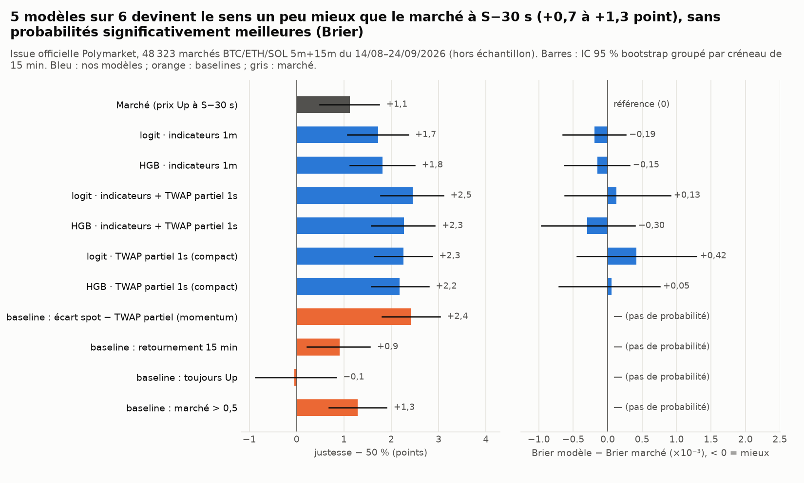
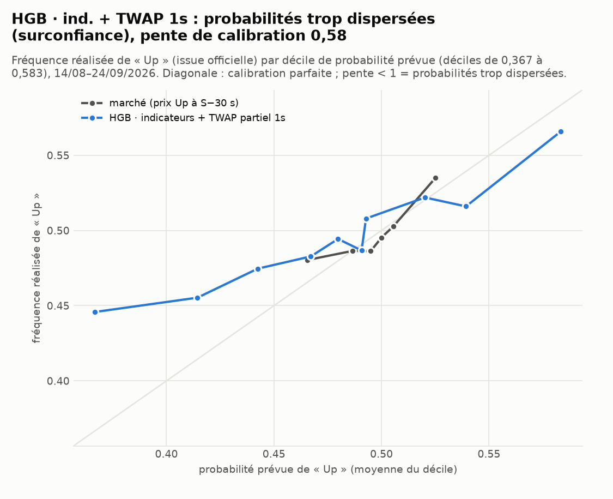
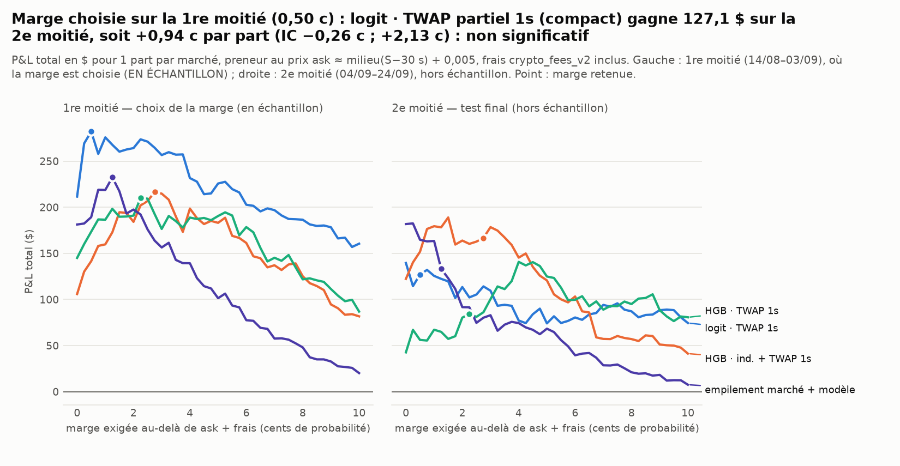
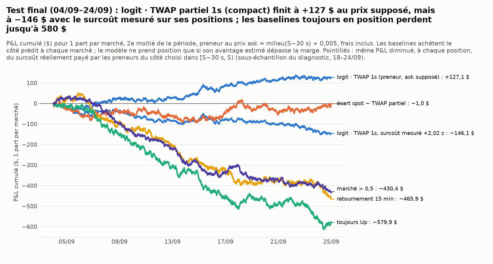

# Nos modèles contre le marché — Polymarket « Up or Down » crypto 5m / 15m

*Généré le 26/09/2026 00:45 UTC par `scripts/polymarket_models_vs_market.py` (temps total : 79 s, caches compris — voir § 8). Marchés : BTC, ETH, SOL × 5m, 15m ; fenêtres du 14/08/2026 au 24/09/2026 23:59 UTC (régime TWAP-60 homogène).*

> Simulation papier sur données publiques : aucune clé, aucun ordre. Depuis la France, ces marchés sont `restricted` (close-only) : ce test mesure seulement si nos prévisions battent le prix du marché.

## 0. Résumé

* **Données** : 48 323 marchés résolus évalués sur 48 384 créneaux attendus (57 sans prix du jeton Up à S−30 s), issue **officielle** Polymarket. Tous les marchés 5m ont été collectés (pas d'échantillonnage).
* **Le prix du marché à S−30 s n'a presque aucune information** : justesse 51,1 % (IC 50,5 % ; 51,7 %), AUC 0,518 (IC 0,509 ; 0,525), Brier 0,2499 (pièce : 0,2500).
* **Modèle choisi sans regarder le test : `hgb_ind1s`** (HGB · indicateurs + TWAP partiel 1s, meilleure log-loss sur la 1re moitié). Sur la 2e moitié : justesse 52,5 % (IC 51,5 % ; 53,4 %) contre 51,1 % pour le marché, AUC 0,537 (IC 0,526 ; 0,548) contre 0,521, écart de Brier −0,14 ×10⁻³ (IC −1,08 ; +0,82) : non significatif (l'IC contient 0). Sur toute la période, il bat le marché en justesse de +1,1 points (IC +0,3 ; +2,0), mais pas en Brier (−0,30 ×10⁻³, IC −0,96 ; +0,39) : ses probabilités sont trop dispersées (§ 4).
* **Les indicateurs 1m seuls (1 an d'apprentissage) font à peine mieux que le marché** : `logit_ind` justesse 51,7 % (IC 51,1 % ; 52,4 %), AUC 0,526. L'information utile vient surtout du **TWAP partiel 1s** (écart spot − moyenne des 30 dernières secondes, connu à S−30 s) : la règle seule `gap_m30` fait 52,4 % (IC 51,8 % ; 53,0 %), AUC 0,532. L'écart se concentre sur les **5m** (`hgb_ind1s` 52,5 % contre 50,9 % pour le marché) ; en **15m**, `hgb_ind1s` fait 51,7 % contre 51,9 %.
* **Marché + modèle (empilement appris sur la 1re moitié, testé sur la 2e)** : Brier 0,2489 contre 0,2497 pour le marché seul (écart −0,74 ×10⁻³, IC −1,31 ; −0,19) : significatif, mais minuscule. Justesse 52,4 % (IC 51,5 % ; 53,2 %), n = 24 173.
* **P&L preneur (1 part par marché, frais inclus)** : la règle fixée d'avance (P&L total maximal sur la 1re moitié) retient `logit_tw` avec une marge de 0,50 c : +282,1 $ sur la 1re moitié (en échantillon pour la marge), **+127,1 $ sur la 2e moitié (13 551 positions), soit +0,94 c par part (IC −0,26 c ; +2,13 c)**, non significatif (l'IC contient 0). Les autres modèles, 2e moitié, par part : `logit_ind` +1,01 c (IC −0,47 c ; +2,52 c) ; `hgb_ind` +2,88 c (IC +0,28 c ; +5,53 c) ; `logit_ind1s` +2,31 c (IC +0,40 c ; +4,18 c) ; `hgb_ind1s` +2,20 c (IC +0,66 c ; +3,69 c) ; `hgb_tw` +0,97 c (IC −0,42 c ; +2,44 c) ; `stack` +2,25 c (IC +0,63 c ; +3,88 c). Avec le surcoût d'exécution de la baseline `gap_m30` mesuré dans le diagnostic (+1,7 c par part), tous les IC contiennent 0. **Mesuré sur les positions de chaque modèle, le surcoût réel est de 1,3 c à 3,1 c par part ; P&L après ce surcoût : de −1,89 c à +0,74 c par part, aucun IC n'est entièrement positif (§ 5 bis).**
* **Baselines toujours en position (2e moitié, par part)** : `gap_m30` −0,00 c (IC −0,90 c ; +0,86 c); `rev15` −1,93 c (IC −2,90 c ; −0,91 c); `always_up` −2,40 c (IC −3,58 c ; −1,22 c); `mkt_gt_05` −1,78 c (IC −2,65 c ; −0,92 c). Aucune n'est rentable après frais.
* **Borne haute maker (achat au bid, sans frais, exécution SUPPOSÉE certaine)** : `logit_tw` +633,4 $ sur 22 710 positions, +2,79 c par part (IC +1,90 c ; +3,69 c). Ce n'est pas un résultat atteignable tel quel : un ordre au repos n'est exécuté que si un preneur vient le chercher, c'est-à-dire surtout quand il a tort (sélection adverse). La baseline `gap_m30`, toujours en position, fait autant (+2,74 c par part) : cette borne mesure surtout le demi-écart capté, pas la qualité du modèle.
* **TimesFM** (sous-échantillon régulier de 1 499 marchés BTC) : justesse 51,8 % (IC 49,0 % ; 54,6 %), AUC 0,509, Brier 0,2500 contre 0,2502 pour le marché sur les mêmes marchés (écart −0,24 ×10⁻³, IC −2,48 ; +1,89).
* **Verdict** : **pas d'avantage démontré après frais.** Avec l'hypothèse d'exécution optimiste (ask = milieu + 0,005), 4 modèles sur 7 (`hgb_ind`, `logit_ind1s`, `hgb_ind1s` et `stack`) gagnent de +2,20 c à +2,88 c par part sur la 2e moitié avec un IC qui exclut 0, mais après correction pour 7 comparaisons (IC simultanés), seuls `hgb_ind1s` et `stack` l'excluent encore, de justesse ; le modèle retenu par la règle fixée d'avance (P&L total maximal sur la 1re moitié), `logit_tw`, ne fait que +0,94 c (IC −0,26 c ; +2,13 c) ; celui retenu par la log-loss, `hgb_ind1s`, +2,20 c (IC +0,66 c ; +3,69 c) ; surtout, sur les positions de chaque modèle, les preneurs ont réellement payé de 1,3 c à 3,1 c de plus que l'ask supposé dans [S−30 s, S) (1,7 c pour la baseline `gap_m30`) : le modèle achète quand le carnet a déjà bougé. Après ce surcoût, le P&L par part va de −1,89 c à +0,74 c et aucun n'a plus un IC entièrement positif. L'avantage brut de 1 à 3 c par part repose surtout sur l'information du TWAP partiel à 1 s, connue à S−30 s. Il est du même ordre que le surcoût réellement payé pour l'exécuter, et il n'en reste rien de démontrable. En probabilité (Brier), seul `stack` fait significativement mieux que le marché, et de très peu (≈ 10⁻³). TimesFM n'apporte rien. Avant toute conclusion, il faut un test papier sur le carnet réel (WebSocket).

## 1. Données

* **Marchés** : `PolymarketClient.list_updown_markets` (slugs déterministes, cache disque), issue officielle `outcomePrices`. Créneaux attendus 48 384, trouvés 48 380, résolus 48 380, en TWAP-60 48 380 ; frais : crypto_fees_v2 (taux 0,07, exposant 1) : 48 323.
* **Prix d'exécution de référence** : dernier point `prices_history` (fidelity = 1, milieu de fourchette) <= S−30 s, ancienneté <= 5 min ; ancienneté médiane 17 s ; 98,0 % des prix dans [0,45 ; 0,55]. Hypothèse (documentée dans le diagnostic, carnet ≈ 0,50 / 0,51 avant l'ouverture) : **ask ≈ milieu + 0,005**, **bid ≈ milieu − 0,005**. Le diagnostic a mesuré que les preneurs ont en réalité payé ≈ 1,7 c de plus dans [S−30 s, S) pour la baseline `gap_m30`, et 1,3 c à 3,1 c de plus sur les positions des modèles (§ 5 bis) : l'hypothèse est optimiste. Avec un pas de 0,01, un milieu sur un cent entier (0,500) implique même un carnet d'au moins 0,49 / 0,51.
* **Collecte** : 48 380 marchés ; historiques de prix à 20 requêtes/s max, 24 fils ; codes HTTP de cette exécution : {} ; durée de la collecte des prix : 0 s dans cette exécution (≈ 0 quand tout est en cache) ; 1re collecte, à froid : 2 018 s (48 332 marchés hors cache de ce script (≈ 8 000 déjà dans le cache du client grâce au diagnostic), 20 req/s max, 24 fils, 41 079 réponses HTTP 200, aucune 429).
* **Binance** : bougies 1m (1 an, `tradebot.data.load_universe`, dérivés alignés) et bougies 1s du 15/05/2026 au 24/09/2026 (zips journaliers, agrégées par demi-minute). Contrôle de l'étiquette proxy sur les marchés testés : `y_proxy` (VWAP 1m) = issue officielle dans 96,1 % des cas (n = 48 323) ; TWAP60 1s exact : 98,1 %.

| cellule | résolus | avec prix S−30 s | couverture | évalués | taux de Up | prix Up moyen | écart-type prix | ancienneté médiane (s) |
|---|---|---|---|---|---|---|---|---|
| BTC 5m | 12 095 | 12 081 | 99,9 % | 12 081 | 49,9 % | 0,501 | 0,021 | 17 |
| ETH 5m | 12 094 | 12 080 | 99,9 % | 12 080 | 50,0 % | 0,499 | 0,017 | 17 |
| SOL 5m | 12 095 | 12 081 | 99,9 % | 12 081 | 49,9 % | 0,500 | 0,011 | 17 |
| BTC 15m | 4 032 | 4 027 | 99,9 % | 4 027 | 49,4 % | 0,499 | 0,025 | 17 |
| ETH 15m | 4 032 | 4 027 | 99,9 % | 4 027 | 50,5 % | 0,500 | 0,019 | 17 |
| SOL 15m | 4 032 | 4 027 | 99,9 % | 4 027 | 50,2 % | 0,501 | 0,012 | 17 |

## 2. Méthode

**Instant d'information.** Tout est mesuré à **S−30 s** : le prix du marché est le dernier point <= S−30 s, et les variables n'utilisent que ce qui est connu à S−30 s. Pour les bougies 1m, c'est la dernière bougie close, ouverte à S−2 min et close à S−1 min (la bougie [S−1 min, S) n'est close qu'à S). Pour les bougies 1s, ce sont les bougies closes au plus tard à S−30 s. Un test unitaire modifie toutes les données postérieures et vérifie que les variables ne changent pas (`tests/test_polymarket_backtest.py`).

**Variables.**

* `ind` : les indicateurs causaux de `tradebot.indicators` (158 pour BTC, 167 pour ETH et SOL avec le benchmark BTC), lus à la bougie ouverte à S−2 min, plus `mom15_m60`, `mom5_m60` et une indicatrice d'actif.
* `tw` (« TWAP partiel », bougies 1s) : `tw_gap30` = log(spot(S−30 s) / moyenne des closes 1s sur (S−60, S−30]), soit l'écart spot − TWAP partiel. La référence TWAP60(S) est à moitié connue à S−30 s. S'y ajoutent sa version réduite par σ, les rendements sur 30 s, 90 s et 330 s, la pente sur 30 s, l'écart au VWAP, l'étendue, la part acheteuse des preneurs, le volume relatif, l'écart TWAP de la minute précédente, σ 1m, l'heure et le jour (sin/cos) et l'actif.
* `ind1s` = `ind` + `tw`.

**Étiquette d'entraînement (Binance)** : y = 1 si VWAP(bougie [S+D−1m]) >= VWAP(bougie [S−1m]), avec VWAP = quote_volume / volume (proxy à 96,5 % du diagnostic). Les origines S suivent une grille de 5 min, pour les 3 actifs. On entraîne **un modèle par durée** (5m, 15m), commun aux trois actifs.

**Apprentissage, purge, calibration.** Seules les origines antérieures au 14/08/2026 00:00 moins D moins 1 h sont utilisées. Cette période est découpée dans le temps en trois segments : apprentissage (75 %), arrêt précoce (10 %) et calibration isotonique (15 %, `forecaster.calibrate_isotonic`, scores bruts winsorisés à 1 % / 99 % pour que les blocs extrêmes ne reposent pas sur quelques points). Entre deux segments, on retire D + 1 h d'origines (purge). Les modèles `*_ind` apprennent sur ~10,5 mois de 1m ; les modèles `*_ind1s` et `*_tw` sur la période couverte par le 1s (depuis le 15/05/2026, ~3 mois). Algorithmes : `logit` (régression logistique L2, C = 0,1, variables standardisées) et `hgb` (HistGradientBoosting, profondeur 3, taux 0,05, 200 observations minimum par feuille, arrêt précoce sur le segment chronologique). Les valeurs manquantes sont remplacées par la médiane de l'apprentissage. Détail : `apprentissage.csv`.

**Baselines** (diagnostic) : `gap_m30` (momentum de l'écart spot − TWAP partiel), `rev15` (retournement des 15 dernières minutes, bougies 1m closes à S−1 min), « toujours Up », « marché > 0,5 ». Le prix du marché lui-même sert de probabilité de référence.

**Évaluation hors échantillon** sur l'issue officielle, 14/08–24/09/2026. Mesures : justesse (Up si p >= 0,5), AUC, Brier et log-loss, écarts appariés au marché, calibration par déciles. Les IC à 95 % viennent d'un **bootstrap groupé par créneau de 15 min** (2000 tirages ; 200 pour l'AUC). Les 3 actifs et les 2 durées d'un même créneau sont corrélés et sont donc tirés ensemble. La période est coupée en deux moitiés : la 1re (14/08–03/09) sert de **validation** (choix de la marge, apprentissage de l'empilement), la 2e (04/09–24/09) de **test final**.

**P&L (1 part par marché).** Coût d'achat de Up : ask_Up = p_Up(S−30 s) + 0,005, plus les frais `taker_fee` du `feeSchedule` du marché (0,07·p·(1−p)). Pour Down : ask_Down = 1 − p_Up(S−30 s) + 0,005. On achète Up si p_modèle − (ask_Up + frais) > marge, et Down si (1 − p_modèle) − (ask_Down + frais) > marge. La position est gardée jusqu'à la résolution. La marge est choisie sur la 1re moitié : c'est celle qui maximise le P&L total avec au moins 100 positions, sur une grille de 0 à 10 c par pas de 0,25 c. Elle est ensuite appliquée telle quelle à la 2e moitié. La variante **maker optimiste** achète au bid (milieu − 0,005), sans frais, et suppose que l'ordre est toujours exécuté. C'est une **borne haute**, pas un résultat atteignable.

## 3. Précision : nos modèles contre le prix du marché au même instant

Période complète (14/08–24/09/2026), tous marchés ; [IC 95 %] :

| modèle | description | n | justesse | AUC | Brier | log-loss | ΔBrier vs marché (×10⁻³) | Δjustesse vs marché (pts) |
|---|---|---|---|---|---|---|---|---|
| `market` | Marché (prix Up à S−30 s) | 48 323 | 51,1 % [50,5 % ; 51,7 %] | 0,518 [0,509 ; 0,525] | 0,2499 | 0,6929 | — | — |
| `logit_ind` | logit · indicateurs 1m | 48 323 | 51,7 % [51,1 % ; 52,4 %] | 0,526 [0,518 ; 0,533] | 0,2497 | 0,6925 | −0,19 [−0,65 ; +0,26] | +0,6 [−0,0 ; +1,2] |
| `hgb_ind` | HGB · indicateurs 1m | 48 323 | 51,8 % [51,1 % ; 52,5 %] | 0,525 [0,517 ; 0,534] | 0,2497 | 0,6926 | −0,15 [−0,63 ; +0,32] | +0,7 [+0,1 ; +1,4] |
| `logit_ind1s` | logit · indicateurs + TWAP partiel 1s | 48 323 | 52,5 % [51,8 % ; 53,1 %] | 0,536 [0,527 ; 0,543] | 0,2500 | 0,6933 | +0,13 [−0,62 ; +0,91] | +1,3 [+0,5 ; +2,2] |
| `hgb_ind1s` | HGB · indicateurs + TWAP partiel 1s | 48 323 | 52,3 % [51,6 % ; 52,9 %] | 0,536 [0,528 ; 0,542] | 0,2496 | 0,6923 | −0,30 [−0,96 ; +0,39] | +1,1 [+0,3 ; +2,0] |
| `logit_tw` | logit · TWAP partiel 1s (compact) | 48 323 | 52,3 % [51,6 % ; 52,9 %] | 0,534 [0,529 ; 0,542] | 0,2503 | 0,6939 | +0,42 [−0,44 ; +1,29] | +1,1 [+0,3 ; +2,0] |
| `hgb_tw` | HGB · TWAP partiel 1s (compact) | 48 323 | 52,2 % [51,6 % ; 52,8 %] | 0,533 [0,526 ; 0,540] | 0,2499 | 0,6930 | +0,05 [−0,70 ; +0,76] | +1,1 [+0,3 ; +1,9] |
| `gap_m30` | baseline : écart spot − TWAP partiel (momentum) | 48 323 | 52,4 % [51,8 % ; 53,0 %] | 0,532 [0,526 ; 0,539] | — | — | — | +1,3 [+0,4 ; +2,1] |
| `rev15` | baseline : retournement 15 min | 48 323 | 50,9 % [50,2 % ; 51,6 %] | 0,514 [0,506 ; 0,522] | — | — | — | −0,2 [−0,9 ; +0,5] |
| `always_up` | baseline : toujours Up | 48 323 | 49,9 % [49,1 % ; 50,8 %] | — | — | — | — | −1,2 [−2,0 ; −0,2] |
| `mkt_gt_05` | baseline : marché > 0,5 | 48 323 | 51,3 % [50,7 % ; 51,9 %] | 0,518 [0,509 ; 0,525] | — | — | — | +0,2 [−0,3 ; +0,6] |

Empilement marché + `hgb_ind1s` (régression logistique sur logit(p_modèle), logit(p_marché) et l'indicatrice 15m, apprise sur la 1re moitié ; coefficients 0,610, −0,153, 0,004) — 2e moitié seulement : justesse 52,4 % (IC 51,5 % ; 53,2 %), AUC 0,535, Brier 0,2489 (marché : 0,2497).

Par actif et durée (période complète) : justesse et écart de Brier au marché (×10⁻³) du meilleur modèle en probabilité, `hgb_ind1s`, et de la baseline `gap_m30` :

| cellule | n | marché : justesse | marché : AUC | hgb_ind1s : justesse | hgb_ind1s : AUC | hgb_ind1s : ΔBrier | gap_m30 : justesse |
|---|---|---|---|---|---|---|---|
| Tous 5m | 36 242 | 50,9 % | 0,515 | 52,5 % [51,8 % ; 53,1 %] | 0,540 | −0,62 [−1,39 ; +0,16] | 52,5 % |
| Tous 15m | 12 081 | 51,9 % | 0,524 | 51,7 % [50,5 % ; 52,7 %] | 0,521 | +0,66 [−0,23 ; +1,67] | 52,3 % |
| BTC 5m | 12 081 | 51,4 % | 0,519 | 52,8 % [51,9 % ; 53,7 %] | 0,542 | −0,77 [−1,79 ; +0,28] | 52,6 % |
| ETH 5m | 12 080 | 50,9 % | 0,518 | 52,4 % [51,5 % ; 53,3 %] | 0,541 | −0,75 [−1,72 ; +0,19] | 52,8 % |
| SOL 5m | 12 081 | 50,3 % | 0,508 | 52,2 % [51,3 % ; 53,0 %] | 0,537 | −0,34 [−1,45 ; +0,72] | 52,0 % |
| BTC 15m | 4 027 | 51,2 % | 0,511 | 51,9 % [50,3 % ; 53,3 %] | 0,518 | +0,02 [−1,24 ; +1,44] | 52,4 % |
| ETH 15m | 4 027 | 52,6 % | 0,536 | 52,0 % [50,5 % ; 53,5 %] | 0,531 | −0,29 [−1,32 ; +0,76] | 52,0 % |
| SOL 15m | 4 027 | 52,0 % | 0,528 | 51,1 % [49,6 % ; 52,6 %] | 0,513 | +2,26 [+0,84 ; +3,85] | 52,4 % |

Stabilité dans le temps (tous marchés) : 1re moitié contre 2e moitié.

| modèle | justesse 1re moitié | justesse 2e moitié | AUC 1re | AUC 2e | ΔBrier 1re (×10⁻³) | ΔBrier 2e (×10⁻³) |
|---|---|---|---|---|---|---|
| `market` | 51,2 % | 51,1 % | 0,515 | 0,521 | — | — |
| `logit_ind` | 51,5 % | 51,9 % | 0,524 | 0,529 | −0,20 | −0,19 |
| `hgb_ind` | 51,6 % | 52,0 % | 0,524 | 0,528 | −0,09 | −0,21 |
| `logit_ind1s` | 52,3 % | 52,6 % | 0,535 | 0,537 | +0,07 | +0,19 |
| `hgb_ind1s` | 52,1 % | 52,5 % | 0,536 | 0,537 | −0,46 | −0,14 |
| `logit_tw` | 52,2 % | 52,3 % | 0,537 | 0,532 | −0,21 | +1,05 |
| `hgb_tw` | 52,3 % | 52,1 % | 0,535 | 0,530 | −0,26 | +0,37 |
| `gap_m30` | 52,6 % | 52,3 % | 0,533 | 0,531 | — | — |

## 4. Calibration

Déciles (quantiles) de probabilité, période complète — marché et `hgb_ind1s` (meilleure log-loss sur la 1re moitié) :

| décile | marché : p moyen | marché : fréquence Up | hgb_ind1s : p moyen | hgb_ind1s : fréquence Up | n |
|---|---|---|---|---|---|
| 1 | 0,465 | 48,0 % | 0,367 | 44,6 % | 2 261 |
| 2 | 0,487 | 48,6 % | 0,414 | 45,5 % | 4 845 |
| 3 | 0,495 | 48,6 % | 0,442 | 47,5 % | 6 028 |
| 4 | 0,500 | 49,5 % | 0,467 | 48,3 % | 5 098 |
| 5 | 0,506 | 50,3 % | 0,480 | 49,4 % | 3 016 |
| 6 | 0,525 | 53,5 % | 0,491 | 48,7 % | 3 238 |
| 7 | — | — | 0,493 | 50,8 % | 9 188 |
| 8 | — | — | 0,520 | 52,2 % | 4 650 |
| 9 | — | — | 0,539 | 51,6 % | 4 372 |
| 10 | — | — | 0,583 | 56,6 % | 5 627 |

**Effet de la calibration isotonique.** Les probabilités « brutes » sont la sortie directe du classifieur. Toutes les métriques et le P&L des § 3 et 5 utilisent la version isotonique demandée. Sur les modèles 1s, l'isotonique **élargit** les probabilités : sur le segment de calibration (fin juillet – mi-août), la relation était plus forte que sur la période de test (AUC 0,56 contre 0,54 sur l'étiquette proxy, voir `apprentissage.csv`). Le choix « brut contre isotonique » fait après coup sur ce tableau serait de la sélection sur le test. Il est donné à titre de diagnostic (×10⁻³, < 0 = mieux que le marché) :

| modèle | Brier brut | Brier isotonique | ΔBrier brut vs marché, période [IC] | ΔBrier brut vs marché, 2e moitié [IC] | ΔBrier isotonique, 2e moitié [IC] | écart-type p brut / isotonique |
|---|---|---|---|---|---|---|
| `logit_ind` | 0,2498 | 0,2497 | −0,01 [−0,57 ; +0,55] | −0,09 [−0,86 ; +0,63] | −0,19 [−0,80 ; +0,40] | 0,045 / 0,038 |
| `hgb_ind` | 0,2496 | 0,2497 | −0,22 [−0,65 ; +0,20] | −0,23 [−0,80 ; +0,35] | −0,21 [−0,84 ; +0,43] | 0,037 / 0,040 |
| `logit_ind1s` | 0,2505 | 0,2500 | +0,66 [−0,27 ; +1,59] | +0,49 [−0,78 ; +1,81] | +0,19 [−0,83 ; +1,32] | 0,067 / 0,058 |
| `hgb_ind1s` | 0,2495 | 0,2496 | −0,39 [−1,04 ; +0,31] | −0,27 [−1,18 ; +0,65] | −0,14 [−1,08 ; +0,82] | 0,053 / 0,056 |
| `logit_tw` | 0,2491 | 0,2503 | −0,72 [−1,33 ; −0,14] | −0,42 [−1,23 ; +0,40] | +1,05 [−0,16 ; +2,29] | 0,045 / 0,068 |
| `hgb_tw` | 0,2492 | 0,2499 | −0,65 [−1,23 ; −0,09] | −0,37 [−1,18 ; +0,42] | +0,37 [−0,64 ; +1,38] | 0,044 / 0,060 |

## 5. P&L simulé

Tous les modèles et toutes les baselines. La marge est choisie sur la 1re moitié ; le P&L est donné sur les deux moitiés (la 1re est **en échantillon** pour la marge). Preneur, 1 part par marché, frais inclus :

| modèle | marge | 1re : positions | 1re : P&L $ | 2e : positions | 2e : taux de gain | 2e : coût moyen | 2e : P&L $ | 2e : P&L par part [IC 95 %] | 2e : P&L/part si +1,7 c [IC 95 %] |
|---|---|---|---|---|---|---|---|---|---|
| `logit_ind` | 0,75 c | 8 302 | +117,6 | 7 823 | 53,4 % | 0,524 | +79,3 | +1,01 c [−0,47 c ; +2,52 c] | −0,69 c [−2,17 c ; +0,82 c] |
| `hgb_ind` | 3,75 c | 2 687 | +74,3 | 2 327 | 55,5 % | 0,526 | +67,0 | +2,88 c [+0,28 c ; +5,53 c] | +1,18 c [−1,42 c ; +3,83 c] |
| `logit_ind1s` | 4,00 c | 4 978 | +182,3 | 4 710 | 54,5 % | 0,522 | +108,7 | +2,31 c [+0,40 c ; +4,18 c] | +0,61 c [−1,30 c ; +2,48 c] |
| `hgb_ind1s` | 2,75 c | 7 962 | +216,6 | 7 575 | 54,7 % | 0,525 | +166,8 | +2,20 c [+0,66 c ; +3,69 c] | +0,50 c [−1,04 c ; +1,99 c] |
| `logit_tw` | 0,50 c | 13 944 | +282,1 | 13 551 | 52,8 % | 0,519 | +127,1 | +0,94 c [−0,26 c ; +2,13 c] | −0,76 c [−1,96 c ; +0,43 c] |
| `hgb_tw` | 2,25 c | 9 008 | +210,1 | 8 712 | 52,9 % | 0,519 | +84,3 | +0,97 c [−0,42 c ; +2,44 c] | −0,73 c [−2,12 c ; +0,74 c] |
| `stack` | 1,25 c | 5 959 | +232,5 | 5 919 | 53,9 % | 0,516 | +133,2 | +2,25 c [+0,63 c ; +3,88 c] | +0,55 c [−1,07 c ; +2,18 c] |
| `gap_m30` | toujours | 24 150 | +70,9 | 24 173 | 52,3 % | 0,523 | −1,0 | −0,00 c [−0,90 c ; +0,86 c] | −1,70 c [−2,60 c ; −0,84 c] |
| `rev15` | toujours | 24 150 | −444,3 | 24 173 | 50,9 % | 0,528 | −465,9 | −1,93 c [−2,90 c ; −0,91 c] | −3,63 c [−4,60 c ; −2,61 c] |
| `always_up` | toujours | 24 150 | −529,7 | 24 173 | 49,8 % | 0,522 | −579,9 | −2,40 c [−3,58 c ; −1,22 c] | −4,10 c [−5,28 c ; −2,92 c] |
| `mkt_gt_05` | toujours | 24 150 | −558,7 | 24 173 | 51,6 % | 0,533 | −430,4 | −1,78 c [−2,65 c ; −0,92 c] | −3,48 c [−4,35 c ; −2,62 c] |

*`stack` : sur la 1re moitié, ses probabilités sont en échantillon (l'empilement y est appris), donc la marge est choisie en échantillon. Le coût moyen comprend le prix et les frais. Le taux de gain est la part des positions gagnantes.*

Par actif et durée, 2e moitié, preneur : `logit_tw` à sa marge et les baselines.

| modèle | cellule | marchés | positions | taux de gain | P&L $ | P&L par part [IC 95 %] |
|---|---|---|---|---|---|---|
| `logit_tw` | Tous | 24 173 | 13 551 | 52,8 % | +127,1 | +0,94 c [−0,26 c ; +2,13 c] |
| `logit_tw` | Tous 5m | 18 131 | 10 281 | 53,0 % | +102,2 | +0,99 c [−0,22 c ; +2,22 c] |
| `logit_tw` | Tous 15m | 6 042 | 3 270 | 52,3 % | +24,9 | +0,76 c [−1,50 c ; +2,98 c] |
| `logit_tw` | BTC 5m | 6 044 | 3 399 | 52,8 % | +35,0 | +1,03 c [−0,60 c ; +2,68 c] |
| `logit_tw` | ETH 5m | 6 043 | 3 474 | 53,5 % | +47,4 | +1,36 c [−0,36 c ; +3,06 c] |
| `logit_tw` | SOL 5m | 6 044 | 3 408 | 52,8 % | +19,7 | +0,58 c [−0,96 c ; +2,25 c] |
| `logit_tw` | BTC 15m | 2 014 | 1 067 | 52,9 % | +23,4 | +2,19 c [−0,85 c ; +5,24 c] |
| `logit_tw` | ETH 15m | 2 014 | 1 059 | 52,5 % | +11,3 | +1,06 c [−1,88 c ; +4,13 c] |
| `logit_tw` | SOL 15m | 2 014 | 1 144 | 51,5 % | −9,8 | −0,86 c [−3,87 c ; +2,18 c] |
| `stack` | Tous | 24 173 | 5 919 | 53,9 % | +133,2 | +2,25 c [+0,63 c ; +3,88 c] |
| `stack` | Tous 5m | 18 131 | 4 698 | 54,9 % | +146,6 | +3,12 c [+1,34 c ; +4,82 c] |
| `stack` | Tous 15m | 6 042 | 1 221 | 49,7 % | −13,5 | −1,10 c [−4,19 c ; +2,00 c] |
| `stack` | BTC 5m | 6 044 | 1 533 | 54,1 % | +42,7 | +2,79 c [+0,20 c ; +5,28 c] |
| `stack` | ETH 5m | 6 043 | 1 447 | 57,2 % | +77,1 | +5,33 c [+2,72 c ; +8,00 c] |
| `stack` | SOL 5m | 6 044 | 1 718 | 53,7 % | +26,8 | +1,56 c [−0,80 c ; +3,86 c] |
| `stack` | BTC 15m | 2 014 | 510 | 49,6 % | −1,0 | −0,20 c [−4,49 c ; +4,22 c] |
| `stack` | ETH 15m | 2 014 | 336 | 51,2 % | +3,0 | +0,90 c [−4,66 c ; +6,36 c] |
| `stack` | SOL 15m | 2 014 | 375 | 48,5 % | −15,5 | −4,12 c [−8,97 c ; +1,11 c] |
| `gap_m30` | Tous | 24 173 | 24 173 | 52,3 % | −1,0 | −0,00 c [−0,90 c ; +0,86 c] |
| `gap_m30` | Tous 5m | 18 131 | 18 131 | 52,3 % | +1,6 | +0,01 c [−0,90 c ; +0,96 c] |
| `gap_m30` | Tous 15m | 6 042 | 6 042 | 52,2 % | −2,6 | −0,04 c [−1,64 c ; +1,56 c] |
| `gap_m30` | BTC 5m | 6 044 | 6 044 | 52,3 % | +4,1 | +0,07 c [−1,20 c ; +1,34 c] |
| `gap_m30` | ETH 5m | 6 043 | 6 043 | 52,6 % | +18,7 | +0,31 c [−0,97 c ; +1,56 c] |
| `gap_m30` | SOL 5m | 6 044 | 6 044 | 51,9 % | −21,2 | −0,35 c [−1,62 c ; +0,96 c] |
| `gap_m30` | BTC 15m | 2 014 | 2 014 | 52,4 % | +3,4 | +0,17 c [−2,11 c ; +2,37 c] |
| `gap_m30` | ETH 15m | 2 014 | 2 014 | 52,2 % | −3,4 | −0,17 c [−2,22 c ; +1,98 c] |
| `gap_m30` | SOL 15m | 2 014 | 2 014 | 52,1 % | −2,6 | −0,13 c [−2,38 c ; +1,97 c] |

Variante **maker optimiste** (borne haute : achat au bid, sans frais, exécution supposée certaine), marge choisie de la même façon :

| modèle | marge | 1re : P&L $ | 2e : positions | 2e : taux de gain | 2e : P&L $ | 2e : P&L par part [IC 95 %] |
|---|---|---|---|---|---|---|
| `logit_ind` | 1,25 c | +431,2 | 18 346 | 51,8 % | +422,0 | +2,30 c [+1,33 c ; +3,37 c] |
| `hgb_ind` | 0,00 c | +471,8 | 24 173 | 51,2 % | +390,8 | +1,62 c [+0,76 c ; +2,50 c] |
| `logit_ind1s` | 1,00 c | +639,8 | 21 212 | 52,4 % | +653,6 | +3,08 c [+2,13 c ; +3,99 c] |
| `hgb_ind1s` | 0,00 c | +602,1 | 24 173 | 52,1 % | +615,9 | +2,55 c [+1,66 c ; +3,42 c] |
| `logit_tw` | 1,00 c | +671,0 | 22 710 | 52,1 % | +633,4 | +2,79 c [+1,90 c ; +3,69 c] |
| `hgb_tw` | 0,00 c | +631,7 | 24 173 | 51,7 % | +602,1 | +2,49 c [+1,67 c ; +3,36 c] |
| `gap_m30` | toujours | +734,4 | 24 173 | 52,3 % | +663,2 | +2,74 c [+1,85 c ; +3,61 c] |
| `always_up` | toujours | +133,8 | 24 173 | 49,8 % | +84,2 | +0,35 c [−0,84 c ; +1,53 c] |

## 5 bis. Robustesse : exécution et tests multiples

Quatre contrôles sur le P&L preneur de la 2e moitié, à la marge choisie sur la 1re moitié :

* **IC par blocs d'un jour** (21 grappes) au lieu des créneaux de 15 min, contre une dépendance plus longue. Avec si peu de grappes, ce bootstrap est lui-même imprécis (il peut donner un IC plus étroit) : c'est un contrôle, pas la référence.
* **IC simultanés** sur les 7 modèles (bande max-|t| sur les mêmes tirages, quantile 2,61 au lieu de 1,96) : c'est la correction pour tests multiples.
* **Ask cohérent avec le pas de 0,01** : un milieu sur un cent entier (0,500, 0,490… : 28,6 % des marchés, jusqu'à la moitié en SOL 5m) impose un carnet d'au moins 0,49 / 0,51, donc ask = milieu + 0,01 et non + 0,005. La marge est re-choisie sur la 1re moitié avec ce coût.
* **Surcoût mesuré sur les positions de chaque modèle** : sur le sous-échantillon aléatoire du diagnostic (600 marchés, 18–24/09, donc dans la 2e moitié), prix moyen réellement payé par les preneurs du côté choisi par le modèle dans [S−30 s, S), moins l'ask supposé. Le P&L « après surcoût » soustrait ce surcoût, propre au modèle, à chaque position (IC : approximation normale combinant les deux incertitudes).

| modèle | positions | P&L/part [IC créneau 15 min] | IC blocs jour | IC simultané | ask cohérent avec le pas : P&L/part [IC] | surcoût mesuré [IC] (n) | P&L/part après surcoût mesuré [IC] |
|---|---|---|---|---|---|---|---|
| `logit_ind` | 7 823 | +1,01 c [−0,47 c ; +2,52 c] | [−0,83 c ; +2,76 c] | [−0,98 c ; +3,01 c] | +0,98 c [−0,54 c ; +2,48 c] | +1,26 c [+0,40 c ; +2,08 c] (120) | −0,24 c [−1,96 c ; +1,47 c] |
| `hgb_ind` | 2 327 | +2,88 c [+0,28 c ; +5,53 c] | [+0,01 c ; +5,91 c] | [−0,58 c ; +6,34 c] | +2,36 c [−0,28 c ; +5,14 c] | +2,14 c [+0,84 c ; +3,60 c] (29) | +0,74 c [−2,22 c ; +3,71 c] |
| `logit_ind1s` | 4 710 | +2,31 c [+0,40 c ; +4,18 c] | [−0,05 c ; +4,62 c] | [−0,22 c ; +4,83 c] | +2,15 c [+0,26 c ; +4,02 c] | +2,08 c [+0,71 c ; +3,33 c] (73) | +0,22 c [−2,07 c ; +2,52 c] |
| `hgb_ind1s` | 7 575 | +2,20 c [+0,66 c ; +3,69 c] | [+0,17 c ; +4,19 c] | [+0,16 c ; +4,24 c] | +2,37 c [+0,80 c ; +3,90 c] | +2,26 c [+1,39 c ; +3,05 c] (144) | −0,06 c [−1,79 c ; +1,67 c] |
| `logit_tw` | 13 551 | +0,94 c [−0,26 c ; +2,13 c] | [+0,10 c ; +1,79 c] | [−0,66 c ; +2,53 c] | +0,94 c [−0,28 c ; +2,15 c] | +2,02 c [+1,47 c ; +2,56 c] (256) | −1,08 c [−2,39 c ; +0,23 c] |
| `hgb_tw` | 8 712 | +0,97 c [−0,42 c ; +2,44 c] | [+0,03 c ; +1,91 c] | [−0,91 c ; +2,85 c] | +0,95 c [−0,45 c ; +2,40 c] | +2,86 c [+2,03 c ; +3,67 c] (148) | −1,89 c [−3,54 c ; −0,25 c] |
| `stack` | 5 919 | +2,25 c [+0,63 c ; +3,88 c] | [+0,35 c ; +4,05 c] | [+0,08 c ; +4,42 c] | +2,05 c [+0,54 c ; +3,59 c] | +3,14 c [+2,34 c ; +4,00 c] (108) | −0,89 c [−2,72 c ; +0,93 c] |

Contrôle d'exécution détaillé (sous-échantillon du diagnostic, positions avec au moins une transaction preneuse du côté choisi dans [S−30 s, S)) :

| modèle | positions (échantillon) | avec transaction | ask supposé moyen | prix payé moyen | surcoût [S−30 s, S) [IC] | surcoût [S−30 s, S−20 s) [IC] (n) | P&L/part, ask supposé | P&L/part, prix payé [IC] |
|---|---|---|---|---|---|---|---|---|
| `logit_ind` | 161 | 120 | 0,505 | 0,518 | +1,26 c [+0,40 c ; +2,08 c] | +1,10 c [+0,45 c ; +1,74 c] (72) | +1,05 c | −0,18 c [−9,36 c ; +9,30 c] |
| `hgb_ind` | 39 | 29 | 0,512 | 0,534 | +2,14 c [+0,84 c ; +3,60 c] | +1,70 c [+0,05 c ; +3,51 c] (19) | +5,63 c | +3,51 c [−14,29 c ; +21,04 c] |
| `logit_ind1s` | 97 | 73 | 0,505 | 0,526 | +2,08 c [+0,71 c ; +3,33 c] | +2,57 c [+1,60 c ; +3,48 c] (49) | −7,01 c | −9,07 c [−20,85 c ; +2,66 c] |
| `hgb_ind1s` | 190 | 144 | 0,510 | 0,532 | +2,26 c [+1,39 c ; +3,05 c] | +2,21 c [+1,52 c ; +2,91 c] (88) | −5,48 c | −7,72 c [−16,20 c ; +0,46 c] |
| `logit_tw` | 358 | 256 | 0,502 | 0,522 | +2,02 c [+1,47 c ; +2,56 c] | +2,07 c [+1,67 c ; +2,50 c] (162) | +0,01 c | −1,98 c [−8,37 c ; +3,97 c] |
| `hgb_tw` | 217 | 148 | 0,503 | 0,531 | +2,86 c [+2,03 c ; +3,67 c] | +2,75 c [+2,17 c ; +3,33 c] (98) | −8,77 c | −11,61 c [−20,12 c ; −3,28 c] |
| `stack` | 138 | 108 | 0,501 | 0,532 | +3,14 c [+2,34 c ; +4,00 c] | +2,50 c [+1,78 c ; +3,30 c] (67) | −3,68 c | −6,80 c [−16,35 c ; +2,38 c] |
| `gap_m30` | 600 | 420 | 0,507 | 0,524 | +1,73 c [+1,29 c ; +2,17 c] | +1,68 c [+1,38 c ; +1,99 c] (262) | +0,44 c | −1,28 c [−6,09 c ; +3,34 c] |
| `rev15` | 600 | 417 | 0,513 | 0,519 | +0,56 c [+0,09 c ; +1,04 c] | +0,35 c [−0,06 c ; +0,74 c] (241) | −1,98 c | −2,53 c [−7,35 c ; +2,25 c] |
| `always_up` | 600 | 407 | 0,504 | 0,509 | +0,45 c [−0,00 c ; +0,92 c] | +0,24 c [−0,14 c ; +0,64 c] (251) | −0,10 c | −0,54 c [−5,73 c ; +4,82 c] |
| `mkt_gt_05` | 600 | 424 | 0,518 | 0,524 | +0,56 c [+0,12 c ; +1,00 c] | +0,15 c [−0,27 c ; +0,57 c] (241) | +3,97 c | +3,42 c [−1,34 c ; +8,26 c] |

*Le surcoût est plus élevé pour les modèles que pour `gap_m30`, et bien plus faible pour « toujours Up », qui n'utilise aucune information. Il est du même ordre dès les 10 premières secondes ([S−30 s, S−20 s)) : il ne vient donc pas des seules transactions tardives de la fenêtre. Un modèle ne prend position que lorsque son signal s'écarte du prix, c'est-à-dire justement quand les autres preneurs et les teneurs de marché ont déjà déplacé le carnet entre l'horodatage du point `prices-history` et l'ordre. Le prix payé par d'autres preneurs reste un proxy optimiste de notre propre exécution (ni latence, ni file, ni impact). Le P&L au prix payé n'est calculé que sur quelques dizaines à centaines de positions : ses IC sont larges.*

## 6. TimesFM

On estime P(close à E >= close à S−1 min) avec `TimesFMForecaster` (backend `timesfm3`, poids non commerciaux, usage de recherche). Le contexte est formé des 512 closes 1m qui finissent à la bougie close à S−1 min. On applique `prob_up` avec comme seuil la dernière valeur, à l'horizon D/1 min + 1 bougie. Le résultat est recalibré par régression isotonique sur des origines BTC des 4 semaines précédant le 14/08 (étiquette proxy VWAP). Le sous-échantillon est un tirage régulier de marchés BTC 5m et 15m ; temps de calcul (à froid) : 709 s (3000 contextes, 3 fils).

| modèle | cellule | n | justesse [IC] | AUC | Brier | ΔBrier vs marché (×10⁻³) [IC] |
|---|---|---|---|---|---|---|
| `market` | Tous | 1 499 | 50,6 % [47,8 % ; 53,2 %] | 0,504 | 0,2502 | — |
| `market` | BTC 5m | 749 | 50,1 % [46,5 % ; 53,6 %] | 0,505 | 0,2501 | — |
| `market` | BTC 15m | 750 | 51,2 % [47,3 % ; 54,8 %] | 0,505 | 0,2503 | — |
| `timesfm` | Tous | 1 499 | 51,4 % [48,7 % ; 54,0 %] | 0,510 | 0,2590 | +8,77 [+3,12 ; +14,45] |
| `timesfm` | BTC 5m | 749 | 50,9 % [47,5 % ; 54,4 %] | 0,502 | 0,2583 | +8,21 [+1,42 ; +14,67] |
| `timesfm` | BTC 15m | 750 | 51,9 % [48,4 % ; 55,3 %] | 0,518 | 0,2596 | +9,33 [+0,63 ; +17,75] |
| `timesfm_cal` | Tous | 1 499 | 51,8 % [49,0 % ; 54,6 %] | 0,509 | 0,2500 | −0,24 [−2,48 ; +1,89] |
| `timesfm_cal` | BTC 5m | 749 | 52,7 % [49,1 % ; 56,4 %] | 0,506 | 0,2495 | −0,58 [−2,81 ; +1,53] |
| `timesfm_cal` | BTC 15m | 750 | 50,9 % [47,3 % ; 54,4 %] | 0,508 | 0,2504 | +0,11 [−3,43 ; +3,64] |
| `hgb_ind1s` | Tous | 1 499 | 50,8 % [47,9 % ; 53,4 %] | 0,503 | 0,2523 | +2,08 [−0,75 ; +4,80] |
| `hgb_ind1s` | BTC 5m | 749 | 50,7 % [47,2 % ; 54,3 %] | 0,508 | 0,2527 | +2,62 [−1,61 ; +6,78] |
| `hgb_ind1s` | BTC 15m | 750 | 50,8 % [47,0 % ; 54,4 %] | 0,497 | 0,2519 | +1,55 [−1,59 ; +4,79] |

## 7. Limites

* **Prix d'exécution approché** : le point `prices-history` est un milieu de fourchette (ancienneté médiane 17 s, et en retard d'environ 10 s sur Binance d'après le diagnostic) ; ask = milieu + 0,005 suppose un écart d'un pas (0,50 / 0,51). Or 28,6 % des milieux tombent sur un cent entier (0,500, 0,490…), ce qui impose un écart d'au moins 2 c avec un pas de 0,01 (variante « ask cohérent avec le pas », § 5 bis). Surtout, sur les positions des modèles, les preneurs ont réellement payé de 1,3 c à 3,1 c de plus que l'ask supposé (§ 5 bis ; sous-échantillon de 600 marchés, 18–24/09). La profondeur n'est pas modélisée (1 part par marché).
* **Étiquette d'entraînement proxy** (VWAP 1m, 96,1 % d'accord avec l'issue officielle sur les marchés testés) : les modèles et leur calibration isotonique visent le proxy, pas l'issue Chainlink ; l'évaluation, elle, porte sur l'issue officielle.
* **Calibration** : l'isotonique, apprise sur la fin de la période d'apprentissage, élargit les probabilités des modèles 1s. La relation s'est affaiblie entre la calibration (fin juillet – mi-août) et le test. Leurs probabilités sont donc trop dispersées (pente de calibration < 1, § 4), ce qui gonfle le nombre de positions.
* **Période de test courte et unique** (6 semaines, un seul régime TWAP-60) ; les IC bootstrap groupés tiennent compte de la corrélation entre actifs et durées d'un même créneau, pas d'un éventuel changement de régime.
* **Sélection** : 6 modèles, l'empilement et 4 baselines sont comparés. Le choix du « meilleur » modèle et de sa marge est fait sur la 1re moitié seulement, ce qui limite le biais. Pour le P&L, le § 5 bis donne des IC simultanés (bande max-|t| sur les 7 modèles). Les métriques de précision sur la période complète ne sont pas corrigées pour tests multiples, et la 1re moitié y sert aussi au choix du modèle par log-loss.
* **Modèles 1s** appris sur ≈ 3 mois seulement (bougies 1s téléchargées depuis le 15/05/2026) ; leur calibration isotonique repose sur ≈ 13 jours (≈ 11 700 origines).
* **Instant S−30 s** : les 30 dernières secondes de TWAP60(S) et la bougie [S−1 min, S) ne sont pas utilisées. Or c'est là que se crée l'information « mécanique » (écart spot − TWAP à S : 56 % de justesse dans le diagnostic). Le marché la paie dès S…S+5 s (0,565 en moyenne pour le côté indiqué).
* **Variante maker** : borne haute irréaliste (ni file d'attente, ni sélection adverse) ; aucune remise maker comptée.
* **TimesFM** : sous-échantillon BTC seulement, contexte 1m, horizon arrondi à la bougie ; licence non commerciale (TimesFM 3.0), usage de recherche uniquement.

## 8. Temps d'exécution

| étape | secondes |
|---|---|
| 1a. liste des marchés + issue officielle (list_updown_markets) | 6,3 |
| 1b. prix du jeton Up à S−30 s (prices_history, 0 marchés hors cache) | 0,0 |
| 2a. Binance 1m + dérivés (tradebot.data.load_universe, 1 an, cache) | 6,8 |
| 2b. Binance 1s -> agrégats par minute (2026-05-15 -> 2026-09-25, zips journaliers, cache) | 1,3 |
| 3a. indicateurs 1m (compute_indicators) à S − 2 min, grille 5 min | 0,7 |
| 4. apprentissage (6 modèles × 2 durées, calibration isotonique) | 0,0 |
| 6a. jointure marchés / prévisions, contrôles | 0,1 |
| 5. TimesFM (sous-échantillon 1500 marchés BTC) | 0,0 |
| 6b. métriques hors échantillon (bootstrap groupé par créneau de 15 min) | 29,8 |
| 7. P&L (marge choisie sur la 1re moitié, évaluée sur la 2e) | 25,8 |
| 8. CSV, graphiques et README | 5,4 |
| total | 78,8 |

*Les étapes réseau et d'apprentissage utilisent des caches disque (`data/cache/polymarket`, `data/cache/pm_backtest`). Mesures de la 1re exécution, à froid : prix Polymarket S−30 s 2 018 s (48 332 marchés hors cache de ce script (≈ 8 000 déjà dans le cache du client grâce au diagnostic), 20 req/s max, 24 fils, 41 079 réponses HTTP 200, aucune 429); bougies 1s -> agrégats 147 s (3 actifs × 133 jours téléchargés (mesuré au préchauffage, 4 fils)); indicateurs (3 actifs) 30 s (3 × 103 680 lignes); apprentissage 5m 61 s (6 modèles, 2 fils); apprentissage 15m 57 s (6 modèles, 2 fils); TimesFM 709 s (3000 contextes, 3 fils).*

## 9. Fichiers

* `marches_predictions.csv` : une ligne par marché évalué : issue officielle, étiquettes proxy, prix S−30 s, frais, variables clés, prévisions de chaque modèle
* `metriques_hors_echantillon.csv` : justesse / AUC / Brier / log-loss et écarts au marché avec IC, par modèle × échantillon (période, moitiés) × cellule
* `metriques_timesfm.csv` : idem sur le sous-échantillon TimesFM
* `calibration.csv` : calibration par déciles (marché et modèles)
* `pnl_vs_marge.csv` : courbes P&L contre marge (preneur et maker), par modèle et moitié
* `pnl_resume.csv` : P&L à la marge choisie (modèles) et des baselines, par moitié, avec IC
* `pnl_par_cellule.csv` : P&L de la 2e moitié par actif × durée
* `pnl_cumule_journalier.csv` : P&L cumulé jour par jour (2e moitié)
* `apprentissage.csv` : périodes, tailles, itérations et AUC de validation de chaque modèle
* `robustesse_pnl.csv` : P&L de la 2e moitié : IC par blocs d'un jour, IC simultanés, ask cohérent avec le pas, après surcoût mesuré
* `controle_execution.csv` : prix réellement payés par les preneurs sur les positions de chaque modèle (sous-échantillon du diagnostic)
* `runtime.csv` : temps d'exécution par étape
* `justesse_brier_vs_marche.png, calibration.png, pnl_vs_marge.png, pnl_cumule_test.png` : graphiques

Reproduire : `. .venv/bin/activate && python scripts/polymarket_models_vs_market.py --end 2026-09-25` ; tests : `python -m pytest tests/test_polymarket_backtest.py`.
