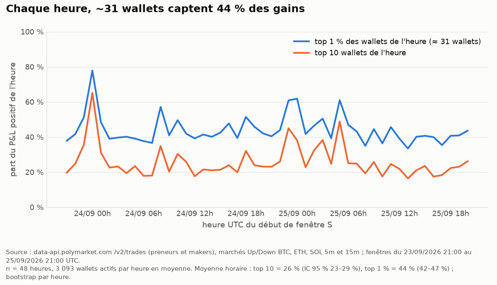
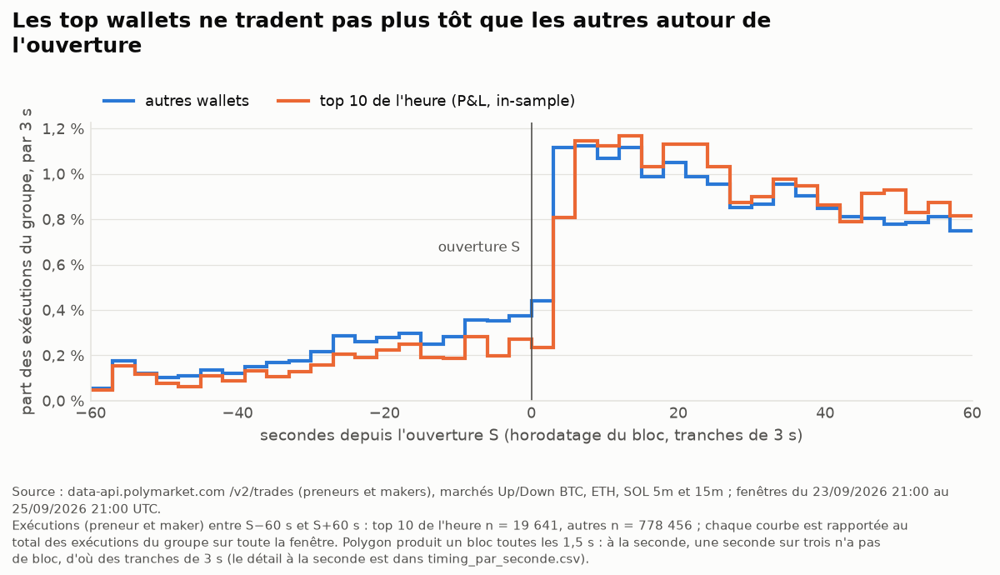
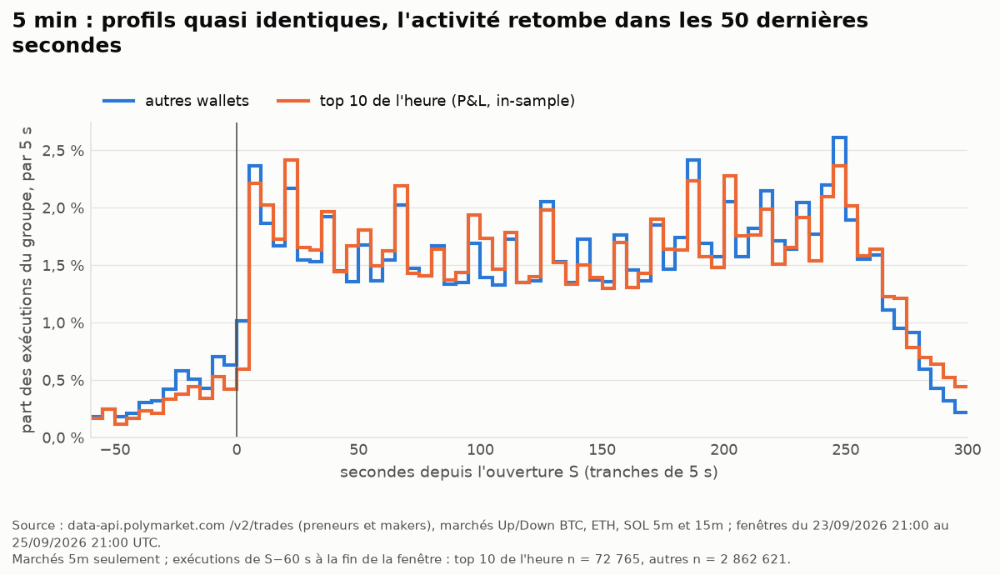
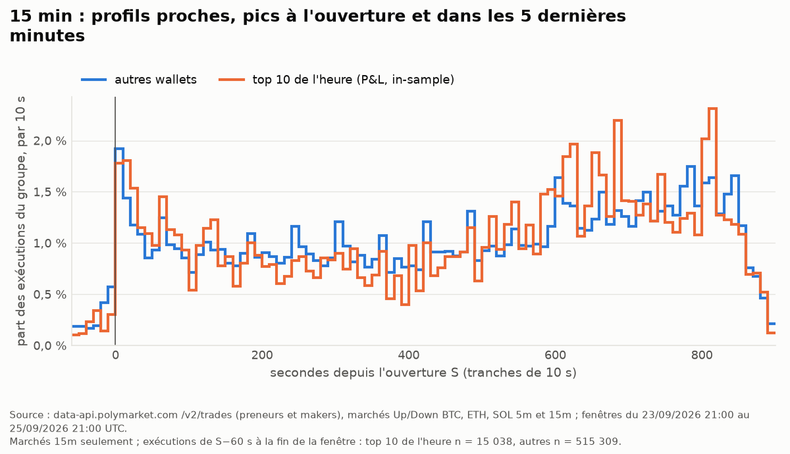
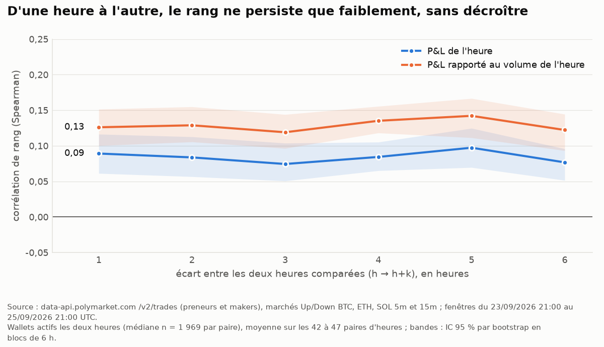
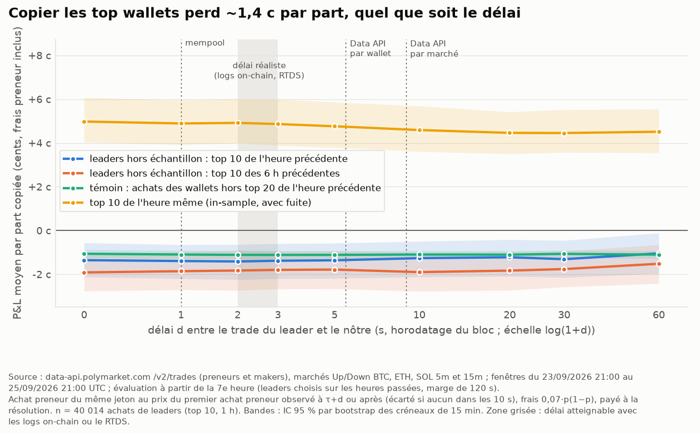
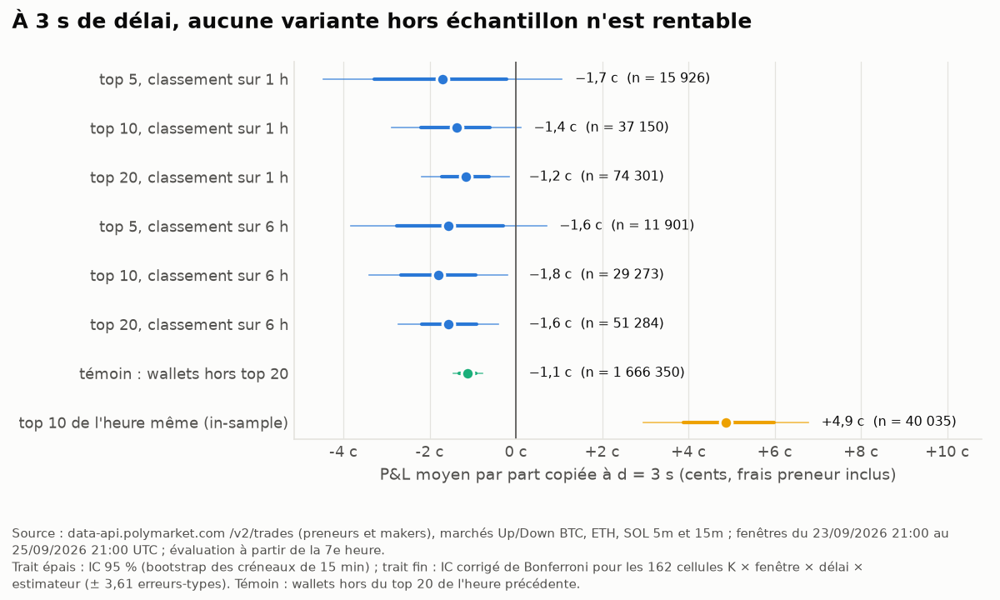
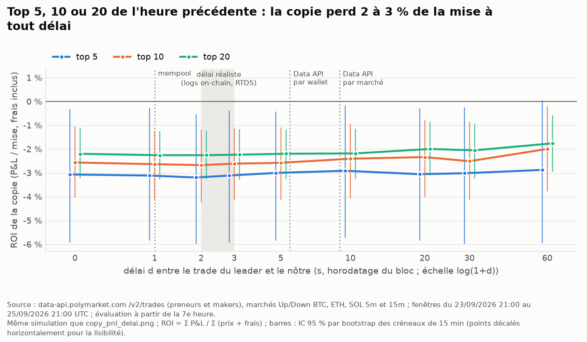
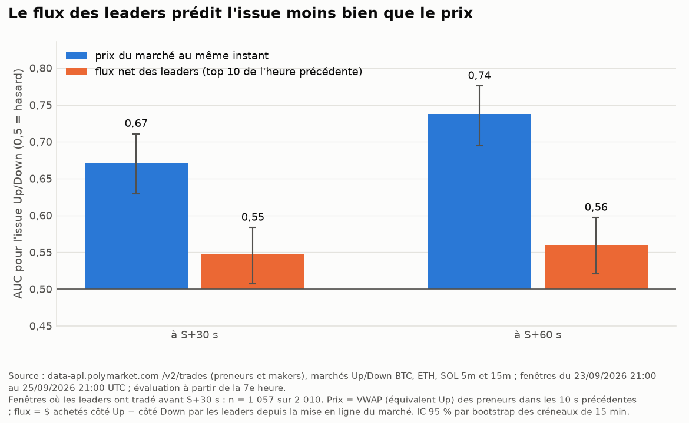

# Top wallets par fenêtre d'une heure : marchés Polymarket « Up or Down » (BTC, ETH, SOL ; 5 et 15 min)

*Analyse du 25/09/2026, produite par `scripts/polymarket_top_wallets.py` (environ 2 min ; les données viennent du cache local, rien n'est retéléchargé quand il couvre la période). Elle porte sur les fenêtres qui commencent entre le 23/09/2026 21:00 et le 25/09/2026 21:00 UTC : 48 heures, 2 304 marchés résolus, 3 535 580 exécutions (1 260 192 côté preneur, 2 275 388 côté maker) et 13 129 wallets. Les données ont été collectées par `tradebot.polymarket_wallets` (`collect_trades`, cache `data/cache/polymarket/wallets/`).*

> Il s'agit d'une lecture seule de données publiques et d'une simulation papier : aucun ordre n'est passé, aucune clé n'est utilisée. Ce rapport est interne. Il ne contient que des statistiques agrégées et ne publie aucune cote (voir `docs/research/polymarket.md`, § 4).

## Résumé

* **On peut récupérer les trades à la seconde, avec le wallet.** `data-api /v2/trades` fournit chaque exécution avec son wallet, le rôle preneur/maker (qu'on reconstitue) et l'horodatage du bloc Polygon, à la seconde. La vraie résolution est celle du bloc, soit **1,5 s** : une seconde sur trois ne porte aucun bloc. La colonne `seq` donne l'ordre on-chain à l'intérieur d'une seconde. En temps réel, les logs on-chain (WSS) ou le RTDS signalent un trade ≈ 2 s après l'appariement. La Data API met 3 s (requête par wallet) à 6,5 s (requête par marché) après le bloc, à condition d'ajouter un paramètre anti-cache.
* **Les gains d'une heure sont concentrés.** En moyenne, le top 10 de l'heure capte **26 %** du P&L positif (IC 95 % : 23–29 %, n = 48 heures) et le top 1 %, soit environ 31 wallets, en capte **44 %** (42–47 %). Les top 10 ne pèsent pourtant que 7 % du volume. Sur 48 h, le P&L total vaut exactement −369 k$, c'est-à-dire l'opposé des frais preneur. Seuls **37 %** des wallets sont gagnants sur 48 h, contre 55 % sur une heure prise isolément.
* **Les top wallets ne tradent pas à des moments particuliers.** Autour de l'ouverture S et jusqu'à la fin de la fenêtre, ils ont le même profil de timing que les autres wallets ; ils sont même un peu moins présents avant S. Seule nuance : leurs ordres preneur sont un peu plus concentrés entre S+5 s et S+40 s (14 % contre 12 %). Ce qui les distingue, c'est la taille : 3,1 k$ de volume médian par heure contre 20 $, 10 marchés par heure contre 3, et 95 % de leur volume sur BTC. Il y a de tout parmi eux : des robots makers présents dans 20 à 25 marchés par heure et de gros paris directionnels ponctuels.
* **Le classement d'une heure persiste à peine.** La corrélation de rang entre le P&L à h et à h+1 vaut **ρ = 0,09** (0,06–0,12). Elle reste la même jusqu'à h+12 : c'est la marque d'une différence stable entre types de wallets (makers contre preneurs), pas d'une « main chaude ». Seuls **14 %** du top 10 d'une heure y restent l'heure suivante. Leur P&L à h+1 vaut +69 $ en moyenne (IC −64 ; +249) et il n'est positif que dans **50 %** des cas, contre 54 % pour les autres wallets. Les 201 wallets passés par un top 10 horaire ont un P&L médian de **−686 $** hors de leurs « bonnes » heures.
* **Copier les leaders hors échantillon perd de l'argent, quel que soit le délai.** Cellule principale : top 10 de l'heure précédente, délai de 3 s. On perd **−1,38 c par part** (IC −2,20 ; −0,60), soit un ROI de **−2,6 %** (IC −4,2 ; −1,1), sur n = 37 150 copies. La courbe est plate de 0 à 60 s : il n'y a aucune information à perdre en attendant. Sur ces mêmes achats, les leaders eux-mêmes gagnent **+0,04 c** (IC −0,74 ; +0,85). Avant frais, la copie est à l'équilibre (−0,15 c) : la perte correspond aux frais preneur (≈ 1,2 c par part).
* **Les 54 variantes hors échantillon perdent toutes**, soit K = 5/10/20 × fenêtre de 1 h ou 6 h × 9 délais : le P&L va de −0,9 à −1,9 c par part. Aucune ne fait mieux que le témoin « copier les wallets hors du top 20 de l'heure précédente » (−1,1 c). À l'inverse, le top 10 **in-sample** de l'heure courante affiche +4,9 c : c'est l'effet de la fuite d'information quand on choisit les leaders après coup.
* **Le flux d'ordres des leaders prédit l'issue moins bien que le prix.** À S+30 s, l'AUC du flux vaut **0,55** (0,51–0,58), contre **0,67** (0,63–0,71) pour le prix du marché au même instant, sur n = 1 057 fenêtres. Ajouter le flux au prix n'améliore pas le Brier (Δ = +0,0001, IC −0,0003 ; +0,0005). Quand le flux et le prix divergent, c'est le flux qui a raison dans seulement **39 %** des cas (35–44 %). À S+60 s, le résultat est le même.
* **Le leaderboard officiel « crypto » (jour) mesure autre chose.** Ses 3 premiers wallets n'ont aucun trade sur nos marchés 5m/15m. Sur son top 100, 40 wallets y tradent et 23 figurent dans notre top 100 sur 24 h. Pour quelques wallets présents dans les deux classements, les montants sont proches (« suntori » : 8 490 $ au leaderboard, 8 502 $ chez nous), mais les périmètres diffèrent et cette concordance est en partie fortuite ; la validation du P&L repose sur `/v2/activity` (§ 1).

**Conclusion pour le bot.** Sur une heure, le classement des wallets reflète surtout la chance. Copier les meilleurs revient à payer les frais preneur sans rien récupérer en information. Il n'y a pas de stratégie « copy-trading » à retenir pour la simulation papier. Le seul avantage durable observé est celui des makers (spread capté, plus la remise maker), qui n'est accessible qu'en fournissant la liquidité.

---

## 1. Données et méthode

| élément | choix |
|---|---|
| Exécutions | `data-api /v2/trades`, avec `taker_only=false` puis `true`. Le rôle preneur ou maker s'obtient par jointure (voir le rapport du module). Horodatage `ts` : bloc Polygon, à la seconde. `t_rel_s` = `ts − S`, où S est l'ouverture de la fenêtre. |
| P&L | `wallet_market_pnl` : positions signées, frais `0,07·p(1−p)` par part pour le preneur seulement, paiement à la résolution. Le calcul est exact, y compris pour les market makers (SPLIT/MERGE implicites), et a été recoupé avec `/v2/activity` sur 16 wallets. Les **remises maker sont estimées à part** (`rebate_est`). Elles n'entrent **pas** dans les classements, qui portent sur le P&L hors remises. |
| « Heure h » | Heure UTC du début S de la fenêtre (`hourly_wallet_table`). Tous les marchés qui commencent dans l'heure h sont terminés au plus tard à h+1:00. |
| Leaders hors échantillon | Pour une décision prise à l'instant t, on pose `H = floor_heure(t − 120 s)`. Les leaders sont le top K par P&L cumulé sur les marchés qui commencent dans `[H − L, H)`, avec L = 1 h ou 6 h. Tous ces marchés étaient clos et résolus au moins 120 s avant la décision. **L'heure courante n'est jamais utilisée.** |
| Période d'évaluation (Q4, Q5) | À partir de la 7e heure (24/09 03:00 UTC), pour que L = 1 h et L = 6 h portent sur les mêmes trades, soit 42 heures et environ 167 créneaux de 15 min. |
| Intervalles de confiance | Bootstrap (2 000 tirages) **par créneau de 15 min** pour les trades et les fenêtres, parce que les marchés 5m/15m et BTC/ETH/SOL d'un même créneau sont corrélés. Bootstrap **par heure** pour les statistiques horaires, et **par blocs de 6 h** pour les corrélations entre heures qui se chevauchent. |
| Tests multiples | Copy-trading : 6 couples (K, fenêtre) × 9 délais × 3 estimateurs de prix (`first`, `vwap`, `best`), soit **162 cellules**. On donne aussi l'IC corrigé de Bonferroni (± 3,61 erreurs-types). Les découpages par sous-groupe (`copy_trading_detail_top10_1h.csv`) ne sont pas corrigés et restent descriptifs. Signal de flux : 3 K × 2 fenêtres × 2 instants, soit 12 cellules. La **cellule principale a été fixée avant de voir les résultats** : K = 10, fenêtre de 1 h, d = 3 s, estimateur « premier trade ». |

## 2. Récupérer les trades « à la seconde » : ce que permettent les API

Réponse à la demande « regarde si tu peux récupérer à la seconde via une API » : **oui, pour l'historique comme pour le temps réel**. Les chiffres de latence viennent de `docs/research/polymarket_temps_reel.md`.

| source | wallet ? | horodatage | on apprend le trade… | délai de copie d équivalent* |
|---|---|---|---|---|
| `data-api /v2/trades?condition=…` (historique, jusqu'à 20 marchés par requête, pages de 1 000) | oui (`proxy_wallet`) | bloc, à la seconde ; ordre on-chain via le curseur (`seq`) | 5,8 à 6,7 s après le bloc en médiane (p90 ≈ 9 s), **avec** un paramètre anti-cache `&_=<ns>` | ≈ 9 s |
| `data-api /v2/trades?user=W` (une adresse par requête) | oui | idem | 2,4 à 3,3 s après le bloc | ≈ 5–6 s |
| Logs `OrderFilled` (`eth_subscribe logs`, nœud public publicnode) | oui (topic maker) | bloc | ≈ 2,2 s après l'appariement, au moment de l'horodatage du bloc | **≈ 2–3 s** |
| RTDS `wss://ws-live-data.polymarket.com`, topic `activity` | oui (+ pseudo) | ms | 1,9 à 2,1 s après l'appariement (PING toutes les 5 s obligatoire) | **≈ 2–3 s** |
| Mempool (`newPendingTransactions`, décodage de `matchOrders`) | oui | — | 0,65 s après l'appariement (92 % des trades) | ≈ 1 s |
| WebSocket CLOB `ws/market` | **non** (hash de tx seulement) | ms | 0,1 s | — |

\* *Le délai d est l'écart entre l'horodatage de bloc du trade du leader et celui du nôtre. Les deux trades entrent dans un bloc environ 2,2 s après leur appariement. On a donc d ≈ (temps pour apprendre le trade, compté depuis l'appariement du leader) + ≈ 0,3 s (envoi de l'ordre et délai preneur de 150 ms).*

**Point de vigilance sur la « seconde ».** Polygon produit un bloc toutes les 1,5 s, et la phase de cette cadence est stable sur plusieurs heures. Relativement à S, une seconde sur trois ne porte donc presque aucune exécution (`timing_par_seconde.csv`, groupe « autres », de S−60 s à S+60 s : 337 k, 62 k et 379 k exécutions selon `t_rel_s mod 3`). Un histogramme à la seconde montre surtout cette cadence. Les graphiques ci-dessous regroupent donc les secondes par tranches de 3 s, qui contiennent chacune deux blocs.

## 3. Qui gagne ? (question 1)

### 3.1 Concentration du P&L par heure



| mesure (n = 48 heures) | moyenne (IC 95 %) | médiane | min–max |
|---|---|---|---|
| part du P&L positif captée par le top 10 | 25,9 % (23,5–28,6 %) | 23,3 % | 16 %–65 % |
| part captée par le top 1 % (≈ 31 wallets) | 44,2 % (42,0–46,7 %) | 41,5 % | 33 %–78 % |
| part du **volume** du top 10 (par P&L) | 7,3 % (6,6–8,0 %) | 6,8 % | 3 %–15 % |
| part de wallets gagnants dans l'heure | 54,6 % | — | — |

Sur l'ensemble des 48 h, le top 10 capte 23,0 % du P&L positif et le top 1 % (132 wallets) 60,9 %. La somme des P&L vaut −368 980 $, soit exactement l'opposé des frais preneur (368 980 $) : c'est un jeu à somme nulle, auquel s'ajoutent environ 73,8 k$ de remises maker estimées. Seuls 36,7 % des wallets sont gagnants sur 48 h.

### 3.2 Top 20 par heure (P&L et volume)

Les tableaux complets sont dans `top20_par_heure_pnl.csv` et `top20_par_heure_volume.csv` (48 × 20 lignes, avec wallet, nom, P&L, remises estimées, volume, nombre de marchés, taux de réussite, part preneur, timing et actifs).

* Le top 20 horaire par P&L réunit **337 wallets distincts** sur 48 heures ; le top 10, **201**. Un même wallet apparaît au plus 11 fois (sur 48) dans le top 10, et 109 wallets n'y apparaissent qu'une fois.
* Un top 10 horaire gagne en médiane 740 $ sur l'heure (min 286 $, max 37 377 $), avec 10 marchés et 3,1 k$ de volume. Sa première exécution arrive en médiane à S+42 s (médiane, sur les wallet-heures, de la médiane par marché).
* Le top 20 par **volume** est plus stable (138 wallets distincts). Il ne recoupe le top 20 par P&L que pour 4 wallets par heure en moyenne. Son P&L horaire médian est de +37 $, positif 56 % du temps.

Les wallets les plus souvent dans le top 10 horaire (`top10_horaire_frequence.csv`) perdent en général ailleurs :

| wallet | nom | heures dans le top 10 | P&L de ces heures ($) | P&L des autres heures ($) | P&L 48 h ($) | part preneur |
|---|---|---|---|---|---|---|
| `0x32ed…8ec3` | mo-money | 11 / 48 | 8 860 | −2 681 | 6 179 | 12 % |
| `0xc2ad…40ed` | bosona | 11 / 48 | 8 845 | −5 224 | 3 621 | 11 % |
| `0xf332…b1c0` | — | 10 / 48 | 5 717 | −3 186 | 2 530 | 0 % |
| `0x8ac8…47ab` | Oussou931 | 10 / 31 | 14 876 | −13 384 | 1 492 | 100 % |
| `0xa827…f959` | JeroHJ | 10 / 22 | 13 577 | −18 716 | −5 139 | 100 % |
| `0x3725…ad88` | almach | 9 / 48 | 8 342 | −264 | 8 078 | 12 % |
| `0x502b…3b15` | — | 9 / 46 | 6 296 | −122 | 6 174 | 13 % |
| `0xe907…cff6` | suntori | 9 / 48 | 24 903 | −25 694 | −791 | 99 % |
| `0xb55f…64d4` | — | 9 / 46 | 9 401 | −13 687 | −4 286 | 98 % |
| `0x280e…fbd8` | — | 8 / 48 | 5 515 | −4 592 | 923 | 0 % |

Sur les 201 wallets passés par un top 10 horaire, 65 % sont gagnants sur 48 h. Leur P&L hors des heures de top 10 est négatif en médiane (−686 $). Les wallets qui restent gagnants sur la durée sont des **makers** : part preneur de 0 à 13 %, avec des remises en plus.

### 3.3 Top 20 sur 48 h

| # | wallet | nom | P&L 48 h ($) | dont remises est.* | volume ($) | marchés | h actives | h dans le top 10 | part preneur | profil |
|---|---|---|---|---|---|---|---|---|---|---|
| 1 | `0x074a…f0e0` | ox123bs | 39 206 | 114 | 47 025 | 15 | 5 | 3 | 68 % | mixte |
| 2 | `0x5b63…11a4` | neutralwave23 | 38 630 | 191 | 71 408 | 823 | 48 | 3 | 71 % | mixte (robot probable) |
| 3 | `0x0357…a7d7` | FennMeazell4035 | 9 950 | 32 | 9 042 | 6 | 3 | 1 | 55 % | mixte |
| 4 | `0x66b5…0c9e` | DambraVictoria | 9 331 | 35 | 12 739 | 8 | 3 | 3 | 42 % | mixte |
| 5 | `0x3725…ad88` | almach | 8 078 | 705 | 149 435 | 940 | 48 | 9 | 12 % | maker (robot probable) |
| 6 | `0x6407…93aa` | smash-to-net | 7 696 | 3 | 79 560 | 21 | 6 | 5 | 99 % | preneur |
| 7 | `0xae39…ff04` | alwayslaugh | 7 505 | 50 | 29 806 | 69 | 21 | 2 | 75 % | mixte |
| 8 | `0x32ed…8ec3` | mo-money | 6 179 | 758 | 158 904 | 970 | 48 | 11 | 12 % | maker (robot probable) |
| 9 | `0x502b…3b15` | — | 6 174 | 440 | 136 112 | 1 135 | 46 | 9 | 13 % | maker (robot probable) |
| 10 | `0x3663…8950` | Nikos888 | 5 610 | 1 | 18 291 | 27 | 7 | 2 | 100 % | preneur |
| 11 | `0x48ac…4a7e` | BoneOhio | 5 096 | 43 | 763 316 | 631 | 48 | 3 | 64 % | mixte (robot probable) |
| 12 | `0x9417…6e5e` | — | 4 724 | 605 | 125 249 | 485 | 48 | 4 | 0 % | maker |
| 13 | `0x3708…daf9` | — | 4 702 | 509 | 107 447 | 492 | 48 | 6 | 0 % | maker |
| 14 | `0x22a6…b5cc` | rwpo | 4 442 | 9 | 10 965 | 46 | 24 | 3 | 88 % | preneur |
| 15 | `0x0ca4…77a6` | GoodFallen | 4 082 | 137 | 159 987 | 555 | 48 | 3 | 86 % | preneur |
| 16 | `0xaae2…2383` | 120x | 4 052 | 5 | 8 046 | 19 | 5 | 2 | 81 % | preneur |
| 17 | `0xa823…6215` | mihaXd | 3 926 | 28 | 22 528 | 135 | 33 | 1 | 81 % | preneur |
| 18 | `0xd5b3…b230` | — | 3 788 | 0 | 56 352 | 34 | 12 | 5 | 100 % | preneur |
| 19 | `0xa665…01e3` | MikeAddon | 3 784 | 13 | 19 272 | 71 | 33 | 2 | 68 % | mixte |
| 20 | `0x0c7c…e4cb` | OhioRiskManagement | 3 736 | 0 | 121 195 | 1 713 | 48 | 2 | 100 % | preneur (robot probable) |

\* *Colonne « dont remises est. » : montant de la remise maker estimée, qui **n'est pas** inclus dans la colonne P&L.* *« Robot probable » : au moins 12 marchés par heure active et au moins 24 heures actives sur 48.* Les deux premiers doivent l'essentiel de leurs 39 k$ à quelques gros paris directionnels (le n° 1 n'a joué que 15 marchés en 5 heures). Détail complet : `top20_48h_profil.csv`.

### 3.4 Recoupement avec le leaderboard officiel « crypto », classement du jour

Instantané pris le 25/09 à 22:00 UTC, à comparer avec notre P&L des 24 dernières heures (fenêtres commençant entre le 24/09 21:00 et le 25/09 21:00). Les deux périodes sont décalées d'environ 1 h. Voir `leaderboard_recoupement.csv` et `leaderboard_detail_top50.csv`.

| classement officiel | top N officiel | présents dans nos trades 5m/15m | dans notre top 20 / 50 / 100 | passés par un top 10 horaire (24 h) | Spearman (présents) |
|---|---|---|---|---|---|
| jour, P&L | 20 | 6 | 3 / 4 / 4 | 5 | 0,20 |
| jour, P&L | 100 | 40 | 7 / 14 / 23 | 25 | 0,45 |
| jour, volume | 20 | 14 | 13 / 13 / 13 (par volume) | 11 | 0,34 |
| jour, volume | 100 | 85 | 20 / 46 / 70 (par volume) | 46 | 0,68 |

Le leaderboard « crypto » couvre tous les marchés crypto : horaires, journaliers, seuils de prix, etc. Ses 3 premiers wallets du jour (30,3 k$, 26,9 k$ et 9,8 k$) n'ont aucune exécution sur nos 5m/15m, et plusieurs affichent un volume nul : leur P&L vient de positions réglées ailleurs. Pour les wallets présents, nos marchés représentent en médiane 71 % de leur P&L officiel et 54 % de leur volume officiel. Pour quelques wallets, les montants sont proches : « suntori » affiche 8 490 $ au leaderboard et 8 502 $ dans nos données ; `0x3708…daf9`, 3 978 $ contre 3 386 $ hors remises. Ce n'est pas une validation : nos marchés ne représentent que 43 % du volume officiel de « suntori », et les deux périodes sont décalées d'une heure, donc la quasi-égalité est en partie fortuite. La validation du calcul du P&L est le recoupement avec `/v2/activity` (§ 1 et § 8).

## 4. Profil des top wallets (question 2 ; descriptif, in-sample)

Groupe « top 10 de l'heure » : les 480 couples (heure, wallet) classés 1 à 10 par P&L de l'heure, comparés à tous les autres couples. Ce classement se fait **in-sample** : il ne sert qu'à décrire. Les questions 3 à 5 utilisent des leaders choisis hors échantillon.







| (`profil_top10_vs_autres.csv`) | top 10 de l'heure | autres |
|---|---|---|
| couples (heure, wallet) / wallets distincts / exécutions | 480 / 201 / 89 197 | 147 996 / 13 121 / 3 446 383 |
| P&L par wallet-heure : moyenne / médiane | +1 219 $ / +740 $ | −6,4 $ / +0,15 $ |
| volume par wallet-heure (médiane) | 3 119 $ | 20 $ |
| marchés par wallet-heure (médiane) ; part ≥ 25 marchés | 10 ; 7,7 % | 3 ; 1,6 % |
| exécutions par wallet-heure (médiane) | 79 | 5 |
| part preneur du volume | 68 % | 51 % |
| wallet-heures surtout maker (< 20 % preneur) / surtout preneur (> 80 %) | 33 % / 50 % | 24 % / 66 % |
| taille médiane d'une exécution | 6,30 $ (15,9 parts) | 3,29 $ (6,9 parts) |
| prix d'achat : moyenne pondérée / médiane | 0,676 / 0,49 | 0,723 / 0,50 |
| part du volume acheté à ≥ 0,90 / entre 0,40 et 0,60 | 25 % / 26 % | 37 % / 23 % |
| exécutions avant S / dans [S, S+10 s) / dans [S, S+60 s) / dernière minute | 4,5 % / 2,6 % / 18,5 % / 13,6 % | 6,0 % / 3,2 % / 18,0 % / 13,2 % |
| exécutions **preneur** dans [S+5 s, S+40 s) : tous marchés / BTC 5m | 14,3 % / 16,3 % | 11,6 % / 12,7 % |
| `t_rel` médian : 5m / 15m | 135 s / 516 s | 137 s / 482 s |
| volume BTC / ETH / SOL ; part du 5m | 95 % / 4 % / 1 % ; 83 % | 89 % / 8 % / 3 % ; 84 % |
| frais / volume | 1,38 % | 0,93 % |

Lecture :

* **Timing.** Les deux groupes suivent la même courbe : une activité faible avant S, un saut dès le premier bloc après S, un plateau, un dernier pic vers S+250 s sur le 5m puis une retombée dans les 50 dernières secondes. Sur le 15m, l'activité est maximale à l'ouverture et dans les 5 dernières minutes. Les top wallets sont **moins** présents avant S (4,5 % contre 6,0 %) et un peu plus tardifs dans les 3 premières secondes. Ils ne gagnent donc pas en arrivant les premiers. Seule nuance : en ne gardant que leurs exécutions **preneur**, les top wallets en placent un peu plus entre S+5 s et S+40 s (14 % contre 12 % ; sur BTC 5m, 16 % contre 13 %). C'est ce qu'avait montré le premier aperçu sur une heure (`reports/polymarket/premieres_courbes/4_timing_top_wallets_derniere_heure.png`, preneurs seulement). L'écart reste modeste, il est mesuré in-sample et sans IC (les exécutions d'un même wallet ne sont pas indépendantes), et la copie des leaders dans la première minute ne fait pas mieux que le reste (§ 6).
* **Prix.** Ils achètent moins de parts presque certaines (≥ 0,90) et davantage autour de 0,50, là où le résultat est encore incertain. C'est cohérent avec des gains qui viennent surtout de la variance.
* **Effet de sélection.** Classer sur le P&L en dollars favorise mécaniquement les gros volumes : à rendement égal, un wallet qui engage 3 k$ dans l'heure a une dispersion de P&L bien plus grande qu'un wallet à 20 $. L'écart de taille entre les deux groupes est donc en partie produit par le classement lui-même.
* **Robots.** 7,7 % des wallet-heures du top 10 touchent au moins 25 des 48 marchés de l'heure, contre 1,6 % pour les autres (`marches_par_heure.csv`). Sur 48 h, 6 des 20 meilleurs wallets ont un profil de robot : présents 46 à 48 heures sur 48, dans 13 à 36 marchés par heure. Les autres sont des preneurs directionnels présents quelques heures seulement.

## 5. Persistance (question 3)



| écart k (heures) | paires d'heures | wallets actifs les deux heures (médiane) | Spearman du P&L (IC 95 %) | Spearman du P&L / volume (IC 95 %) |
|---|---|---|---|---|
| 1 | 47 | 2 246 | 0,089 (0,061–0,116) | 0,126 (0,100–0,152) |
| 2 | 46 | 2 094 | 0,084 (0,057–0,113) | 0,129 (0,106–0,155) |
| 3 | 45 | 2 003 | 0,074 (0,051–0,104) | 0,119 (0,096–0,144) |
| 4 | 44 | 1 936 | 0,084 (0,065–0,105) | 0,135 (0,118–0,156) |
| 5 | 43 | 1 902 | 0,097 (0,070–0,125) | 0,142 (0,111–0,167) |
| 6 | 42 | 1 862 | 0,077 (0,052–0,096) | 0,122 (0,093–0,144) |
| 12 | 36 | 1 704 | 0,082 (0,063–0,101) | 0,129 (0,105–0,147) |

La corrélation est faible, positive (91 % des paires d'heures à k = 1) et **ne décroît pas** avec l'écart. Elle vient d'une hétérogénéité stable entre wallets, et non d'une série de bonnes heures : les makers gagnent un peu à chaque heure, les petits preneurs perdent les frais à chaque heure. On le voit en regardant le top 10 (`persistance_top10.csv`, IC par bootstrap sur les heures) :

| | top 10 de l'heure h | autres wallets actifs à h |
|---|---|---|
| encore actifs à h+1 | 85,5 % (81,9–89,2) | 72,6 % (71,9–73,3) |
| encore dans le top 10 à h+1 | **13,8 %** (10,9–16,8) | 0,2 % |
| P&L moyen à h+1 (s'ils sont actifs) | +69 $ (−64 ; +249) | −3,0 $ (−4,2 ; −2,0) |
| part gagnante à h+1 | **50,5 %** (45,2–55,6) | 53,9 % (52,9–54,8) |
| P&L / volume à h+1 | +1,4 % (−1,4 ; +4,8) | −1,0 % (−1,4 ; −0,7) |
| P&L moyen à h+2 ; à h+6 | −84 $ (−187 ; +30) ; −41 $ (−131 ; +50) | −2,1 $ ; −1,4 $ |

## 6. Copy-trading hors échantillon (question 4)

**Simulation.** On prend chaque exécution **acheteuse** d'un leader (maker ou preneur) à l'instant τ, horodatage du bloc. Les exécutions d'un même wallet sur un même jeton dans la même seconde sont regroupées en un seul événement. On achète alors le même jeton en preneur à τ+d, pour d ∈ {0, 1, 2, 3, 5, 10, 20, 30, 60} s. Le prix vient de la bande des achats preneur du même jeton, selon trois estimateurs :
* `first` (principal) : prix du premier achat preneur à τ+d ou après. Pour d = 0, on prend le premier strictement postérieur, dans l'ordre on-chain, aux exécutions du leader.
* `vwap` : VWAP des achats preneur sur [τ+d, τ+d+2 s].
* `best` : meilleur niveau maker de cette transaction, c'est-à-dire le prix qu'aurait obtenu un petit acheteur.

Si aucun achat preneur n'a lieu dans les 10 s, l'événement est écarté et compté : 6,5 % des événements à d = 0, 7,2 % à 3 s, 10 % à 10 s et 26 % à 60 s, surtout en fin de fenêtre. On applique les frais `0,07·p(1−p)` par part et on encaisse le paiement à la résolution. Tout est dans `copy_trading.csv` : 8 groupes × 9 délais × 3 estimateurs.



Cellule principale, top 10 de l'heure précédente (143 wallets leaders distincts sur 42 heures, estimateur `first`) :

| d (s) | copies | prix moyen | taux de gain | P&L brut (avant frais) | frais | **P&L net par part (IC 95 %)** | ROI (IC 95 %) | P&L des leaders sur ces achats (IC 95 %) |
|---|---|---|---|---|---|---|---|---|
| 0 | 37 429 | 0,516 | 51,5 % | −0,11 c | 1,24 c | **−1,35 c** (−2,12 ; −0,56) | −2,6 % (−4,0 ; −1,1) | −0,02 c (−0,81 ; +0,77) |
| 1 | 37 294 | 0,516 | 51,5 % | −0,15 c | 1,24 c | −1,39 c (−2,20 ; −0,65) | −2,6 % | 0,00 c |
| 2 | 37 297 | 0,516 | 51,4 % | −0,18 c | 1,23 c | −1,41 c (−2,24 ; −0,64) | −2,7 % | 0,00 c |
| **3** | **37 150** | 0,516 | 51,5 % | −0,15 c | 1,23 c | **−1,38 c** (−2,20 ; −0,60) | **−2,6 %** (−4,2 ; −1,1) | +0,04 c (−0,74 ; +0,85) |
| 5 | 36 815 | 0,516 | 51,4 % | −0,14 c | 1,22 c | −1,36 c (−2,19 ; −0,58) | −2,6 % | +0,05 c |
| 10 | 35 964 | 0,513 | 51,3 % | −0,07 c | 1,19 c | −1,26 c (−2,12 ; −0,49) | −2,4 % | +0,06 c |
| 20 | 34 955 | 0,511 | 51,0 % | −0,07 c | 1,16 c | −1,22 c (−2,09 ; −0,41) | −2,3 % | +0,02 c |
| 30 | 33 600 | 0,511 | 50,9 % | −0,18 c | 1,13 c | −1,31 c (−2,14 ; −0,45) | −2,5 % | −0,23 c |
| 60 | 29 565 | 0,512 | 51,2 % | +0,01 c | 1,05 c | −1,04 c (−1,96 ; −0,12) | −2,0 % (−3,8 ; −0,2) | −0,48 c |





À d = 3 s, estimateur `first` :

| leaders | copies | leaders distincts | P&L net par part (IC 95 %) | ROI (IC 95 %) | P&L des leaders sur ces achats |
|---|---|---|---|---|---|
| top 5, classement sur 1 h | 15 926 | 80 | −1,70 c (−3,28 ; −0,21) | −3,1 % (−5,9 ; −0,4) | −0,48 c (−2,04 ; +1,01) |
| top 10, classement sur 1 h | 37 150 | 143 | −1,38 c (−2,20 ; −0,60) | −2,6 % (−4,2 ; −1,1) | +0,04 c (−0,74 ; +0,85) |
| top 20, classement sur 1 h | 74 301 | 238 | −1,17 c (−1,72 ; −0,61) | −2,2 % (−3,3 ; −1,2) | +0,35 c (−0,19 ; +0,91) |
| top 5, classement sur 6 h | 11 901 | 48 | −1,56 c (−2,77 ; −0,30) | −3,1 % (−5,5 ; −0,6) | −0,06 c (−1,38 ; +1,14) |
| top 10, classement sur 6 h | 29 273 | 78 | −1,80 c (−2,67 ; −0,94) | −3,5 % (−5,3 ; −1,8) | −0,28 c (−1,15 ; +0,64) |
| top 20, classement sur 6 h | 51 284 | 132 | −1,57 c (−2,19 ; −0,90) | −3,0 % (−4,2 ; −1,8) | +0,03 c (−0,59 ; +0,67) |
| témoin : wallets hors du top 20 de l'heure précédente | 1 666 350 | 12 058 | −1,11 c (−1,31 ; −0,94) | −2,1 % (−2,4 ; −1,7) | −0,23 c |
| *top 10 de l'heure même (in-sample, fuite)* | *40 035* | *180* | *+4,86 c (+3,88 ; +5,99)* | *+9,2 %* | *+6,42 c* |

Ce qu'il faut retenir :

* **Il n'y a pas de pente.** Si les leaders avaient de l'information, la copie devrait se dégrader avec le délai. La courbe reste plate de 0 à 60 s, parce qu'il n'y a pas d'information à perdre : les leaders choisis hors échantillon sont eux-mêmes à l'équilibre sur leurs achats. Le délai réaliste, d ≈ 2–3 s avec les logs on-chain ou le RTDS, ne change rien. La Data API (d ≈ 5 à 9 s) non plus.
* **La perte correspond aux frais.** Le taux de gain (51,5 %) égale le prix payé (0,516) : le marché est calibré pour ces achats. Ce qui reste, ce sont les 1,2 c de frais preneur par part. Le copieur paie aussi 0,6 à 0,7 c de plus que le leader (0,516 contre 0,509), parce que le leader achète souvent en maker au bid alors que le copieur paie l'ask. C'est pourquoi les leaders sont à l'équilibre et le copieur non.
* **Tests multiples.** Les 54 cellules hors échantillon de l'estimateur principal ont toutes un P&L négatif (de −0,87 à −1,91 c). 52 sur 54 ont un IC 95 % entièrement négatif, et 23 le restent après correction de Bonferroni sur les 162 cellules (54 × 3 estimateurs). La borne haute de l'IC 95 % la plus favorable vaut +0,6 c par part (top 5 sur 6 h, d = 60 s). Pour la cellule principale, la borne haute corrigée de Bonferroni vaut +0,11 c : un gain supérieur à ~0,1 c par part est exclu.
* **Sensibilités.** Avec l'estimateur `vwap` 2 s : −1,57 c (−2,39 ; −0,80). Avec `best` : −1,33 c (−2,16 ; −0,55). En pondérant par la taille du leader : −0,91 c (−2,82 ; +0,98). Par sous-groupe (`copy_trading_detail_top10_1h.csv`, d = 3 s) : BTC −1,49 c, ETH −0,91 c, SOL −0,71 c. Leader maker −1,58 c, leader preneur −1,10 c. Dans la première minute après S, −2,65 c (−4,97 ; −0,45) : c'est le point estimé le plus bas, mais son IC recouvre celui du milieu de fenêtre (−1,10 c ; −1,95 ; −0,18), et ce découpage n'est pas corrigé des tests multiples. On ne peut donc pas dire que la première minute coûte davantage. Avant S, +0,08 c (−5,07 ; +4,91), avec n = 1 519, un effectif trop faible pour conclure.
* **P&L réalisé par les leaders dans l'heure d'évaluation** (`copy_leaders_pnl_horaire.csv`, toute leur activité) : top 10 sur 1 h, −20 $ par leader-heure (−91 ; +48), soit un ROI de −0,4 % (−1,8 ; +0,9), contre −1,05 % pour les autres wallets. Top 10 sur 6 h : −107 $ (−212 ; −3), soit un ROI de −2,3 % (−4,6 ; 0,0). L'IC des leaders sur 6 h (−4,6 ; 0,0) recouvre le ROI des autres wallets (−1,0 %) : ils ne font pas mieux que la moyenne, mais on ne peut pas dire qu'ils font pire.

## 7. Le flux des leaders comme signal (question 5)

Pour chaque fenêtre, on calcule le flux net des leaders hors échantillon jusqu'à S+30 s ou S+60 s, depuis la mise en ligne du marché : dollars achetés côté Up, moins côté Down, ventes comptées en sens inverse, rôles maker et preneur confondus. On le compare au prix du marché au même instant, défini comme le VWAP (équivalent Up) des achats et ventes preneur des 10 s précédentes. Pour le Brier, on utilise des régressions logistiques en validation croisée par blocs de temps (6 blocs) : prix seul recalibré, puis prix + flux. Voir `flux_leaders_signal.csv` et `flux_leaders_par_fenetre_K10_1h.csv`.



| instant, leaders | fenêtres avec flux (sur 2 010) | justesse flux / prix | AUC flux (IC) | AUC prix (IC) | Brier prix / prix recalibré / prix + flux | Δ Brier (prix + flux − prix recalibré) | flux juste quand il contredit le prix |
|---|---|---|---|---|---|---|---|
| S+30 s, top 10 sur 1 h | 1 057 | 53,8 % / 63,6 % | 0,547 (0,507–0,583) | 0,671 (0,629–0,711) | 0,228 / 0,231 / 0,231 | +0,0001 (−0,0003 ; +0,0005) | 39 % (35–44 %), n = 475 |
| S+30 s, top 10 sur 6 h | 1 021 | 50,4 % / 63,7 % | 0,525 (0,485–0,566) | 0,689 (0,652–0,729) | 0,223 / 0,226 / 0,227 | +0,0006 (0,0000 ; +0,0012) | 36 % (32–41 %), n = 487 |
| S+60 s, top 10 sur 1 h | 1 138 | 54,5 % / 68,2 % | 0,559 (0,521–0,597) | 0,738 (0,695–0,776) | 0,208 / 0,212 / 0,212 | +0,0002 (−0,0001 ; +0,0006) | 33 % (29–38 %), n = 468 |
| S+60 s, top 10 sur 6 h | 1 119 | 50,2 % / 68,2 % | 0,527 (0,486–0,565) | 0,734 (0,698–0,768) | 0,210 / 0,213 / 0,213 | +0,0003 (−0,0008 ; +0,0015) | 30 % (27–34 %), n = 511 |

Le flux des leaders contient un peu d'information : son AUC dépasse 0,5 de justesse avec les leaders sur 1 h, et vaut 0,57 pour K = 20. Mais le prix contient déjà cette information, et bien davantage. Dans les 12 cellules (K × fenêtre × instant), la justesse du flux est inférieure de 9 à 18 points à celle du prix, avec des IC entièrement négatifs. Le Brier ne s'améliore jamais. Suivre le flux des top wallets contre le prix est perdant : quand les deux divergent, le prix a raison 6 à 7 fois sur 10. Note : le « prix recalibré » en validation croisée fait un peu moins bien que le prix brut, parce que ses coefficients sont estimés sur les autres blocs. La comparaison qui a du sens est celle entre prix + flux et prix recalibré.

Variante de contrôle (revue, non enregistrée dans les CSV) : en ne gardant que les exécutions **preneur** des leaders, pour écarter l'effet des makers qui achètent contre le flux informé, la conclusion ne change pas. À S+30 s, top 10 sur 1 h : AUC du flux 0,55 (0,51–0,60) contre 0,66 pour le prix, n = 726 fenêtres ; justesse 54,7 % contre 62,5 % ; ΔBrier ≈ 0 (−0,002 ; +0,001) ; flux juste dans 41 % des désaccords. Top 20 sur 1 h : AUC 0,58 contre 0,68. À S+60 s : 0,56 contre 0,73 (IC approximatifs, 200 tirages).

## 8. Limites

* **Durée.** L'échantillon ne couvre que 48 h, dont 42 h d'évaluation hors échantillon, dans un seul régime (TWAP 60 s, `crypto_fees_v2`). Les IC tiennent compte de la corrélation entre marchés d'un même créneau, pas d'éventuels changements de régime d'un jour à l'autre.
* **Prix de copie.** Il n'existe pas d'historique du carnet. Le prix de copie est estimé à partir des achats preneur observés ; l'estimateur `first` reprend le prix moyen d'un autre preneur, qui a pu balayer plusieurs niveaux. L'estimateur `best` corrige ce biais et donne le même résultat. La profondeur, la file d'attente et l'impact de notre propre ordre ne sont pas modélisés ; pour de grosses tailles, ils ne pourraient qu'aggraver la perte. Seuls les **achats** des leaders sont copiés, et seulement **en preneur** : la copie en maker n'est pas testée.
* **Granularité du délai.** Les horodatages de bloc font que d n'est connu qu'à environ ±1 s près (un bloc toutes les 1,5 s).
* **Remises et frais d'intégrateur.** Les remises maker, les récompenses de liquidité et les frais d'intégrateur ne sont pas dans les classements. Ces frais concernent environ 20 % des petits ordres preneur, pour 0,01 à 0,09 $ ; les ajouter ne ferait qu'aggraver la perte de la copie.
* **Leaderboard.** L'instantané est pris à 22:00 UTC, alors que nos fenêtres finissent à 21:00. La définition exacte du « jour » (glissant ou calendaire) n'est pas documentée.
* **Bord de période.** Pendant la dernière minute de la dernière heure, les trades d'avant-ouverture des marchés qui commencent à 21:00 ou plus tard ne sont pas dans la collecte. L'effet est négligeable.
* **Exécutions après la clôture.** 9 540 exécutions (0,3 %) ont lieu à E ou après, jusqu'à E+225 s : ce sont surtout des sorties à ≈ 0,99 sur un résultat déjà fixé par le TWAP60 à E. Elles sont comptées dans le P&L de l'heure de S. Seules 85 d'entre elles (52 k$ sur 38 M$) sont postérieures à E+120 s : le classement « hors échantillon » peut donc utiliser moins de 0,2 % d'exécutions pas encore publiques au moment de la décision. Aucun achat copié n'appartient lui-même à la fenêtre de classement (vérifié : 0 cas), et 52 des 40 014 achats copiés de la cellule principale ont lieu à E ou après.
* **Module utilisé.** Aucun bug bloquant n'a été rencontré dans `tradebot.polymarket_wallets`. Les tables (P&L, tables horaires) ont été recalculées par le script et sont identiques aux fichiers `derived/` (715 025 couples wallet-marché, écart maximal 0).

**Vérifications indépendantes (revue du 25/09/2026).**

* P&L recalculé à la main, par une boucle sur les exécutions brutes, pour le n° 1 sur 48 h (`0x074a…f0e0`, 15 marchés, 1 605 exécutions) : 39 206,33 $, identique au centime marché par marché. Le recoupement `/v2/activity` enregistré (16 wallets, 9 263 couples réglés, dont des market makers avec SPLIT/MERGE) donne un écart maximal de 0,0045 $. La somme des P&L vaut −368 979,84 $ pour 368 979,87 $ de frais preneur.
* Copy-trading recalculé avec un code distinct (classement refait depuis `wallet_market_pnl`, prix par `merge_asof` sur la bande des achats preneur) : d = 3 s, −1,380 c par part, n = 37 150 ; d = 5 s, −1,360 c, n = 36 815. Les chiffres du script sont retrouvés exactement.
* IC de la cellule principale (d = 3 s) selon le regroupement du bootstrap : créneaux de 15 min (−2,19 ; −0,62), heures (−2,10 ; −0,75), wallets leaders (−2,19 ; −0,68), blocs de 2 h (−2,14 ; −0,70). La conclusion ne dépend pas de ce choix.
* Cadence des blocs : entre deux secondes consécutives portant des exécutions, l'écart vaut 1 s (55 271 fois) ou 2 s (55 228 fois), soit un bloc toutes les 1,5 s. La seconde vide (modulo 3) a changé une fois au cours des 48 h.
* Frais : les 2 304 marchés sont en `crypto_fees_v2` (taux 0,07, exposant 1, TWAP 60 s).

## 9. Reproduire

```bash
.venv/bin/python scripts/polymarket_top_wallets.py            # période par défaut : 23/09 21:00 → 25/09 21:00 UTC
.venv/bin/python scripts/polymarket_top_wallets.py --start 2026-09-23T21:00Z --end 2026-09-25T21:00Z --boot 2000
```

Le script lit le cache de `tradebot.polymarket_wallets.collect_trades` ; si des marchés manquent, il les télécharge en lecture seule. Durée : environ 2 min (35 s de chargement et de calcul du P&L, 65 s pour la simulation de copie). Tous les tirages bootstrap ont une graine fixe, et deux exécutions successives donnent des fichiers identiques.

Fichiers : `concentration_par_heure.csv`, `top20_par_heure_pnl.csv`, `top20_par_heure_volume.csv`, `top10_horaire_frequence.csv`, `top20_48h_profil.csv`, `leaderboard_recoupement.csv`, `leaderboard_detail_top50.csv`, `profil_top10_vs_autres.csv`, `marches_par_heure.csv`, `timing_par_seconde.csv`, `timing_fenetre_5s.csv`, `persistance_spearman.csv`, `persistance_top10.csv`, `persistance_paires_heures.csv`, `copy_trading.csv`, `copy_trading_detail_top10_1h.csv`, `copy_leaders_pnl_horaire.csv`, `flux_leaders_signal.csv`, `flux_leaders_par_fenetre_K10_1h.csv`, ainsi que les 10 graphiques PNG ci-dessus.
