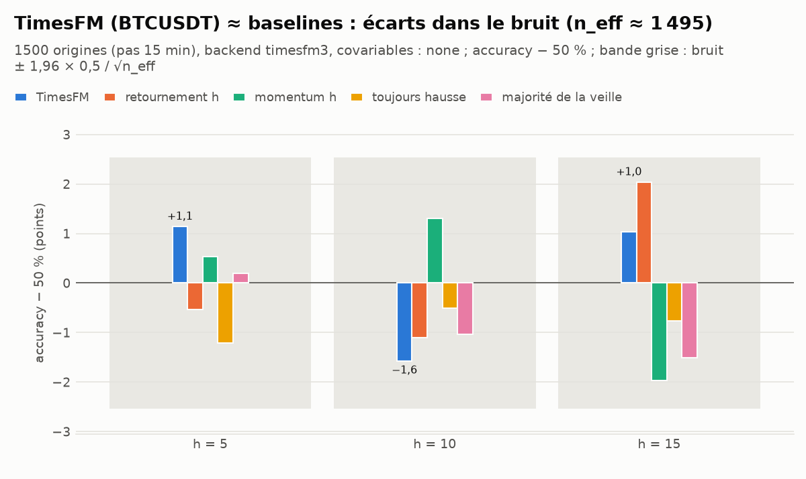
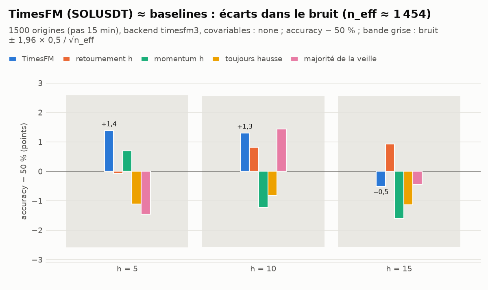
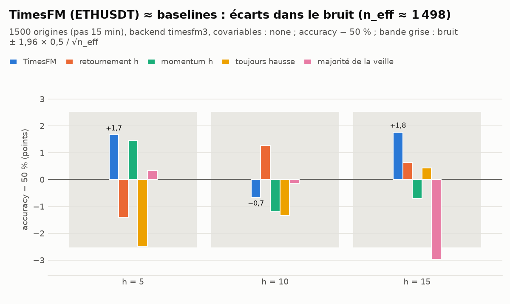
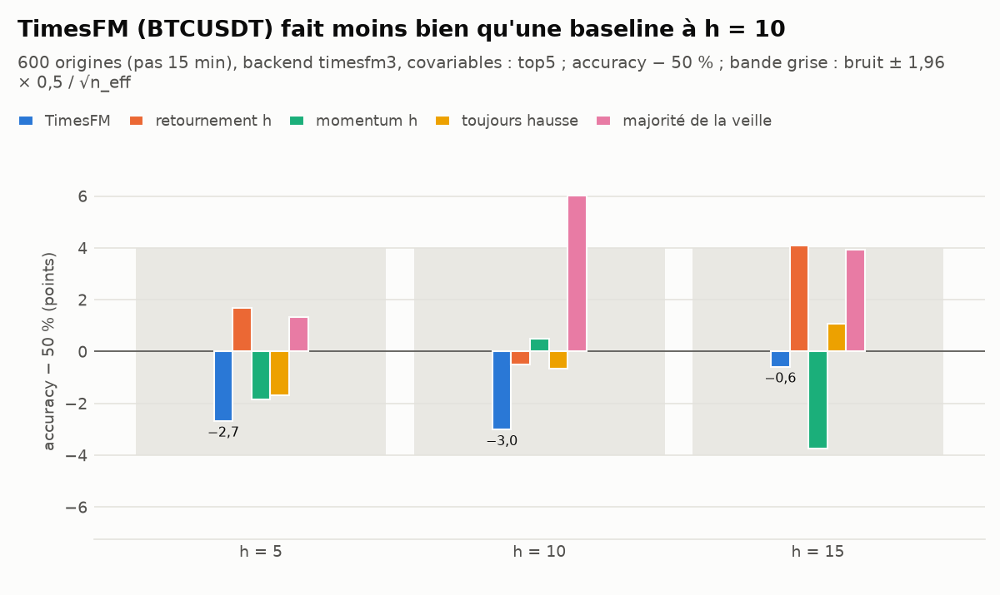
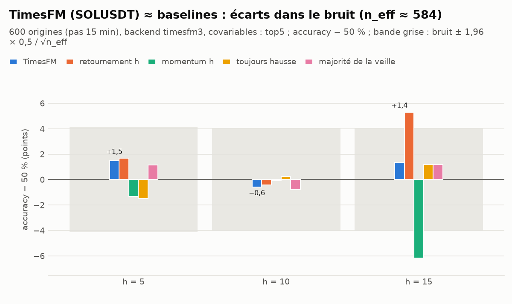
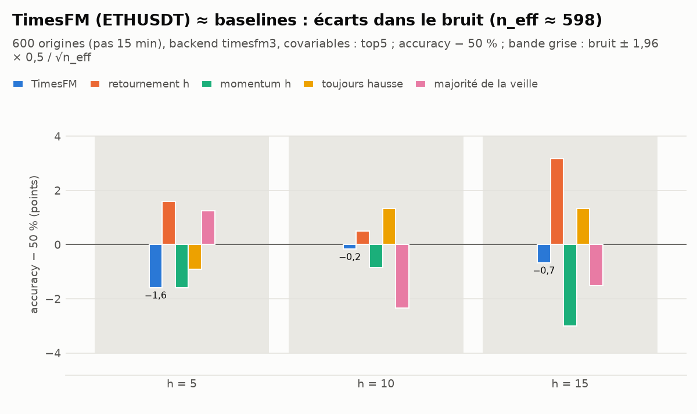

# Backtest TimesFM (zero-shot) contre baselines — direction à 5, 10 et 15 minutes

*Mis à jour le 2026-09-26 00:06 UTC ; 8 run(s). Chaque `python -m tradebot timesfm-backtest` ajoute ou remplace ses runs.*

> **Licence** : les poids de TimesFM 3.0 (`timesfm3`) sont sous licence non commerciale (`timesfm-non-commercial-license-v1.0`) : recherche uniquement, aucun trading réel. TimesFM 2.5 (`timesfm2p5`) est sous Apache-2.0.
>
> **Puissance** : quelques centaines d'origines ne permettent de détecter qu'une accuracy vraie de 57 % ou plus ; trois horizons testés = trois essais. Ne rien conclure d'un écart de quelques points.

## 0. En bref

* **BTCUSDT_timesfm3_none_s30_c512_logprice** (200 origines) — TimesFM ≈ baselines : écarts dans le bruit (n_eff ≈ 199). Accuracy TimesFM contre retournement : h = 5 : 51,5 % contre 51,0 % ; h = 10 : 46,2 % contre 47,7 % ; h = 15 : 46,0 % contre 49,5 %. Avec n_eff ≈ 198 (h = 15), seule une accuracy vraie ≥ 58,8 % serait détectable (puissance 80 %).
  ρ(P(hausse), rendement des 60 min passées) : −0,19 / −0,20 / −0,18 ; IC partiel (hors retournement) : +0,108 / +0,032 / −0,079.
  Mini-stratégie (P brute, seuil 0,55, 10 pb) : −8,3 pb / −9,0 pb / −10,4 pb nets par trade.
* **SOLUSDT_timesfm3_top5_s60_c512_logprice** (60 origines) — TimesFM ≈ baselines : écarts dans le bruit (n_eff ≈ 60). Accuracy TimesFM contre retournement : h = 5 : 53,3 % contre 51,7 % ; h = 10 : 63,3 % contre 58,3 % ; h = 15 : 51,7 % contre 56,7 %. Avec n_eff ≈ 60 (h = 15), seule une accuracy vraie ≥ 66,1 % serait détectable (puissance 80 %).
  ρ(P(hausse), rendement des 60 min passées) : −0,46 / −0,48 / −0,49 ; IC partiel (hors retournement) : +0,214 / +0,258 / +0,208.
  Mini-stratégie (P brute, seuil 0,55, 10 pb) : −6,5 pb / −4,8 pb / −3,4 pb nets par trade.
* **BTCUSDT_timesfm3_none_s15_c512_logprice** (1500 origines) — TimesFM ≈ baselines : écarts dans le bruit (n_eff ≈ 1 495). Accuracy TimesFM contre retournement : h = 5 : 51,1 % contre 49,5 % ; h = 10 : 48,4 % contre 48,9 % ; h = 15 : 51,0 % contre 52,0 %. Avec n_eff ≈ 1 492 (h = 15), seule une accuracy vraie ≥ 53,2 % serait détectable (puissance 80 %).
  ρ(P(hausse), rendement des 60 min passées) : −0,23 / −0,24 / −0,22 ; IC partiel (hors retournement) : −0,012 / −0,035 / −0,017.
  Mini-stratégie (P brute, seuil 0,55, 10 pb) : −10,3 pb / −10,7 pb / −10,0 pb nets par trade.
* **SOLUSDT_timesfm3_none_s15_c512_logprice** (1500 origines) — TimesFM ≈ baselines : écarts dans le bruit (n_eff ≈ 1 454). Accuracy TimesFM contre retournement : h = 5 : 51,4 % contre 49,9 % ; h = 10 : 51,3 % contre 50,8 % ; h = 15 : 49,5 % contre 50,9 %. Avec n_eff ≈ 1 440 (h = 15), seule une accuracy vraie ≥ 53,3 % serait détectable (puissance 80 %).
  ρ(P(hausse), rendement des 60 min passées) : −0,25 / −0,25 / −0,23 ; IC partiel (hors retournement) : +0,014 / −0,010 / −0,018.
  Mini-stratégie (P brute, seuil 0,55, 10 pb) : −10,2 pb / −10,2 pb / −10,4 pb nets par trade.
* **ETHUSDT_timesfm3_none_s15_c512_logprice** (1500 origines) — TimesFM ≈ baselines : écarts dans le bruit (n_eff ≈ 1 498). Accuracy TimesFM contre retournement : h = 5 : 51,7 % contre 48,6 % ; h = 10 : 49,3 % contre 51,3 % ; h = 15 : 51,8 % contre 50,6 %. Avec n_eff ≈ 1 498 (h = 15), seule une accuracy vraie ≥ 53,2 % serait détectable (puissance 80 %).
  ρ(P(hausse), rendement des 60 min passées) : −0,29 / −0,31 / −0,30 ; IC partiel (hors retournement) : +0,002 / −0,038 / −0,023.
  Mini-stratégie (P brute, seuil 0,55, 10 pb) : −9,8 pb / −10,4 pb / −10,7 pb nets par trade.
* **BTCUSDT_timesfm3_top5_s15_c512_logprice** (600 origines) — TimesFM fait moins bien qu'une baseline à h = 10. Accuracy TimesFM contre retournement : h = 5 : 47,3 % contre 51,7 % ; h = 10 : 47,0 % contre 49,5 % ; h = 15 : 49,4 % contre 54,1 %. Avec n_eff ≈ 598 (h = 15), seule une accuracy vraie ≥ 55,1 % serait détectable (puissance 80 %).
  ρ(P(hausse), rendement des 60 min passées) : +0,03 / +0,04 / +0,03 ; IC partiel (hors retournement) : −0,025 / +0,001 / +0,020.
  Mini-stratégie (P brute, seuil 0,55, 10 pb) : −10,7 pb / −9,4 pb / −9,9 pb nets par trade.
* **SOLUSDT_timesfm3_top5_s15_c512_logprice** (600 origines) — TimesFM ≈ baselines : écarts dans le bruit (n_eff ≈ 584). Accuracy TimesFM contre retournement : h = 5 : 51,5 % contre 51,7 % ; h = 10 : 49,4 % contre 49,6 % ; h = 15 : 51,4 % contre 55,3 %. Avec n_eff ≈ 567 (h = 15), seule une accuracy vraie ≥ 55,2 % serait détectable (puissance 80 %).
  ρ(P(hausse), rendement des 60 min passées) : +0,14 / +0,15 / +0,15 ; IC partiel (hors retournement) : −0,026 / +0,016 / +0,033.
  Mini-stratégie (P brute, seuil 0,55, 10 pb) : −10,4 pb / −10,4 pb / −8,7 pb nets par trade.
* **ETHUSDT_timesfm3_top5_s15_c512_logprice** (600 origines) — TimesFM ≈ baselines : écarts dans le bruit (n_eff ≈ 598). Accuracy TimesFM contre retournement : h = 5 : 48,4 % contre 51,6 % ; h = 10 : 49,8 % contre 50,5 % ; h = 15 : 49,3 % contre 53,2 %. Avec n_eff ≈ 598 (h = 15), seule une accuracy vraie ≥ 55,1 % serait détectable (puissance 80 %).
  ρ(P(hausse), rendement des 60 min passées) : −0,01 / +0,01 / +0,00 ; IC partiel (hors retournement) : +0,005 / +0,020 / −0,004.
  Mini-stratégie (P brute, seuil 0,55, 10 pb) : −9,7 pb / −10,5 pb / −11,0 pb nets par trade.

## 1. Runs

| run | ticker | backend | covariates | stride | context_len | n_origins | first_origin | last_origin | walk_forward_s | origins_per_s |
|---|---|---|---|---|---|---|---|---|---|---|
| `BTCUSDT_timesfm3_none_s30_c512_logprice` | BTCUSDT | timesfm3 | none | 30 | 512 | 200 | 2026-05-02 23:00 UTC | 2026-09-25 22:30 UTC | 20 | 10,2 |
| `SOLUSDT_timesfm3_top5_s60_c512_logprice` | SOLUSDT | timesfm3 | top5 | 60 | 512 | 60 | 2026-09-13 23:00 UTC | 2026-09-25 22:00 UTC | 29 | 2,1 |
| `BTCUSDT_timesfm3_none_s15_c512_logprice` | BTCUSDT | timesfm3 | none | 15 | 512 | 1 500 | 2026-05-02 23:30 UTC | 2026-09-25 23:15 UTC | 184 | 8,2 |
| `SOLUSDT_timesfm3_none_s15_c512_logprice` | SOLUSDT | timesfm3 | none | 15 | 512 | 1 500 | 2026-05-02 23:30 UTC | 2026-09-25 23:15 UTC | 260 | 5,8 |
| `ETHUSDT_timesfm3_none_s15_c512_logprice` | ETHUSDT | timesfm3 | none | 15 | 512 | 1 500 | 2026-05-02 23:30 UTC | 2026-09-25 23:15 UTC | 254 | 5,9 |
| `BTCUSDT_timesfm3_top5_s15_c512_logprice` | BTCUSDT | timesfm3 | top5 | 15 | 512 | 600 | 2026-05-02 23:45 UTC | 2026-09-25 23:30 UTC | 436 | 1,4 |
| `SOLUSDT_timesfm3_top5_s15_c512_logprice` | SOLUSDT | timesfm3 | top5 | 15 | 512 | 600 | 2026-05-02 23:45 UTC | 2026-09-25 23:30 UTC | 489 | 1,2 |
| `ETHUSDT_timesfm3_top5_s15_c512_logprice` | ETHUSDT | timesfm3 | top5 | 15 | 512 | 600 | 2026-05-03 00:00 UTC | 2026-09-25 23:45 UTC | 977 | 0,6 |

## 2. Détail par run

`timesfm` : P(hausse) brute sur toutes les origines ; `timesfm_cal` : recalibrée (isotonique) sur la 2e moitié des origines, apprise sur la 1re (seulement si elle compte au moins 300 labels par horizon) ; baselines sur les mêmes origines. Stratégie : `reversal_h` au seuil 0,5 (trade à chaque signal) sert de référence de coût.

### BTCUSDT_timesfm3_none_s30_c512_logprice

Commande : `python -m tradebot timesfm-backtest --tickers BTCUSDT --covariates none --stride 30 --max-origins 200`  
Backend `timesfm3`, contexte 512 (logprice), pas 30 min, origines du 2026-05-02 23:00 UTC au 2026-09-25 22:30 UTC (200 sur 7008 candidates, 0 écartées pour trou), covariables : aucune. Walk-forward : 20 s (10,2 origines/s).

| model | sample | horizon | n | n_eff | accuracy | balanced_accuracy | auc | brier | log_loss | acc_w | p_binom | pt_hac_t | dm_brier_vs_reversal_t |
|---|---|---|---|---|---|---|---|---|---|---|---|---|---|
| `timesfm` | toutes | 5 | 198 | 198 | 51,5 % | 51,5 % | 0,554 | 0,2466 | 0,6858 | 49,1 % | 0,361 | +0,44 | −0,59 |
| `timesfm` | toutes | 10 | 199 | 199 | 46,2 % | 46,3 % | 0,495 | 0,2607 | 0,7161 | 52,0 % | 0,872 | −1,09 | +1,37 |
| `timesfm` | toutes | 15 | 200 | 200 | 46,0 % | 46,0 % | 0,456 | 0,2690 | 0,7344 | 49,9 % | 0,885 | −1,25 | +2,55 |
| `reversal_h` | toutes | 5 | 198 | 198 | 51,0 % | 51,0 % | 0,513 | 0,2499 | 0,6929 | 53,1 % | 0,416 | +0,28 | — |
| `reversal_h` | toutes | 10 | 199 | 199 | 47,7 % | 47,8 % | 0,478 | 0,2513 | 0,6958 | 40,6 % | 0,761 | −0,63 | — |
| `reversal_h` | toutes | 15 | 200 | 200 | 49,5 % | 49,5 % | 0,495 | 0,2506 | 0,6943 | 48,5 % | 0,584 | −0,13 | — |
| `momentum_h` | toutes | 5 | 198 | 198 | 48,5 % | 48,5 % | 0,487 | 0,2509 | 0,6950 | 46,0 % | 0,691 | −0,41 | +0,34 |
| `momentum_h` | toutes | 10 | 199 | 199 | 52,3 % | 52,2 % | 0,522 | 0,2495 | 0,6921 | 59,4 % | 0,285 | +0,63 | −0,65 |
| `momentum_h` | toutes | 15 | 200 | 200 | 50,5 % | 50,5 % | 0,505 | 0,2502 | 0,6935 | 51,6 % | 0,472 | +0,13 | −0,13 |
| `always_up` | toutes | 5 | 198 | 198 | 50,5 % | 50,0 % | 0,500 | 0,2502 | 0,6935 | 50,4 % | 0,472 | — | +0,14 |
| `always_up` | toutes | 10 | 199 | 199 | 48,2 % | 50,0 % | 0,500 | 0,2511 | 0,6954 | 45,3 % | 0,715 | — | −0,10 |
| `always_up` | toutes | 15 | 200 | 200 | 50,0 % | 50,0 % | 0,500 | 0,2504 | 0,6939 | 44,1 % | 0,528 | — | −0,09 |
| `majority_prev_day` | toutes | 5 | 198 | 198 | 44,4 % | 44,6 % | 0,448 | 0,2525 | 0,6982 | 47,5 % | 0,949 | −1,54 | +1,28 |
| `majority_prev_day` | toutes | 10 | 199 | 199 | 51,3 % | 50,9 % | 0,509 | 0,2499 | 0,6929 | 55,9 % | 0,388 | +0,27 | −0,77 |
| `majority_prev_day` | toutes | 15 | 200 | 200 | 50,0 % | 50,0 % | 0,497 | 0,2505 | 0,6941 | 55,5 % | 0,528 | +0,00 | −0,05 |

| horizon | n | coverage_q10_q90 | rho_past_60 | ic_p_up | ic_partial | median_abs_pred_bps | median_abs_ret_bps | frac_pred_gt_cost |
|---|---|---|---|---|---|---|---|---|
| 5 | 200 | 0,805 | −0,19 | +0,107 | +0,108 | 0,9 | 5,5 | 1,0 % |
| 10 | 200 | 0,790 | −0,20 | +0,028 | +0,032 | 1,5 | 6,8 | 3,0 % |
| 15 | 200 | 0,715 | −0,18 | −0,077 | −0,079 | 2,0 | 8,6 | 6,0 % |

| signal | h | threshold | cost_bps | n_trades | hit_rate | gross_bps_mean | net_bps_mean | net_bps_se |
|---|---|---|---|---|---|---|---|---|
| `timesfm` | 5 | 0,55 | 10 | 97 | 59,8 % | +1,66 | −8,34 | 1,26 |
| `reversal_h` | 5 | 0,50 | 10 | 198 | 51,0 % | +0,58 | −9,42 | 0,91 |
| `timesfm` | 10 | 0,55 | 10 | 104 | 51,0 % | +0,99 | −9,01 | 1,45 |
| `reversal_h` | 10 | 0,50 | 10 | 199 | 47,7 % | −2,01 | −12,01 | 1,22 |
| `timesfm` | 15 | 0,55 | 10 | 124 | 44,4 % | −0,41 | −10,41 | 1,93 |
| `reversal_h` | 15 | 0,50 | 10 | 198 | 49,5 % | −0,45 | −10,45 | 1,64 |

### SOLUSDT_timesfm3_top5_s60_c512_logprice

Commande : `python -m tradebot timesfm-backtest --tickers SOLUSDT --covariates top --top-k 5 --stride 60 --max-origins 60`  
Backend `timesfm3`, contexte 512 (logprice), pas 60 min, origines du 2026-09-13 23:00 UTC au 2026-09-25 22:00 UTC (60 sur 288 candidates, 0 écartées pour trou), covariables : tick_imb_60, obv_slope_60, ema_dist_240, ret_60, ret_vol_60. Walk-forward : 29 s (2,1 origines/s).

| model | sample | horizon | n | n_eff | accuracy | balanced_accuracy | auc | brier | log_loss | acc_w | p_binom | pt_hac_t | dm_brier_vs_reversal_t |
|---|---|---|---|---|---|---|---|---|---|---|---|---|---|
| `timesfm` | toutes | 5 | 60 | 60 | 53,3 % | 53,4 % | 0,532 | 0,2518 | 0,6972 | 66,0 % | 0,349 | +0,50 | +0,12 |
| `timesfm` | toutes | 10 | 60 | 60 | 63,3 % | 64,0 % | 0,668 | 0,2270 | 0,6440 | 65,3 % | 0,026 | +2,01 | −1,26 |
| `timesfm` | toutes | 15 | 60 | 60 | 51,7 % | 52,1 % | 0,559 | 0,2449 | 0,6800 | 68,6 % | 0,449 | +0,32 | −0,18 |
| `reversal_h` | toutes | 5 | 60 | 60 | 51,7 % | 51,8 % | 0,511 | 0,2501 | 0,6933 | 52,5 % | 0,449 | +0,23 | — |
| `reversal_h` | toutes | 10 | 60 | 60 | 58,3 % | 58,1 % | 0,603 | 0,2464 | 0,6859 | 61,3 % | 0,123 | +1,27 | — |
| `reversal_h` | toutes | 15 | 60 | 60 | 56,7 % | 57,6 % | 0,576 | 0,2477 | 0,6886 | 66,1 % | 0,183 | +1,18 | — |
| `momentum_h` | toutes | 5 | 60 | 60 | 50,0 % | 49,8 % | 0,489 | 0,2507 | 0,6946 | 50,0 % | 0,551 | −0,02 | +0,11 |
| `momentum_h` | toutes | 10 | 60 | 60 | 38,3 % | 38,2 % | 0,397 | 0,2544 | 0,7019 | 33,8 % | 0,974 | −2,07 | +1,67 |
| `momentum_h` | toutes | 15 | 60 | 60 | 43,3 % | 42,4 % | 0,424 | 0,2531 | 0,6993 | 33,9 % | 0,877 | −1,18 | +1,00 |
| `always_up` | toutes | 5 | 60 | 60 | 48,3 % | 50,0 % | 0,500 | 0,2511 | 0,6953 | 38,5 % | 0,651 | — | +0,27 |
| `always_up` | toutes | 10 | 60 | 60 | 45,0 % | 50,0 % | 0,500 | 0,2524 | 0,6979 | 43,7 % | 0,817 | — | +1,85 |
| `always_up` | toutes | 15 | 60 | 60 | 40,0 % | 50,0 % | 0,500 | 0,2544 | 0,7020 | 41,3 % | 0,954 | — | +2,22 |
| `majority_prev_day` | toutes | 5 | 60 | 60 | 45,0 % | 45,2 % | 0,452 | 0,2524 | 0,6979 | 55,1 % | 0,817 | −0,73 | +0,58 |
| `majority_prev_day` | toutes | 10 | 60 | 60 | 48,3 % | 49,0 % | 0,490 | 0,2511 | 0,6953 | 56,7 % | 0,651 | −0,18 | +1,30 |
| `majority_prev_day` | toutes | 15 | 60 | 60 | 56,7 % | 58,3 % | 0,583 | 0,2477 | 0,6886 | 55,4 % | 0,183 | +1,44 | +0,00 |

| horizon | n | coverage_q10_q90 | rho_past_60 | ic_p_up | ic_partial | median_abs_pred_bps | median_abs_ret_bps | frac_pred_gt_cost |
|---|---|---|---|---|---|---|---|---|
| 5 | 60 | 0,800 | −0,46 | +0,200 | +0,214 | 2,8 | 12,4 | 6,7 % |
| 10 | 60 | 0,833 | −0,48 | +0,282 | +0,258 | 4,3 | 18,7 | 16,7 % |
| 15 | 60 | 0,883 | −0,49 | +0,257 | +0,208 | 5,9 | 18,6 | 28,3 % |

| signal | h | threshold | cost_bps | n_trades | hit_rate | gross_bps_mean | net_bps_mean | net_bps_se |
|---|---|---|---|---|---|---|---|---|
| `timesfm` | 5 | 0,55 | 10 | 38 | 44,7 % | +3,54 | −6,46 | 3,49 |
| `reversal_h` | 5 | 0,50 | 10 | 59 | 50,8 % | +0,43 | −9,57 | 2,91 |
| `timesfm` | 10 | 0,55 | 10 | 43 | 60,5 % | +5,19 | −4,81 | 4,57 |
| `reversal_h` | 10 | 0,50 | 10 | 58 | 60,3 % | +6,37 | −3,63 | 4,06 |
| `timesfm` | 15 | 0,55 | 10 | 44 | 47,7 % | +6,58 | −3,42 | 4,51 |
| `reversal_h` | 15 | 0,50 | 10 | 60 | 56,7 % | +7,66 | −2,34 | 4,31 |

### BTCUSDT_timesfm3_none_s15_c512_logprice

Commande : `python -m tradebot timesfm-backtest --tickers BTCUSDT SOLUSDT ETHUSDT --covariates none --stride 15 --max-origins 1500`  
Backend `timesfm3`, contexte 512 (logprice), pas 15 min, origines du 2026-05-02 23:30 UTC au 2026-09-25 23:15 UTC (1500 sur 14016 candidates, 0 écartées pour trou), covariables : aucune. Walk-forward : 184 s (8,2 origines/s).

| model | sample | horizon | n | n_eff | accuracy | balanced_accuracy | auc | brier | log_loss | acc_w | p_binom | pt_hac_t | dm_brier_vs_reversal_t |
|---|---|---|---|---|---|---|---|---|---|---|---|---|---|
| `timesfm` | toutes | 5 | 1 492 | 1 492 | 51,1 % | 51,1 % | 0,498 | 0,2590 | 0,7124 | 50,7 % | 0,196 | +0,85 | +3,55 |
| `timesfm` | toutes | 10 | 1 495 | 1 495 | 48,4 % | 48,4 % | 0,471 | 0,2674 | 0,7314 | 50,0 % | 0,893 | −1,21 | +5,97 |
| `timesfm` | toutes | 15 | 1 497 | 1 497 | 51,0 % | 51,0 % | 0,503 | 0,2653 | 0,7292 | 51,3 % | 0,219 | +0,78 | +4,91 |
| `timesfm_cal` | 2e moitié | 5 | 743 | 743 | 49,4 % | 49,1 % | 0,490 | 0,2527 | 0,6988 | 48,9 % | 0,643 | −0,58 | +1,42 |
| `timesfm_cal` | 2e moitié | 10 | 747 | 747 | 47,5 % | 47,3 % | 0,455 | 0,2516 | 0,6963 | 48,7 % | 0,918 | −1,80 | +0,22 |
| `timesfm_cal` | 2e moitié | 15 | 748 | 748 | 49,3 % | 49,7 % | 0,501 | 0,2522 | 0,6975 | 47,1 % | 0,656 | −0,16 | +1,60 |
| `reversal_h` | toutes | 5 | 1 492 | 1 492 | 49,5 % | 49,4 % | 0,494 | 0,2506 | 0,6944 | 46,6 % | 0,670 | −0,44 | — |
| `reversal_h` | toutes | 10 | 1 495 | 1 495 | 48,9 % | 48,9 % | 0,488 | 0,2509 | 0,6949 | 50,6 % | 0,810 | −0,89 | — |
| `reversal_h` | toutes | 15 | 1 497 | 1 497 | 52,0 % | 52,0 % | 0,520 | 0,2496 | 0,6923 | 50,9 % | 0,060 | +1,59 | — |
| `momentum_h` | toutes | 5 | 1 492 | 1 492 | 50,5 % | 50,6 % | 0,506 | 0,2502 | 0,6935 | 53,5 % | 0,349 | +0,44 | −0,41 |
| `momentum_h` | toutes | 10 | 1 495 | 1 495 | 51,3 % | 51,3 % | 0,512 | 0,2499 | 0,6930 | 49,6 % | 0,163 | +1,04 | −0,96 |
| `momentum_h` | toutes | 15 | 1 497 | 1 497 | 48,0 % | 48,0 % | 0,480 | 0,2512 | 0,6956 | 49,2 % | 0,940 | −1,53 | +1,56 |
| `always_up` | toutes | 5 | 1 492 | 1 492 | 48,8 % | 50,0 % | 0,500 | 0,2509 | 0,6949 | 48,1 % | 0,831 | — | +0,37 |
| `always_up` | toutes | 10 | 1 495 | 1 495 | 49,5 % | 50,0 % | 0,500 | 0,2506 | 0,6943 | 48,4 % | 0,660 | — | −0,40 |
| `always_up` | toutes | 15 | 1 497 | 1 497 | 49,2 % | 50,0 % | 0,500 | 0,2507 | 0,6946 | 50,3 % | 0,732 | — | +1,57 |
| `majority_prev_day` | toutes | 5 | 1 492 | 1 492 | 50,2 % | 50,0 % | 0,501 | 0,2503 | 0,6937 | 51,0 % | 0,449 | −0,04 | −0,46 |
| `majority_prev_day` | toutes | 10 | 1 495 | 1 495 | 49,0 % | 48,9 % | 0,490 | 0,2508 | 0,6947 | 51,0 % | 0,796 | −0,89 | −0,17 |
| `majority_prev_day` | toutes | 15 | 1 497 | 1 497 | 48,5 % | 48,4 % | 0,484 | 0,2510 | 0,6951 | 49,8 % | 0,883 | −1,34 | +1,88 |

| horizon | n | coverage_q10_q90 | rho_past_60 | ic_p_up | ic_partial | median_abs_pred_bps | median_abs_ret_bps | frac_pred_gt_cost |
|---|---|---|---|---|---|---|---|---|
| 5 | 1 500 | 0,789 | −0,23 | −0,002 | −0,012 | 1,0 | 5,3 | 0,8 % |
| 10 | 1 499 | 0,789 | −0,24 | −0,025 | −0,035 | 1,7 | 7,3 | 4,4 % |
| 15 | 1 499 | 0,787 | −0,22 | +0,001 | −0,017 | 2,1 | 8,8 | 8,5 % |

| signal | h | threshold | cost_bps | n_trades | hit_rate | gross_bps_mean | net_bps_mean | net_bps_se |
|---|---|---|---|---|---|---|---|---|
| `timesfm` | 5 | 0,55 | 10 | 791 | 49,2 % | −0,26 | −10,26 | 0,48 |
| `timesfm_cal` | 5 | 0,55 | 10 | 51 | 43,1 % | −0,99 | −10,99 | 1,15 |
| `reversal_h` | 5 | 0,50 | 10 | 1 494 | 49,2 % | −0,56 | −10,56 | 0,33 |
| `timesfm` | 10 | 0,55 | 10 | 868 | 46,4 % | −0,66 | −10,66 | 0,58 |
| `timesfm_cal` | 10 | 0,55 | 10 | 43 | 37,2 % | −5,37 | −15,37 | 3,15 |
| `reversal_h` | 10 | 0,50 | 10 | 1 496 | 48,7 % | +0,11 | −9,89 | 0,44 |
| `timesfm` | 15 | 0,55 | 10 | 929 | 50,1 % | −0,03 | −10,03 | 0,67 |
| `timesfm_cal` | 15 | 0,55 | 10 | 114 | 49,1 % | −1,14 | −11,14 | 2,12 |
| `reversal_h` | 15 | 0,50 | 10 | 1 496 | 51,9 % | +0,23 | −9,77 | 0,55 |

### SOLUSDT_timesfm3_none_s15_c512_logprice

Commande : `python -m tradebot timesfm-backtest --tickers BTCUSDT SOLUSDT ETHUSDT --covariates none --stride 15 --max-origins 1500`  
Backend `timesfm3`, contexte 512 (logprice), pas 15 min, origines du 2026-05-02 23:30 UTC au 2026-09-25 23:15 UTC (1500 sur 14016 candidates, 0 écartées pour trou), covariables : aucune. Walk-forward : 260 s (5,8 origines/s).

| model | sample | horizon | n | n_eff | accuracy | balanced_accuracy | auc | brier | log_loss | acc_w | p_binom | pt_hac_t | dm_brier_vs_reversal_t |
|---|---|---|---|---|---|---|---|---|---|---|---|---|---|
| `timesfm` | toutes | 5 | 1 440 | 1 440 | 51,4 % | 51,4 % | 0,517 | 0,2556 | 0,7054 | 50,1 % | 0,152 | +1,01 | +2,22 |
| `timesfm` | toutes | 10 | 1 454 | 1 454 | 51,3 % | 51,3 % | 0,502 | 0,2610 | 0,7173 | 50,7 % | 0,166 | +0,96 | +4,01 |
| `timesfm` | toutes | 15 | 1 459 | 1 459 | 49,5 % | 49,5 % | 0,494 | 0,2651 | 0,7272 | 48,7 % | 0,662 | −0,40 | +5,00 |
| `timesfm_cal` | 2e moitié | 5 | 717 | 717 | 49,1 % | 48,5 % | 0,522 | 0,2502 | 0,6935 | 47,7 % | 0,699 | −0,87 | −0,64 |
| `timesfm_cal` | 2e moitié | 10 | 725 | 725 | 46,6 % | 49,9 % | 0,518 | 0,2527 | 0,7051 | 49,6 % | 0,968 | — | +1,12 |
| `timesfm_cal` | 2e moitié | 15 | 730 | 730 | 52,1 % | 49,9 % | 0,500 | 0,2509 | 0,6979 | 49,3 % | 0,142 | −0,24 | +0,62 |
| `reversal_h` | toutes | 5 | 1 440 | 1 440 | 49,9 % | 49,9 % | 0,496 | 0,2505 | 0,6942 | 49,5 % | 0,532 | −0,09 | — |
| `reversal_h` | toutes | 10 | 1 454 | 1 454 | 50,8 % | 50,8 % | 0,511 | 0,2500 | 0,6931 | 49,7 % | 0,273 | +0,63 | — |
| `reversal_h` | toutes | 15 | 1 459 | 1 459 | 50,9 % | 50,9 % | 0,513 | 0,2499 | 0,6929 | 50,1 % | 0,248 | +0,67 | — |
| `momentum_h` | toutes | 5 | 1 440 | 1 440 | 50,7 % | 50,6 % | 0,504 | 0,2502 | 0,6936 | 51,6 % | 0,308 | +0,49 | −0,29 |
| `momentum_h` | toutes | 10 | 1 454 | 1 454 | 48,8 % | 48,8 % | 0,489 | 0,2508 | 0,6947 | 50,2 % | 0,834 | −0,98 | +0,84 |
| `momentum_h` | toutes | 15 | 1 459 | 1 459 | 48,4 % | 48,4 % | 0,487 | 0,2509 | 0,6949 | 50,0 % | 0,896 | −1,24 | +0,99 |
| `always_up` | toutes | 5 | 1 440 | 1 440 | 48,9 % | 50,0 % | 0,500 | 0,2508 | 0,6948 | 48,4 % | 0,808 | — | +0,42 |
| `always_up` | toutes | 10 | 1 454 | 1 454 | 49,2 % | 50,0 % | 0,500 | 0,2507 | 0,6946 | 49,3 % | 0,744 | — | +1,05 |
| `always_up` | toutes | 15 | 1 459 | 1 459 | 48,9 % | 50,0 % | 0,500 | 0,2509 | 0,6949 | 50,6 % | 0,813 | — | +1,31 |
| `majority_prev_day` | toutes | 5 | 1 440 | 1 440 | 48,5 % | 48,5 % | 0,485 | 0,2510 | 0,6951 | 48,7 % | 0,871 | −1,16 | +0,60 |
| `majority_prev_day` | toutes | 10 | 1 454 | 1 454 | 51,4 % | 51,4 % | 0,514 | 0,2498 | 0,6928 | 53,0 % | 0,141 | +1,09 | −0,21 |
| `majority_prev_day` | toutes | 15 | 1 459 | 1 459 | 49,6 % | 49,5 % | 0,495 | 0,2506 | 0,6943 | 50,7 % | 0,643 | −0,39 | +0,94 |

| horizon | n | coverage_q10_q90 | rho_past_60 | ic_p_up | ic_partial | median_abs_pred_bps | median_abs_ret_bps | frac_pred_gt_cost |
|---|---|---|---|---|---|---|---|---|
| 5 | 1 500 | 0,789 | −0,25 | +0,023 | +0,014 | 1,6 | 8,4 | 2,5 % |
| 10 | 1 500 | 0,787 | −0,25 | −0,005 | −0,010 | 2,6 | 11,8 | 9,4 % |
| 15 | 1 499 | 0,785 | −0,23 | −0,009 | −0,018 | 3,5 | 13,7 | 16,6 % |

| signal | h | threshold | cost_bps | n_trades | hit_rate | gross_bps_mean | net_bps_mean | net_bps_se |
|---|---|---|---|---|---|---|---|---|
| `timesfm` | 5 | 0,55 | 10 | 802 | 49,3 % | −0,23 | −10,23 | 0,66 |
| `timesfm_cal` | 5 | 0,55 | 10 | 0 | — | — | — | — |
| `reversal_h` | 5 | 0,50 | 10 | 1 437 | 47,5 % | −0,27 | −10,27 | 0,52 |
| `timesfm` | 10 | 0,55 | 10 | 882 | 48,6 % | −0,21 | −10,21 | 0,85 |
| `timesfm_cal` | 10 | 0,55 | 10 | 7 | 57,1 % | +0,70 | −9,30 | 4,75 |
| `reversal_h` | 10 | 0,50 | 10 | 1 453 | 49,5 % | −0,10 | −10,10 | 0,67 |
| `timesfm` | 15 | 0,55 | 10 | 902 | 47,9 % | −0,39 | −10,39 | 0,98 |
| `timesfm_cal` | 15 | 0,55 | 10 | 23 | 47,8 % | +2,08 | −7,92 | 8,49 |
| `reversal_h` | 15 | 0,50 | 10 | 1 465 | 50,0 % | +0,02 | −9,98 | 0,84 |

### ETHUSDT_timesfm3_none_s15_c512_logprice

Commande : `python -m tradebot timesfm-backtest --tickers BTCUSDT SOLUSDT ETHUSDT --covariates none --stride 15 --max-origins 1500`  
Backend `timesfm3`, contexte 512 (logprice), pas 15 min, origines du 2026-05-02 23:30 UTC au 2026-09-25 23:15 UTC (1500 sur 14016 candidates, 0 écartées pour trou), covariables : aucune. Walk-forward : 254 s (5,9 origines/s).

| model | sample | horizon | n | n_eff | accuracy | balanced_accuracy | auc | brier | log_loss | acc_w | p_binom | pt_hac_t | dm_brier_vs_reversal_t |
|---|---|---|---|---|---|---|---|---|---|---|---|---|---|
| `timesfm` | toutes | 5 | 1 498 | 1 498 | 51,7 % | 51,7 % | 0,517 | 0,2556 | 0,7052 | 51,3 % | 0,103 | +1,30 | +2,05 |
| `timesfm` | toutes | 10 | 1 498 | 1 498 | 49,3 % | 49,3 % | 0,493 | 0,2638 | 0,7236 | 48,5 % | 0,706 | −0,54 | +5,15 |
| `timesfm` | toutes | 15 | 1 499 | 1 499 | 51,8 % | 51,8 % | 0,511 | 0,2630 | 0,7228 | 49,5 % | 0,090 | +1,32 | +4,14 |
| `timesfm_cal` | 2e moitié | 5 | 748 | 748 | 50,1 % | 50,1 % | 0,508 | 0,2539 | 0,7043 | 47,0 % | 0,485 | +0,21 | +1,25 |
| `timesfm_cal` | 2e moitié | 10 | 749 | 749 | 50,2 % | 50,1 % | 0,493 | 0,2510 | 0,6980 | 49,4 % | 0,471 | — | +0,77 |
| `timesfm_cal` | 2e moitié | 15 | 749 | 749 | 53,0 % | 53,5 % | 0,534 | 0,2496 | 0,6924 | 50,6 % | 0,054 | +1,90 | −0,02 |
| `reversal_h` | toutes | 5 | 1 498 | 1 498 | 48,6 % | 48,5 % | 0,485 | 0,2510 | 0,6951 | 47,5 % | 0,867 | −1,15 | — |
| `reversal_h` | toutes | 10 | 1 498 | 1 498 | 51,3 % | 51,2 % | 0,512 | 0,2499 | 0,6930 | 47,3 % | 0,170 | +0,96 | — |
| `reversal_h` | toutes | 15 | 1 499 | 1 499 | 50,6 % | 50,6 % | 0,507 | 0,2501 | 0,6934 | 48,1 % | 0,321 | +0,49 | — |
| `momentum_h` | toutes | 5 | 1 498 | 1 498 | 51,5 % | 51,6 % | 0,515 | 0,2498 | 0,6928 | 52,6 % | 0,133 | +1,20 | −1,11 |
| `momentum_h` | toutes | 10 | 1 498 | 1 498 | 48,8 % | 48,8 % | 0,488 | 0,2509 | 0,6949 | 52,7 % | 0,830 | −0,91 | +0,96 |
| `momentum_h` | toutes | 15 | 1 499 | 1 499 | 49,3 % | 49,3 % | 0,493 | 0,2507 | 0,6945 | 51,9 % | 0,715 | −0,54 | +0,51 |
| `always_up` | toutes | 5 | 1 498 | 1 498 | 47,5 % | 50,0 % | 0,500 | 0,2514 | 0,6959 | 49,0 % | 0,974 | — | +0,56 |
| `always_up` | toutes | 10 | 1 498 | 1 498 | 48,7 % | 50,0 % | 0,500 | 0,2509 | 0,6950 | 48,4 % | 0,855 | — | +1,44 |
| `always_up` | toutes | 15 | 1 499 | 1 499 | 50,4 % | 50,0 % | 0,500 | 0,2502 | 0,6936 | 50,7 % | 0,378 | — | +0,13 |
| `majority_prev_day` | toutes | 5 | 1 498 | 1 498 | 50,3 % | 50,0 % | 0,500 | 0,2503 | 0,6937 | 48,8 % | 0,408 | −0,02 | −0,99 |
| `majority_prev_day` | toutes | 10 | 1 498 | 1 498 | 49,9 % | 49,6 % | 0,496 | 0,2505 | 0,6941 | 47,6 % | 0,551 | −0,34 | +0,73 |
| `majority_prev_day` | toutes | 15 | 1 499 | 1 499 | 47,0 % | 47,1 % | 0,471 | 0,2516 | 0,6963 | 48,4 % | 0,990 | −2,33 | +2,04 |

| horizon | n | coverage_q10_q90 | rho_past_60 | ic_p_up | ic_partial | median_abs_pred_bps | median_abs_ret_bps | frac_pred_gt_cost |
|---|---|---|---|---|---|---|---|---|
| 5 | 1 500 | 0,784 | −0,29 | +0,019 | +0,002 | 1,3 | 7,2 | 2,3 % |
| 10 | 1 500 | 0,779 | −0,31 | −0,026 | −0,038 | 2,3 | 9,1 | 6,8 % |
| 15 | 1 499 | 0,777 | −0,30 | −0,014 | −0,023 | 2,9 | 11,4 | 11,9 % |

| signal | h | threshold | cost_bps | n_trades | hit_rate | gross_bps_mean | net_bps_mean | net_bps_se |
|---|---|---|---|---|---|---|---|---|
| `timesfm` | 5 | 0,55 | 10 | 810 | 52,1 % | +0,24 | −9,76 | 0,64 |
| `timesfm_cal` | 5 | 0,55 | 10 | 314 | 50,3 % | +0,12 | −9,88 | 0,74 |
| `reversal_h` | 5 | 0,50 | 10 | 1 495 | 48,5 % | −0,56 | −10,56 | 0,46 |
| `timesfm` | 10 | 0,55 | 10 | 890 | 49,0 % | −0,38 | −10,38 | 0,87 |
| `timesfm_cal` | 10 | 0,55 | 10 | 3 | 66,7 % | +6,20 | −3,80 | 5,09 |
| `reversal_h` | 10 | 0,50 | 10 | 1 499 | 51,2 % | −0,79 | −10,79 | 0,62 |
| `timesfm` | 15 | 0,55 | 10 | 917 | 51,5 % | −0,74 | −10,74 | 1,07 |
| `timesfm_cal` | 15 | 0,55 | 10 | 0 | — | — | — | — |
| `reversal_h` | 15 | 0,50 | 10 | 1 498 | 50,7 % | −0,67 | −10,67 | 0,77 |

### BTCUSDT_timesfm3_top5_s15_c512_logprice

Commande : `python -m tradebot timesfm-backtest --tickers BTCUSDT SOLUSDT ETHUSDT --covariates top --top-k 5 --stride 15 --max-origins 600`  
Backend `timesfm3`, contexte 512 (logprice), pas 15 min, origines du 2026-05-02 23:45 UTC au 2026-09-25 23:30 UTC (600 sur 14016 candidates, 0 écartées pour trou), covariables : ema_dist_60, ema_dist_30, sma_dist_30, di_diff_14, ema_gap_5_20. Walk-forward : 436 s (1,4 origines/s).

| model | sample | horizon | n | n_eff | accuracy | balanced_accuracy | auc | brier | log_loss | acc_w | p_binom | pt_hac_t | dm_brier_vs_reversal_t |
|---|---|---|---|---|---|---|---|---|---|---|---|---|---|
| `timesfm` | toutes | 5 | 598 | 598 | 47,3 % | 47,3 % | 0,490 | 0,2612 | 0,7170 | 44,6 % | 0,911 | −1,36 | +2,60 |
| `timesfm` | toutes | 10 | 598 | 598 | 47,0 % | 47,0 % | 0,479 | 0,2683 | 0,7338 | 49,5 % | 0,935 | −1,50 | +3,57 |
| `timesfm` | toutes | 15 | 599 | 599 | 49,4 % | 49,4 % | 0,500 | 0,2669 | 0,7321 | 49,7 % | 0,628 | −0,27 | +3,46 |
| `timesfm_cal` | 2e moitié | 5 | 298 | 298 | 46,3 % | 49,3 % | 0,518 | 0,2589 | 0,7116 | 42,5 % | 0,909 | — | +1,89 |
| `timesfm_cal` | 2e moitié | 10 | 298 | 298 | 44,3 % | 49,3 % | 0,503 | 0,2662 | 0,7422 | 42,9 % | 0,979 | — | +3,03 |
| `timesfm_cal` | 2e moitié | 15 | 299 | 299 | 44,1 % | 49,3 % | 0,458 | 0,2707 | 0,7680 | 41,8 % | 0,981 | — | +3,81 |
| `reversal_h` | toutes | 5 | 598 | 598 | 51,7 % | 51,8 % | 0,519 | 0,2497 | 0,6925 | 50,8 % | 0,219 | +0,84 | — |
| `reversal_h` | toutes | 10 | 598 | 598 | 49,5 % | 49,5 % | 0,495 | 0,2506 | 0,6943 | 49,7 % | 0,613 | −0,23 | — |
| `reversal_h` | toutes | 15 | 599 | 599 | 54,1 % | 54,1 % | 0,539 | 0,2488 | 0,6908 | 57,9 % | 0,025 | +2,04 | — |
| `momentum_h` | toutes | 5 | 598 | 598 | 48,2 % | 48,0 % | 0,481 | 0,2511 | 0,6954 | 48,6 % | 0,827 | −0,92 | +0,83 |
| `momentum_h` | toutes | 10 | 598 | 598 | 50,5 % | 50,5 % | 0,505 | 0,2502 | 0,6935 | 50,3 % | 0,419 | +0,23 | −0,24 |
| `momentum_h` | toutes | 15 | 599 | 599 | 46,2 % | 46,3 % | 0,461 | 0,2520 | 0,6971 | 42,5 % | 0,970 | −1,89 | +1,99 |
| `always_up` | toutes | 5 | 598 | 598 | 48,3 % | 50,0 % | 0,500 | 0,2511 | 0,6953 | 50,5 % | 0,805 | — | +1,21 |
| `always_up` | toutes | 10 | 598 | 598 | 49,3 % | 50,0 % | 0,500 | 0,2507 | 0,6945 | 48,1 % | 0,644 | — | +0,06 |
| `always_up` | toutes | 15 | 599 | 599 | 51,1 % | 50,0 % | 0,500 | 0,2500 | 0,6931 | 49,5 % | 0,312 | — | +1,03 |
| `majority_prev_day` | toutes | 5 | 598 | 598 | 51,3 % | 51,0 % | 0,512 | 0,2498 | 0,6927 | 52,6 % | 0,270 | +0,51 | +0,09 |
| `majority_prev_day` | toutes | 10 | 598 | 598 | 56,0 % | 55,9 % | 0,562 | 0,2479 | 0,6890 | 56,6 % | 0,002 | +2,97 | −2,37 |
| `majority_prev_day` | toutes | 15 | 599 | 599 | 53,9 % | 54,1 % | 0,541 | 0,2488 | 0,6908 | 54,4 % | 0,030 | +1,98 | −0,00 |

| horizon | n | coverage_q10_q90 | rho_past_60 | ic_p_up | ic_partial | median_abs_pred_bps | median_abs_ret_bps | frac_pred_gt_cost |
|---|---|---|---|---|---|---|---|---|
| 5 | 599 | 0,728 | +0,03 | −0,025 | −0,025 | 1,1 | 5,4 | 1,3 % |
| 10 | 599 | 0,788 | +0,04 | −0,002 | +0,001 | 1,9 | 7,2 | 5,0 % |
| 15 | 599 | 0,781 | +0,03 | +0,018 | +0,020 | 2,5 | 8,3 | 8,8 % |

| signal | h | threshold | cost_bps | n_trades | hit_rate | gross_bps_mean | net_bps_mean | net_bps_se |
|---|---|---|---|---|---|---|---|---|
| `timesfm` | 5 | 0,55 | 10 | 373 | 49,1 % | −0,68 | −10,68 | 0,65 |
| `timesfm_cal` | 5 | 0,55 | 10 | 65 | 50,8 % | +0,60 | −9,40 | 1,50 |
| `reversal_h` | 5 | 0,50 | 10 | 597 | 51,8 % | +0,18 | −9,82 | 0,51 |
| `timesfm` | 10 | 0,55 | 10 | 402 | 48,3 % | +0,63 | −9,37 | 0,76 |
| `timesfm_cal` | 10 | 0,55 | 10 | 299 | 44,1 % | −1,28 | −11,28 | 0,75 |
| `reversal_h` | 10 | 0,50 | 10 | 599 | 49,4 % | −0,06 | −10,06 | 0,61 |
| `timesfm` | 15 | 0,55 | 10 | 412 | 50,5 % | +0,08 | −9,92 | 0,98 |
| `timesfm_cal` | 15 | 0,55 | 10 | 111 | 38,7 % | −2,70 | −12,70 | 1,67 |
| `reversal_h` | 15 | 0,50 | 10 | 597 | 53,9 % | +1,94 | −8,06 | 0,78 |

### SOLUSDT_timesfm3_top5_s15_c512_logprice

Commande : `python -m tradebot timesfm-backtest --tickers BTCUSDT SOLUSDT ETHUSDT --covariates top --top-k 5 --stride 15 --max-origins 600`  
Backend `timesfm3`, contexte 512 (logprice), pas 15 min, origines du 2026-05-02 23:45 UTC au 2026-09-25 23:30 UTC (600 sur 14016 candidates, 0 écartées pour trou), covariables : ema_dist_60, ema_dist_30, sma_dist_30, di_diff_14, ema_gap_5_20. Walk-forward : 489 s (1,2 origines/s).

| model | sample | horizon | n | n_eff | accuracy | balanced_accuracy | auc | brier | log_loss | acc_w | p_binom | pt_hac_t | dm_brier_vs_reversal_t |
|---|---|---|---|---|---|---|---|---|---|---|---|---|---|
| `timesfm` | toutes | 5 | 567 | 567 | 51,5 % | 51,5 % | 0,502 | 0,2611 | 0,7180 | 48,5 % | 0,251 | +0,72 | +2,52 |
| `timesfm` | toutes | 10 | 585 | 585 | 49,4 % | 49,4 % | 0,487 | 0,2672 | 0,7325 | 50,9 % | 0,630 | −0,29 | +3,22 |
| `timesfm` | toutes | 15 | 584 | 584 | 51,4 % | 51,3 % | 0,495 | 0,2681 | 0,7363 | 52,8 % | 0,267 | +0,64 | +3,63 |
| `reversal_h` | toutes | 5 | 567 | 567 | 51,7 % | 51,7 % | 0,517 | 0,2498 | 0,6927 | 49,7 % | 0,225 | +0,83 | — |
| `reversal_h` | toutes | 10 | 585 | 585 | 49,6 % | 49,6 % | 0,498 | 0,2505 | 0,6941 | 49,0 % | 0,598 | −0,21 | — |
| `reversal_h` | toutes | 15 | 584 | 584 | 55,3 % | 55,3 % | 0,558 | 0,2481 | 0,6893 | 53,3 % | 0,006 | +2,53 | — |
| `momentum_h` | toutes | 5 | 567 | 567 | 48,7 % | 48,5 % | 0,483 | 0,2510 | 0,6951 | 51,7 % | 0,749 | −0,73 | +0,76 |
| `momentum_h` | toutes | 10 | 585 | 585 | 49,9 % | 49,9 % | 0,502 | 0,2503 | 0,6938 | 49,9 % | 0,533 | −0,04 | −0,09 |
| `momentum_h` | toutes | 15 | 584 | 584 | 43,8 % | 43,9 % | 0,442 | 0,2527 | 0,6985 | 46,2 % | 0,999 | −2,91 | +2,78 |
| `always_up` | toutes | 5 | 567 | 567 | 48,5 % | 50,0 % | 0,500 | 0,2510 | 0,6951 | 52,3 % | 0,775 | — | +1,06 |
| `always_up` | toutes | 10 | 585 | 585 | 50,3 % | 50,0 % | 0,500 | 0,2503 | 0,6937 | 50,3 % | 0,467 | — | −0,13 |
| `always_up` | toutes | 15 | 584 | 584 | 51,2 % | 50,0 % | 0,500 | 0,2499 | 0,6930 | 49,6 % | 0,295 | — | +1,59 |
| `majority_prev_day` | toutes | 5 | 567 | 567 | 51,1 % | 51,1 % | 0,511 | 0,2499 | 0,6930 | 52,1 % | 0,307 | +0,50 | +0,14 |
| `majority_prev_day` | toutes | 10 | 585 | 585 | 49,2 % | 49,2 % | 0,492 | 0,2507 | 0,6946 | 51,1 % | 0,660 | −0,36 | +0,23 |
| `majority_prev_day` | toutes | 15 | 584 | 584 | 51,2 % | 51,3 % | 0,513 | 0,2499 | 0,6930 | 52,5 % | 0,295 | +0,61 | +1,57 |

| horizon | n | coverage_q10_q90 | rho_past_60 | ic_p_up | ic_partial | median_abs_pred_bps | median_abs_ret_bps | frac_pred_gt_cost |
|---|---|---|---|---|---|---|---|---|
| 5 | 600 | 0,720 | +0,14 | −0,024 | −0,026 | 1,8 | 9,2 | 6,3 % |
| 10 | 600 | 0,798 | +0,15 | +0,004 | +0,016 | 3,2 | 12,2 | 11,2 % |
| 15 | 599 | 0,795 | +0,15 | +0,015 | +0,033 | 4,4 | 13,2 | 19,3 % |

| signal | h | threshold | cost_bps | n_trades | hit_rate | gross_bps_mean | net_bps_mean | net_bps_se |
|---|---|---|---|---|---|---|---|---|
| `timesfm` | 5 | 0,55 | 10 | 361 | 47,1 % | −0,40 | −10,40 | 1,02 |
| `reversal_h` | 5 | 0,50 | 10 | 572 | 48,6 % | −0,29 | −10,29 | 0,82 |
| `timesfm` | 10 | 0,55 | 10 | 401 | 47,4 % | −0,39 | −10,39 | 1,15 |
| `reversal_h` | 10 | 0,50 | 10 | 578 | 48,6 % | −0,15 | −10,15 | 0,98 |
| `timesfm` | 15 | 0,55 | 10 | 411 | 48,4 % | +1,27 | −8,73 | 1,43 |
| `reversal_h` | 15 | 0,50 | 10 | 588 | 54,4 % | +1,43 | −8,57 | 1,21 |

### ETHUSDT_timesfm3_top5_s15_c512_logprice

Commande : `python -m tradebot timesfm-backtest --tickers BTCUSDT SOLUSDT ETHUSDT --covariates top --top-k 5 --stride 15 --max-origins 600`  
Backend `timesfm3`, contexte 512 (logprice), pas 15 min, origines du 2026-05-03 00:00 UTC au 2026-09-25 23:45 UTC (600 sur 14016 candidates, 0 écartées pour trou), covariables : ema_dist_60, ema_dist_30, sma_dist_30, di_diff_14, ema_gap_5_20. Walk-forward : 977 s (0,6 origines/s).

| model | sample | horizon | n | n_eff | accuracy | balanced_accuracy | auc | brier | log_loss | acc_w | p_binom | pt_hac_t | dm_brier_vs_reversal_t |
|---|---|---|---|---|---|---|---|---|---|---|---|---|---|
| `timesfm` | toutes | 5 | 599 | 599 | 48,4 % | 48,4 % | 0,504 | 0,2588 | 0,7119 | 47,8 % | 0,793 | −0,75 | +2,10 |
| `timesfm` | toutes | 10 | 598 | 598 | 49,8 % | 49,9 % | 0,509 | 0,2590 | 0,7126 | 46,9 % | 0,549 | −0,07 | +1,85 |
| `timesfm` | toutes | 15 | 598 | 598 | 49,3 % | 49,3 % | 0,501 | 0,2621 | 0,7198 | 47,1 % | 0,644 | −0,32 | +2,67 |
| `timesfm_cal` | 2e moitié | 5 | 299 | 299 | 48,5 % | 49,5 % | 0,489 | 0,2565 | 0,7140 | 44,2 % | 0,718 | −0,17 | +1,26 |
| `timesfm_cal` | 2e moitié | 10 | 298 | 298 | 48,0 % | 48,1 % | 0,482 | 0,2528 | 0,6987 | 47,0 % | 0,774 | −0,74 | +0,35 |
| `reversal_h` | toutes | 5 | 599 | 599 | 51,6 % | 51,6 % | 0,516 | 0,2498 | 0,6927 | 50,4 % | 0,231 | +0,79 | — |
| `reversal_h` | toutes | 10 | 598 | 598 | 50,5 % | 50,6 % | 0,508 | 0,2501 | 0,6934 | 48,6 % | 0,419 | +0,31 | — |
| `reversal_h` | toutes | 15 | 598 | 598 | 53,2 % | 53,2 % | 0,531 | 0,2492 | 0,6915 | 50,3 % | 0,065 | +1,59 | — |
| `momentum_h` | toutes | 5 | 599 | 599 | 48,4 % | 48,4 % | 0,484 | 0,2510 | 0,6952 | 49,6 % | 0,793 | −0,79 | +0,79 |
| `momentum_h` | toutes | 10 | 598 | 598 | 49,2 % | 49,1 % | 0,492 | 0,2507 | 0,6945 | 51,1 % | 0,674 | −0,47 | +0,34 |
| `momentum_h` | toutes | 15 | 598 | 598 | 47,0 % | 47,0 % | 0,469 | 0,2516 | 0,6964 | 49,8 % | 0,935 | −1,50 | +1,54 |
| `always_up` | toutes | 5 | 599 | 599 | 49,1 % | 50,0 % | 0,500 | 0,2508 | 0,6947 | 51,3 % | 0,688 | — | +0,94 |
| `always_up` | toutes | 10 | 598 | 598 | 51,3 % | 50,0 % | 0,500 | 0,2499 | 0,6929 | 55,2 % | 0,270 | — | −0,22 |
| `always_up` | toutes | 15 | 598 | 598 | 51,3 % | 50,0 % | 0,500 | 0,2499 | 0,6929 | 54,1 % | 0,270 | — | +0,61 |
| `majority_prev_day` | toutes | 5 | 599 | 599 | 51,3 % | 51,1 % | 0,511 | 0,2499 | 0,6929 | 50,9 % | 0,284 | +0,55 | +0,12 |
| `majority_prev_day` | toutes | 10 | 598 | 598 | 47,7 % | 48,0 % | 0,480 | 0,2513 | 0,6958 | 48,2 % | 0,882 | −1,00 | +1,10 |
| `majority_prev_day` | toutes | 15 | 598 | 598 | 48,5 % | 48,7 % | 0,487 | 0,2510 | 0,6952 | 50,1 % | 0,781 | −0,72 | +1,71 |

| horizon | n | coverage_q10_q90 | rho_past_60 | ic_p_up | ic_partial | median_abs_pred_bps | median_abs_ret_bps | frac_pred_gt_cost |
|---|---|---|---|---|---|---|---|---|
| 5 | 599 | 0,689 | −0,01 | −0,001 | +0,005 | 1,4 | 7,3 | 2,7 % |
| 10 | 599 | 0,756 | +0,01 | +0,016 | +0,020 | 2,4 | 9,5 | 8,7 % |
| 15 | 599 | 0,778 | +0,00 | −0,004 | −0,004 | 3,2 | 11,1 | 12,5 % |

| signal | h | threshold | cost_bps | n_trades | hit_rate | gross_bps_mean | net_bps_mean | net_bps_se |
|---|---|---|---|---|---|---|---|---|
| `timesfm` | 5 | 0,55 | 10 | 365 | 50,1 % | +0,32 | −9,68 | 0,86 |
| `timesfm_cal` | 5 | 0,55 | 10 | 83 | 49,4 % | −3,51 | −13,51 | 2,02 |
| `reversal_h` | 5 | 0,50 | 10 | 599 | 51,6 % | +0,09 | −9,91 | 0,63 |
| `timesfm` | 10 | 0,55 | 10 | 402 | 48,8 % | −0,52 | −10,52 | 1,12 |
| `timesfm_cal` | 10 | 0,55 | 10 | 53 | 56,6 % | +0,05 | −9,95 | 3,04 |
| `reversal_h` | 10 | 0,50 | 10 | 597 | 50,6 % | −0,34 | −10,34 | 0,87 |
| `timesfm` | 15 | 0,55 | 10 | 401 | 48,6 % | −0,96 | −10,96 | 1,45 |
| `timesfm_cal` | 15 | 0,55 | 10 | 0 | — | — | — | — |
| `reversal_h` | 15 | 0,50 | 10 | 598 | 53,0 % | +0,08 | −9,92 | 1,08 |

## 3. Fichiers

| fichier | contenu |
|---|---|
| `runs.csv` | un run par ligne (paramètres, période, débit) |
| `<run>_predictions.csv` | une ligne par (origine, horizon) : prévision TimesFM, baselines, rendement réalisé |
| `<run>_metrics.csv` | métriques de direction par modèle × horizon |
| `<run>_diagnostics.csv` | calibration des déciles, lien avec le rendement passé |
| `<run>_strategy.csv` | mini-stratégie non chevauchante avec frais |
| `<run>_accuracy.png` | accuracy − 50 % de TimesFM et des baselines |
| `timings_last_run.csv` | temps des étapes du dernier appel |

## 4. Dictionnaire des colonnes

### runs.csv

| colonne | signification |
|---|---|
| `run` | Identifiant du run : actif_backend_covariables_pas_contexte_transformation. |
| `ticker` | Actif (paire Binance contre USDT). |
| `generated_at` | Date du run (UTC). |
| `command` | Commande exacte. |
| `backend` | `timesfm3` (licence non commerciale) ou `timesfm2p5` (Apache-2.0). |
| `covariates` | Mode de covariables : `none`, `topK` (K meilleurs \|ic_train_mean\|), `all`. |
| `covariate_names` | Indicateurs passés en covariables past-only (séparés par `;`). |
| `stride` | Pas entre origines, en barres (grille alignée sur l'horloge UTC). |
| `context_len` | Longueur du contexte TimesFM, en barres. |
| `transform` | Espace du contexte : `logprice`, `price` ou `cumret` (toujours centré en float64). |
| `symmetric` | Moyenne symétrique (prévision exactement antisymétrique : pas de biais haussier). |
| `max_origins` | Plafond du nombre d'origines (réparties régulièrement sur la période). |
| `n_candidates` | Origines possibles sur la période avant plafond. |
| `n_excluded_gaps` | Origines écartées car leur contexte contient un trou de plus de 3 barres. |
| `n_origins` | Origines effectivement prévues. |
| `first_origin` | Première origine. |
| `last_origin` | Dernière origine. |
| `test_part_start` | Début de la partie test de l'actif (coupure à `train_frac`). |
| `days` | Jours d'historique chargés. |
| `train_frac` | Part d'apprentissage : les origines sont prises après. |
| `cost_bps` | Coût aller-retour déduit de chaque trade (points de base ; 10 = futures taker). |
| `threshold` | Seuil : long si P(hausse) ≥ seuil, short si ≤ 1 − seuil. |
| `walk_forward_s` | Durée du walk-forward TimesFM (s). |
| `origins_per_s` | Débit : origines prévues par seconde (CPU, 3 horizons en un appel). |

### <run>_predictions.csv

| colonne | signification |
|---|---|
| `time` | Origine t : horodatage d'ouverture de la dernière barre connue (sa clôture est le dernier prix du contexte). |
| `horizon` | Horizon h en barres de 1 minute : on prévoit le signe de log(close[t+h] / close[t]). |
| `last_close` | close[t], dernier prix du contexte. |
| `pred_median` | Médiane prévue du close à t + h (en prix). |
| `p_up` | P(close[t+h] > close[t]) déduite des déciles TimesFM (brute, non recalibrée). |
| `p_up_cal` | P(hausse) recalibrée (isotonique apprise sur la 1re moitié des origines) ; vide sur la 1re moitié. |
| `ret` | Rendement réalisé log(close[t+h] / close[t]) (vide si trou de données). |
| `y_true` | Direction réalisée : 1 hausse, 0 baisse, vide si égalité. |
| `pred_ret` | Médiane prévue en log-rendement. |
| `q10_ret` | Décile 10 % prévu en log-rendement. |
| `q90_ret` | Décile 90 % prévu en log-rendement. |
| `reversal_h` | Baseline « retournement » : 0,52 si le rendement des h dernières barres est négatif (on parie contre le mouvement), 0,48 s'il est positif, 0,5 sinon. C'est le vrai rival à 5–15 min. |
| `momentum_h` | Baseline « momentum » : l'inverse du retournement (0,52 après une hausse). |
| `always_up` | Baseline « toujours hausse » (0,52) : mesure l'avantage dû au seul taux de base. |
| `majority_prev_day` | Baseline « majorité de la veille » : direction majoritaire des labels à h barres du jour UTC précédent (connue à minuit : causale). |
| `past_ret_60` | Rendement des 60 minutes précédant t (log). |

### <run>_metrics.csv

| colonne | signification |
|---|---|
| `model` | Modèle : `logit` et `hgb` (gradient boosting) combinent tous les indicateurs en walk-forward purgé ; `reversal_h`, `momentum_h`, `always_up`, `majority_prev_day` sont les baselines naïves évaluées sur exactement les mêmes barres ; `timesfm` = TimesFM zero-shot, `timesfm_cal` = sa probabilité recalibrée (isotonique). |
| `sample` | Échantillon : `toutes` les origines, ou `2e moitié` (recalibration apprise sur la 1re). |
| `horizon` | Horizon h en barres de 1 minute : on prévoit le signe de log(close[t+h] / close[t]). |
| `h_eff` | Chevauchement des cibles en nombre d'origines : ceil(h / stride). |
| `n` | Nombre de barres où l'indicateur et le rendement futur sont tous deux définis. |
| `n_eff` | Taille effective : n divisé par le chevauchement des cibles (ceil(h / pas entre origines)). |
| `accuracy` | Part des directions correctement prévues (hausse prévue si P(hausse) > 0,5). |
| `balanced_accuracy` | Moyenne des taux de réussite sur les hausses et sur les baisses (insensible au taux de base). |
| `auc` | AUC de la probabilité de hausse (0,5 = aucun pouvoir de classement). |
| `brier` | Score de Brier : moyenne de (P(hausse) − y)². 0,25 = toujours 0,5 ; plus bas = mieux. |
| `log_loss` | Log-loss (entropie croisée). ln 2 ≈ 0,693 = toujours 0,5 ; plus bas = mieux. |
| `p_binom` | p-valeur binomiale unilatérale (accuracy > 0,5) sur n_eff essais. |
| `pt_stat` | Statistique de Pesaran-Timmermann (1992) : la direction prévue est-elle indépendante de la direction réalisée ? > 1,64 ≈ significatif à 5 % (unilatéral, sans correction). |
| `pt_pvalue` | p-valeur unilatérale de `pt_stat`. |
| `base_rate` | Part de hausses réalisées (taux de base). |
| `excess_accuracy` | accuracy − max(taux de base, 1 − taux de base) : gain sur la meilleure prévision constante. |
| `pt_hac_t` | PT robuste à l'autocorrélation : t Newey-West (retards 2 × h_eff) de la régression y = a + b × prévision. Viser t > 3. |
| `pt_hac_pvalue` | p-valeur unilatérale de `pt_hac_t`. |
| `acc_w` | Accuracy pondérée par \|rendement\| : c'est elle qui compte pour gagner de l'argent. |
| `dm_brier_vs_reversal_t` | Diebold-Mariano sur le Brier contre `reversal_h` (t Newey-West) : t < −2 = le modèle fait mieux que le retournement. |

### <run>_diagnostics.csv

| colonne | signification |
|---|---|
| `horizon` | Horizon h en barres de 1 minute : on prévoit le signe de log(close[t+h] / close[t]). |
| `n` | Nombre de barres où l'indicateur et le rendement futur sont tous deux définis. |
| `coverage_q10_q90` | Part des rendements réalisés dans l'intervalle prévu [q10, q90] (cible 0,80). |
| `rho_past_60` | Corrélation de Spearman entre P(hausse) et le rendement des 60 dernières minutes (fortement négative = TimesFM agit comme un signal de retour à la moyenne). |
| `ic_p_up` | IC de Spearman entre P(hausse) et le rendement réalisé. |
| `ic_partial` | Même IC après neutralisation (sur les rangs) du rendement des 60 dernières minutes et des h dernières barres : ce que TimesFM apporte au-delà du retournement. |
| `median_abs_pred_bps` | \|médiane prévue − dernier prix\| médian, en points de base. |
| `median_abs_ret_bps` | \|rendement réalisé\| médian, en points de base. |
| `frac_pred_gt_cost` | Part des origines où \|médiane prévue\| dépasse le coût aller-retour. |

### <run>_strategy.csv

| colonne | signification |
|---|---|
| `signal` | Probabilité utilisée pour trader (`timesfm`, `timesfm_cal`, ou `reversal_h` en référence). |
| `h` | Horizon (durée de détention en barres). |
| `threshold` | Seuil : long si P(hausse) ≥ seuil, short si ≤ 1 − seuil. |
| `cost_bps` | Coût aller-retour déduit de chaque trade (points de base ; 10 = futures taker). |
| `n_signals` | Origines où le seuil est franchi. |
| `n_trades` | Trades effectivement ouverts (non chevauchants : un seul à la fois). |
| `n_long` | Trades acheteurs. |
| `n_short` | Trades vendeurs. |
| `hit_rate` | Part des trades gagnants avant frais. |
| `gross_bps_mean` | Gain brut moyen par trade (pb). |
| `net_bps_mean` | Gain net moyen par trade, frais déduits (pb). |
| `net_bps_se` | Erreur type de `net_bps_mean` (pb) : IC à 95 % ≈ ± 2 × se. |
| `gross_bps_sum` | Gain brut cumulé (pb). |
| `net_bps_sum` | Gain net cumulé (pb). |

## 5. Méthode et limites

* Origines sur une grille alignée sur l'horloge UTC tous les `stride` minutes, dans la partie **test** (après `train_frac`) ; contexte = les `context_len` dernières clôtures jusqu'à t inclus, centré en float64 ; un seul appel à horizon 15, lu aux pas 5, 10, 15.
* Covariables `top` : choisies par |ic_train_mean| de `reports/etat_des_lieux/aggregate.csv` (apprentissage seulement) ; les origines commencent après la fin de l'apprentissage de cette étude.
* `n_eff = n / ceil(h / stride)` ; PT HAC avec 2 × h_eff retards ; Diebold-Mariano sur le Brier contre le retournement.
* La P(hausse) brute est trop confiante : la stratégie au seuil 0,55 n'a de sens qu'avec `timesfm_cal` (recalibrée sur une période antérieure).
* Frais seuls (pas de spread ni de glissement) : le coût réel est plus élevé.
