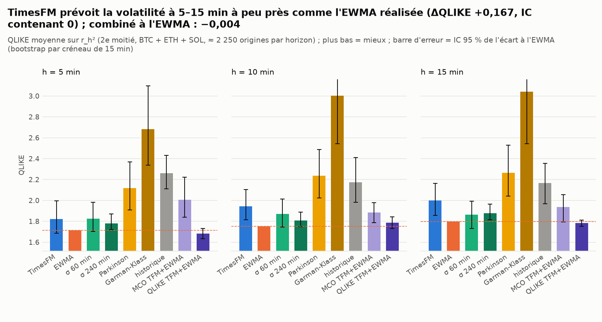
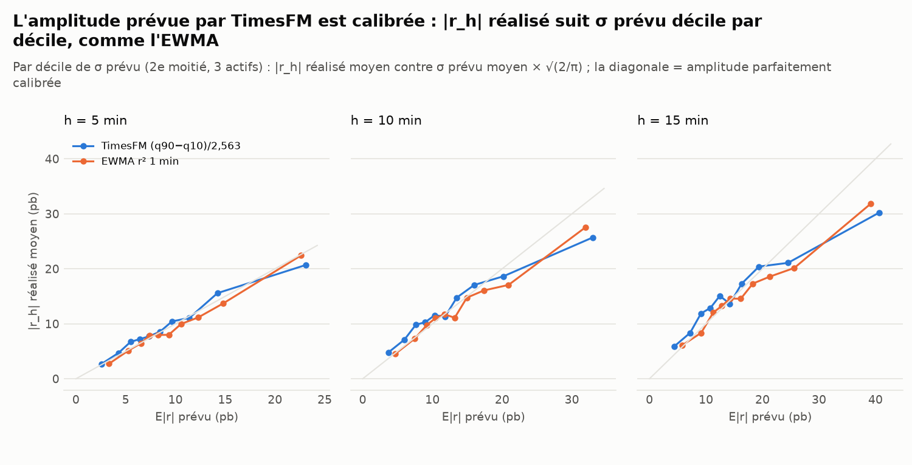
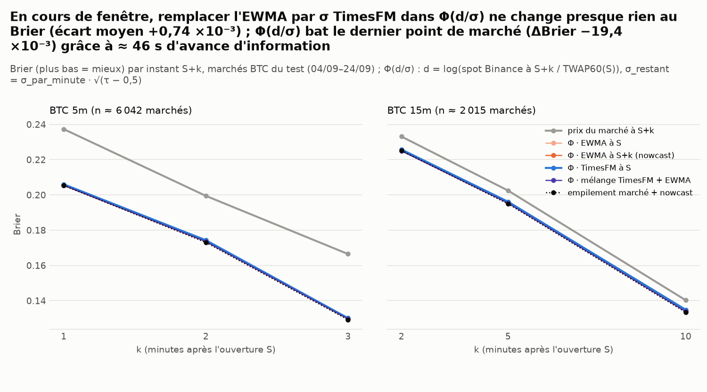
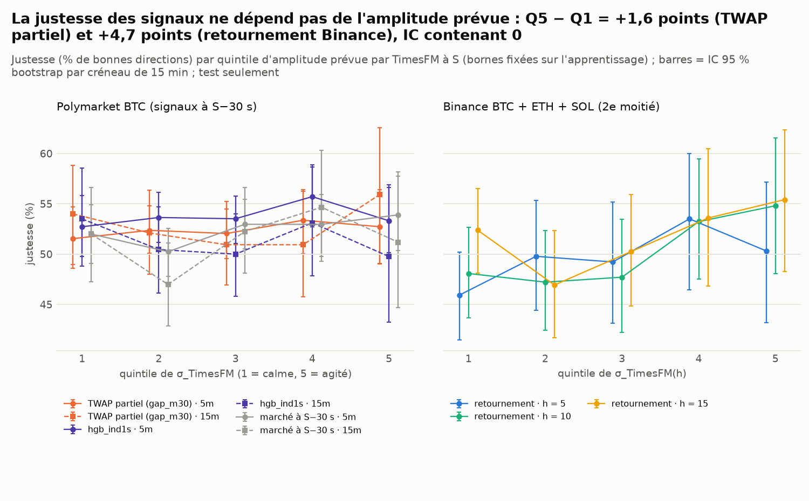

# À quoi sert l'amplitude prévue par TimesFM ? — volatilité, juste valeur en cours de fenêtre, régime

*Généré le 26/09/2026 05:20 UTC par `scripts/timesfm_amplitude.py` (temps total : 71 s, caches compris — § 7). TimesFM 3.0 (`timesfm3`, contexte 512 barres 1m, moyenne symétrique, déciles 0,1…0,9), poids sous licence non commerciale : recherche uniquement. 12 564 contextes calculés en 1 384 s (9,1 origines/s, 3 fils CPU).*

> Simulation papier sur données publiques : aucune clé, aucun ordre. Les prix Polymarket ne sont montrés qu'en agrégé.

## 0. Résumé : à quoi sert TimesFM ?

* **Prévoir l'amplitude (test 1)** : sur 6 750 origines hors échantillon (BTC, ETH, SOL, 15/07–25/09/2026, 3 horizons), σ_TimesFM = (q90−q10)/2,563 prévoit r_h² **un peu moins bien** que l'EWMA (QLIKE +9,5 % en moyenne ; IC excluant 0 à 2 horizon(s) sur 3) : ΔQLIKE (TimesFM − EWMA) h = 5 : +0,106 [−0,027 ; +0,281] ; h = 10 : +0,195 [+0,066 ; +0,354] ; h = 15 : +0,202 [+0,060 ; +0,364]. Classement de TimesFM parmi 10 modèles (QLIKE, tous actifs) : 4ᵉ à h = 5, 6ᵉ à h = 10, 6ᵉ à h = 15 (meilleur : `encomp_q` à h = 5, `ewma` à h = 10, `encomp_q` à h = 15). Couverture de [q10, q90] : 0,792, 0,781, 0,787 pour 0,80 visé ; pente de Mincer-Zarnowitz 0,08, 0,02, 0,04.
* **Information EN PLUS de la vol réalisée ?** Régression d'encompassing r_h² ~ a + b·σ²_TimesFM + c·σ²_EWMA (MCO sur l'apprentissage, 9 cellules actif × h) : b a |t| > 2 dans 3/9 cellules (c : 6/9) ; b moyen 0,28, c moyen 0,33. Hors échantillon, cette combinaison MCO fait h = 5 : ΔQLIKE +0,291 [+0,125 ; +0,507] ; h = 10 : ΔQLIKE +0,133 [+0,037 ; +0,230] ; h = 15 : ΔQLIKE +0,140 [−0,005 ; +0,256] par rapport à l'EWMA seule (0/3 horizons significativement mieux) : les MCO en niveau sont tirées par quelques r² extrêmes et se transportent mal. La combinaison **QLIKE-optimale** σ² = w₁σ²_TimesFM + w₂σ²_EWMA (poids >= 0 sur l'apprentissage) donne à TimesFM une part moyenne de 0,54 du poids et fait h = 5 : ΔQLIKE −0,032 [−0,081 ; +0,015] ; h = 10 : ΔQLIKE +0,035 [−0,019 ; +0,092] ; h = 15 : ΔQLIKE −0,016 [−0,048 ; +0,012] (0/3 significativement mieux que l'EWMA). L'apport de TimesFM au-delà de la vol réalisée n'est pas démontré : à peine mieux, IC contenant 0.
* **Juste valeur en cours de fenêtre (test 2, 8 064 marchés BTC 5m/15m du 04/09 au 24/09, tous, pas de sous-échantillon)** : Φ(d/σ_restant) avec σ de TimesFM prévu à S fait 0/6 fois significativement mieux et 2/6 fois significativement moins bien (Brier) que la même formule avec l'EWMA réalisée à S+k : 5m k = 1 : +0,67 [+0,02 ; +1,28] ; 5m k = 2 : +0,80 [+0,16 ; +1,45] ; 5m k = 3 : +0,46 [−0,07 ; +0,98] ; 15m k = 2 : +0,81 [−0,42 ; +2,07] ; 15m k = 5 : +0,71 [−0,77 ; +2,21] ; 15m k = 10 : +0,97 [−0,34 ; +2,33] (×10⁻³). Le poids de TimesFM dans le mélange choisi sur l'apprentissage vaut 5m : 0,2, 15m : 0,1. Le nowcast EWMA bat le dernier point de marché <= S+k dans 6/6 cas et l'empilement marché + nowcast dans 6/6 cas, mais ce point a ≈ 46 s d'ancienneté : c'est une avance d'information, pas un gain exploitable (§ 3). **La σ de TimesFM n'améliore pas la juste valeur** par rapport à une volatilité réalisée à jour : ce qui compte à S+k, c'est d (le chemin déjà parcouru), pas la finesse de σ.
* **Régime (test 3)** : l'amplitude prévue trie bien les marchés par mouvement réalisé (|log(finalPrice/priceToBeat)| médian de 2,1 pb au 1er quintile à 10,3 pb au 5ᵉ en 5m ; 3,8 à 16,5 pb en 15m) et le taux de résolutions serrées (< 2 pb) passe de 47,3 % à 8,9 % en 5m (Q5−Q1 : −38,3 [−42,0 ; −34,4] points). Justesse du TWAP partiel (`gap_m30`) Q5−Q1 : 5m +1,2 [−3,7 ; +5,8], 15m +1,9 [−6,7 ; +9,8] points ; `hgb_ind1s` : 5m +0,6 [−3,7 ; +5,1], 15m −3,7 [−12,0 ; +4,5] ; retournement Binance Q5−Q1 : h = 5 +4,4 [−3,7 ; +12,6], h = 10 +6,7 [−1,2 ; +14,9], h = 15 +3,0 [−5,4 ; +11,3] points. Aucun écart Q5 − Q1 de justesse n'est significatif : l'amplitude prévue ne sert pas de filtre pour ces signaux ; elle prédit seulement la taille du mouvement, pas si le signal aura raison.
* **Fichier pour l'agent maker** : `sigma_par_marche.csv` (8 064 marchés BTC 5m/15m du 04/09 au 24/09) : `sigma_timesfm_bp` (σ à l'horizon D, pb de log-prix), `sigma_rv_bp` (EWMA à S, même horizon), `amplitude_quantile_train` (rang dans la distribution d'apprentissage 14/08–03/09). Corrélation de Spearman σ_TimesFM / σ_EWMA : 0,94 ; médiane de σ_TimesFM : 5m 9,0 pb, 15m 14,3 pb.
* **Verdict** : TimesFM sert à **prévoir l'amplitude**, pas le sens : ses déciles donnent une σ calibrée à 5–15 min (couverture ≈ 0,79 pour 0,80), un peu moins discriminante qu'une EWMA à la minute (QLIKE +9,5 %, test 1), avec un apport complémentaire non démontré une fois combinée à l'EWMA. En cours de fenêtre Polymarket, cette σ ne rend pas Φ(d/σ) meilleure qu'avec une EWMA à jour (test 2) : l'information utile est dans d, que le marché intègre déjà. Comme filtre de régime, l'amplitude prévue trie le mouvement réalisé et le taux de résolutions serrées, mais pas la justesse des signaux directionnels (test 3). Usage raisonnable pour un maker : dimensionner (taille, écart coté, σ_restant pour valoriser une position) plutôt que choisir le sens. Une EWMA à la minute fait presque aussi bien, en microsecondes et sans licence non commerciale.

## 1. Données et méthode

* **Test 1** : barres Binance 1m (1 an en cache, `tradebot.data`), origines des runs existants `reports/timesfm/*_none_s15_c512_logprice` (1 500 par actif, toutes les 15 min du 02/05 au 25/09/2026). Les déciles sont **recalculés** (le CSV existant ne garde que q10/q90) et vérifiés contre lui : écart maximal BTC 0,0000 pb, ETH 0,0000 pb, SOL 0,0000 pb. Coupure apprentissage / test à la médiane des origines (14/07/2026 23:22 UTC).
* **σ_TimesFM(h)** = (q90 − q10)/2,5631 en points de base de log-prix (déciles au pas h, contexte centré, `TimesFMForecaster`) ; variante robuste (q75 − q25)/1,349 avec q25/q75 interpolés entre déciles (`timesfm_iqr`). Comparateurs (tous causaux, variance par minute × h) : EWMA des r² 1 min (λ choisi sur l'apprentissage par QLIKE : BTC 0,995, ETH 0,990, SOL 0,990), écart-type roulant 60 / 240 min, Parkinson et Garman-Klass 60 min, moyenne historique de r_h² (apprentissage), `encomp` = a + b·σ²_TimesFM + c·σ²_EWMA (MCO sur l'apprentissage, plancher à 5 % de la moyenne des deux) et `encomp_q` = w₁σ²_TimesFM + w₂σ²_EWMA (poids >= 0 minimisant la QLIKE d'apprentissage).
* **Scores** (2e moitié) : QLIKE = r²/σ² − log(r²/σ²) − 1 (r_h² plancheré à (0,1 pb)² : r_h = 0 exact arrive), MSE sur r_h², MAE entre |r_h| et σ√(2/π), régression de Mincer-Zarnowitz r_h² = a + b σ² (pente b, R²), couverture de [q10, q90] (gaussienne ±1,2816 σ pour les comparateurs). `qlike_rv` : même QLIKE avec la variance réalisée Σ r²_1min des h barres (cible moins bruitée). IC : bootstrap groupé par créneau de 15 min (2 000 tirages), les 3 actifs d'un créneau tirés ensemble.
* **Tests 2 et 3 (Polymarket)** : marchés BTC 5m et 15m résolus du 14/08 (régime TWAP-60) au 24/09/2026 (16 127 marchés, issue officielle `outcomePrices`, `priceToBeat`/`finalPrice` d'`eventMetadata`). **Apprentissage** 14/08–03/09 sur la grille de 15 min (4 032 marchés avec TimesFM), **test** 04/09–24/09 : tous les marchés (8 064, dont 8 064 avec TimesFM). TimesFM « prévu à S » = contexte de 512 closes finissant à la barre close à S − 1 min (origine S − 120 s), σ au pas D/60 + 1, σ_par_minute = σ/√(D/60 + 1). d = log(close Binance 1m à S+k / TWAP60(S)), TWAP60(S) = moyenne des closes 1s sur (S−60 s, S] (agrégats `pm_backtest/agg1s`). Prix du marché = dernier point `prices-history` <= S+k (ancienneté <= 90 s, milieu de fourchette). EWMA : λ = 0.96 (log-loss sur l'apprentissage, grille (0.9, 0.94, 0.96, 0.97, 0.98, 0.99, 0.995)). Mélange : σ² = w σ²_TimesFM + (1−w) σ²_EWMA(S+k), w sur l'apprentissage. Empilement : régression logistique sur logit(p_marché) et logit(p_nowcast EWMA(S+k)), par durée et k, apprise sur l'apprentissage.
* **Tests multiples** : test 1 compare 9 modèles × 3 horizons (× 4 cellules), test 2 6 modèles × 6 instants, test 3 5 quintiles × 6 mesures × 2 durées. Aucune correction n'est appliquée aux IC ; à 5 %, 1 comparaison sur 20 sort par hasard. Ne retenir que les écarts cohérents entre horizons / durées / actifs.

## 2. Test 1 — TimesFM prévoit-il la volatilité mieux que la volatilité réalisée ?

Tous actifs, 2e moitié (15/07–25/09/2026) ; ΔQLIKE = QLIKE(modèle) − QLIKE(EWMA), apparié, [IC 95 %] ; < 0 = mieux que l'EWMA.

| h | modèle | n | qlike | ΔQLIKE vs EWMA [IC] | qlike_rv | ΔQLIKE (cible Σr²_1m) [IC] | mse_r2 | mae_abs | mz_b | mz_r2 | couverture_80 | sigma_moy_pb | abs_ret_moy_pb |
|---|---|---|---|---|---|---|---|---|---|---|---|---|---|
| 5 | `timesfm` | 2 250 | 1,820 | +0,106 [−0,027 ; +0,281] | 0,748 | +0,091 [−0,022 ; +0,247] | 4 485 192 | 6,28 | 0,08 | 0,006 | 0,792 | 11,7 | 9,5 |
| 5 | `timesfm_iqr` | 2 250 | 1,914 | +0,199 [+0,031 ; +0,411] | 0,817 | +0,159 [+0,024 ; +0,343] | 4 157 799 | 6,21 | 0,08 | 0,006 | 0,784 | 11,2 | 9,5 |
| 5 | `ewma` | 2 250 | 1,715 | +0,000 [+0,000 ; +0,000] | 0,658 | +0,000 [+0,000 ; +0,000] | 2 491 965 | 6,58 | 0,63 | 0,021 | 0,837 | 12,6 | 9,5 |
| 5 | `rstd60` | 2 250 | 1,825 | +0,110 [−0,012 ; +0,268] | 0,749 | +0,091 [−0,015 ; +0,232] | 2 498 619 | 6,36 | 0,58 | 0,024 | 0,817 | 12,0 | 9,5 |
| 5 | `rstd240` | 2 250 | 1,778 | +0,064 [+0,005 ; +0,157] | 0,708 | +0,051 [−0,005 ; +0,132] | 2 572 185 | 6,71 | 0,37 | 0,010 | 0,824 | 12,5 | 9,5 |
| 5 | `park60` | 2 250 | 2,116 | +0,402 [+0,193 ; +0,654] | 1,003 | +0,345 [+0,193 ; +0,527] | 2 476 273 | 6,13 | 0,73 | 0,026 | 0,745 | 10,4 | 9,5 |
| 5 | `gk60` | 2 250 | 2,682 | +0,967 [+0,624 ; +1,381] | 1,497 | +0,839 [+0,621 ; +1,095] | 2 473 664 | 6,13 | 0,79 | 0,026 | 0,697 | 9,6 | 9,5 |
| 5 | `hist` | 2 250 | 2,262 | +0,547 [+0,397 ; +0,718] | 1,155 | +0,497 [+0,382 ; +0,638] | 2 529 776 | 9,50 | 0,67 | 0,002 | 0,915 | 17,8 | 9,5 |
| 5 | `encomp` | 2 250 | 2,005 | +0,291 [+0,125 ; +0,507] | 0,896 | +0,238 [+0,123 ; +0,399] | 3 042 638 | 7,69 | 0,15 | 0,007 | 0,904 | 15,4 | 9,5 |
| 5 | `encomp_q` | 2 250 | 1,683 | −0,032 [−0,081 ; +0,015] | 0,625 | −0,033 [−0,067 ; −0,002] | 3 594 371 | 6,75 | 0,13 | 0,009 | 0,865 | 13,8 | 9,5 |
| 10 | `timesfm` | 2 250 | 1,945 | +0,195 [+0,066 ; +0,354] | 0,600 | +0,110 [+0,040 ; +0,201] | 19 018 116 | 9,13 | 0,02 | 0,000 | 0,781 | 16,4 | 13,1 |
| 10 | `timesfm_iqr` | 2 250 | 2,048 | +0,298 [+0,122 ; +0,516] | 0,671 | +0,181 [+0,090 ; +0,299] | 18 462 737 | 8,96 | 0,02 | 0,000 | 0,778 | 15,6 | 13,1 |
| 10 | `ewma` | 2 250 | 1,750 | +0,000 [+0,000 ; +0,000] | 0,490 | +0,000 [+0,000 ; +0,000] | 10 355 132 | 9,43 | 0,54 | 0,015 | 0,833 | 17,8 | 13,1 |
| 10 | `rstd60` | 2 250 | 1,870 | +0,120 [−0,004 ; +0,264] | 0,562 | +0,072 [+0,005 ; +0,157] | 10 659 771 | 9,26 | 0,31 | 0,007 | 0,809 | 17,0 | 13,1 |
| 10 | `rstd240` | 2 250 | 1,807 | +0,057 [−0,000 ; +0,139] | 0,530 | +0,041 [+0,006 ; +0,091] | 10 513 770 | 9,52 | 0,42 | 0,012 | 0,822 | 17,6 | 13,1 |
| 10 | `park60` | 2 250 | 2,236 | +0,486 [+0,275 ; +0,737] | 0,850 | +0,361 [+0,244 ; +0,486] | 10 464 524 | 8,91 | 0,45 | 0,010 | 0,740 | 14,7 | 13,1 |
| 10 | `gk60` | 2 250 | 3,004 | +1,254 [+0,791 ; +1,836] | 1,444 | +0,955 [+0,720 ; +1,213] | 10 408 961 | 8,89 | 0,52 | 0,011 | 0,689 | 13,6 | 13,1 |
| 10 | `hist` | 2 250 | 2,172 | +0,422 [+0,233 ; +0,662] | 0,904 | +0,414 [+0,318 ; +0,532] | 10 387 007 | 12,12 | 0,78 | 0,002 | 0,906 | 22,9 | 13,1 |
| 10 | `encomp` | 2 250 | 1,883 | +0,133 [+0,037 ; +0,230] | 0,627 | +0,137 [+0,087 ; +0,192] | 10 850 236 | 10,38 | 0,20 | 0,003 | 0,891 | 20,3 | 13,1 |
| 10 | `encomp_q` | 2 250 | 1,785 | +0,035 [−0,019 ; +0,092] | 0,487 | −0,003 [−0,032 ; +0,028] | 15 859 094 | 9,47 | 0,04 | 0,001 | 0,838 | 18,1 | 13,1 |
| 15 | `timesfm` | 2 250 | 2,000 | +0,202 [+0,060 ; +0,364] | 0,563 | +0,122 [+0,060 ; +0,195] | 36 659 729 | 11,16 | 0,04 | 0,002 | 0,787 | 19,9 | 15,7 |
| 15 | `timesfm_iqr` | 2 250 | 2,098 | +0,300 [+0,115 ; +0,507] | 0,640 | +0,199 [+0,117 ; +0,296] | 34 526 922 | 10,92 | 0,04 | 0,002 | 0,784 | 18,9 | 15,7 |
| 15 | `ewma` | 2 250 | 1,798 | +0,000 [+0,000 ; +0,000] | 0,441 | +0,000 [+0,000 ; +0,000] | 17 822 372 | 11,60 | 0,52 | 0,018 | 0,840 | 21,8 | 15,7 |
| 15 | `rstd60` | 2 250 | 1,865 | +0,066 [−0,069 ; +0,193] | 0,501 | +0,060 [+0,006 ; +0,127] | 18 104 307 | 11,31 | 0,42 | 0,016 | 0,820 | 20,9 | 15,7 |
| 15 | `rstd240` | 2 250 | 1,879 | +0,080 [+0,016 ; +0,165] | 0,487 | +0,046 [+0,013 ; +0,090] | 18 406 806 | 11,66 | 0,33 | 0,010 | 0,828 | 21,6 | 15,7 |
| 15 | `park60` | 2 250 | 2,266 | +0,468 [+0,242 ; +0,729] | 0,797 | +0,355 [+0,247 ; +0,469] | 17 728 114 | 10,79 | 0,57 | 0,020 | 0,750 | 18,0 | 15,7 |
| 15 | `gk60` | 2 250 | 3,040 | +1,241 [+0,743 ; +1,819] | 1,417 | +0,976 [+0,726 ; +1,250] | 17 628 141 | 10,73 | 0,64 | 0,022 | 0,696 | 16,7 | 15,7 |
| 15 | `hist` | 2 250 | 2,167 | +0,369 [+0,170 ; +0,557] | 0,876 | +0,434 [+0,354 ; +0,524] | 17 902 337 | 15,92 | 0,75 | 0,002 | 0,924 | 30,1 | 15,7 |
| 15 | `encomp` | 2 250 | 1,938 | +0,140 [−0,005 ; +0,256] | 0,636 | +0,195 [+0,140 ; +0,250] | 17 577 454 | 13,72 | 0,82 | 0,018 | 0,909 | 26,8 | 15,7 |
| 15 | `encomp_q` | 2 250 | 1,782 | −0,016 [−0,048 ; +0,012] | 0,431 | −0,010 [−0,027 ; +0,005] | 19 479 889 | 12,10 | 0,25 | 0,011 | 0,860 | 23,3 | 15,7 |

*`mse_r2` en pb⁴, `mae_abs` en pb. `couverture_80` : part des r_h dans [q10, q90] (TimesFM) ou dans ±1,2816 σ (comparateurs).*

Par actif (2e moitié) : QLIKE et ΔQLIKE vs EWMA de TimesFM et de l'encompassing.

| actif | h | n | QLIKE EWMA | QLIKE TimesFM | ΔQLIKE TimesFM [IC] | ΔQLIKE combinaison QLIKE [IC] | couverture TimesFM | MZ b TimesFM | MZ b EWMA | MZ R² TimesFM | MZ R² EWMA |
|---|---|---|---|---|---|---|---|---|---|---|---|
| BTC | 5 | 750 | 1,825 | 1,940 | +0,115 [−0,042 ; +0,304] | −0,060 [−0,149 ; +0,019] | 0,787 | 0,60 | 0,79 | 0,042 | 0,053 |
| BTC | 10 | 750 | 1,798 | 1,993 | +0,195 [+0,041 ; +0,359] | +0,013 [−0,095 ; +0,098] | 0,788 | 0,43 | 0,80 | 0,017 | 0,037 |
| BTC | 15 | 750 | 1,828 | 2,084 | +0,255 [+0,053 ; +0,484] | −0,021 [−0,051 ; +0,004] | 0,792 | 0,28 | 0,48 | 0,016 | 0,025 |
| ETH | 5 | 750 | 1,722 | 1,853 | +0,131 [−0,052 ; +0,392] | −0,042 [−0,129 ; +0,019] | 0,785 | 1,04 | 1,07 | 0,011 | 0,018 |
| ETH | 10 | 750 | 1,754 | 2,018 | +0,264 [+0,076 ; +0,506] | +0,057 [+0,001 ; +0,126] | 0,769 | 0,82 | 1,15 | 0,007 | 0,021 |
| ETH | 15 | 750 | 1,867 | 2,120 | +0,253 [+0,064 ; +0,482] | −0,018 [−0,091 ; +0,041] | 0,784 | 0,73 | 0,73 | 0,008 | 0,011 |
| SOL | 5 | 750 | 1,597 | 1,668 | +0,071 [−0,043 ; +0,222] | +0,006 [−0,030 ; +0,041] | 0,803 | 0,07 | 0,44 | 0,037 | 0,064 |
| SOL | 10 | 750 | 1,699 | 1,823 | +0,124 [+0,004 ; +0,308] | +0,035 [−0,019 ; +0,112] | 0,785 | 0,01 | 0,27 | 0,000 | 0,022 |
| SOL | 15 | 750 | 1,699 | 1,797 | +0,098 [−0,005 ; +0,220] | −0,009 [−0,033 ; +0,010] | 0,785 | 0,03 | 0,41 | 0,008 | 0,050 |

**Régression d'encompassing** (apprentissage, 1re moitié) : r_h² = a + b·σ²_TimesFM + c·σ²_EWMA ; t robustes (HC1). `b_seul` / `c_seul` : pentes des régressions à une seule variable (Mincer-Zarnowitz). `w_*_qlike` : poids (>= 0, sans constante) de la combinaison qui minimise la QLIKE d'apprentissage ; `part_timesfm_qlike` = w₁/(w₁ + w₂).

| actif | h | n_train | a | b_timesfm | t_timesfm | c_ewma | t_ewma | b_timesfm_seul | t_timesfm_seul | c_ewma_seul | t_ewma_seul | w_timesfm_qlike | w_ewma_qlike | part_timesfm_qlike |
|---|---|---|---|---|---|---|---|---|---|---|---|---|---|---|
| BTC | 5 | 750 | 92 | 0,88 | 3,7 | −0,26 | −1,0 | 0,80 | 3,8 | 0,74 | 3,8 | 1,00 | 0,34 | 0,75 |
| BTC | 10 | 750 | 131 | 0,05 | 0,5 | 0,49 | 3,2 | 0,26 | 2,6 | 0,54 | 4,4 | 0,91 | 0,27 | 0,77 |
| BTC | 15 | 750 | 197 | −0,21 | −1,7 | 0,88 | 3,2 | 0,20 | 2,6 | 0,67 | 3,9 | 0,02 | 1,06 | 0,02 |
| ETH | 5 | 750 | 135 | 1,00 | 1,9 | −0,26 | −0,7 | 0,88 | 2,2 | 0,86 | 3,3 | 0,68 | 0,60 | 0,53 |
| ETH | 10 | 750 | 255 | 0,11 | 0,7 | 0,44 | 2,9 | 0,33 | 2,4 | 0,57 | 4,0 | 0,97 | 0,25 | 0,79 |
| ETH | 15 | 750 | 543 | −0,06 | −0,4 | 0,60 | 2,7 | 0,22 | 1,8 | 0,53 | 3,4 | 0,61 | 0,77 | 0,44 |
| SOL | 5 | 750 | 167 | 0,54 | 2,6 | 0,15 | 0,8 | 0,60 | 3,3 | 0,74 | 3,9 | 0,73 | 0,53 | 0,58 |
| SOL | 10 | 750 | 297 | 0,25 | 3,2 | 0,28 | 2,0 | 0,39 | 3,8 | 0,55 | 3,7 | 0,78 | 0,30 | 0,72 |
| SOL | 15 | 750 | 499 | −0,03 | −0,3 | 0,62 | 2,6 | 0,29 | 3,3 | 0,59 | 3,9 | 0,27 | 0,84 | 0,24 |

## 3. Test 2 — Juste valeur en cours de fenêtre : Φ(d/σ) contre le prix du marché

Test (04/09–24/09), même échantillon pour tous les modèles (marché, TimesFM et EWMA disponibles) ; ΔBrier ×10⁻³ apparié [IC 95 %], < 0 = mieux. `justesse` : Up prévu si p >= 0,5.

| durée | k | modèle | n | brier | log_loss | justesse [IC] | ΔBrier vs marché [IC] | ΔBrier vs EWMA(S+k) [IC] | p_sd |
|---|---|---|---|---|---|---|---|---|---|
| 5m | 1 | `market` | 6 037 | 0,2373 | 0,6672 | 58,8 % [57,6 % ; 60,0 %] | +0,00 [+0,00 ; +0,00] | +31,96 [+28,09 ; +35,77] | 0,113 |
| 5m | 1 | `ewma_S` | 6 037 | 0,2055 | 0,5997 | 68,0 % [66,8 % ; 69,2 %] | −31,81 [−35,67 ; −27,93] | +0,15 [+0,00 ; +0,30] | 0,206 |
| 5m | 1 | `ewma_k` | 6 037 | 0,2054 | 0,5984 | 68,0 % [66,8 % ; 69,2 %] | −31,96 [−35,77 ; −28,09] | +0,00 [+0,00 ; +0,00] | 0,202 |
| 5m | 1 | `timesfm_S` | 6 037 | 0,2060 | 0,6018 | 68,0 % [66,8 % ; 69,2 %] | −31,30 [−35,25 ; −27,40] | +0,67 [+0,02 ; +1,28] | 0,210 |
| 5m | 1 | `mix` | 6 037 | 0,2054 | 0,5985 | 68,0 % [66,8 % ; 69,2 %] | −31,92 [−35,75 ; −28,08] | +0,04 [−0,08 ; +0,16] | 0,202 |
| 5m | 1 | `stack` | 6 037 | 0,2054 | 0,5985 | 68,2 % [67,0 % ; 69,4 %] | −31,97 [−35,74 ; −28,24] | −0,01 [−0,33 ; +0,31] | 0,207 |
| 5m | 2 | `market` | 6 042 | 0,1995 | 0,5839 | 69,6 % [68,4 % ; 70,7 %] | +0,00 [+0,00 ; +0,00] | +25,95 [+22,34 ; +29,62] | 0,214 |
| 5m | 2 | `ewma_S` | 6 042 | 0,1739 | 0,5229 | 73,7 % [72,5 % ; 74,8 %] | −25,59 [−29,30 ; −22,01] | +0,36 [+0,14 ; +0,57] | 0,271 |
| 5m | 2 | `ewma_k` | 6 042 | 0,1735 | 0,5213 | 73,7 % [72,5 % ; 74,8 %] | −25,95 [−29,62 ; −22,34] | +0,00 [+0,00 ; +0,00] | 0,270 |
| 5m | 2 | `timesfm_S` | 6 042 | 0,1743 | 0,5258 | 73,7 % [72,5 % ; 74,8 %] | −25,14 [−28,92 ; −21,32] | +0,80 [+0,16 ; +1,45] | 0,276 |
| 5m | 2 | `mix` | 6 042 | 0,1736 | 0,5216 | 73,7 % [72,5 % ; 74,8 %] | −25,90 [−29,53 ; −22,27] | +0,05 [−0,07 ; +0,17] | 0,270 |
| 5m | 2 | `stack` | 6 042 | 0,1731 | 0,5206 | 73,8 % [72,7 % ; 75,0 %] | −26,40 [−29,96 ; −22,89] | −0,45 [−0,77 ; −0,12] | 0,279 |
| 5m | 3 | `market` | 6 041 | 0,1665 | 0,5026 | 75,3 % [74,2 % ; 76,4 %] | +0,00 [+0,00 ; +0,00] | +36,83 [+32,90 ; +40,79] | 0,286 |
| 5m | 3 | `ewma_S` | 6 041 | 0,1302 | 0,4085 | 81,7 % [80,7 % ; 82,6 %] | −36,29 [−40,27 ; −32,35] | +0,54 [+0,31 ; +0,78] | 0,334 |
| 5m | 3 | `ewma_k` | 6 041 | 0,1297 | 0,4053 | 81,7 % [80,7 % ; 82,6 %] | −36,83 [−40,79 ; −32,90] | +0,00 [+0,00 ; +0,00] | 0,335 |
| 5m | 3 | `timesfm_S` | 6 041 | 0,1301 | 0,4085 | 81,7 % [80,7 % ; 82,6 %] | −36,37 [−40,41 ; −32,45] | +0,46 [−0,07 ; +0,98] | 0,338 |
| 5m | 3 | `mix` | 6 041 | 0,1297 | 0,4054 | 81,7 % [80,7 % ; 82,6 %] | −36,81 [−40,75 ; −32,89] | +0,01 [−0,09 ; +0,12] | 0,335 |
| 5m | 3 | `stack` | 6 041 | 0,1292 | 0,4054 | 81,6 % [80,6 % ; 82,5 %] | −37,29 [−41,14 ; −33,50] | −0,46 [−1,04 ; +0,10] | 0,355 |
| 15m | 2 | `market` | 2 015 | 0,2331 | 0,6583 | 60,5 % [58,5 % ; 62,7 %] | +0,00 [+0,00 ; +0,00] | +8,15 [+3,96 ; +12,47] | 0,120 |
| 15m | 2 | `ewma_S` | 2 015 | 0,2253 | 0,6433 | 63,2 % [61,0 % ; 65,2 %] | −7,82 [−12,13 ; −3,43] | +0,34 [−0,12 ; +0,84] | 0,165 |
| 15m | 2 | `ewma_k` | 2 015 | 0,2250 | 0,6408 | 63,2 % [61,0 % ; 65,2 %] | −8,15 [−12,47 ; −3,96] | +0,00 [+0,00 ; +0,00] | 0,159 |
| 15m | 2 | `timesfm_S` | 2 015 | 0,2258 | 0,6454 | 63,2 % [61,0 % ; 65,2 %] | −7,34 [−11,99 ; −2,79] | +0,81 [−0,42 ; +2,07] | 0,174 |
| 15m | 2 | `mix` | 2 015 | 0,2250 | 0,6409 | 63,2 % [61,0 % ; 65,2 %] | −8,16 [−12,44 ; −3,95] | −0,00 [−0,11 ; +0,11] | 0,159 |
| 15m | 2 | `stack` | 2 015 | 0,2251 | 0,6411 | 63,0 % [60,8 % ; 65,0 %] | −7,98 [−12,16 ; −3,90] | +0,18 [−0,07 ; +0,43] | 0,154 |
| 15m | 5 | `market` | 2 014 | 0,2025 | 0,5916 | 68,4 % [66,4 % ; 70,5 %] | +0,00 [+0,00 ; +0,00] | +7,03 [+3,02 ; +11,13] | 0,205 |
| 15m | 5 | `ewma_S` | 2 014 | 0,1961 | 0,5769 | 70,4 % [68,4 % ; 72,4 %] | −6,41 [−10,68 ; −2,27] | +0,61 [+0,02 ; +1,18] | 0,242 |
| 15m | 5 | `ewma_k` | 2 014 | 0,1955 | 0,5740 | 70,4 % [68,4 % ; 72,4 %] | −7,03 [−11,13 ; −3,02] | +0,00 [+0,00 ; +0,00] | 0,238 |
| 15m | 5 | `timesfm_S` | 2 014 | 0,1962 | 0,5806 | 70,4 % [68,4 % ; 72,4 %] | −6,32 [−10,74 ; −1,90] | +0,71 [−0,77 ; +2,21] | 0,251 |
| 15m | 5 | `mix` | 2 014 | 0,1954 | 0,5737 | 70,4 % [68,4 % ; 72,4 %] | −7,10 [−11,24 ; −3,07] | −0,08 [−0,23 ; +0,07] | 0,238 |
| 15m | 5 | `stack` | 2 014 | 0,1950 | 0,5728 | 70,2 % [68,3 % ; 72,2 %] | −7,52 [−10,54 ; −4,56] | −0,50 [−1,62 ; +0,68] | 0,232 |
| 15m | 10 | `market` | 2 013 | 0,1403 | 0,4325 | 79,4 % [77,6 % ; 81,1 %] | +0,00 [+0,00 ; +0,00] | +6,37 [+1,95 ; +11,01] | 0,319 |
| 15m | 10 | `ewma_S` | 2 013 | 0,1345 | 0,4206 | 80,5 % [78,8 % ; 82,3 %] | −5,76 [−10,51 ; −1,25] | +0,61 [−0,06 ; +1,30] | 0,343 |
| 15m | 10 | `ewma_k` | 2 013 | 0,1339 | 0,4163 | 80,5 % [78,8 % ; 82,3 %] | −6,37 [−11,01 ; −1,95] | +0,00 [+0,00 ; +0,00] | 0,345 |
| 15m | 10 | `timesfm_S` | 2 013 | 0,1349 | 0,4229 | 80,5 % [78,8 % ; 82,3 %] | −5,40 [−10,23 ; −0,66] | +0,97 [−0,34 ; +2,33] | 0,350 |
| 15m | 10 | `mix` | 2 013 | 0,1339 | 0,4163 | 80,5 % [78,8 % ; 82,3 %] | −6,41 [−11,03 ; −1,96] | −0,04 [−0,16 ; +0,08] | 0,345 |
| 15m | 10 | `stack` | 2 013 | 0,1334 | 0,4140 | 80,2 % [78,4 % ; 81,9 %] | −6,89 [−11,01 ; −2,95] | −0,52 [−1,22 ; +0,17] | 0,348 |

*Ancienneté médiane du point de marché « <= S+k » : 5m k = 1 : 45 s, 5m k = 2 : 46 s, 5m k = 3 : 47 s, 15m k = 2 : 46 s, 15m k = 5 : 46 s, 15m k = 10 : 46 s ; d est lu exactement à S+k.*

Paramètres appris sur l'apprentissage (14/08–03/09) :

| durée | k | w_timesfm | stack_b_marché | stack_b_nowcast | stack_a | n_train |
|---|---|---|---|---|---|---|
| 5m | 1 | 0,2 | 0,16 | 0,99 | −0,00 | 6 033 |
| 5m | 2 | 0,2 | 0,08 | 1,02 | 0,00 | 6 034 |
| 5m | 3 | 0,2 | 0,12 | 1,11 | −0,02 | 6 034 |
| 15m | 2 | 0,1 | −0,01 | 0,97 | 0,02 | 2 011 |
| 15m | 5 | 0,1 | 0,31 | 0,73 | −0,00 | 2 008 |
| 15m | 10 | 0,1 | 0,17 | 0,89 | −0,00 | 2 012 |

*Lecture.* Le point de marché « <= S+k » a en médiane 46 s d'ancienneté (échantillonnage `prices-history` ≈ 1 point/min) alors que d est lu exactement à S+k : l'avance de Φ(d/σ) sur le marché est donc en grande partie une avance d'information, comme le diagnostic l'a montré (au même horodatage, le nowcast ne bat plus le marché que de ≈ 3 points en 5m). Cette comparaison ne dit rien d'exploitable ; elle sert de référence. La question posée ici est ailleurs : **remplacer σ_EWMA par σ_TimesFM prévue à S, ou mélanger les deux, déplace le Brier de quelques 10⁻⁴ au plus**, car à S+k la probabilité est dominée par d/σ où d (le chemin déjà parcouru) varie de dizaines de pb quand σ_restant ne varie que de quelques pb entre modèles. L'EWMA à S (même information que TimesFM) et TimesFM à S sont au coude à coude. L'empilement marché + nowcast apprend surtout à faire confiance au nowcast.

## 4. Test 3 — Régime : les marchés à forte amplitude prévue sont-ils différents ?

Polymarket BTC, test (04/09–24/09), quintiles de σ_TimesFM à l'horizon D (bornes fixées sur l'apprentissage, par durée) ; `serré_2pb` : |log(finalPrice/priceToBeat)| < 2 pb ; justesse des signaux disponibles à S−30 s (`gap_m30` = signe de l'écart spot − TWAP partiel, `hgb_ind1s` = modèle retenu du backtest, marché = prix du jeton Up à S−30 s) et du marché à S+1 min (5m) / S+2 min (15m). Dernière ligne : écart Q5 − Q1 [IC 95 %].

BTC 5m :

| quintile | n | sigma_moy_pb | mouvement_médian_pb | serré_2pb | taux_up | just_gap_m30 | just_hgb_ind1s | just_marché_S-30 | just_marché_S+k1 |
|---|---|---|---|---|---|---|---|---|---|
| 1 | 1 102 | 3,9 | 2,1 | 47,3 [44,3 ; 50,3] | 50,0 [47,3 ; 52,9] | 51,5 [48,6 ; 54,7] | 52,7 [49,8 ; 55,8] | 52,0 [49,1 ; 54,9] | 57,9 [55,0 ; 60,9] |
| 2 | 1 648 | 7,2 | 4,1 | 28,2 [26,0 ; 30,4] | 48,7 [46,4 ; 51,0] | 52,4 [50,1 ; 54,8] | 53,6 [51,1 ; 56,2] | 50,2 [47,8 ; 52,6] | 60,4 [58,0 ; 62,8] |
| 3 | 1 635 | 9,9 | 5,4 | 20,3 [18,4 ; 22,2] | 50,4 [48,0 ; 52,8] | 52,0 [49,6 ; 54,5] | 53,5 [51,1 ; 55,7] | 53,0 [50,5 ; 55,4] | 57,9 [55,4 ; 60,1] |
| 4 | 980 | 13,3 | 6,7 | 16,1 [13,9 ; 18,5] | 49,2 [46,1 ; 52,3] | 53,4 [50,1 ; 56,4] | 55,7 [52,7 ; 58,7] | 53,0 [49,8 ; 55,9] | 57,3 [54,1 ; 60,2] |
| 5 | 683 | 23,0 | 10,3 | 8,9 [6,8 ; 11,1] | 52,7 [48,9 ; 56,4] | 52,7 [49,0 ; 56,4] | 53,3 [50,1 ; 56,9] | 53,9 [50,4 ; 57,8] | 60,6 [57,0 ; 64,2] |
| Q5−Q1 | 1 785 | — | — | −38,3 [−42,0 ; −34,4] | 2,7 [−2,1 ; 7,4] | 1,2 [−3,7 ; 5,8] | 0,6 [−3,7 ; 5,1] | 1,9 [−2,7 ; 6,6] | 2,7 [−2,0 ; 7,4] |

BTC 15m :

| quintile | n | sigma_moy_pb | mouvement_médian_pb | serré_2pb | taux_up | just_gap_m30 | just_hgb_ind1s | just_marché_S-30 | just_marché_S+k1 |
|---|---|---|---|---|---|---|---|---|---|
| 1 | 400 | 6,4 | 3,8 | 27,0 [22,8 ; 31,4] | 44,0 [39,4 ; 48,7] | 54,0 [49,0 ; 58,8] | 53,5 [48,8 ; 58,5] | 52,0 [47,3 ; 56,6] | 60,5 [56,0 ; 65,3] |
| 2 | 547 | 11,7 | 7,1 | 16,5 [13,4 ; 19,6] | 49,4 [45,2 ; 53,5] | 52,1 [48,0 ; 56,3] | 50,5 [46,2 ; 54,7] | 47,0 [42,9 ; 51,1] | 62,9 [58,9 ; 66,7] |
| 3 | 534 | 16,0 | 9,5 | 10,1 [7,8 ; 12,8] | 51,3 [47,1 ; 55,6] | 50,9 [46,9 ; 55,2] | 50,0 [45,8 ; 54,0] | 52,2 [48,1 ; 56,6] | 61,6 [57,4 ; 65,7] |
| 4 | 322 | 21,6 | 11,4 | 8,4 [5,6 ; 11,7] | 46,9 [41,3 ; 52,1] | 50,9 [45,7 ; 56,3] | 53,1 [47,9 ; 58,9] | 54,7 [49,3 ; 60,3] | 55,0 [49,4 ; 60,1] |
| 5 | 213 | 37,8 | 16,5 | 7,0 [3,9 ; 10,7] | 54,9 [48,1 ; 61,8] | 55,9 [49,1 ; 62,6] | 49,8 [43,3 ; 56,6] | 51,2 [44,7 ; 58,2] | 60,4 [54,0 ; 66,8] |
| Q5−Q1 | 613 | — | — | −20,0 [−25,4 ; −14,5] | 10,9 [2,4 ; 19,5] | 1,9 [−6,7 ; 9,8] | −3,7 [−12,0 ; 4,5] | −0,8 [−8,8 ; 7,6] | −0,1 [−8,4 ; 7,8] |

Même découpage par quintile de **σ_EWMA à S** (volatilité réalisée, sans TimesFM) — pour savoir si le tri vient de TimesFM ou de la vol réalisée :

| durée | quintile | n | sigma_moy_pb | mouvement_médian_pb | serré_2pb | just_gap_m30 | just_hgb_ind1s |
|---|---|---|---|---|---|---|---|
| 5m | 1 | 1 004 | 4,2 | 2,1 | 47,4 [44,4 ; 50,7] | 52,2 [49,1 ; 55,5] | 52,7 [49,7 ; 55,7] |
| 5m | 2 | 1 805 | 7,3 | 4,0 | 28,8 [26,6 ; 31,0] | 52,6 [50,3 ; 54,8] | 53,2 [50,8 ; 55,6] |
| 5m | 3 | 1 636 | 10,2 | 5,5 | 20,5 [18,6 ; 22,5] | 51,6 [49,2 ; 53,9] | 54,6 [52,1 ; 56,9] |
| 5m | 4 | 908 | 13,6 | 6,7 | 15,9 [13,6 ; 18,2] | 54,7 [51,4 ; 57,9] | 55,0 [51,8 ; 58,2] |
| 5m | 5 | 695 | 23,6 | 10,5 | 8,9 [6,9 ; 11,1] | 50,4 [46,7 ; 53,9] | 53,1 [49,6 ; 56,7] |
| 5m | Q5−Q1 | 1 699 | — | — | −38,5 [−42,4 ; −34,7] | −1,8 [−6,9 ; 2,8] | 0,4 [−4,1 ; 5,0] |
| 15m | 1 | 329 | 6,9 | 3,7 | 28,0 [23,4 ; 32,8] | 52,6 [47,1 ; 57,9] | 49,8 [44,5 ; 55,2] |
| 15m | 2 | 598 | 11,9 | 6,9 | 17,4 [14,3 ; 20,5] | 51,0 [47,0 ; 55,2] | 51,7 [47,6 ; 55,5] |
| 15m | 3 | 554 | 16,6 | 9,4 | 10,3 [7,9 ; 13,0] | 52,0 [48,0 ; 56,0] | 50,4 [46,1 ; 54,6] |
| 15m | 4 | 305 | 22,0 | 12,0 | 8,5 [5,7 ; 11,6] | 55,1 [49,5 ; 60,6] | 54,1 [48,8 ; 60,1] |
| 15m | 5 | 230 | 38,2 | 15,9 | 6,5 [3,5 ; 9,9] | 53,1 [46,2 ; 59,0] | 50,9 [44,5 ; 57,3] |
| 15m | Q5−Q1 | 559 | — | — | −21,4 [−27,2 ; −15,6] | 0,5 [−8,1 ; 8,2] | 1,0 [−7,4 ; 9,3] |

Binance (BTC + ETH + SOL, 2e moitié du test 1) : justesse du signal « retournement » (parier contre le rendement des h dernières minutes, `reversal_h` des runs existants) par quintile de σ_TimesFM(h), bornes par actif × h sur la 1re moitié.

| h | quintile | n | sigma_moy_pb | abs_ret_médian_pb | serré_2pb | taux_up | just_retournement |
|---|---|---|---|---|---|---|---|
| 5 | 1 | 758 | 5,8 | 3,7 | 34,7 [30,9 ; 38,5] | 50,8 [45,9 ; 55,8] | 45,9 [41,5 ; 50,2] |
| 5 | 2 | 473 | 9,3 | 5,8 | 19,5 [15,8 ; 23,3] | 43,5 [37,5 ; 49,5] | 49,8 [44,4 ; 55,4] |
| 5 | 3 | 390 | 11,9 | 7,1 | 16,2 [12,4 ; 19,8] | 52,6 [46,5 ; 59,0] | 49,2 [43,1 ; 55,2] |
| 5 | 4 | 317 | 15,2 | 9,5 | 11,7 [8,2 ; 15,3] | 49,7 [43,1 ; 56,4] | 53,5 [46,5 ; 60,0] |
| 5 | 5 | 312 | 25,6 | 14,6 | 5,1 [2,8 ; 7,7] | 50,6 [42,9 ; 58,5] | 50,3 [43,2 ; 57,1] |
| 5 | Q5−Q1 | 1 070 | — | — | −29,6 [−34,1 ; −25,2] | −0,2 [−9,3 ; 9,0] | 4,4 [−3,7 ; 12,6] |
| 10 | 1 | 748 | 8,0 | 5,4 | 21,5 [18,4 ; 24,8] | 47,0 [42,0 ; 51,9] | 48,1 [43,7 ; 52,7] |
| 10 | 2 | 488 | 13,0 | 8,6 | 13,7 [10,7 ; 17,1] | 48,0 [42,1 ; 53,7] | 47,2 [42,4 ; 52,4] |
| 10 | 3 | 373 | 16,5 | 9,3 | 11,0 [7,9 ; 14,3] | 50,9 [44,5 ; 57,3] | 47,7 [42,2 ; 53,5] |
| 10 | 4 | 327 | 21,5 | 10,9 | 11,0 [7,8 ; 14,4] | 49,5 [43,5 ; 55,6] | 53,2 [47,5 ; 59,5] |
| 10 | 5 | 314 | 36,4 | 18,3 | 4,1 [2,1 ; 6,5] | 51,0 [43,6 ; 59,0] | 54,8 [48,1 ; 61,6] |
| 10 | Q5−Q1 | 1 062 | — | — | −17,4 [−21,2 ; −13,3] | 4,0 [−4,8 ; 13,3] | 6,7 [−1,2 ; 14,9] |
| 15 | 1 | 751 | 9,7 | 6,5 | 18,2 [15,2 ; 21,4] | 48,3 [43,4 ; 53,1] | 52,4 [48,1 ; 56,5] |
| 15 | 2 | 477 | 15,7 | 10,7 | 9,4 [6,7 ; 12,3] | 49,3 [43,6 ; 55,0] | 46,9 [41,7 ; 52,3] |
| 15 | 3 | 386 | 19,7 | 10,7 | 9,1 [6,2 ; 12,5] | 52,6 [46,5 ; 59,0] | 50,3 [44,9 ; 55,9] |
| 15 | 4 | 321 | 26,2 | 12,8 | 7,8 [4,6 ; 11,4] | 55,1 [48,5 ; 61,5] | 53,6 [46,8 ; 60,5] |
| 15 | 5 | 315 | 44,8 | 20,1 | 5,1 [2,7 ; 7,8] | 48,4 [41,0 ; 56,0] | 55,4 [48,3 ; 62,4] |
| 15 | Q5−Q1 | 1 066 | — | — | −13,2 [−17,2 ; −9,1] | 0,1 [−8,4 ; 9,0] | 3,0 [−5,4 ; 11,3] |

*Lecture.* Les quintiles de σ_TimesFM et de σ_EWMA trient de la même façon le mouvement réalisé et les résolutions serrées (corrélation de Spearman entre les deux σ : 0,94) : c'est la volatilité réalisée qui porte l'information de régime. Sur la justesse des signaux directionnels, aucun quintile ne se distingue de façon cohérente entre 5m, 15m et Binance.

## 5. `sigma_par_marche.csv` (pour l'agent maker)

Une ligne par marché BTC 5m / 15m résolu du 04/09 au 24/09/2026 (8 064 lignes ; 0 sans TimesFM : contexte troué). Colonnes : `slug`, `S` (début de fenêtre, UTC), `start_ts` (s Unix), `duration`, `sigma_timesfm_bp` (σ_TimesFM à l'horizon D = (q90−q10)/2,563 au pas D/60 + 1, pb de log-prix, prévu à S − 1 min), `sigma_timesfm_iqr_bp` (variante robuste), `sigma_rv_bp` (EWMA réalisée à S − 1 min, λ = 0.96, ramenée au même horizon), `amplitude_quantile_train` (rang de `sigma_timesfm_bp` dans la distribution d'apprentissage 14/08–03/09 de la même durée, 0 = le plus calme, 1 = le plus agité), `quintile_train` (1–5). Lecture : un marché au-dessus de 0,8 est dans le quintile le plus agité du mois d'apprentissage.

| duration | σ | count | mean | 10% | 50% | 90% | max |
|---|---|---|---|---|---|---|---|
| 15m | sigma_timesfm_bp | 2 016 | 16,1 | 6,5 | 14,3 | 26,6 | 122,7 |
| 15m | sigma_rv_bp | 2 016 | 16,9 | 7,6 | 14,9 | 27,7 | 98,6 |
| 5m | sigma_timesfm_bp | 6 048 | 10,1 | 4,1 | 9,0 | 16,7 | 89,4 |
| 5m | sigma_rv_bp | 6 048 | 10,4 | 4,6 | 9,1 | 17,3 | 68,0 |

## 6. Limites

* **σ_TimesFM est une lecture gaussienne des déciles** : (q90 − q10)/2,563 suppose des queues normales ; la variante IQR donne un ordre de grandeur voisin (tableau § 2). Les quantiles du pas h sont marginaux : ils décrivent close[t+h] − close[t], pas le chemin.
* **Cible bruitée** : r_h² est un proxy très bruité de la variance (une seule réalisation) ; la QLIKE sur Σ r²_1min (`qlike_rv`) est donnée en contrôle et donne le même classement. Le plancher (0,1 pb)² sur r_h² touche 1,87 % des origines (surtout SOL).
* **Polymarket** : d utilise Binance (spot et TWAP60 1s) alors que l'issue vient de Chainlink (≈ 3 pb de décalage de niveau, sans effet sur d puisque les deux termes sont Binance ; ≈ 4 s de retard du flux). Le prix du marché est un milieu de fourchette `prices-history` daté à la minute (ancienneté moyenne ≈ 45 s, déjà en retard de ≈ 10 s sur Binance d'après le diagnostic) : battre ce point au même horodatage ne prouve pas un gain exploitable. Le TWAP60 final est approché par le prix à E − 30 s (σ_restant en √(τ − 0,5)) : c'est une approximation (la vraie variance du TWAP d'une minute est un peu plus faible).
* **Un seul régime, 6 semaines** (TWAP-60 depuis le 14/08) ; le test 1 couvre 5 mois. Les IC groupés par créneau ne couvrent pas un changement de régime.
* **TimesFM est plus lent** que n'importe quel estimateur de vol réalisée (≈ 8 origines/s sur 3 fils CPU contre des microsecondes) et ses poids 3.0 sont sous licence non commerciale : pour un usage réel, il faudrait revalider avec TimesFM 2.5 (Apache-2.0).
* **Sélection** : λ, w et l'empilement sont choisis sur l'apprentissage ; les bornes de quintiles aussi. Les 3 tests réutilisent les mêmes prévisions TimesFM ; aucune correction pour tests multiples (§ 1).

## 7. Temps d'exécution

| étape | secondes |
|---|---|
| 1a. Binance 1m (tradebot.data, cache 1 an) | 1,8 |
| 1b. origines : runs TimesFM existants + fenêtres Polymarket BTC | 0,0 |
| 3a. test 1 : cibles, volatilités réalisées (λ sur l'apprentissage), encompassing | 27,3 |
| 3b. test 1 : scores hors échantillon + bootstrap par créneau | 1,3 |
| 4a. marchés BTC 5m/15m (list_updown_markets, cache) + prévisions modeles_vs_marche | 1,7 |
| 4b. eventMetadata (priceToBeat / finalPrice ; caches diag + gamma) | 0,6 |
| 4c. prix du jeton Up à S+k (prices_history, cache) | 21,7 |
| 4d. Binance : TWAP60(S) (agrégats 1s), prix à S+k, EWMA | 0,3 |
| 4e. test 2 : λ de l'EWMA (apprentissage), mélange, empilement, scores | 12,0 |
| 5. test 3 : quintiles d'amplitude (bornes sur l'apprentissage) | 1,6 |
| 6a. sigma_par_marche.csv | 0,1 |
| 6b. CSV, graphiques, README | 2,6 |
| total | 71,2 |

Calcul des quantiles TimesFM (mis en cache dans `data/cache/timesfm_amplitude/`, première exécution) :

| jeu | asset | n_origins | n_done | seconds | origins_per_s | threads | context_len | horizon |
|---|---|---|---|---|---|---|---|---|
| test1_btc | btc | 1 500 | 1 500 | 175 | 8,6 | 3 | 512 | 16 |
| test1_eth | eth | 1 500 | 1 500 | 176 | 8,5 | 3 | 512 | 16 |
| test1_sol | sol | 1 500 | 1 500 | 176 | 8,6 | 3 | 512 | 16 |
| pm_train_btc | btc | 2 016 | 2 016 | 245 | 8,2 | 3 | 512 | 16 |
| pm_test_btc | btc | 6 048 | 6 048 | 613 | 9,9 | 3 | 512 | 16 |

## 8. Fichiers

* `sigma_par_marche.csv` : σ TimesFM / EWMA par marché BTC 5m/15m du test (pour l'agent maker)
* `test1_scores.csv` : test 1 : scores hors échantillon par cellule × h × modèle, ΔQLIKE vs EWMA avec IC
* `test1_encompassing.csv` : test 1 : régressions d'encompassing (apprentissage)
* `test1_origines.csv` : test 1 : une ligne par (actif, origine, h) : r_h, Σr²_1m, σ² de chaque modèle
* `test2_scores.csv` : test 2 : Brier / log-loss / justesse par durée × k × modèle, écarts au marché et à l'EWMA avec IC
* `test2_parametres.csv` : test 2 : poids du mélange et coefficients de l'empilement (apprentissage)
* `test2_lambda.csv` : test 2 : log-loss d'apprentissage par λ
* `test3_quintiles_polymarket.csv` : test 3 : Polymarket par quintile de σ_TimesFM et de σ_EWMA
* `test3_quintiles_binance.csv` : test 3 : Binance par quintile de σ_TimesFM(h)
* `marches_test.csv` : marchés BTC du test : y, priceToBeat/finalPrice, d à S+k, prix du marché à S+k, σ, p de chaque modèle
* `runtime.csv` : temps par étape
* `qlike_par_modele.png, amplitude_calibration.png, brier_en_cours_de_fenetre.png, justesse_par_quintile.png` : graphiques

Reproduire : `. .venv/bin/activate && python scripts/timesfm_amplitude.py` ; tests : `python -m pytest tests/test_timesfm_amplitude.py`.
